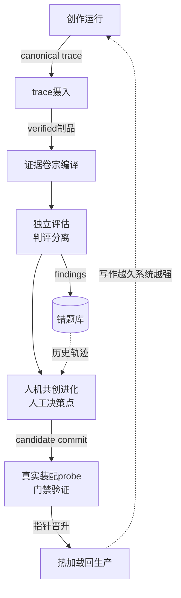
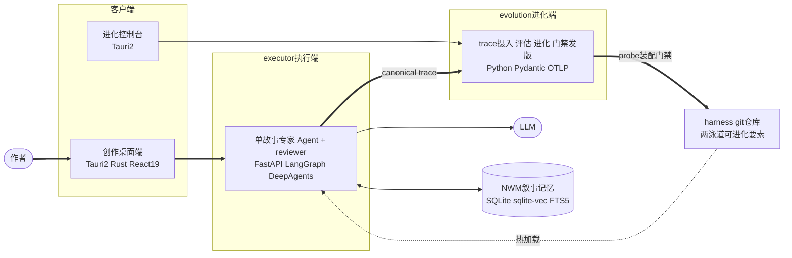
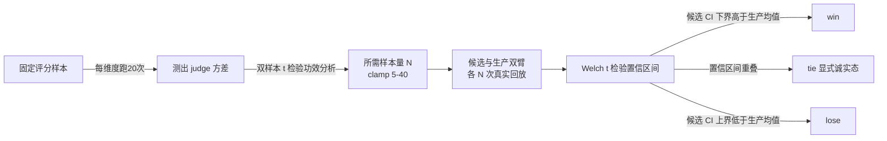

# EvoWriter

**自进化大纲创作 Agent 平台** · Self-Evolving Outline-Writing Agent Platform

[](LICENSE)
[](https://github.com/gaoshoupaper-code/EvoWriter/actions/workflows/layering.yml)


以长篇小说大纲为首个垂直领域:单故事专家 Agent(剧情大纲设计)在真实创作中沉淀 trace,评估定位弱点,人机共创改进配置,经门禁发版回灌生产——**形成越用越强的数据飞轮**,为垂直领域 Agent 的持续演进建立基础设施。

> 📑 **系统全景**:[docs/系统心智模型.md](docs/系统心智模型.md)——系统唯一文档真相源,**8 张 Mermaid 图**分层下钻:系统总览 → 三端请求流 → 四大机制深潜。本文是导览与机制速写,细节都在那里。

> **规模速览**:全栈 **11.9 万行**(Python **9.0 万** = 源码 **7.2 万** + 测试 **1.9 万** · 双桌面端 Tauri 2 + React 19 共 **2.9 万**)· **812** 测试函数 / **100** 测试文件 · **26** 个可组合中间件 · **45** 个版本 tag · 单人开发(AI 辅助 + 人定架构)

## 🎯 核心亮点(30 秒)

**Agent 应用的瓶颈不在能跑,在持续变好。** EvoWriter 用四个机制回答"怎么安全地越用越强":

- **🧬 自进化闭环**:生产 trace → 评估 → 人机共创 → 门禁发版 → 热加载回生产;数据飞轮已驱动生产级改进上线
- **🔭 Agent 观测底座**:自研 canonical trace 采集可信运行事实——四维正交审计宁缺毋谎,还能从事件流**确定性反推最终稿**
- **🧠 类型化叙事记忆**(已实现并运行验证,当前随架构聚焦休眠):8 类强类型记录建模"谁知什么、坑填没填",因果锚点杜绝未来章节泄漏
- **⚙️ 版本化 Agent 运行时**:Agent 定义外置为 git 版本化 harness,按 commit 装配、热切换;洋葱中间件治理执行安全与成本。v9 起聚焦单故事专家 + reviewer 两泳道,进化对象更纯粹

> **怎么读这份 README**:赶时间看上方核心亮点(30 秒)与下方核心机制一览表(3 分钟);想评估技术深度,四个机制章节每节开头有问题导语,按需下钻;全部机制细节在 [docs/系统心智模型.md](docs/系统心智模型.md) 的 8 张图里。全文通读约 8 分钟。

---

## 为什么做

Agent 应用的瓶颈不在"能不能跑",而在"能不能持续变好"。Prompt、行为护栏、记忆检索策略靠人肉调优不可扩展;而让系统自我改进,又要面对它天然的不可信——改的人可能改错、评估的人可能放水、上线的过程可能出事故。

EvoWriter 的答案是:把进化做成一条**每级只消费上级封存制品的单向加工链**,评估与创作异源(判评分离)、进化改动逐条人工拍板、发版经真实装配门禁验证。人握住方向与发布两个决策点,其余交给飞轮。

为什么选长篇小说做首个垂直领域:它是上下文工程的极限场景(数十万字的状态追踪、跨章节的信息差与伏笔),有可结构化评估的产物(契约矩阵 + 多维评分都能落地),且改进效果真实可感——**能在最难的领域验证过的机制,迁移到其他垂直领域只会更容易**。

## 自进化闭环

一次完整的数据飞轮旅途。与下方静态架构图互补:那张图看"系统有哪些部分",这张图看"事实与版本怎么流动"。



**机制落地实证**:

- **发版能力**:门禁单阶段化后**连续 4 版**热切换上线,执行端全程**零重部署**;发版链路迭代全程 **12 次激活失败全部自动补偿恢复、2 次真实回滚**(registry 发版账本可查),生产侧始终保有可用版本
- **进化实效**:针对蓝图阶段失控扩展,进化会话分析历史 trace、人机共创迭代上限约束,上线后根治顽疾;针对信息收集冗余,进化会话提炼预置方案,信息收集阶段**耗时降至约 1/5、token 消耗降至约 1/6**——改进均由闭环产出,非人工调优
- **环境复现**:代码树、依赖锁与 harness commit **三源指纹**冻结每次生成的完整环境,任意历史生成结果可**精确复现**

以上数字均出自 registry 发版账本与 sealed 评估制品——**可复核,不自述**。

## 系统架构



**执行端在线服务生产写作,进化端离线安全改进**——实验与生产互不扰动,这是整个系统的第一道结构约束。

两端独立部署、独立演进:执行端是领域无关的 Agent 运行时,四层架构(`routers → domains → platform` + 运行时动态加载的 harness 包),分层依赖由 AST 静态分析强制;进化端是离线质量与改进引擎。两端只通过两样东西单向耦合:**canonical trace**(事实)与 **harness git 仓库**(版本)——`contracts/` 里的共享类型契约(trace schema / 跨端 API)零业务依赖,三端从同一类型源生成,接口漂移在编译期暴露。

## 核心机制一览

| 机制 | 回答的问题 | 方案速写 | 硬证据 |
|---|---|---|---|
| 🧬 [自进化引擎](#自进化引擎) | 怎么安全地自我改进 | 单向加工链 · 判评分离 · 统计受控 A/B · 门禁发版 | 连续 4 版热切换上线;12 次激活失败全部自动补偿 |
| 🔭 [观测底座](#agent-观测底座) | 怎么采到可信的运行事实 | 受治理 canonical trace · 四维正交审计 · 增量存储 | 7 小时长跑 3500+ 事件封存 verified;单条 trace 治理前膨胀至 39MB |
| 🧠 [类型化记忆](#类型化长期记忆) | 怎么建模长篇叙事状态 | 8 类 typed records · 因果锚点 · 四阶段检索 | 写第 N+1 章只见前 N 章,结构上杜绝未来泄漏 |
| ⚙️ [版本化 Agent 运行时](#版本化-agent-运行时) | 怎么动态装配并治理 Agent | git 版本化 harness · 26 洋葱中间件 · 成本与行为治理 | 发版零重部署;任意历史生成可精确复现 |

四个机制共享同一个信任模型:**信任来自结构,不来自模型自觉**——单向数据流让事实不可篡改、正交状态让状态不可谎报、显式状态机让非法转移不可能、校验层约束让无证据的结论进不了制品。

## 自进化引擎

本节回答:**怎么让系统自我改进而不失控**。核心思路是把进化做成单向加工链——信任来自结构约束,不来自模型自觉。

### Agent-as-Code,git 即版本库

**9 类**可进化要素中 **7 类**物理在 harness 仓库内、为 git 版本化制品:

- prompts(系统提示词)
- middleware(行为护栏)
- tools(工具定义)
- subagents(子代理)
- skills(技能包)
- assemble 装配入口
- NWM 记忆子系统(横切 prompts/middleware/tools 的抽取-检索-回填链)

另 **2 类**为包外框架层要素(create_deep_agent 续接、State 结构)。

发版 = 冻结 candidate commit → executor 在该 commit 上干净 checkout 做**真实装配 probe** → registry 指针晋升 production。版本内容真源是 commit、元信息真源是 registry.json,**两者落在同一个 git commit 里即原子晋升**,免两阶段提交。reload 返回身份与 probe 不符即自动恢复原版本;executor 每 **600s 对账**远端与本地版本,漂移自动拉齐(GitOps reconcile 的轻量实现)——通知丢失最多造成分钟级版本滞后,绝不永久分叉。

> 🔍 深挖:[系统心智模型 · 图 8](docs/系统心智模型.md)——harness 中间件的组装规则与执行模型

### 发版是一张状态转移表 + 分级补偿梯

发版横跨 git commit、registry 指针晋升、executor 热加载三步,任何一步失败都会产生分裂态。这里用显式状态转移表(committed → registry_promoted → refresh_ack → activated;activation_failed 可转重试或回滚终态)让非法转移变成不可能。

补偿按失败层级分级:指针提交失败恢复指针;激活失败则指针恢复 + 重载旧版 + **校验恢复后的 commit 确实等于原生产版本**;最刁钻的边界——首次发版失败没有旧版可退时,生产置空并要求人工确认,**绝不静默回滚到幽灵版本**。每一步都追加发版账本。这是 saga 补偿模式的落地,也是"12 次激活失败全部自动补偿、2 次真实回滚"实证背后的结构。

### 判评分离防 reward hacking

评估模型默认与创作/进化模型异家族(同家族配置告警 + 降级共用);确定性契约覆盖矩阵(0-LLM 求值,抓"本该参与的机制没出现"类结构性缺失)与 **28 维**内容评分双轨出报告——外部研究(arXiv:2502.01534)显示同源评估会漏掉 **18-29%** 的结构性缺陷,凡是"自己给自己打分"的系统都需要这道隔离。

更硬的一道:进化 Agent 对评估器与契约代码**物理禁写**(root_dir 物理隔离 + 路径前缀纵深防御)——进化无法篡改评判标准,不靠提示词自律。

> 🔍 深挖:[系统心智模型 · 图 3](docs/系统心智模型.md)——evolution 端的 trace 摄入与评估请求流

### 无证据即封存失败 + 预期退化声明

评估卷宗里每条结论必须携带指向证据卷宗冻结证据的 ID 引用,缺一条即 SealError——封存失败等于评估失败,LLM 编不出无出处的结论。进化方案的每条改动同样强制引用证据 ID,且 schema 强制填写 `expected_down`(预期会变差的方面)与证据可靠度分级。

**逼 Agent 在承诺收益的同时声明代价**——两道约束都在校验层硬性生效,不是提示词自律。

### 不可变制品单向加工链

trace → 证据卷宗 → 评估卷宗逐级 seal(单事务原子写入,此后不可变),下游只消费 sealed 制品、成功只以制品存在性判定;跨服务异步因果用 Span Link + 制品版本双向还原,**绝不伪造跨服务父子 Span**。

进化 Agent 自己的进化会话同样被 trace 录像并写入血缘——**治理者也被治理**。

### 人机共创的进化会话

"人机共创"的具体载体是一个受控工作台:进化 Agent 在 **15 个受控工具**内工作(只读卷宗、检索错题库、分析 trace、起草改动),**涉及落地的工具在改动未拍板前硬拦截**;会话自身是状态机(conversing → finalizing),每会话独立 checkpoint 可断点续谈。

产出双制品:**design_doc**(每条改动带证据引用、组件归因与 `expected_down` 预期退化声明)+ **change_log**(逐条可拍板的改动清单)——人逐条批准后才进入发版流程。"怎么改"始终是人拍板,Agent 负责分析与起草的规模。

### 双层问题知识库(错题库,一期)

评估卷宗封存时同事务收录 findings 为不可变问题实例(非阻塞——知识归并失败绝不影响评估事实),与可治理的标准问题分层:归并不覆盖事实、复用不牺牲审计,沉淀为进化过程的数据资产。

进化 Agent 先冻结当前问题卡锚定独立分析,再按问题组召回相似历史问题的事实轨迹注入——让 Agent 看清同类问题此前的进化方案与效果,不重蹈覆辙、防止进化变退化(检索管线:结构化过滤 → FTS5 → sqlite-vec 向量重排 → RRF 融合,逐级降级)。**一期只注入事实轨迹,不产出经验对象/等级/自动推荐**——这条边界由 **13 个**契约测试锁定(含"无经验推荐"反向断言)。

### 失败签名挖掘:反复失败才配进化

单条 badcase 是噪声,每见一条就改配置会让系统抖动。badcase 评估后只入表、不触发任何动作;新 badcase 先结构化预筛、再由 LLM 确认是否与已有签名同病灶;同维度攒够 **10 条**才提炼"失败签名"并做**组件归因**(该改 prompt / skill / middleware / subagent 中的哪一个)。

同 Sentry 的 error grouping:聚合成势才行动,天然限频、高信噪比。

### 统计受控的 A/B 进化实验

LLM judge 对同一输入多次打分有方差,拍脑袋定实验重复次数则统计结论不可信。系统先对固定样本逐评分维度跑 20 次测出评分方差 σ,用双样本 t 检验的**功效分析**(α=0.05、功效 0.8、最小可检测差异 0.1)反推该维度所需样本量,clamp 在 [5,40] 防成本失控。



**"测不出差异"与"没有差异"是两个结论**,完整统计量(均值/σ/CI/p 值)入库可审计。这是 A/B 实验平台的标准前置工程(power analysis)在 LLM 评估上的落地。

### 生产数据资产化

judge scheduler 周期自动发现完成的生产 trace,规则前置过滤后复用 **28 维**评分链路按阈值分流(auto_promote 仍需人工确认),人工标注沉淀为 growing 数据集;与 golden 基准分层——进化消费时 golden 走验证模式、growing 走探索模式。

跨版本 benchmark 以 case×version 矩阵执行,`golden_revision` 内容指纹(SHA-256)锁定数据集版本,保证跨版本分数可比。

## Agent 观测底座

本节回答:**评估与进化凭什么信数据**。trace 在这里不是日志,是证据链——错的数据会把错误固化进下一代行为,所以宁可显式缺失,绝不默默说谎。

### 受治理的 canonical trace

事件只存 PayloadRef,语义正文先过 PayloadGate(定向剥离推理字段、fail-closed 整包拒绝凭据/密钥)再 sha256 内容寻址落盘——治理前单条 trace 实测膨胀至 **39MB**(llm_start 重复输入内联占 **90%**);治理后事件不内联正文,保留的交付物正文仅占 trace 的 **0.5%**。

中间件无侵入采集 **26 类**事件(LLM 调用、工具使用、HITL 交互、用户采纳等),同一事件 schema 可投影 **OTLP** 对接标准追踪生态。

### trace 增量存储引擎

同一次生成里第 N 次模型输入天然包含第 N-1 次的全部历史,内联存储是 39MB 膨胀的根因。引擎只存新增尾部消息 + 指向前次的 anchor 链,消费时回溯拼接。

去重 key 刻意用**结构身份**(消息类型 + 首 200 字符指纹 + tool_call_id)而非内容哈希——因为中间件截断会破坏内容哈希,而首 200 字符必在保留头部内。语义正文仍走 PayloadGate 内容寻址外置,事件内联只留引用;跨重启状态丢失时自动降级为全量存储,不报错不丢事件。

### 四维正交状态机

业务状态 / trace 阶段 / 完整性 / 取消时间线拆为四个独立维度,`lifecycle_revision` 单调递增拒绝旧快照覆盖;`pending` 是中性态不误报损坏,只有 `verified` 放行下游消费——"完整性"不是一个 bool。

拆开的收益立竿见影:`pending` 不再被误报为损坏,`cancel_timeout` 不再被谎报成 `cancelled`——每个维度独立单调化,下游按维度判定而非猜。

### 写盘与崩溃恢复工程

事件写入内存队列、后台协程批量落盘(0.5s 批次、单批上限 200 行防占满线程池),同步 IO 不碰事件循环——根因是同步写盘曾周期性占满事件循环,生成期间其他 HTTP 请求全部排队超时。终态写 manifest(事件哈希清单)封存;进程崩溃后由启动期 reconcile 按 sealed 制品收敛分裂态(recover_pending 处理自观测中断态),跨进程强杀由父进程 `seal_external_cancel` 幂等接管 trace 收尾——超时不谎报 cancelled。

单次 **7 小时**长跑任务留痕 **3500+** 事件,终态封存且完整性 verified。

> 🔍 深挖:[系统心智模型 · 图 6](docs/系统心智模型.md)——一次 trace 的端到端全链路与四个反直觉不变量

### 确定性制品恢复:从事件流反推最终稿

工作区文件丢失或任务停在半成品时,系统能只凭 trace 中不可变的受治理事件重建最终产物:枚举全部与事件序一致的有效写操作线性化(上限 20 万次防爆炸),逐序重放得到候选终稿并按 SHA-256 去重;候选不唯一时,用 trace 里 read_file 的行号观察窗口当一致性约束消歧——**读事件反过来成为写序的验证证据**;最终必须收敛到唯一 hash,否则抛错拒绝,宁失败不猜测。

恢复产物作为独立 sealed trace 落盘并以 span link 标注派生血缘。这是数据库可串行化检查 + 操作回放思想在制品层的复现——设计文档实测单条 trace 可恢复 **75 个**交付物。

### 停止的 trace 也值钱:人工抢救通道

用户中途停止但已写出的半成品有价值,却被"仅 completed 可入证据链"的闸门挡死。产品负责人确认后走专用通道:审批标记写入**正交新增列**而非改写终态状态(终态单调性不被例外通道破坏,条件更新保证并发审批唯一);确认即触发确定性恢复把半成品冻成不可变制品;编出的卷宗如实标注 `partial` 来源告知下游。

候选列表、启动 API、编译器三层资格判定共用同一入口,不会一层放行一层拦。

## 类型化长期记忆(已实现并运行验证,当前休眠)

> v9 架构聚焦:记忆链路代码保留在包与平台层、不挂载,进化端不再优化记忆要素;历史 trace 与录像可继续讲述本机制。本节按实现时形态记述。

本节回答:**长篇叙事的状态怎么建模**。"谁知道什么""坑填没填"这类叙事学结构在通用图 schema 里没有位置——类型化记录 + 因果边界是答案。

### 8 类叙事学 typed records

角色状态/关系/物品/伏笔承诺/叙事功能/场景/世界设定/章节摘要——替代 Graphiti 类通用图 schema。"谁知道什么""坑填没填"在 generic entity/edge 图里没有位置放。每条记忆带 `source_chapter` 因果锚点与原文引用;写第 N+1 章时以章节号为因果边界(causal cutoff),写作只能看见过去,杜绝未来章节泄漏。

> 🔍 深挖:[系统心智模型 · 图 5](docs/系统心智模型.md)——NWM 记忆的抽取-检索-回填闭环

### 四阶段检索管线

写第 N+1 章时的检索路径:

1. **因果截断**:以章节号为因果边界,先验排除第 N+1 章及以后的全部记忆——未来泄漏在检索入口就被挡住,不靠提示词约束
2. **双路召回**:FTS5(BM25 关键词)+ sqlite-vec(向量语义)并行召回,RRF(k=60) 融合排序
3. **图扩展**:对top 记忆做 one-hop SQL JOIN,拉回关联的角色状态与伏笔承诺
4. **有界注入**:融合后裁剪为 **12k 字符**证据包注入 prompt——有界保证上下文预算可控

检索失败或记忆子系统不健康时降级到静态蓝图兜底,**writing 永不零上下文**。

### 零图数据库依赖

typed records 本身就是图的节点和边——要的是图的语义,不是图的数据库。一作品一库、三写一体单事务(主表+FTS+向量)、窗口函数取"最新有效切片"免 UPDATE 竞争。

单文件即作品:备份、迁移、删除都是文件操作,零数据库运维;全程 SQL 可审计,任何一次记忆召回都能重放验证。

## 版本化 Agent 运行时

本节回答:**Agent 怎么被动态装配、治理成本与行为**。定义外置为版本化制品(harness),治理内建为中间件(洋葱模型)——装配随发版热切换,治理随角色定制。

### 26 个可组合中间件,洋葱模型按角色组装

v9 包 **14** + executor 平台/领域件(同名对应件去重),故事专家与 reviewer 的中间件链不同:故障自愈、路径防护、按文件粒度的并发写串行化(根治 asyncio 并发编辑同文件的字节流交叉截断)、修订硬上限、写后回读取证。

**五类** hook(`wrap_tool_call` / `wrap_model_call` / `before_model` / `after_model` / `before_agent`)在 graph 不同节点生效,不是单一管道。

> 🔍 深挖:[系统心智模型 · 图 8](docs/系统心智模型.md)——组装规则(谁、挂哪些、什么顺序)与洋葱执行模型

### 主控自主委托 + HITL

v9 装配 = 单故事专家(剧情大纲设计)+ reviewer 两泳道:表单需求模板化为 demand.md 直入,故事专家生成大纲三件套(故事线/人物/世界观),reviewer 审查后单次修订(RevisionLimit 硬上限防不收敛),全程无中途提问;产出后用户在原会话对话修订,修订轨迹进同一条 trace 链。多 Agent 编排(访谈/细纲/正文的 meta 委托链)已随架构聚焦退役,恢复路径见 git 历史;LangGraph interrupt/`Command(resume)` 断点续跑机制保留,取消语义三路分流(用户停止 / 等待输入保持可恢复 / 断连)不混淆。

HITL 的运维面同样闭环:interrupt 时 trace 进 `awaiting_input` 中间态;恢复三路——内存命中直接续跑、**执行端重启后从落盘 index 重建最小活跃态、事件序号续接同一条 trace**、都失败才降级开新 trace;后台扫描器把挂起超 **2 小时**的 trace 收敛为超时取消;用户停止走服务端任务注册表主动注入取消——不依赖前端连接存亡,浏览器刷新或隧道掐断后后台依然停得干净。

> 🔍 深挖:[系统心智模型 · 图 7](docs/系统心智模型.md)——writing 生成流程的装配 + 委托 + 循环全链

### 缓存前缀稳定的上下文工程

子代理开工前由 before_model 把 workspace 关键产物一次性注入 state;由于消息 reducer 只能追加,注入会落在上下文尾部,于是每次模型调用前用 override 把它重排回列表头——模型永远看到稳定的 `[上下文, 任务, …]` 序列,**prompt 缓存前缀在整个多轮工具循环中保持命中**。配合缓存命中的折价计费,上下文注入部分的调用成本大幅下降。

上下文工程的关注点不只是"注入什么",更是"以什么顺序注入才吃得到 KV cache"。

### 传输重试的三层收敛,重试不乘法

① SDK 隐藏重试显式关闭,预算集中到单一重试控制器(一次逻辑调用恰好两次传输尝试);② 错误分类决定可否重试,且**一旦收到任何流式增量即禁止整次重放**——防重复输出、重复副作用、重复计费;③ 子代理委派这类"重试等于重跑整个子代理"的工具恒不重试,交回主控以新调用 ID 显式重新委派。

根因是一次真实事故:多层各管各的重试相乘(3 层 × 每层 3 次 × 120s 超时),把一次失败调用拖成约 18 分钟的挂死。每次尝试带 attempt_id 与剩余预算入 trace,支持虚拟时钟故障注入测试。

### 计费即中间件,预算即异常

预扣(按篇幅档位冻结)挂在 wrap_tool_call 对"主控首次委托创作子代理"的检测上,逐次累加挂在 wrap_model_call 的 usage 折算上(缓存命中 token 折价);实时余额触线即从中间件层抛异常**强停整个 agent** 并经 SSE 通知前端;完成/用户停止/断连/强停四条退出路径全部结算,多退少补落一条流水。

计费触发点绑在 **agent 委托行为**上而非 HTTP 请求上——这是 Agent 原生计费与请求计费的本质差别。余额耗尽后端点层直接冻结新的生成触发,不再进入任何 LLM 调用。

### Goal 契约门:无验收证据不得交卷

主控每轮必须先设定目标(每轮限一次,重复/并行调用返回结构化错误),输出最终回答前必须记录完成并附**验收证据**;after_model 钩子拦截"目标未完成就想交卷"——删除该消息、注入引导、跳回模型继续干,连续三次拦截才强制失败。

刻意不写进 system prompt:**行为门控放图状态机而非提示词,既不可绕过又不破坏缓存前缀**。

### 进程级失败隔离域

A/B 候选在独立进程执行(POSIX `setsid` 独立进程组 / Windows `taskkill`),停止 = 协作式取消 → `join(10s)` → 强杀,超时硬上限 **10s**;子进程被强杀后由父进程 `seal_external_cancel` 幂等接管 trace 收尾——实验故障永不波及生产。

隔离是双向的:实验域拿不到生产凭证与用户请求,生产域也不感知实验进程的存亡——**两个域唯一的交集是 harness git 仓库的只读 checkout**。

## 关键设计决策

专业深度往往体现在**否决了什么**。以下每一条都是先走到端到端可用、再拿替代方案认真对比后拍板的——不是纸面推演:

| 决策 | 否决的现成方案 | 为什么 |
|---|---|---|
| 自研 canonical trace(事件 schema + PayloadGate + 内容寻址 + manifest) | Langfuse / LangSmith 等观测平台 | 进化闭环要的不是看板,是**下游可消费的可信事实**:receipt 按连续 sequence 幂等校验、终态事件哈希清单、不可变 ArtifactRevision、血缘 DAG。观测平台的定位止于"给人看",这里的 trace 是评估与进化的**证据链**,载荷必须先治理(剥离推理字段/拒绝凭据)才配作证据——甚至能从事件流确定性反推最终稿 |
| 功效分析定样本量 + Welch CI 分离判胜负 | 均值差阈值、拍脑袋定重复次数 | LLM judge 有方差,小样本 + 均值差阈值必然翻车;"测不出差异"(tie)与"没有差异"必须分开——统计结论要能被审计,不是看个平均分 |
| 增量存储 + 内容寻址外置 | 全量内联事件 | 同一 trace 内第 N 次输入包含第 N-1 次全部历史,内联实测膨胀至 39MB;增量尾部 + anchor 链回拼,事件只留引用 |
| SQLite + sqlite-vec + FTS5,8 类 typed records | Graphiti/Neo4j 图数据库、独立向量库 | 先做 **4 个 spike 原型验证**、端到端建成之后,才依论文对照/国产模型适配税/运维成本三层证据否决重构——通用 entity/edge 图抽不出"信息差""伏笔状态机"这类叙事结构;一作品一库文件即隔离、零部署依赖,全程 SQL 可审计。要图的语义,不要图的数据库 |
| harness 以 git 仓库为单一真源,registry 只存指针 | 数据库存版本 | commit 天然不可变且可精确 checkout——"线上任意一次生成行为可精确复现"由此免费获得;回滚 = 指针回退 + 记账,不删谱系。GitOps 范式的轻量落地 |
| 判评分离:评估用异家族模型 | 同一模型自评 / 同源评估 | 外部研究(arXiv:2502.01534)显示同源评估会漏掉 18-29% 结构性缺陷。凡是"自己给自己打分"的系统都需要这道隔离,再叠加 0-LLM 的确定性契约矩阵兜底 |
| 进化点逐条人工拍板 + probe 单阶段门禁 | 全自动进化、全自动发布 | "怎么改"必须人拍板(对话式共创,未拍板前硬拦截落地工具);门禁的**可通过性是门禁的生死线**——旧三件套门禁在正常路径上从未通过过、流水线永久卡死,教训换来"真实装配 probe 一道门" |
| 四维正交状态机 + 中性中间态 | 单一 status 字段 | 状态混在一个字段里必然互相污染:`pending` 被误报为损坏、`cancel_timeout` 被谎报为 `cancelled`。拆成正交维度后每个维度可独立单调化,下游按维度判定而非猜 |

---

## ⚙️ AI 辅助开发方法论

本项目由单人完成:架构决策、机制设计、取舍拍板与验收由作者负责,coding agent(Claude Code / ZCode 等)执行实现。**做 Agent 平台的人,自己的开发流程就该是一条 Agent 流水线**——让 AI 大量写代码而不失控,靠的是把质量控制做成**机器可执行的约束**,而不是人肉 review 意志:

1. **812 个测试函数 / 100 个测试文件**——机制先可测,再谈实现
2. **AST 分层 linter**(`scripts/check_layering.py`)——6 条分层铁律由静态分析强制,CI 拦截新增违规(ratchet 模式:存量违规登记于 baseline 逐步清零,只拦新增)
3. **conventional commits + feature branch**——全程 **300+** 个提交带 scope 与根因说明,不写"fix bug"式的无信息提交
4. **不可变制品 + probe 门禁**——连"进化系统自己"的改动都要过真实装配门禁才能上线;治理生产系统的机制,同样治理开发过程
5. **结构化制品流转**——需求文档、审查报告、验收证据都是结构化制品,会话中断后凭制品即可接手,不依赖对话记忆

开发流程本身也沉淀为一套自建 coding agent 技能流水线:**需求冻结(require)→ 实现(work)→ 代码精简(simplify)→ 结构化审查(review)→ 提交推送(commit-push)**。每个环节产出结构化制品(需求文档 / 审查报告 / 验收证据),人握拍板点、机器做规模——平台 builders 用自己的平台,这套流水线与项目本身同步演进。

本文档本身即产自这条流水线:需求经多轮追问冻结为结构化需求文档,亮点经代码探索逐条核验后才落稿。

---

## 快速开始

```bash
git clone https://github.com/gaoshoupaper-code/EvoWriter.git && cd EvoWriter
cp executor/.env.production.example executor/.env
cp evolution/.env.production.example evolution/.env
docker compose up -d        # executor + evolution + website + nginx 四服务
```

LLM 凭据在桌面端配置页填写(加密存储)。桌面端(`desktop/` 创作端、`evolution/desktop/` 进化控制台,Tauri 2 + React)需 Rust 工具链;部署细节见 [docs/deployment.md](docs/deployment.md)。

## 仓库结构

| 目录 | 说明 |
|---|---|
| `contracts/` | 三端共享类型契约(trace schema / 跨端 API),零业务依赖 |
| `executor/` | 执行端:FastAPI + DeepAgents 写作运行时(routers / domains / platform 分层) |
| `evolution/` | 进化端:trace 摄入、证据卷宗、评估、进化、发版全流水线 |
| `evolution/harnesses/repo/` | harness 包:git 版本化的 Agent 定义(**9 类**可进化要素) |
| `desktop/` | 创作桌面端(Tauri 2 + React 19,Rust 做 HTTP/SSE 中继) |
| `evolution/desktop/` | 进化控制台(Tauri 2:观测 / 质量闭环 / 系统资产) |
| `website/` | 官网(Astro 静态页) |
| `docs/` | [系统心智模型](docs/系统心智模型.md)——**8 张**图分层下钻的唯一文档真相源 |

## 技术栈

| 层 | 选型 |
|---|---|
| Agent 框架 | LangChain / LangGraph · DeepAgents(主控-子代理委派、interrupt/resume) |
| 后端 | Python 3.11 · FastAPI · Pydantic v2 |
| 存储 | SQLite 单库多写一体:主表 + FTS5 全文 + sqlite-vec 向量(记忆与数据集均零外部依赖) |
| 观测 | 自研 canonical trace 事件 schema · PayloadGate 内容寻址 · 可投影 OTLP |
| 桌面端 | Tauri 2(Rust 中继 HTTP/SSE)+ React 19 |
| 部署 | Docker Compose 四服务(executor / evolution / website / nginx) |

## 工程质量

- **812 个测试函数 / 100 个测试文件**(pytest,executor **398** + evolution **370** + contracts **44**)
- **AST 分层依赖 linter**:架构约束从文档变成机器可执行
- **单一 SQLite 技术栈**(sqlite-vec 向量 + FTS5 全文):零外部数据库 / 图数据库 / 消息队列,docker compose **四服务**即可全量部署
- **可审计发版**:发版账本完整记录每次晋升与回滚,任意历史版本可 checkout 精确重建

## License

[MIT](LICENSE) © 2026 黄鑫宇
