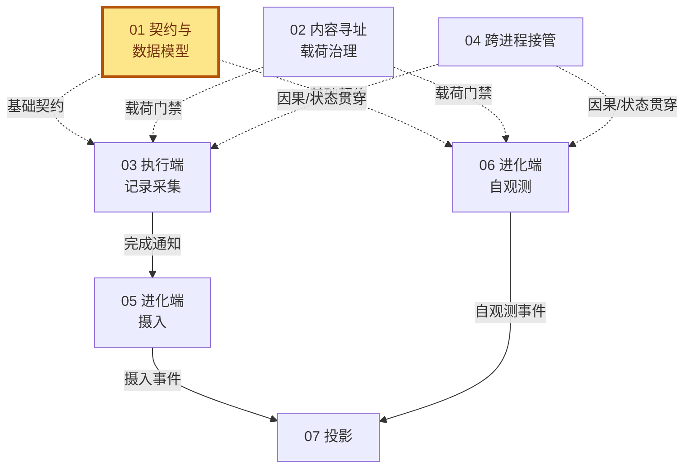
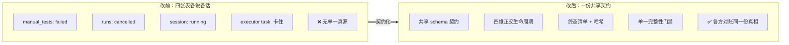
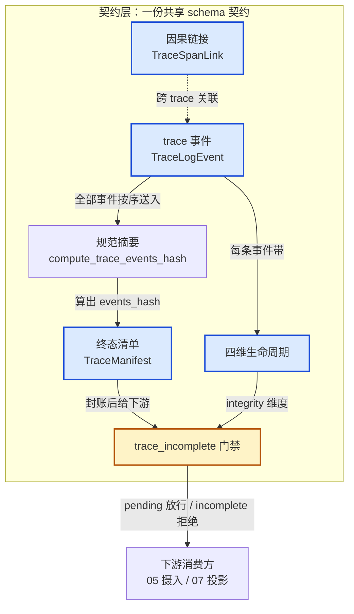
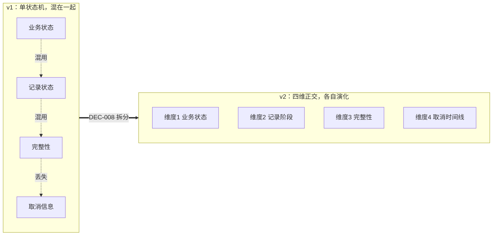
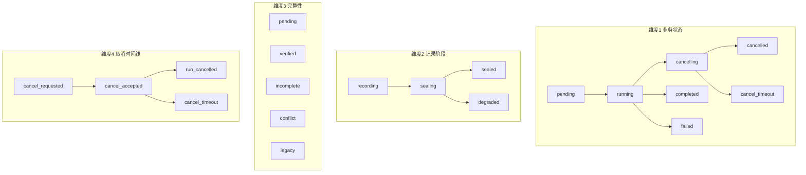
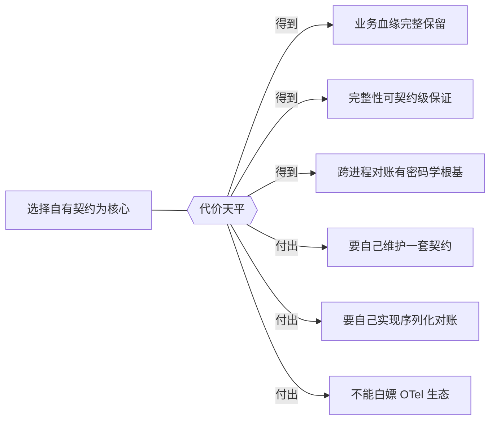
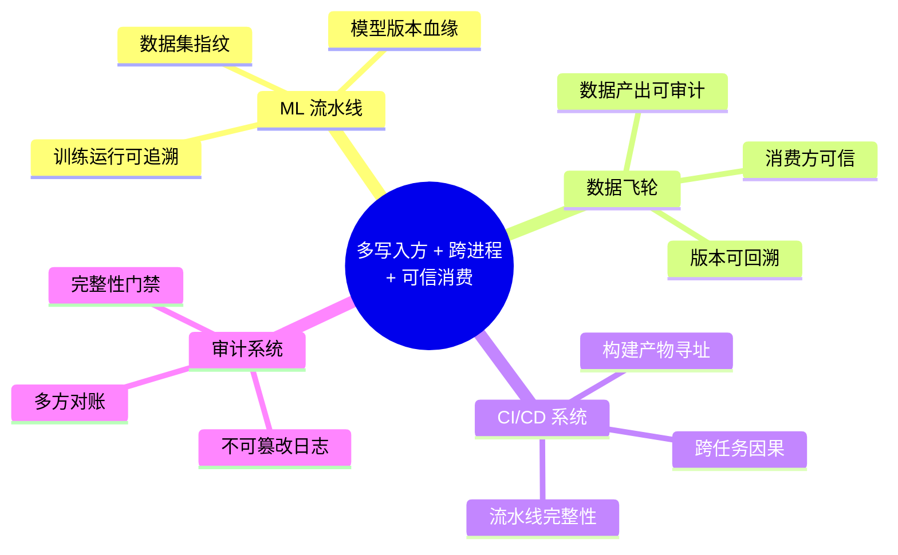
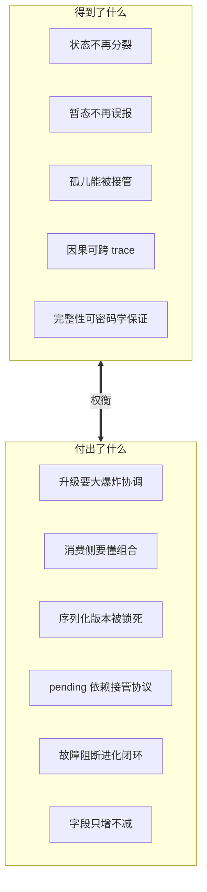
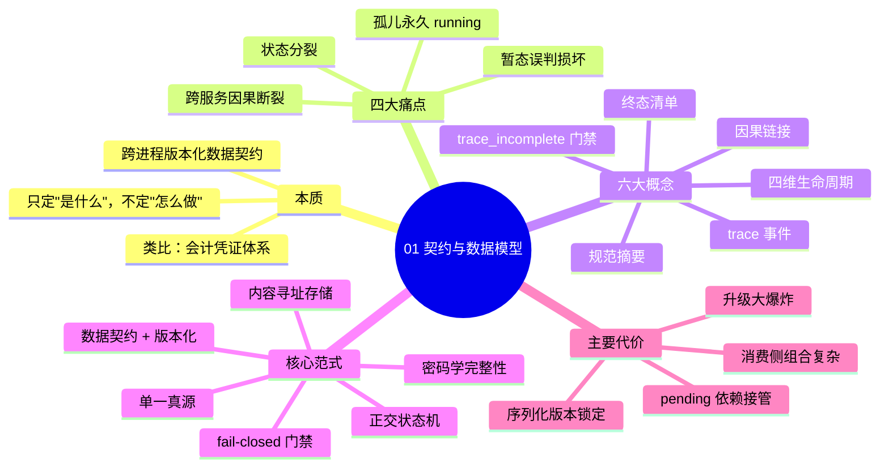

# 01 · 契约与数据模型（trace 系统 深读·子块 01）

> **层位声明：本文为设计思想层（架构师视角）。** 讲的是这套契约为什么这么设计、宏观怎么运转、各概念间怎么协作、契约与不变量是什么、优势与弊端、背后的可迁移原理。主动剥离环节内部微观实现（不钻步骤序列、不列字段级数据结构、不贴行号代码）。
>
> **本子块在 trace 系统中的位置**：契约层是全系统的地基——所有子块的结构定义都来自这里。它被 03/06 实现，被 05 消费，被 07 投影。

## 全局定位



**你在读的就是被高亮的 01 块**——全图的地基。它不消费谁，但 03、06 要照它的图纸施工，05 要按它的契约验收，07 要按它的字段投影。地基松一寸，全图晃三尺。

---

## 第 1 步：本质锚定

**一句话本质**：这是一份跨进程（executor 执行端 ↔ evolution 进化端）共享的**版本化数据契约**，用 pydantic 模型把"一次有界运行到底发生了什么"固化为可持久化、可校验、可消费的结构化事实，让两个独立服务对"什么是真相"达成一致。

### 用会计凭证体系来类比

这套契约的各个部件，几乎一一对应一套成熟的会计凭证体系。如果你能想象一家公司怎么管账，就能想象 trace 怎么管运行记录：

| trace 概念 | 会计里的对应 | 一句话点破 |
|---|---|---|
| trace 事件 (TraceLogEvent) | 流水账 / 记账凭证 | 每发生一件事就记一条，是原始事实 |
| 载荷 (TracePayloadRef) | 原始单据（发票、合同） | 凭证只引用单据号，不把单据正文塞进账本 |
| 终态清单 (TraceManifest) | 月末封账清单 | 把整月的凭证统一算个总哈希，盖上"封"字 |
| 规范摘要 (compute_trace_events_hash) | 会计核算口径 | 两端必须用同一套算法算账，差一个零都对不上 |
| 完整性 (TraceIntegrityStatus) | 审计意见 | pending=审计中、verified=无保留意见、incomplete=保留意见 |
| 因果链接 (TraceSpanLink) | 关联交易凭证 | "这笔是上笔的重试"，关联但不嵌套 |

**会计为什么这么做？** 因为流水一旦记下就不该改、单据和账本要分开存、封账之后要可审计、审计意见要独立于记账本身。trace 契约要解决的，是同一组问题在"运行观测"领域的版本。

### 这一层只负责"是什么"，不负责"怎么做"

契约层刻意只定义两件事：

1. **是什么**——每个结构的字段语义、合法取值。
2. **不变量**——哪些关系必须成立、什么组合合法、什么一旦写下就不能改。

它**不规定**：

- **怎么写盘** → 归 03（执行端记录采集）/06（进化端自观测）
- **怎么读** → 归 05（进化端摄入）
- **怎么投影给用户看** → 归 07（投影）

这种"图纸与施工分离"是为了让生产方、消费方、展示方各干各的，但都对着同一张图纸。图纸改了，三方都得对齐；图纸稳定，三方可以独立演化。

---

## 第 2 步：痛点动机

这一节要回答：**如果没有这套契约，线上到底会出什么事？** 答案是四件真实事故，每件都有 git 证据，每件都源于"契约缺失"这个共同的根。

> **怎么读这一节**：每个痛点都按「问题现场 → 根因 → 契约的解药 → 为什么管用」四段走。痛点和解药是一一对应的——看完四个痛点，你就知道契约为什么要长成第 3 步那个样子。下表先给一张全局映射，细节在下面逐个展开。

| 痛点 | 一句话问题 | 根因 | 契约给的解药 |
|---|---|---|---|
| 一·状态分裂 | 四张表各说各话 | 没有"共享单调终态" | 四维正交生命周期 + 单一真源 schema |
| 二·暂态误判 | 运行中永远弹"损坏"横幅 | "记录中"和"已损坏"塞进同一个值 | 完整性加 `pending` 值 + `trace_incomplete` 门禁 |
| 三·孤儿永久 running | 子进程被杀，没人能封账 | "读取权"和"封账所有权"没分开 | `TraceManifest` 封账 + 父进程接管协议（子块 04） |
| 四·跨服务因果断裂 | 重建不出父子树 | 没有"跨 trace 因果"的位置 | `TraceSpanLink` 因果链接（因果但不嵌套） |

### 痛点一：状态分裂灾难（78472eb，真实线上事故）

**场景**：用户点"取消"。

- evolution 端把状态写成了 `cancelled`。
- 但 executor 端那个真正在跑的 task 没收到、或者收到了卡住了，进程还在转。
- 结果：同一运行的四个表（manual_tests / runs / session / executor task）各显示各的——

```
用户看到的：
  测试页         → failed
  trace 详情页   → running
  停止按钮       → 不见了（因为某处认为已 cancelled）
用户实际能做的：干瞪眼。
```

**根因**：四张表由不同写入方各改各的，**没有一份共享的、单调的终态契约**。所谓"单调"指的是状态只能往一个方向走、不能往回退。没有它，"取消"就不是一次收敛，而是四场各说各话的独白。

**契约的解药（两层）**：

1. **单一真源**——两端 `import` 同一份 `contracts/trace/__init__.py`。所有写入方对着同一张图纸说话，不再各记各的本地账。这是地基。
2. **四维正交生命周期**（DEC-008，详见第 3 步 3.5）——v1 把"业务走到哪""trace 记完没""可不可信""谁取消的"全揉成一列状态，一揉就乱。v2 拆成四条**各自独立、各自单调**的时间线：业务状态 / 记录阶段 / 完整性 / 取消时间线。每个维度只能往一个方向走、不能往回退。

**为什么管用**："分裂"的本质是状态互相污染。一旦拆成正交维度，**每个维度自己单调自己演化，谁也推断不了谁**——你不能拿"业务 cancelled"去推断"trace 已封存"。组合态变成笛卡尔积，每张表想各说各话也说不起来了，因为大家都按同一个四维坐标对账。

### 痛点二：运行暂态被误判为终态损坏（509ceb1，EVD-005）

**场景**：一个正常运行中的 trace，事件还在源源不断地写。

- v1 契约里，`create_run` 一开始就把 `integrity_status` 写成 `"incomplete"`。
- 前端的逻辑是：看到任何**非 `verified`** 的状态，立刻弹一条"Trace 不完整"的红色故障横幅。
- 于是——**只要运行还没封账，前端就永远显示故障横幅**。运行得越久，红色横幅亮得越久。

**根因**：契约把"还在记录中"和"已封账但有缺口"塞进了同一个状态值 `incomplete`。前端分不清，用户更分不清。缺的是一个独立的"记录中/尚未校验"语义。

**契约的解药（两步拆分）**：

1. **完整性维度加一个 `pending` 值**（详见 3.5 维度 3）——这是最直接的解药：
   - 运行中（`recording`/`sealing`）→ `pending`（**不报损坏**）；
   - 封账后 → `verified`（哈希对）或 `incomplete`（有缺口，才报损坏）。
2. **`trace_incomplete` 门禁做精细区分**（详见 3.6）：`pending` **放行**（下游还能继续等后续事件），`incomplete` **拒绝**。

**为什么管用**：问题的本质是"语义混用一个词"。v2 没有去改前端逻辑，而是**在契约层把'暂态'和'终态损坏'这两个语义拆开成两个值**。词分清了，前端自然就知道该怎么展示。一处改动，根除误判。

### 痛点三：跨进程孤儿永久 running（509ceb1，EVD-006/007）

**场景**：一个隔离子进程正在跑 trace，被系统强杀。

- 父进程**只有读 trace 的权利，没有收尾 trace 的所有权**。
- 没人有权"封账"，这条 trace 永远停在 running。
- 线上抓到的 3 条 V2 取消样本，全部是这种孤儿：状态 `running` / `incomplete`、没有 manifest、`event_count=0`——但 jsonl 文件里其实已经写了 200 条事件。

**根因**：契约里没有表达"谁有权封存这条 trace""取消意图到底归谁所有"。封账的权力（所有权）和读取的权力（访问权）没有被契约区分开。

**契约的解药（跨两层，地基本块给、接管在子块 04）**：

1. **契约层给地基**——`TraceManifest` 终态清单（详见 3.3）：明确"封账"是一道正式工序，要算总哈希、写清单、盖 schema 版本章。这把"谁来封账、封账要干什么"首次变成了契约里的一等公民。
2. **`pending` + 父进程接管协议**（子块 04）——`pending` 这个暂态默认"封存终会发生"，但它能兑现这个承诺，靠的是父进程接管：子进程挂了，父进程来收尾。没有接管协议，`pending` 就是坑（见第 6 步代价四）。

**为什么管用**：孤儿问题的本质是"所有权缺位"。契约把"封账"从一个隐含动作**升级成有明确所有权的工序**，再用父进程接管保证"子进程倒了一定有人来封"。封账权 + 接管权合起来，孤儿就不可能永久 running——要么子进程自己封，要么父进程来封，总之有人封。

### 痛点四：跨服务因果断裂

**场景**：创作 → 证据 → 评估 → 进化，这是 Writer 的核心异步业务链，跨多个服务、跨多次运行。

- v1 只有 `run` / `llm` / `tool` 三类事件，**根本表达不出"这次进化是基于那篇证据"这种跨运行因果关系**。
- `run_id` / `parent_run_id` 字段大比例为空，事后想重建父子树都重建不出来。

**根因**：契约里没有"跨 trace 的异步因果"这个概念的位置。

**契约的解药**：专门造了 `TraceSpanLink` 结构（详见 3.4），用 **6 种 relation**（`triggered_by` / `retry_of` / `resumed_from` / `derived_from` / `consumes` / `produces`）显式表达跨 trace 的因果。

**关键设计取舍——为什么不直接用父子 span？** 这是这个解药最精髓的地方：

- OpenTelemetry 的 parent span 假设的是**同步嵌套调用树**（A 调 B，B 没返回 A 不能结束，且都在同一个 trace 内）。
- 但 Writer 的业务链是**异步、跨服务、跨 trace** 的——各跑各的、互不阻塞。
- 硬塞进父子 span = 把"师傅传绝活给徒弟"硬画成"母亲怀着孩子"——同步嵌套是假的、跨 trace 的 parent_span_id 根本无意义。

所以契约选了 `TraceSpanLink`——一句话：**有因果关系，但不构成嵌套**。

**为什么管用**：问题的本质是"没有合适的容器装这种因果"。v2 不是去硬套一个不合适的模型，而是**造了一个专门表达'异步、跨 trace、因果但不嵌套'的容器**。因果终于有处安放，而且不会污染同步调用树。

### 四个痛点收敛成一句话

> 这套契约要解决的，是**多写入方 + 跨进程 + 需要可信消费**时的四个根本问题：**可信边界**（下游只消费可信数据）、**状态分裂**（多写入方需共享单调状态机）、**可解释性**（需要能回溯）、**演化兼容**（schema 要能向后兼容地升级）。

**痛点 → 必备能力 → 落地概念 的闭环**：第 2 步的真正意图，不是罗列四个事故，而是用四个有 git 证据的真实事故，**倒推出契约必须具备的四个能力**，每个能力都有对应的概念落地（全部在第 3 步详讲）：

```
痛点一（状态分裂）   ──倒推──→ 必须有「共享单调状态机」 ──落地为──→ 四维正交生命周期
痛点二（暂态误判）   ──倒推──→ 必须有「暂态/终态分离」 ──落地为──→ pending 值 + 门禁
痛点三（孤儿running）──倒推──→ 必须有「封账所有权」    ──落地为──→ Manifest + 接管协议
痛点四（因果断裂）   ──倒推──→ 必须有「跨trace因果」   ──落地为──→ TraceSpanLink
```

第 2 步负责讲清"为什么需要"，第 3 步负责讲清"契约具体长什么样"——两步是同一个逻辑的两个面。

下面这张前后对比图，把"没有契约"和"有契约"的区别一次说清：



---

## 第 3 步：模块协作与契约

这是全文信息密度最高的一节。先上一张宏观图，看清契约层内部的概念怎么搭在一起，再逐个拆。

### 宏观模块协作图



**一句话点题**：事件是原料，规范摘要和清单把原料封账，四维生命周期给每条事件贴上四组独立标签，门禁是封账后下游能不能消费的唯一裁判。因果链接是唯一横向跨 trace 的组件。

下面逐个拆开讲。每个概念按"**职责 / 输入 / 输出 / 不变量 / 设计动机**"五点走。

---

### 3.1 trace 事件 (TraceLogEvent) —— 最小记录单元

- **职责**：trace 的最小记录单元。一条事件 = 一条 jsonl 行 / 一条 DB 记录。它就是会计里的一张记账凭证。
- **输入**：recorder 捕获到的运行事实（一次 LLM 调用、一次工具执行、一次状态变化……）。
- **输出**：可持久化、可哈希、可被 evolution 摄入的结构化记录。
- **不变量（三条铁律）**：
  1. `event_id` 稳定——写盘后**永久不变**。这是幂等去重的基石。
  2. `sequence` 连续无缺口——一条 trace 的事件序号是 1,2,3,…，不能跳号。
  3. `schema_version` 标记契约版本——读这条事件的人据此知道按哪版规则解读。
- **载荷不内联原则**：业务正文不直接塞进事件，而是用 `payload_refs` 放**引用**。为什么不内联？因为正文往往很大、有治理需求（脱敏、去重、生命周期），塞进事件里就治理不动了。这部分由 02 块的 PayloadGate 专门管，本块不展开。
- **设计动机**：把"运行到底发生了什么"切成最小、稳定、可排序的颗粒，让生产、传输、消费三方都能对齐到同一个粒度。

---

### 3.2 规范摘要 (compute_trace_events_hash) —— 两端对账的算法

- **职责**：把一条 trace 的全部事件，算成一个 SHA-256 哈希。两端（executor / evolution）必须用**完全相同**的算法，否则对不上账。
- **算法骨架**（这是契约层的硬规定）：
  1. 按事件的 `sequence` 排序。
  2. 每条事件做 `model_dump(exclude_none=True)`——丢掉空字段。
  3. 加上 `sort_keys=True`——字段按键名排序。
  4. 加上 `separators` 设到最紧凑——不留多余空白。
  5. 编码 UTF-8，每条事件后加一个换行。
  6. 对拼起来的字节流做 SHA-256。
- **每个参数防的是什么漂移？** 算法骨架的 6 个动作不是随便写的，每一个都封死一种会让哈希漂移的来源。下表一一对应：

  | 漂移来源 | 封死它的动作 | 没封会怎样 |
  |---|---|---|
  | 事件到达乱序 | 动作 1 `sorted(sequence)` | 按到达序算 → 哈希随机变 |
  | 字典键插入顺序不同 | 动作 3 `sort_keys=True` | Python dict 按插入序，两端插入序无法一致 → 哈希天差地别 |
  | JSON 多余空白 | 动作 4 `separators=(",",":")` | 默认 `json.dumps` 带空格 → 哈希不同 |
  | 空字段 `None` 有无 | 动作 2 `exclude_none=True` | 事件有 30+ 可选字段，None 出现时机不定 → 哈希不同 |
  | Unicode 转义差异 | `ensure_ascii=False` | 中文哈希跨库版本不同 |
  | 编码 / 换行差异 | 动作 5-6 UTF-8 + 每条加 `\n` | 跨平台哈希不同 |

  > 配套测试 `test_event_digest_is_stable_across_json_key_reordering` 专门验证这件事：两个键插入顺序不同的事件，算出的哈希必须相等。

- **如果允许漂移，会出什么事？** 哈希不一致不是软警告，是硬阻断。校验发生在 evolution 摄入端（`importer.py` 的 `_upsert_receipt`）：

  ```
  manifest 里的 events_hash  ≠  evolution 端重算的 events_hash
    → manifest_ok = False
      → integrity = "conflict"
        → trace_incomplete 门禁 = True（拒绝下游）
          → 这条 trace 进不了进化闭环
  ```

  最阴险之处在于：jsonl 文件里 200 条事件一条不少、肉眼看完全正常，纯粹因为序列化多了一个空格、键序不同，就被判"可能被篡改"。这种**幽灵冲突**排查极难——不是数据丢了，是口径漂了。这正是算法必须钉死在契约层、两端 import 同一份函数的根本原因。
- **输入**：全部 trace 事件。
- **输出**：一个 `events_hash` 字符串。
- **不变量**：相同的事件集合 + 相同的算法 = 永远相同的哈希。任何一条事件改一个字、序列化时多一个空格，哈希全变。
- **设计动机**：**为什么这个算法要写在契约层？** 因为 executor 和 evolution 是两个独立进程，可能用不同版本的库。序列化这种事，差一个空格、字段顺序换一下，哈希就天差地别。把算法钉死在契约层，两端才能"零摩擦复用"，避免出现"明明事件一样，哈希就是不相等"的幽灵冲突。【推测】放在契约层而非各自实现，就是为了从源头消灭这种摩擦。
- **生活类比**：这就像会计核算口径——两家公司对账，必须事先约定"四舍五入到第几位、按什么顺序列项"。口径不一致，账永远对不平。

---

### 3.3 终态清单 (TraceManifest) —— trace 的封账清单

- **职责**：trace 跑完、准备封存时写的一份"终态清单"。就像月末封账单：把整月凭证统一算个总账、盖个"封"字章。
- **关键字段**（按职责讲，不列字段级细节）：
  - `final_sequence`：最后一条事件的序号。
  - `terminal_event_id`：终态事件的 ID。
  - `events_hash`：由 3.2 的规范摘要算出来的总哈希。
  - `payload_ids`：本 trace 引用到的所有载荷清单。
  - `capture_degraded`：封账过程有没有降级（比如某些事件抓不到）。
- **输入**：全部 trace 事件 + 全部载荷引用。
- **输出**：一份不可变的封账凭证，附在 trace 终态上。
- **不变量（三条铁律）**：
  1. `schema_version=2` 显式写——封账这件事本身也是版本化的。
  2. **一旦写入，不可变**——封账后不能再改。
  3. `events_hash` **必须等于** `compute_trace_events_hash(全部事件)`——这是端到端完整性的密码学根基。
- **设计动机**：给 trace 一个"封账章"。下游消费时，先验这个章——哈希对得上，说明事件没被篡改、没丢没多；对不上，立即判 `conflict`。这是后面完整性门禁的信任根基。

---

### 3.4 因果链接 (TraceSpanLink) —— 跨 trace 的异步因果

- **职责**：表达**跨 trace 的异步因果关系**。docstring 原文一句话："异步因果关系，**不伪造为跨 Trace 父子 Span**。"
- **6 种 relation**（每种都是一个独立的因果动词）：
  - `triggered_by`：被某 trace 触发
  - `retry_of`：是某 trace 的重试
  - `resumed_from`：从某 trace 续跑
  - `derived_from`：派生自某 trace
  - `consumes`：消费了某 trace 的产物
  - `produces`：为某 trace 生产了产物
- **输入**：两个 trace 之间的一次因果事实 + 关系类型。
- **输出**：一条独立的因果链接记录，两端各持一份引用。
- **设计动机（这是本概念的精髓）**——**为什么不直接用父子 span？**

  OpenTelemetry 的 parent span 模型假设的是**同步调用树**：同一个 trace 内、有时序嵌套关系（A 调用 B，B 没返回前 A 不能结束）。但 Writer 的核心业务链是：

  ```
  创作 → 证据 → 评估 → 进化
  ```

  这条链是**异步**的（各跑各的）、**跨服务**的、**跨 trace** 的（每次都是一个独立运行）。如果硬塞进父子 span 模型，会发生三件错事：

  1. **伪造同步嵌套**——把"先后跑、互不阻塞"硬说成"嵌套调用"。
  2. **跨 trace parent_span_id 无意义**——OTel 的 parent span 只在同一个 trace 里有定义。
  3. **把长期业务血缘错压成短时调用链**——业务血缘可能跨好几天，调用链通常是毫秒级。

  所以契约选择**用独立的 span link 结构**，明确表达"我们之间有因果关系，但不构成嵌套"。一句话：**因果但不嵌套**。

  生活类比：父子 span 像"母亲怀着孩子"（同步、嵌套、同一体内）；span link 像"师傅把绝活传给徒弟"（异步、独立、但确有传承）。硬把传承关系画成怀孕，就荒谬了。

---

### 3.5 四维生命周期 —— 本子块的重中之重

这是整个契约层最关键、也是 v1→v2 改造最大的部分。先说**为什么要正交**，再逐个看四个维度。

#### 为什么要拆成四个正交维度？

v1 只有一个状态机，把"业务走到哪了""trace 记完了吗""记录可不可信""谁取消的"全混在一列。结果是：

- 业务 `completed` 不代表 trace 已封存 → 下游误以为可消费。
- 业务 `cancelled` 不代表 trace 已封存 → 但下游会推断它封存了。
- trace 已封存不代表业务成功 → 但下游会推断它成功了。

混用状态，是前面痛点一、二的**全局割裂的架构根因**。正交改造（DEC-008）的核心思想：**让每个维度独立演化、独立单调化**，组合态就是笛卡尔积。

> **先弄懂两个关键词**：下面会反复出现"正交"和"笛卡尔积"，先讲清这两个词，后面的硬规矩才看得懂。

##### 关键词一：什么是"正交"？

**几何直觉**：正交来自几何学，就是"互相垂直"。坐标系里的 x 轴和 y 轴正交——**沿 x 轴移动，y 坐标不变；沿 y 轴移动，x 坐标不变。** 两条轴互不影响。

```
        y轴
        ↑
        │   ← x轴和y轴互相"正交"
        │
   ─────┼─────→ x轴
```

**工程含义**：两个东西正交 = **改其中一个，另一个完全不受影响**。

> **生活类比——汽车油门和方向盘**：
> - 踩油门 → 改变速度，不影响方向
> - 打方向盘 → 改变方向，不影响速度
> - 两者正交，各管一摊，所以开车很顺。
>
> **反例**：如果油门和方向盘焊死了（踩油门车还自动拐弯），想加速却拐了弯、想拐弯却加速了——**耦合 = 改一个带动另一个，是混乱的根源**。

v1 的单状态字段，就相当于油门和方向盘焊死了。v2 拆成四个维度，相当于把它们拆成四根独立的"轴"：业务状态、记录阶段、完整性、取消时间线各管各的，**改一根不动其他三根**。

##### 关键词二：什么是"笛卡尔积"？它有什么用？

**定义**：把几个集合里所有可能的组合，全部列出来。

```
上衣 = {红, 蓝}
裤子 = {黑, 白}

笛卡尔积 = {红黑, 红白, 蓝黑, 蓝白}   ← 2 × 2 = 4 种组合
```

关键性质：**每个组合都是合法的，任意搭配都成立。** 上衣和裤子互相独立，所以怎么搭都行——这正是正交带来的回报。

**套到四维生命周期**：一次运行的状态不再是"一个值"，而是**四个值组成的元组**：

```
一次运行的状态 = (业务状态, 记录阶段, 完整性, 取消时间线)
```

四个维度各有自己的合法取值，组合数 ≈ 10 × 4 × 5 × 5 = **1000 种组合**。每一种组合都有独立的合法含义，举几个真实场景：

| 业务状态 | 记录阶段 | 完整性 | 取消时间线 | 这个组合描述什么真实场景 |
|---|---|---|---|---|
| `cancelled` | `sealed` | `verified` | `run_cancelled` | 正常收尾：业务取消成功，记录完整封存，可信 |
| `cancelled` | `recording` | `pending` | `cancel_requested` | 取消刚发出，还在等收尾，trace 还在记 |
| `cancelled` | `degraded` | `incomplete` | `cancel_timeout` | 取消超时，封账降级了，记录有缺口 |
| **`completed`** | **`recording`** | **`pending`** | **无取消** | **业务做完了，但 trace 还在写、没封账（痛点二正是这里）** |

**看最后一行**——这就是痛点二的精确解。v2 能同时表达"业务 completed"和"trace 还没 sealed"，而 v1 做不到。

**笛卡尔积的三个作用**：

1. **精确表达，不丢信息**——1000 种组合覆盖所有真实状态切片。v1 把这些压成一列，丢失大部分信息；v2 全部保留。
2. **避免状态爆炸**——不正交的话，要在单状态机里手动枚举 `completed_sealed_verified`、`cancelled_recording_pending_cancel_requested`...无法维护。正交拆分把"一个大状态机"变成"四个小状态机"，组合数自动是笛卡尔积，**不用手动枚举**。
3. **独立单调**——每根轴自己只往一个方向走（`recording → sealing → sealed` 只进不退），组合起来整个系统状态也只进不退。

**一句话收束**：**因为正交（独立），所以笛卡尔积（任意组合合法）。** 两者是因果关系，这是 DEC-008 改造的核心思想。



**正交的硬规矩（CON-007）**：任何组件不得——

- 用 `incomplete` 代替"仍在记录"；
- 用业务 `cancelled` 推断 trace 已封存；
- 用 trace `sealed` 推断业务成功。

每个**组合**（比如 `status=cancelled` + `phase=sealed` + `integrity=verified`）都有独立合法含义，不能互相推断。

**辅助字段 `lifecycle_revision`**：单调递增的版本号。桌面端据此**拒绝旧快照覆盖新状态**（CON-006）——谁后写谁作数，但必须是更新的版本号。这防止了"乱序到达的旧状态把新状态盖回去"。

下面逐维拆解。

#### 维度 1：业务状态 (TraceStatus) —— 任务走到哪了？

- **回答的问题**：这次运行，业务上走到哪一步了？最终结局是什么？
- **枚举值**：`pending` / `running` / `awaiting_input` / `cancelling` / `completed` / `failed` / `evidence_capture_failed` / `cancelled` / `cancel_timeout` / `interrupted`
- **设计动机（根因）**：
  - v1 **缺 `cancelling` 中间态** → 用户点取消，界面没有任何反馈，只能猜"是不是点了没用"。
  - v1 **缺 `pending`** → 取消早于 worker 建立时，根本无法表达"还没开始就被取消了"。
  - `cancel_timeout` 是一种**诚实告警**：取消请求发出后，10 秒内无法确认是否收敛，就如实报告超时，**绝不谎报 `cancelled`**。谎报成功是最危险的，因为它会让下游以为一切已经收尾。

#### 维度 2：记录阶段 (TracePhase) —— trace 写完了吗？

- **回答的问题**：trace 的记录写完了吗？封存了吗？
- **枚举与流转**：`recording` → `sealing` → `sealed` | `degraded`
  - `recording`：还在写事件。
  - `sealing`：正在封账（算哈希、写清单）。
  - `sealed`：封账完成，不可变。
  - `degraded`：封账过程中降级了（部分抓不到等），但仍算封完。
- **设计动机（根因）**：v1 **没有这个维度** → 业务 `completed` 不代表 trace 已 `sealed`，下游误以为"业务一完成，trace 立刻就能消费"。实际上 trace 的封账是另一道工序，需要单独表达。

#### 维度 3：完整性 (TraceIntegrityStatus) —— 这份记录可信吗？

- **回答的问题**：这份 trace 记录可信吗？能不能放进下游？
- **枚举值**：`pending` / `verified` / `incomplete` / `conflict` / `legacy`
- **`pending` 是 v2 后加的关键值**——这也是痛点二的直接解药：
  - 在 `recording` / `sealing` 期间，完整性是 `pending`（**不误报损坏**）。
  - 只有 `sealed` 之后，才判 `verified`（哈希对、无缺口）或 `incomplete`（已封账但有缺口）。
- v1 直接写 `incomplete`，导致**运行中永远显示"损坏"**。v2 用 `pending` 把"暂态"和"终态损坏"彻底分开。
- `conflict`：哈希对不上，可能被篡改或序列化不一致。
- `legacy`：旧版本索引，按旧规则读。

#### 维度 4：取消时间线 —— 用户何时何人为何取消？

- **回答的问题**：谁、什么时候、为什么取消的？取消收敛了吗？
- **结构**：一组取消事件 + 一个 `CancelAudit` 审计记录。
- **流转**：`cancel_requested` → `cancel_accepted` → `run_cancelled` | `cancel_timeout`
- **设计动机（根因）**：v1 **取消请求只存内存** → 进程被强杀，取消意图彻底丢失、毫无审计痕迹。v2 用 `CancelAudit` 把 `cancel_id` **持久化**，让它贯穿 executor / evolution / 桌面三端，谁也不能抵赖"我没收到取消"。

#### 四维正交的一张总图



**一句话点题**：四条独立时间线，互不推断，组合起来才能完整描述一次运行的全貌。

---

### 3.6 trace_incomplete 门禁 —— 唯一的可信出口

这是契约层最后一个、也是最关键的消费侧机制。

- **职责**：一道**契约级硬门禁**，决定下游能不能消费这条 trace。它是一个 property（计算属性），不是字段。
- **代码逻辑（CON-001/FR-004）**：

  ```
  trace_incomplete = (integrity_status not in ("verified", "pending"))
  ```

  也就是：完整性是 `verified` 或 `pending` → 门禁放行（`trace_incomplete=False`）；其余（`incomplete` / `conflict` / `legacy`）→ 门禁拒绝（`trace_incomplete=True`）。

- **`pending` vs `incomplete` 的微妙区别（这是精髓）**：

  | 状态 | 含义 | 门禁结果 | UI 应该怎么展示 |
  |---|---|---|---|
  | `pending` | 还在记录 / 封存中 | **放行**（`trace_incomplete=False`） | 不能当终态 `incomplete` 展示 |
  | `incomplete` | 已封账但有缺口 | **拒绝**（`trace_incomplete=True`） | 如实展示为不完整 |

  为什么 `pending` 要放行？因为下游（05 摄入）还需要继续等这条 trace 后续的事件，不能因为"还没封账"就被一刀切掉。但 UI 又不能把 `pending` 当成"损坏"吓唬用户——所以**门禁放行 ≠ UI 可当终态展示**，这两件事是分开的。

- **为什么门禁必须设在契约层，而不是各下游各判断？**

  CON-001 的原话精神：**"完整性必须基于内部持久化事实，UI / OTLP / '页面看起来完整'都不得直接提升状态。"**

  如果门禁散落在每个下游入口，只要有一个入口漏判，不可信数据就会溜进评估，直接污染进化结论——错误会沿着业务链放大。所以门禁必须**单一、契约级、不可绕过**。这是典型的 fail-closed（默认拒绝）安全设计。

- **为什么 `trace_incomplete` 是 property 不是字段？**

  【推测】因为它是 `integrity_status` 的**派生判断**。如果存成字段，就会出现"字段值和 `integrity_status` 不一致"的二次分裂——又回到痛点一的老路。用 property 保证**单一来源**：完整性状态一变，门禁结果自动跟着变，不可能不同步。

---

## 第 4 步：决策对比

### 本项目方案一句话

**Writer 选择"自有版本化 pydantic 契约为核心 + W3C Trace Context 做跨服务传播 + OpenTelemetry 作为薄薄的、可替换的单向出口"的三明治架构。** 自有契约承载业务血缘，OTel 只在最外层当个导出口。

### 为什么不全盘用 OpenTelemetry？

关键在于**观测对象根本不一样**：

- **OTel 是"通用 APM 调用树"思维**——它假设自己观测的是**无状态的一次请求**（一次 HTTP 调用、一次 RPC）。请求来了、处理、走了，观测结束。
- **Writer 观测的是有状态、有制品、有版本的 Agent 工作流**——一份稿件有 revision、一次进化是一个实验、证据是一份卷宗。这些概念，OTel 的模型里**根本没有位置**。

如果把 Writer 的工作流硬塞进 OTel，"稿件 revision""证据卷宗""进化实验"这些业务血缘会全部丢失——你只能看到一堆 LLM 调用和工具调用，看不出它们和具体业务产物的关系。

### 三个方案对比

| 维度 | **Writer（本项目）** | **OpenTelemetry (OTel)** | **W3C Trace Context** |
|---|---|---|---|
| 核心模型 | 自有版本化 pydantic 契约，`schema_version` 显式 | Span / SpanContext 为中心，OTLP 导出 | 仅定义 `traceparent` 头格式，管跨服务传播 |
| 异步因果 | 因果链接独立结构，6 种 relation | Span Link（语义弱，实践少用） | 不涉及 |
| 完整性 | 四维之一，`verified` / `incomplete` / `conflict` / `legacy` + `pending`，契约级硬门禁 | **无原生完整性概念**（APM 假设管道可靠） | 无 |
| 载荷治理 | 载荷内容寻址 + PayloadGate + 90 天生命周期 | 不规定 | 不涉及 |
| 业务血缘 | `artifact_revision_id` + `external_refs` 显式制品版本链 | **无**（OTel 是通用调用树，不懂制品） | 无 |
| Writer 的态度 | **核心机制，进内部契约** | 兼容适配薄边界，OTLP 当可替换单向出口 | 第一阶段采用，解决跨服务传播 |

### 代价天平



**一句话总结**：Writer 选择了"自己造核心、别人造的当配件"。核心层（业务血缘、完整性、契约）必须自己掌握，因为这是产品的命脉；传播和导出这些通用层用业界标准，省事又能互通。

---

## 第 5 步：理论抽象

这套契约不是凭空发明的，它落地了六条经典的工程原理。理解了这六条，你就能把它们搬到任何"多写入方 + 跨进程 + 需要可信消费"的系统里。

### 六条第一性原理

**1. 单一真源原则（Single Source of Truth）**
两个服务 `import` 同一份 `contracts/trace/__init__.py`。契约即真相，避免双方各自维护一份会漂移的"本地理解"。
*类比：两家公司对账，必须对着同一张总账，不能各记各的。*

**2. 数据契约模式（Data Contract）**
版本化数据契约是微服务解耦的经典手段。`schema_version` + 向后兼容的默认值，实现"混合版本窗口"的平滑迁移（CON-009）——新 trace 写新版本号，旧索引按默认旧版读，两端能在一段时间内并存。
*家族：API 版本化、Protocol Buffers、Avro schema registry。*

**3. 正交状态机（Orthogonal State Machines）**
四个维度独立演化，组合态空间 = 笛卡尔积。用多个小状态机替代一个大状态机，**避免状态爆炸**，每个维度可独立单调化。这是状态机理论里的经典手法。
*家族：游戏 AI 的 FSM 分层、编译器的正交属性分析。*

**4. 内容寻址存储（Content-Addressable Storage, CAS）**
载荷用 `content_hash` 寻址——内容决定地址。天然带来三个好处：去重（同内容同地址）、可校验（取出来重算哈希能验真）、不可变（内容改了就是新地址）。
*家族：Git、IPFS、Nix 包管理器。*

**5. 密码学完整性校验**
`compute_trace_events_hash` 用 SHA-256 + 规范序列化，实现端到端 tamper-evident（可证篡改）。任何中途对事件的改动，都会让清单上的哈希对不上。
*家族：Merkle 树、区块链哈希、软件包签名。*

**6. Fail-Closed 安全门禁**
`trace_incomplete` 默认拒绝下游，符合安全工程里"默认拒绝"的原则。宁可阻断业务，也不放行不可信数据。
*家族：防火墙默认拒绝、Kubernetes 准入控制、零信任架构。*

### 同类家族：这套范式还能用在哪？



**可迁移的原理家族**（一句话）：任何"多写入方 + 跨进程 + 需要可信消费"的系统，都可以套这套范式——**版本化契约 + 正交状态机 + 内容寻址载荷 + 密码学清单 + fail-closed 门禁**。

---

## 第 6 步：边界与代价

任何设计都是取舍。这套契约解决了上面的四个痛点，但也付出了实打实的代价。这一节讲清：**它在什么情况下会失效？有什么副作用？牺牲了什么？**

### 代价一：契约升级的连锁代价（有 git 证据：R5/R16/R18 + CON-009）

改一个字段，**两端同时受影响**。v1 → v2 的四维升级，迫使 executor recorder、evolution ingestion / projector、桌面端、四类 workload 一次性全部对齐——光测试文件就改了 7 个（509ceb1）。

这是典型的**大爆炸式协调成本**。契约越核心、消费方越多，升级越痛。

### 代价二：正交维度的组合复杂度【推测】

四维正交在生产侧带来了清晰，但**把复杂度推给了消费侧**。下游消费者必须理解所有合法组合：UI 投影怎么展示 `status=cancelling + phase=sealing + integrity=pending`？诊断文案怎么写？门禁逻辑覆盖到每个组合了吗？

这是用"消费侧复杂度"换"生产侧清晰度"。组合空间 = 笛卡尔积，维度越多，组合数涨得越凶。

### 代价三：manifest 哈希对序列化的脆弱依赖【推测】

规范摘要要求两端 JSON 序列化**字节级一致**。这意味着序列化工具的版本也被锁死进了契约。

如果一端升级 pydantic，导致 `model_dump` 输出多了哪怕一个空格、字段顺序变了，**历史 trace 的哈希全部失效**——全体 `conflict`。这是一个隐藏的、脆弱的版本耦合。

### 代价四：pending 暂态的时效性假设（有证据：EDGE-009 + AC-010）

`pending` 这个语义，**默认"封存终会发生"**。如果 recorder 崩溃且没有父进程接管，`pending` 就会永久停留——退化回 v1 那种"永久 incomplete"的困境。

所以 `pending` 不是孤立成立的，它**必须配套父进程接管协议**（子块 04）才能兑现"终会收敛"的承诺。这是一个有依赖的设计。

### 代价五：门禁 fail-closed 的可用性代价（有证据：FR-004 + RSK-001）

严格拒绝下游，意味着观测管道的任何故障都会**阻断整个进化闭环**。宁可阻断，也不放行不可信数据。

更复杂的是**非对称设计**：创作流程是 **fail-open**（出了问题继续完成创作，别让用户白干），下游消费是 **fail-closed**（拒绝消费不可信数据）。同一个系统两套故障策略，实现起来不简单。

### 代价六：向后兼容的字段膨胀

四维字段全带默认值，旧索引缺省读 `None`。这是向后兼容的代价：**契约字段只会越加越多，旧字段不敢删**。长期下来是一笔技术债。

### 代价七：不覆盖确定性回放

契约的目标是"**解释发生了什么**"，不承诺"对非确定性模型做确定性回放"。也就是说，你能用它回溯一次运行，但不能指望用它把同一个 LLM 调用原样再跑一遍——模型本身是不确定的。

### 代价天平总图



**一句话总结**：这套契约用"高昂的契约维护成本"换来了"可信、可审计、可演化的运行记录"。对一个把"可信消费"当命脉的系统，这笔交易是值的；对一个轻量、低风险的工具，可能就过度设计了。

---

## 第 7 步：吃透检验

下面六个问题，是面试官或代码 reviewer 最可能追问的。每题按"**点题 → 机制 → 权衡**"三段式作答。

### Q1：为什么 manifest 放 executor 写，而不是 evolution？

- **点题**：这是**权责分离**。
- **机制**：executor 是 trace 的**生产方**，是 canonical truth owner（唯一真相的持有者）；evolution 是**消费方**。生产方负责封章，消费方负责验章。如果反过来让消费方封章，等于让吃饭的人决定菜单，信任根基就没了。
- **权衡**：代价是 executor 必须承担封账的复杂度（算哈希、写清单）。但这是合理的——谁生产谁负责，比让消费方各显神通地猜"这条 trace 封没封"要可靠得多。

### Q2：trace_incomplete 为什么是 property 不是字段？

- **点题**：因为它是**派生判断**，不能有第二份真相。
- **机制**：`trace_incomplete` 由 `integrity_status` 计算得出。如果存成字段，就会出现"字段值和完整性状态不一致"的二次分裂——又回到痛点一的老路。用 property 保证**单一来源**：完整性一变，门禁结果自动同步。
- **权衡**【推测】：代价是每次访问都要计算（极轻），换来了"绝不可能不一致"的强保证。这种用计算换一致性的取舍，在状态机设计里非常常见。

### Q3：四维正交 vs 单状态机，值得这么大改造吗？

- **点题**：值得，而且**是彻底解决的唯一路径**。
- **机制**：509ceb1 的证据摆在那——混用状态导致线上 3/3 取消闭环失败、永久 running 孤儿。局部补丁已经失败过两次（EVD-003），证明在旧模型里打补丁是行不通的。正交改造是一次性把根因连根拔起。
- **权衡**：代价是组合复杂度和升级协调成本（见第 6 步）。但相比"线上每隔一段时间就出一次状态分裂事故"，这点代价是划算的——尤其对一个把可信消费当命脉的系统。

### Q4：pending 暂态会不会让下游永远等？

- **点题**：不会，前提是**配套父进程接管**。
- **机制**：`pending` 配合 `seal_external_cancel`（父进程接管协议）+ 三方对账（task / test / trace 三方互相印证），保证 `pending` **必然收敛**。如果封存超过阈值，状态会转成 `degraded` 或 `incomplete`——不会无限等。
- **权衡**：代价是这套接管协议本身有复杂度（子块 04 的事）。但有了它，`pending` 的"终会收敛"承诺才成立；没有它，`pending` 就是个坑。

### Q5：schema_version=2 之后还会有 v3 吗？

- **点题**：会，而且**已经预留了平滑升级的机制**。
- **机制**（CON-009）：升级走三步——
  1. 新 trace **显式写**新版本号；
  2. 旧索引**按默认值**当旧版读；
  3. 混合窗口期靠**向后兼容的默认值**让两端并存。
- **权衡**：代价是字段只增不减（代价六）。好处是升级不需要停服、不需要一次性迁移全部历史数据。

### Q6：同一事件被重复投递两次会怎样？

- **点题**：靠 `event_id` 幂等去重，但**完整性由 sequence 决定**。
- **机制**：`event_id` 稳定（不变量铁律 1）。evolution 摄入时按 `event_id` 去重，重复投递的同一条事件只会被记一次。**但是**——如果 `sequence` 出现缺口（中间漏了一条），或者终态事件缺失，完整性会判 `incomplete`，门禁会拒绝下游。
- **权衡**：去重保证不重复，但**不保证完整**。完整性的红线在 sequence 连续 + 哈希对得上，这两条任何一条破了，trace 就不可信。这是"幂等"和"完整"两个层次的分离。

---

## 收束：一张图记住本块



读完这块，你应该能回答：**换一个项目，遇到"多写入方 + 跨进程 + 要可信消费"的场景，我该往哪个方向想？** 答案就在上面那张思维导图里——版本化契约 + 正交状态机 + 内容寻址 + 密码学清单 + fail-closed 门禁。这是一套可以搬走的设计范式，不只是一个项目的内部实现。
