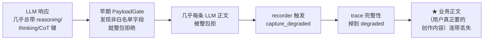
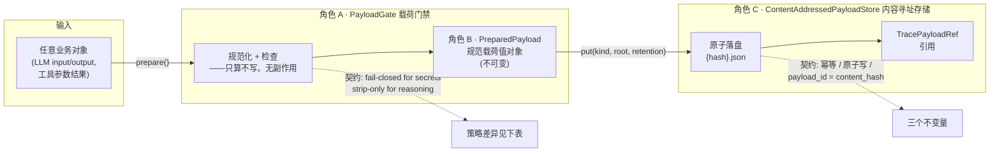

# 02 · 内容寻址载荷治理（trace 系统 深读·子块 02）

> **层位声明：本文为设计思想层（架构师视角）。** 讲的是载荷治理为什么这么设计、三个角色怎么协作、契约与不变量、策略差异、优势弊端、可迁移原理。主动剥离环节内部微观实现——不钻步骤序列、不列字段级数据结构、不贴行号代码。
>
> 认知光谱：① 解决什么问题 ② 为什么这么设计 ③ 宏观模块流转与契约（本层讲）│ ④ 步骤序列 ⑤ 伪代码 ⑥ 字段清单 ⑦ 行号代码（本层不讲）。
>
> **诚实铁律**：推断标 `【推测】`，看不清如实说，不编造。
>
> **本子块在 trace 系统中的位置**：载荷治理是"事件该轻、正文该重"原则的落地——把受治理的业务正文从事件流剥离，用内容哈希寻址存储。它被 recorder（负责把 trace 落盘的采集器，详见子块 03/06）调用。

---

## 全局定位

> **先建个画面**：这套机制像一个「指纹快递柜」——大块正文从日志里抠出来，用内容的指纹当柜号存进去，日志里只留一张取件卡。
>
> **读完这篇你能用自己的话回答**：这套机制干嘛（一句话比方）/ 为什么这么干（不这么干炸四个雷）/ 怎么干活的（三个角色）/ 最聪明的设计点在哪（推理键剥离 vs 密钥整包拒）。

下面的图是"谁负责什么"的分工全景。术语较多，先扫一眼有个印象即可，下一节起会逐个接地。

```
契约 contracts：S01 TracePayloadRef/TraceManifest 定义
        │
        ▼
产生端 executor：载荷治理 ← 你在这里   →  S03/S06 recorder 调用
        │   （PayloadGate + ContentAddressedPayloadStore）
        ▼
摄入端 evolution：purge_expired_payloads / 引用计数删除
```

本子块只回答一个问题：**业务正文（LLM 输入输出、工具参数结果）从事件流里被剥离出来之后，在被永久落盘之前，要经过怎样的治理？**

> **术语接地——载荷（payload）**：受治理的业务正文。在 trace 里它不内联进事件，而是用一个轻量引用 `TracePayloadRef` 指向真正存盘的文件。
> **术语接地——内容寻址存储（ContentAddressedPayloadStore）**：用内容本身的 SHA-256 哈希当文件名。内容一变哈希就变，文件名就跟着变——所以同一份内容永远只存一份，也天然防篡改。（「哈希」「内容寻址」到底是什么，下面第 1 步会从头讲透。）
> **术语接地——PayloadGate（载荷门禁）**：写入前的一道检查站。进存储柜之前先过安检：推理键（模型的内部思考）脱掉放行，密钥（用户凭据）直接没收拒收。
> **术语接地——manifest（终态清单）**：像快递寄出前贴的那张「箱内物品清单」——trace 跑完时把本次所有正文的哈希列成一张表封存起来（封存是子块 03 的事），载荷治理只负责保证清单里每个哈希都能被回读校验。
> **术语接地——retention（保留期）**：文件的存活天数，本项目默认 90 天。到期只是个「该清理了」的标记，真正删文件靠定时任务 + 引用计数（见第 6 步）。

---

## 第 1 步：本质锚定

### 一句话本质

> **白话版**：把大块正文从日志里抠出来，过一道安检，用内容的「指纹」当柜号存进快递柜——日志里只留一张取件卡。

**术语版**：把 trace 事件的"语义正文"——也就是 LLM 的输入输出、工具的参数和结果——从事件流里剥离出来，经一道门禁（PayloadGate）治理后，用**内容本身的 SHA-256 哈希**作为文件名落盘存储；事件流里只留一个轻量引用（`TracePayloadRef`）。

### 先把地基打牢：什么叫「内容寻址」「哈希」「幂等」

下面三个支柱全都立在一个底层概念上。这个概念不弄懂，后面整篇都悬空。所以先花一小节把它讲到能用你自己的话复述。

**① 位置寻址 vs 内容寻址——两种给文件起名的方式**

普通存文件是「位置寻址」：你先起个名字（比如 `foo.json`），把内容塞进去。内容改了，名字不变。像停车位——7 号车位是固定的，今天停奥迪、明天停宝马，车位号不变。

这套机制用「内容寻址」：文件名不是你起的，是**拿内容本身算出来的指纹**。内容一变，指纹就变，文件名跟着变。像图书馆按书的内容编索书号——同一本书无论谁编目，永远同一个号。

**② 哈希（hash）= 内容的指纹**

把任意内容（哪怕几万字）丢进一个函数，算出一串固定长度的乱码。同一份内容算出来永远一样；内容哪怕改一个标点，算出来就完全不同。就像人的指纹——一个人一个，碰巧两人一样的概率近乎零。本项目用 SHA-256（一种具体的指纹算法）。

```
"你好"     →  670d413f...（共 64 位十六进制：只含 0-9、a-f）
"你好。"   →  a1f3c082...（仅多了一个句号，结果完全变了）
"你好"     →  670d413f...（还是它，永远一样）
```

**③ 幂等（idempotent）= 做多少遍效果跟做一遍一样**

「幂等」是后面反复出现的词。它指的是：同一个操作做一百遍、一万遍，最终效果跟做一遍完全一样。内容寻址天然幂等——同一份内容存一万次，因为指纹一样、文件名一样，磁盘上始终只有一个文件。

这三个概念就位，下面的「三个支柱」就好懂了。

### 三个支柱（地基概念之上，本机制新增的两根柱）

地基概念是底层常识；这一步讲的是**本机制自己**立在哪几根柱子上。注意：①内容寻址**升级成了支柱**（地基里它只是个概念，这里它真正撑起了去重和防篡改），而②门控、③不可变是本机制新加的两根——地基概念里没有它们：

| 支柱 | 一句话 | 它撑起什么 |
|---|---|---|
| **① 内容寻址**（从地基升格） | 地址 = 内容指纹。同内容必同地址 | 天然幂等（写一万次磁盘一个文件）、天然去重、天然防篡改 |
| **② 门控（PayloadGate）**（本机制新加） | 进柜前过安检 | 密钥没收拒收（fail-closed），推理脱掉放行（定向剥离） |
| **③ 不可变**（本机制新加） | 文件名是哈希，改内容即换文件 | 落盘的 payload 永不被改写，引用永远指得对 |

### 建立画面：三个类比任选其一

读到后面如果觉得抽象，回来翻这张表。

| 类比 | 事件流像什么 | 正文像什么 | 引用（TracePayloadRef）像什么 |
|---|---|---|---|
| **Git（最贴）** | commit 历史 | 文件内容（blob） | commit 里指向 blob 的哈希 |
| **快递柜** | 快递单（薄薄一张） | 大件货物（塞柜子里） | 快递单上的柜号 |
| **图书馆** | 借阅流水账 | 真书（按书号上架） | 索引卡上的书号——凭卡取书就是 hydrate（回取正文） |

最贴的是 **Git**：Git 用 SHA 当对象的 ID，同一份内容只存一份 blob，commit 只是引用。本项目的载荷治理做的就是这件事，只不过加了一道"进 Git 之前先安检"的门禁。

**一句话带走**：把正文从事件流里抠出来，安检一道，用哈希当文件名存——事件流只留指针。

---

## 第 2 步：痛点动机

> 【主线位置：因果链起点。先看清"不治理会出什么事"，再理解后面三个角色为什么这么分工。】

如果业务正文直接内联进事件流（不剥离、不门控、不内容寻址），会同时炸四个雷。其中第四个是真实踩过的线上事故。

### 痛点 1：jsonl 膨胀（体积灾难）

一条 LLM 事件的 input/output 可能几万字。一条长 trace 几十上百条事件，jsonl 文件迅速膨胀到几十上百 MB。更要命的是——摄入端（evolution）拉数据时要把全部正文都扛着走一遍，而**多数分析只需要事件骨架**（调了几次 AI、跑了哪些工具），并不需要每次的完整正文。

**根因**：事件流是"时间线日志"，天生该轻；语义正文是"大块内容"，天生该分离存储。把它们塞在一起，两边都难受。

### 痛点 2：敏感信息泄漏（安全灾难）

LLM 的 input 里可能带着各种凭据：`Authorization: Bearer ...`、`api_key: sk-...`、AWS 的 `AKIA...`、PEM 格式私钥。trace jsonl 会持久化到本地磁盘，evolution 还会做受控拉取——**密钥一旦进了 jsonl，等于凭据明文被写进了多个组件都能读的存储**。

这条痛点直接对应 commit `3250fef` 里明确写的设计原则："敏感内容 fail-closed"（敏感内容默认拒绝，宁可错杀不可放过）。

### 痛点 3：重复存储（去重失败）

同一份 payload 会被多个事件、甚至多条 trace 引用。典型场景：同一段系统提示词、同一个工具入参、artifact 的同一个版本。内联存储意味着每次引用都复制全文；内容寻址存储意味着同哈希只写一份，多个事件各自持有一个轻量引用。

### 痛点 4：★ 线上真实事故（最高优先级证据）

> 这是本子块最戏剧性的一段，也是后面"策略差异"的灵魂动机。

commit `3250fef` 修复了一个线上问题："reasoning 导致业务正文整包丢弃（EVD-001/002）"。（说明：DEC / EVD / CON 是项目内部的三类编号——DEC = 设计决策，EVD = 事故证据，CON = 约束。后文遇到同类编号同理。）事故链路【基于代码推演】是这样走的：



把这条链路翻译成人话：早期的 PayloadGate 大概是"发现任何非白名单字段就整包拒"。但 LLM 的响应里几乎总带着 `reasoning` / `thinking` / `chain_of_thought` 这些**模型内部推理键**——结果几乎每条 LLM 正文都被整包拒了。recorder（采集器）一看正文没进存储，就标记这次采集是 **degraded（降级）= 本次 trace 的正文没存全，完整性打了折**。最致命的是：**用户真正想要的业务正文（创作的小说、生成的方案）也连带被丢了**，因为它们和推理键同在一条响应里。

**这就是后面 DEC-001「定向剥离」的动机**：推理键不能像密钥那样整包拒。模型推理是"无害但不应留"的噪声，必须**只删掉它、保留其余**——而不是连洗澡水带盆里的孩子一起倒掉。

### 四个痛点收束成一个核心问题

体积、安全、去重、误伤业务正文——这四个痛点不能各自为政地解决，必须**用一套机制同时回答**。这套机制就是后面三个角色组成的载荷治理流水线。

**一句话带走**：不治理会同时炸体积、安全、去重、误伤四个雷，其中最后一个真实发生过，把用户的创作内容连同模型推理一起丢了。

---

## 第 3 步：模块协作与契约

> 【主线位置：因果链中段。前面看清了"要解决什么"，这一步看清"怎么分工解决"。】

### 宏观流水线

> **先定位**：本步讲的三个角色，全部活在「产生端 executor」里——也就是说，业务正文落盘这一整套都发生在产生端。回看开头的全局图，产生端下游的「摄入端 evolution」不参与这套治理，它只在事后做清理（purge 过期 payload、引用计数删除，见第 6 步）。

业务正文从"原始对象"变成"受治理的不可变文件 + 引用"，要经过三个角色：



一句话讲清三个角色的分工：

- **角色 A（PayloadGate）**：安检员。把任意业务对象规范化成"可持久化的规范字节流 + 内容哈希 + 剥离报告"。**只算不写，无副作用**。
- **角色 B（PreparedPayload）**：安检完的值对象。不可变，承载规范化字节、哈希、被剥离的推理键名。
- **角色 C（ContentAddressedPayloadStore）**：柜子。把 PreparedPayload 原子落盘成不可变文件，签发 `TracePayloadRef`。

### 角色 A：PayloadGate（载荷门禁）

**职责**：把任意业务对象规范化成"可持久化规范字节流 + 内容哈希 + 剥离报告"。

**契约**：
- 输入：任意业务对象（Any）。
- 输出：`PreparedPayload`——不可变，含三个东西：`canonical_json`（规范字节）、`content_hash`（SHA-256）、`stripped_reasoning_keys`（被剥离的推理键名元组）。
- **规范化不变量 1：确定性**。`json.dumps(sort_keys=True, ...)` + 最小分隔符 + UTF-8 编码。结果是：**同一份逻辑内容 → 同一字节流 → 同一哈希**。这是去重和 manifest 校验的地基——如果规范化不确定，同内容可能算出不同哈希，去重就失效。
- **规范化不变量 2：fail-closed for secrets / strip-only for reasoning**。这是本子块的核心策略，详见下面的差异表。
- **规范化不变量 3：无副作用**。只算不写。规范化、检查、剥离全在内存里完成。

**设计动机——为什么把"检查+规范化"从"存储"拆出来**：写入时和读取时要用**完全相同的判定逻辑**。把这两件事放在同一个 Gate 里、两端共享，就保证了"写的时候怎么判、读的时候也怎么判"，不会出现写进去的东西读出来判不过。

### 角色 B：PreparedPayload（规范载荷值对象）

**职责**：承载 PayloadGate 的产物，是不可变的值对象。

**一个关键设计点**：`stripped_reasoning_keys` **只记键名，不记值**。被剥离的是模型的私密推理原文，诊断用的元数据不能再把它泄漏出来——否则剥离就白做了。键名经过 `sorted(set(...))` 去重排序，保证确定性。

### 角色 C：ContentAddressedPayloadStore（内容寻址存储）

**职责**：把 PreparedPayload 原子落盘成不可变文件，签发 `TracePayloadRef`。

**契约**：
- 输入：业务对象 + `kind`（载荷类型，见下）+ `root`（存储根目录）+ `retention_days`（保留天数，默认 90）。
- 输出：`TracePayloadRef`。

> **术语接地——kind（载荷类型）**：分三档。`semantic_full`（语义完整，最常用）、`reference_only`（仅引用）、`structural`（结构性）。它决定了引用里记录什么、以及过期策略怎么走。本层不展开字段，知道"有这三种档"即可。

**三个存储不变量**（这是内容寻址存储的灵魂）：

| 存储不变量 | 怎么做到 | 保证什么 |
|---|---|---|
| **① 幂等去重** | 文件名就是 `{hash}.json`；`put` 之前先 `if not target.exists()` 才写 | 同一个对象 `put` 一万次，磁盘上只有一个文件 |
| **② 原子写** | 写 `.tmp` → 回读校验哈希 → `os.replace` 改名 → `finally` 删 tmp | 崩溃在任何一个阶段，都不留半成品 |
| **③ payload_id = content_hash** | 引用 ID 就是内容哈希本身 | `get` 时直接拼路径读文件，**不需要任何索引表** |

> **原子写为什么这么折腾——一句比方**：怕的是"写到一半断电，留下半个坏 JSON"。套路像快递员签收前当面拆箱验货——先搬到临时区（`.tmp`）、拆开核对（回读算哈希对一对）、对得上才贴正式签收标签（`os.replace` 原子改名），最后无论成不成都清掉临时区。崩溃在任何一步，都只会剩一个临时垃圾，正式柜里绝不会有半成品。

第三个不变量特别值得记住：**哈希既是内容指纹，又是存储地址，又是引用 ID**——三位一体。这就是内容寻址存储为什么简单：不需要维护一张"ID → 文件路径"的索引表，因为 ID 本身就是路径。

### ★ 关键策略差异表（本子块的核心）

同样是"在 PayloadGate 里被拦下来"，**推理键**和**密钥**的命运截然不同。这张表是整个载荷治理设计最浓缩的地方：

| 维度 | 内部推理键（DEC-001） | 敏感凭据/密钥（CON-002） |
|---|---|---|
| **触发键** | `chain_of_thought` / `cot` / `reasoning` / `thinking`（子串匹配） | `authorization` / `cookie` / `secret` / `password` / `api_key` 等 + 正则 `sk-` / `AKIA` / PEM 头 + 结构性赋值 |
| **动作** | 删掉该键值对，**继续**规范化剩余部分 | 抛 `PayloadRejected`，**整包拒绝** |
| **风险性质** | 模型的私密属性，不是用户数据；几乎每条 LLM 响应都带 | 用户/系统的认证材料，泄漏后可能被滥用 |
| **误伤代价** | 整包拒 = 业务正文连带丢失 → degraded → 线上事故 | 整包拒 = 该条正文不进 trace，recorder 标 degraded 留痕 |
| **策略家族** | **定向净化**（surgical redaction） | **fail-closed**（默认拒绝） |
| **为什么策略不同** | 推理是"无害但不应留"的噪声，**剥离即可保全文** | 密钥是"一旦漏就是灾难"的危险品，**无法保证删干净**，只能整包拒 |

把这张表的最后一行单独拎出来强调——这是**判据**，不是拍脑袋：

> **威胁能不能被完整、确定地识别？**
> - 密钥**不能**——它可以任意嵌套、任意编码、键名千变万化。没法保证"删干净"，所以只能 fail-closed（宁可整包拒，不留任何风险）。
> - 推理键**能**——它就是那么几个固定键名（`reasoning`/`thinking`/...），子串匹配就能精确识别。可以删掉它保留其余，所以走定向剥离。

这条判据是可迁移的——见第 5 步的"Policy-as-Gate"原理家族。

**一句话带走**：三个角色分工——Gate 安检只算不写，PreparedPayload 是不可变的安检产物，Store 用哈希当文件名原子落盘。核心是推理键"剥离"和密钥"整包拒"的策略分野，判据是"威胁能否被完整确定地识别"。

---

## 第 4 步：决策对比

> 【主线位置：把本项目的设计选择放到业界坐标系里看。知道别人怎么做、本项目为什么不同。】

本项目的设计选择一句话归纳：**内容寻址 + 门禁前置 + 不可变正文 + 事件持引用；门禁里推理定向剥离、密钥 fail-closed；90 天 retention + 引用计数删除。**

把它和三个业界方案对照着看：

> **先认人——这三个对照系分别是什么**：① **OpenTelemetry（OTel）** 是业界统一的「可观测性」标准（trace/metrics/logs 的通用规范），它规定了 trace 事件该怎么记，但不管你怎么存大块内容；② **Git LFS** 是 Git 生态里专门存大文件的扩展——主仓库只留一个指针文本块，真正的大文件外置到单独的 store；③ **IPFS** 是一个全局分布式的「内容寻址」网络，用 CID（内容指纹）寻址、跨节点读取。认得这三个，下面的对比才有支点。

### 对比表

| 维度 | 本项目 | ① OpenTelemetry attribute volume | ② Git LFS | ③ IPFS |
|---|---|---|---|---|
| **大内容该不该塞进主索引** | 同：不该（外置） | 同：意识到不该塞 span attribute | 同：大文件外置，主索引只留指针 | — |
| **怎么处理大内容** | **不可变正文 + 内容寻址** | **截断（truncate）** | 外置 store + pointer 文本块 | CID 内容寻址 + Merkle DAG 分块 |
| **截断 vs 完整保留** | 测试验证"正文×20000"必须**完整保留** | 截断 | 完整保留 | 完整保留 |
| **去重** | 内容寻址天然去重 | 无 | 无 | Merkle DAG 分块去重 |
| **安全门禁** | **密钥 fail-closed + 推理定向剥离** | 无 | 无 | 无 |
| **存储拓扑** | 本地文件系统（单机） | 不存（OTel 只规范格式） | 中心化 store | 全局分布式 |
| **引用形态** | 结构化模型（含 kind/expires_at/size） | — | 文本块 pointer | CID |

### 三个关键差异点

**差异 1：截断 vs 完整保留（反 OTel 之道）**
OpenTelemetry 面对"大内容塞进 span attribute"的标准做法是**截断**。本项目明确反其道：测试用例验证"正文 × 20000"必须**完整保留不截断**。理由是创作场景里正文就是**业务证据**——截断就毁了证据完整性。你不能拿一份被截断的小说去复盘"为什么这次写得好"。

**差异 2：有无安全门禁（vs Git LFS / IPFS）**
Git LFS 和 IPFS 都是纯粹的内容存储，**没有任何写入前的安全门禁**。本项目在内容寻址的基础上**前置了一道 PayloadGate**——这是它独有的：内容寻址保证了"存进去的东西不可变、可去重"，门禁保证了"危险的东西（密钥）根本进不来、噪声的东西（推理）进不来干净的版本"。

**差异 3：本地化简化（vs IPFS）**
IPFS 是全局分布式的，CID 要跨节点解析，还有 Merkle DAG 分块去重。本项目是**单机本地文件系统**，整对象单文件存储——不需要分布式协调，简单很多。代价是失去了跨机器的去重能力，但对一个 trace 系统来说够用。

### 一句话归纳

本项目 = **Git 的内容寻址去重思想** + **OTel"大内容外置"的意识**（但用不可变正文替代截断） + **写入门禁**（剥离推理 / 拒密钥） + **本地化简化**。

它不是发明了新东西，而是把几个成熟原理（内容寻址、Policy-as-Gate、原子写）组合在一起，回答了一个具体问题：**怎么把 LLM 的正文安全、不重复、不丢失地存下来给 trace 用**。

**一句话带走**：和 OTel 比，本项目反截断保完整；和 Git LFS/IPFS 比，本项目多了安全门禁；整体是 Git 去重 + OTel 外置意识 + 写入门禁 + 本地简化的组合。

---

## 第 5 步：理论抽象

> 【主线位置：把本项目的设计选择抽象成可迁移的原理。换一个项目、换一个领域，这些原理仍然成立。】

> **这一步和前面什么关系**：前面（尤其第 3 步）讲的是"本项目具体怎么做"——用的是本项目自己的角色名、字段名。这一步把那些具体设计**抽掉外壳、提炼成原理**——原理是"换一个项目、换一个领域也照样成立"的内核。所以你会看到内容寻址、fail-closed、原子写在这里再出现一次，但这次是从"为什么这么设计才合理"的角度讲，不是重复第 3 步。

本子块的设计背后，站着三个可迁移的原理家族。

### 原理家族 1：内容寻址存储（CAS）

**核心思想**：地址 = f(内容)，而不是地址 = 位置。

传统存储是"位置寻址"——你先有个文件路径 `/data/foo.json`，再把内容塞进去，内容变了路径不变。内容寻址反过来——**地址由内容算出来**，内容变了地址就跟着变。

**不变量**（这是 CAS 的四个标志）：
- **幂等**：同一内容写多次，效果等同写一次。
- **去重**：同内容只存一份。
- **完整性**：拿到地址就能验证内容（重算哈希对比）。
- **防篡改**：改内容即换地址，旧地址指的还是旧内容。

**家族成员**：Git（对象用 SHA 当 ID）、IPFS（CID）、ZFS（dedup）、Docker（层用哈希）、本项目。

**代价**：失去了"按位置更新"的能力——你不能"改 foo.json 的第三行"，只能写一个新哈希的文件。所以需要 **GC / 引用计数** 来清理没人引用的旧内容（见第 6 步的代价 4）。

### 原理家族 2：fail-closed vs 定向剥离（Policy-as-Gate）

**核心思想**：把策略做成一道"门"，所有数据进存储之前必须过这道门。

**两种策略的判据**——这是本原理最可迁移的部分：

| 策略 | 什么时候用 | 判据 |
|---|---|---|
| **fail-closed（默认拒绝）** | "漏判代价 >> 误杀代价" | 威胁**不能**被完整、确定地识别 |
| **定向剥离（surgical redaction）** | "已知威胁可精确识别 + 误杀代价高" | 威胁**能**被完整、确定地识别 |

本项目的应用：
- **密钥 → fail-closed**：因为密钥可以任意嵌套、任意编码、键名千变万化，没法保证删干净，所以整包拒。
- **推理键 → 定向剥离**：因为推理键就是固定几个键名（`reasoning`/`thinking`/...），子串匹配就能精确识别，所以删掉它保留其余。

**家族成员**：日志脱敏器（脱敏手机号 vs 拒绝整条日志）、防火墙默认策略（default deny）、GDPR 答除（精确删个人数据）、K8s admission webhook（准入控制）。

### 原理家族 3：原子写 + 幂等（write-tmp → verify → rename）

**核心思想**：要保证"目标文件要么不存在，要么完整且哈希匹配"，绝不能出现半截 JSON。

**套路**（这是数据库和包管理器的经典手法）：
1. 先写到 `.tmp` 临时文件。
2. 回读 `.tmp` 校验哈希——**不信任"写成功"这个信号**，只信任"读回来哈希对得上"。
3. `os.replace` 原子改名（同卷 rename 在大多数 OS 上是原子的）。
4. `finally` 块里删掉 `.tmp`，无论成功失败都不留垃圾。

**为什么回读校验那一步不能省**：write 返回成功，只代表"字节交给了 OS"，不代表"字节真的落盘了"——中间可能有页缓存未刷、中断、编码层故障。回读是"我相信磁盘已经吃下字节"的硬验证，不匹配就抛 `OSError`，绝不留半成品。

**幂等的配合**：`if not exists` 跳过——同一对象写一万次，第一次落盘后剩下 9999 次都跳过。

**家族成员**：SQLite WAL、PostgreSQL commit log、apt/yum 包安装。

**一句话带走**：三个可迁移原理——内容寻址（地址=f(内容)）、Policy-as-Gate（按"威胁能否精确识别"选 fail-closed 还是定向剥离）、原子写+幂等（write-tmp→verify→rename）。

---

## 第 6 步：边界与代价

> 【主线位置：任何设计都有边界。这一步讲"它在什么情况下会失效或表现不好"，扛追问必备。】

每条都标了性质：【确证】= 原料直接给出，【推测】= 合理推断。

1. **白名单是封闭类型集，bytes 一律拒**。【确证】合法的业务二进制（比如图片）进不了 trace payload。【推测：定位是"语义文本 trace"，不是多媒体证据库——多媒体要走别的通道。】
2. **原子写不防极少数平台/文件系统对"同卷 rename 原子性"的破坏**。【推测：假设本地是正常的现代 FS。极罕见情况（某些网络文件系统）下 rename 可能不原子，本项目不显式防御。】
3. **retention_days=90 的 `expires_at` 只是元数据**。【确证】真正销毁靠 evolution（摄入端）的 `purge_expired_payloads` 定时任务（每小时扫一次）。**scheduler 没启动，过期就不会被清，磁盘会一直涨**。这是一条运维风险——光看 `expires_at` 字段过期了不代表文件没了。（类比：图书馆给旧书贴了"满 3 年可销毁"的标签，但只有管理员真的去清点时才会动那本书，标签本身不会让书消失。）
4. **内容寻址去重的代价 = 引用计数删除的复杂度**。【确证】所谓"引用计数"就是——删一个文件前先数一数"还有几处记录指着它"，只要还有任何一处引用（count > 0）就不删，全部解绑（count = 0）才删。`delete_trace_payloads` 要三表联查来数这个 count：`trace_payload_links`（记录 trace 与 payload 的关联）+ `artifact_revisions`（记录作品版本与 payload 的关联）+ `outcome_records`（记录执行结果与 payload 的关联）。【推测：GC 账本维护是负担——以后新增引用 payload 的表，忘了加进这三表联查，就会误删还在被引用的 payload。】
5. **定向剥离的过度风险和不足风险**。【推测】
   - **过度风险**：子串匹配可能误伤同名业务字段（比如用户的字段就叫 `my_reasoning_log`）。权衡是"鲁棒性换轻微误伤概率低"。
   - **不足风险**：只剥已知推理键。模型要是换了个新键名（`deliberation` / `inner_monologue`），就会漏过。需要持续维护这份白名单。
   - **EDGE-001 边界保护**（EDGE = 边界场景编号，与前面的 DEC/EVD/CON 同类）：先剥 reasoning，剩余部分**仍然递归检测密钥**——防止密钥藏在推理键的同级里逃过检测。
6. **sanitize_structural_text vs PayloadGate 的分工**。【推测】
   - `sanitize_structural_text`：用于结构性字段（`tool_name` / `error`），做**尽力脱敏 + 截断 500 字**。
   - `PayloadGate`：用于语义正文，做**严格门禁**。
   - **判据**：字段是"诊断"（结构性，截断无妨）还是"证据"（语义正文，必须完整）——这决定走哪条路。

**一句话带走**：边界有六条——白名单拒二进制、retention 靠定时任务才真删、引用计数删除要三表联查、定向剥离有误伤和漏过两面风险、结构性字段走 sanitize 而非 Gate。

---

## 第 7 步：吃透检验

> 【主线位置：能不能扛住追问，是检验"吃透"的唯一标准。】

**Q1：为什么用 SHA-256 不用更短的哈希？同内容真只存一份吗？**

A：SHA-256 抗碰撞。短哈希有碰撞风险（SHAtted 攻击已知能撞某些算法）。SHA-256 在工程上"无脑安全"。至于"同内容只存一份"——`put` 之前先 `if not target.exists()` 才写，文件名又是哈希本身，所以同一对象 `put` 一万次，磁盘上**只有一个文件**。这是内容寻址的天然属性，不是额外加的优化。

**Q2：原子写里"回读校验哈希"真有必要吗？write 不是已经写了吗？**

A：**必要**。write 返回成功只代表"字节交给了 OS"，不代表"字节真的落盘"。中间可能有页缓存未刷、中断、编码层故障。回读是"我相信磁盘已经吃下字节"的硬验证——不匹配就抛 `OSError`，绝不留半成品。少了这一步，崩溃时可能留下一个"看似存在但内容损坏"的文件，后续读它的人会被骗。

**Q3：定向剥离推理之后，recorder 为什么不算 degraded？这不算改了用户数据吗？**

A：**不算**。剥的是**模型的私密属性**（CoT 是模型的 IP，不是用户数据），不是用户的业务正文。业务正文 100% 保留——`store.put` 成功就不标 degraded。如果在这里改标 degraded，就会**重现 EVD-001/002 事故**：用户明明创作成功了，trace 却说"采集降级了，正文没了"。这正是定向剥离要避免的。

**Q4：如果 LLM 正文里自然语言夹带密钥（模型把 `sk-...` 写进了创作内容），能拦住吗？**

A：**能**。`_SECRET_PATTERNS` 会对**值**做正则扫描，不只是键名那一层。所以即使键名是合法的业务字段，只要值里匹配到 `sk-` / `AKIA` / PEM 头，照样拦下。**但只能拦已知模式**——新型凭据格式（项目没见过的）会漏过，靠持续维护正则兜底。这也是为什么密钥走 fail-closed 而不是定向剥离：没法保证"删干净"。

**Q5：90 天 retention 到了，正在被引用的 payload 会被误删吗？**

A：**不会**。`purge_expired_payloads` 只删 `sealed=0` 的（未封存的）。已封存的 payload 由**引用计数**保护——只要还有任何表（trace_payload_links / artifact_revisions / outcome_records）引用它，`count > 0` 就不删。这是 retention 和引用计数两道闸门的配合：retention 管"过期没封存的"，引用计数管"还在被引用的"。

**一句话带走**：扛追问的五条——SHA-256 抗碰撞保去重、回读校验防半成品、剥推理不改用户数据、密钥正则扫值不扫键、retention 不误删有引用计数兜底。
