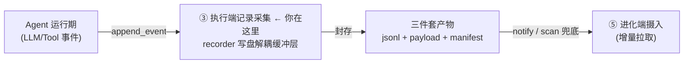
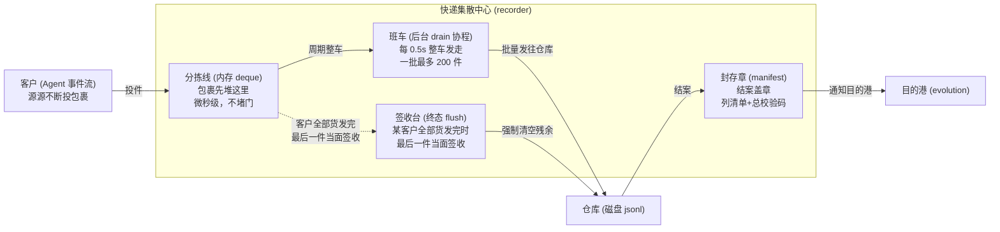
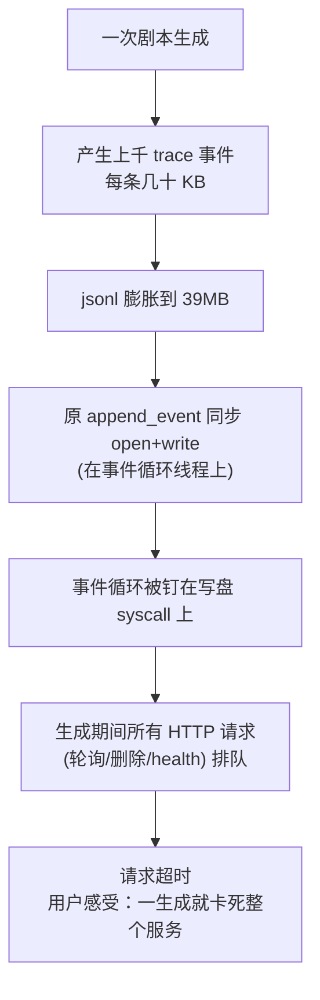
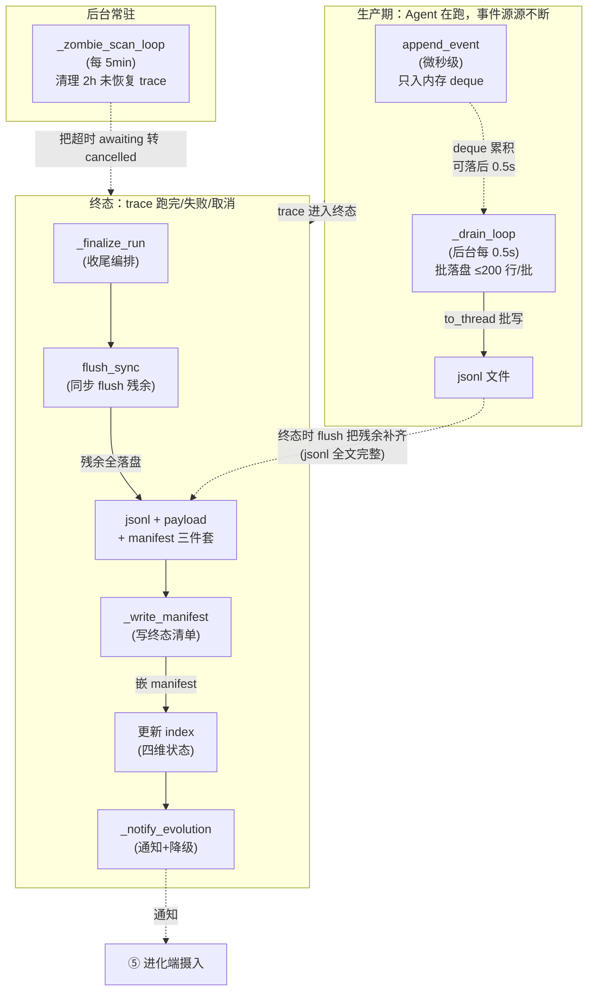
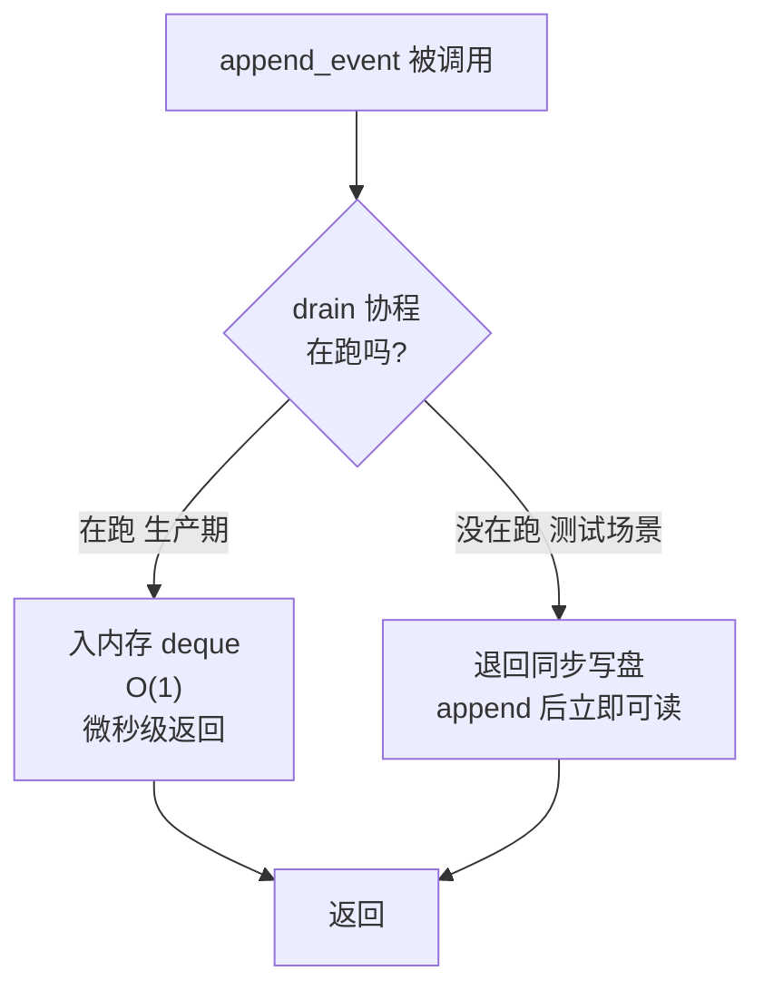
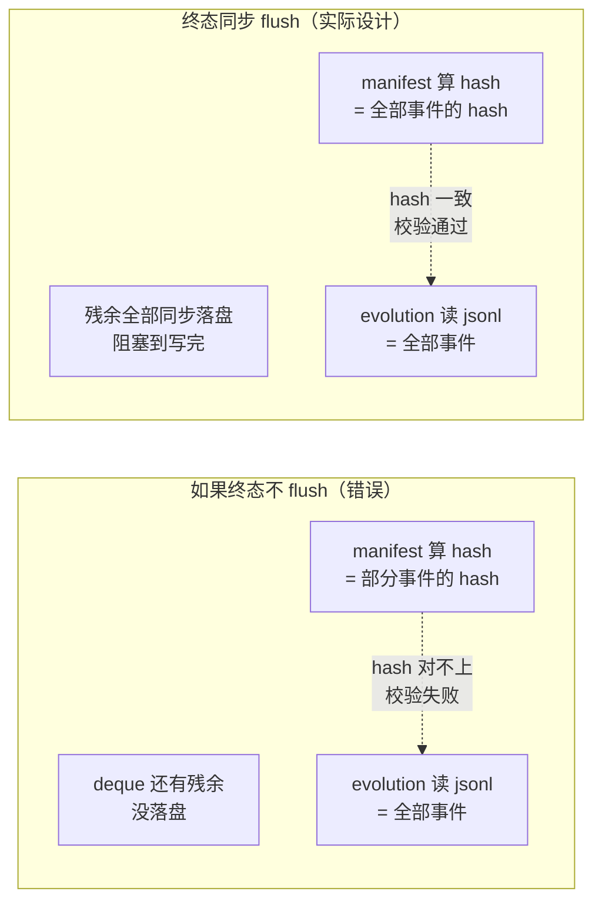
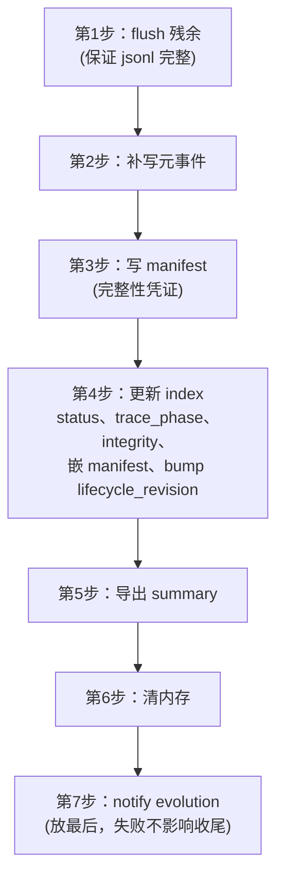
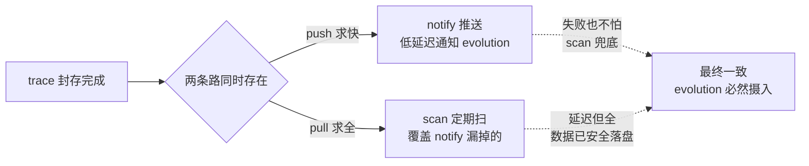
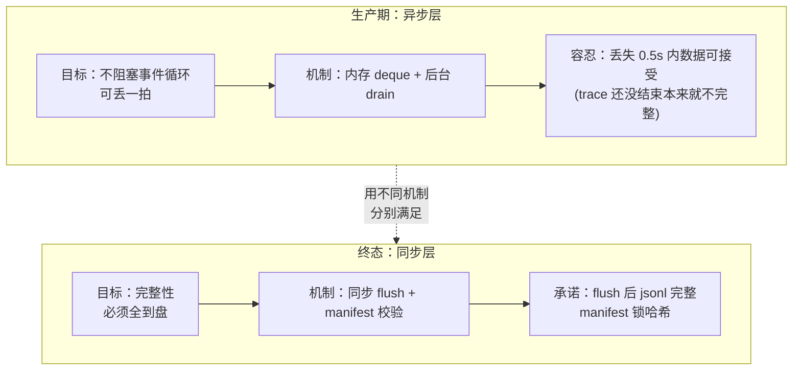
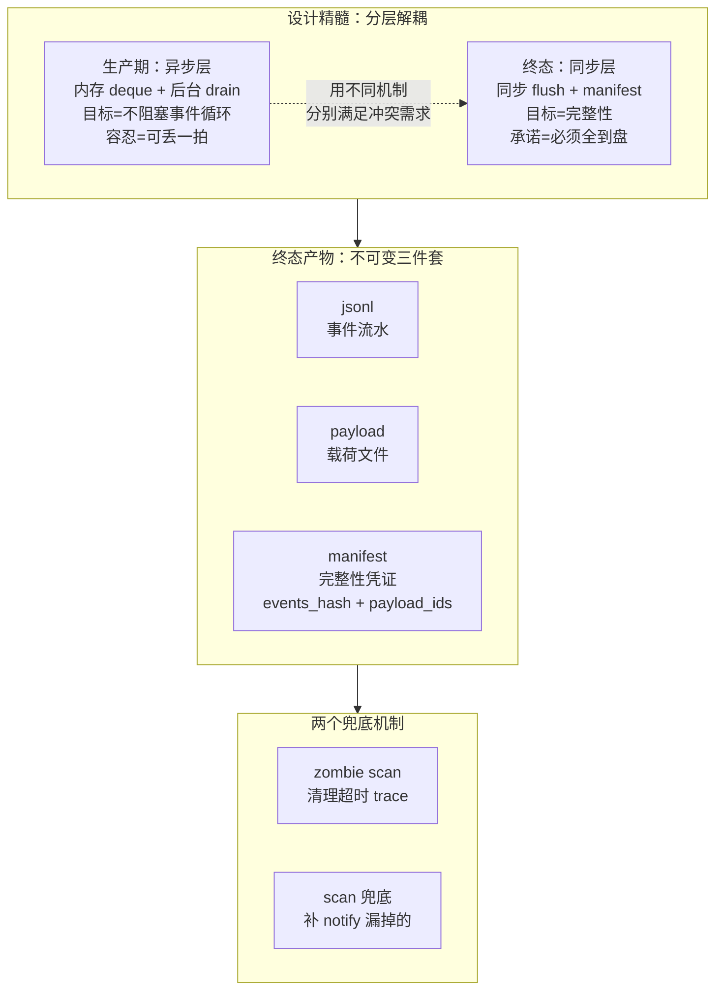

# 03 · 执行端记录采集（trace 系统 深读·子块 03）

> **层位声明：本文属于「设计思想层」，也就是架构师视角。**
>
> 这是什么意思？这一层关心的是三件事：recorder 为什么这么设计、写盘解耦整体怎么运转、manifest 的完整性契约长什么样、每个机制各自的优势和弊端。
>
> 这一层**主动剥掉**环节内部的微观实现。举个例子：讲 drain 的「契约」时，只说清三句话——append 只入内存、后台批量落盘、终态时同步 flush；至于代码里「先 push 再判断 full 再 drain」这种一步步的动作序列，不讲。那是实现层的事。
>
> **本子块在 trace 系统中的位置**：执行端是 trace 事件流的产生源。Agent 运行期产生的事件，经它解耦落盘，终态时封存成 jsonl+payload+manifest 三件套，并通知进化端（evolution）来摄入。

## 全局定位

执行端 recorder 夹在 Agent 运行期和磁盘之间，像个「夹心层」。Agent 每跑一步产生一个事件，recorder 就把事件攒进内存，由后台协程一批批异步落盘；trace 跑到终态时，再同步 flush 把残余补齐、保证完整；最后封存成不可变的三件套，通知下游来取。

本子块的目标，就是讲透这个「夹心层」的设计思想。

---

## 第 1 步：本质锚定

### 一句话本质

执行端 recorder 是 trace 事件流与持久化磁盘之间的**写盘解耦缓冲层**——事件在生产期只攒进内存 deque，由后台协程成批异步落盘，trace 终态时同步 flush 残余保证完整，最后封存为不可变 jsonl+payload+manifest 三件套并通知下游摄入。

这句话信息量很大，先别急着往下读。把它拆成四段来理解：

1. **它夹在「事件流」和「磁盘」之间**——上游是源源不断的事件，下游是慢吞吞的磁盘。
2. **生产期只攒内存**——事件先攒进一个内存队列（deque），不等落盘就返回。
3. **后台批量落盘**——有个后台协程定期把队列里的事件一批批写进磁盘。
4. **终态同步 flush + 封存三件套 + 通知下游**——trace 跑完时，把残余事件强行补齐落盘，盖个「完整性章」（manifest），再喊下游来取。

> 【术语接地——三件套与 payload】：终态封存的「三件套」，其实是分工不同的三份产物。先认清各自角色：
>
> - **jsonl = 事件流水账**：一行一个事件，记「发生了什么、什么时候、什么类型」。
> - **manifest = 完整性凭证**：盖的「封存章」，列清单 + 总校验码（第 3 步契约 5 详讲）。
> - **payload = 大块正文**：事件里那些体积大的语义正文。这个最容易让人糊涂，下面单独说。
>
> payload 到底装什么？一个 trace 事件里，常常带着大块正文——模型的输入/输出原文、工具调用的参数和返回、业务正文（比如剧本、合同、记忆）。这些就是 payload。
>
> 为什么要和 jsonl 分开存？如果把这些大块正文全塞进 jsonl，jsonl 会又大又重，没法整文件流式扫描统计。所以做法是**外置**：大块正文写到 trace 目录旁的 `payloads/` 下独立文件（由一个内容寻址仓库 `ContentAddressedPayloadStore` 管理；内容寻址是什么，后面契约 5 会接地）。jsonl 事件行里只留一个轻量引用，正文不内联。这个引用叫 `payload_ref`，是一条完整的引用记录，里面装着 payload_id、大小、类型、过期时间等字段。其中 `payload_id` 是载荷的身份号——它就是正文内容的 SHA-256 哈希，同时充当载荷文件名。后面 manifest 里的 `payload_ids`，正是从各事件的 payload_ref 里提取 payload_id、去重排序得来。
>
> 好处是分工清晰：jsonl 保持小而轻，可以整文件流式扫描、统计；大块正文按需加载——读取事件时默认不带正文，需要时才按引用「注水」（hydrate）回事件。而 manifest 的 `payload_ids`，正是锁住「应该有哪些 payload 文件」的清单，缺一个 = 载荷丢失。
>
> 用后文快递集散中心的类比说：jsonl 像快递的「面单流水账」（轻、可整本翻），payload 像「包裹实物」（大、按单号取），manifest 就是盖在面单上的「封存章」。三件套正好对应一个快递件的三样东西。

下面用一个类比，把这四段讲成画面。

### 一个类比把本质说清：快递集散中心

把 recorder 想象成一个**快递集散中心**：

这个类比的关键有三段，正好对应本质那四段：

1. **分拣线攒件（对应「生产期只攒内存」）**：客户（Agent）投件，只管把包裹扔上分拣线（内存 deque），扔完就走，不用等班车。投件是微秒级的动作，**绝不堵在门口**。
2. **班车批量发（对应「后台批量落盘」）**：班车每 0.5 秒来一趟，把分拣线上的包裹整车拉走、发往仓库（磁盘）。一趟最多拉 200 件——不拉太多，免得班车自己占住路。
3. **结案当面签收（对应「终态 flush」）**：某个客户全部货发完时，最后一件要**当面签收**——确认这件真到了仓库，才算结案。然后盖封存章（对应「封存三件套」），通知目的港（对应「通知下游」）。

> 补充一句：你可能听过「邮筒攒信」的类比。那个类比偏弱——邮筒只体现了「攒+定时取」，没体现「某客户全部货发完当面签收」的终态语义，更没体现「封存清单」。集散中心最贴切。

### 它是什么 / 不是什么

| 它是 | 它不是 |
|---|---|
| trace 事件流到磁盘的**解耦缓冲层** | trace_id 跨进程回传通道（那是子块 04 的事） |
| 本地文件写入器（jsonl+payload+manifest 三件套） | 查询/投影服务（read/list 只是顺手提供，不是主业） |
| 本地落盘 + 通知 evolution 来拉 | OTLP 远程后端（不走远程协议，evolution 用 HTTP 拉取） |

---

## 第 2 步：痛点动机

> 【主线位置：先看清「为什么要造这个夹心层」，再看它怎么造。】

### 核心痛点：同步写盘拖垮事件循环（这是被修掉的 bug）

这一条有最高权威证据——**文件头部注释原文**就记录了它。把它拆成一条**故障链**：

**讲场景，不讲纯指标**。用户视角的痛点，不是「jsonl 膨胀 39MB」这个数字，而是下面这种体验：

> 用户点下「开始生成」，界面转圈。他想看看进度，刷新一下页面——**页面也转圈**。他点删除重试——**删除也卡住**。他打开健康检查——**健康检查也超时**。整个服务像死了一样，直到生成跑完才恢复。用户以为服务挂了，又点了一次提交——结果重复生成。

为什么整个服务会「卡死」？因为这个项目用的是**单线程异步框架**（事件循环）。打个比方：事件循环就像一个**只开一个窗口的收银台**，同一时刻只服务一个请求。同步的 `open("a")+write` 把收银员钉在了写盘 syscall 上，一钉就是几十毫秒。这几十毫秒里，**所有别的请求都得排队**。一次生成要写上千次盘，等于收银员被钉了上千次——别的请求就这么一直排着，直到超时。

**这就是核心问题所在**：trace 写盘是一种高频、丢一拍也无妨、但**绝不能阻塞主业务**的副业。要做的，就是把它和事件循环解耦。

### 三个次要痛点

核心痛点之外，还有三个次要但必须解决的痛点。每一个都对应一个独立机制。

**次要痛点 ①：trace 终态后，下游怎么知道是「完整可摄入」还是「中途断电损坏」？**

trace 跑完，evolution 要来摄入。但如果没人在终态给一份清单，evolution 只能**盲信 jsonl 全文**——它不知道这个 jsonl 是真写完了，还是写到一半进程崩了。这里需要一个**终态清单**（manifest），明明白白告诉下游：这个 trace 的事件哈希是什么、应该有哪些 payload 文件、采集过程有没有降级。→ 对应 `_write_manifest` 完整性契约。

**次要痛点 ②：HITL 让 trace 进入 awaiting_input，用户关浏览器永不回来，怎么办？**

> 【术语接地——HITL】：Human-In-The-Loop，人机协同。Agent 跑到某一步需要用户确认（比如「这段剧情你想往 A 还是 B 方向写？」），这时 trace 进入 `awaiting_input`（等待用户输入）状态。

用户关了浏览器去吃饭，再也不回来。这条 trace **永久卡在 awaiting_input**，后果有三个：占着内存不释放；index（所有 trace 的目录页文件，第 3 步开头详讲）永远收敛不到终态；evolution 看不到终态，不会摄入。这里需要一个**僵尸清理机制**（zombie scan），定期把超时未恢复的 trace 转成 cancelled。→ 对应 `_zombie_scan_loop`。

**次要痛点 ③：通知 evolution 是网络调用，失败就让 trace 收尾失败——这合理吗？**

trace 跑完要通知 evolution 来摄入。但通知是**网络调用**，可能失败。如果「通知失败」导致「trace 收尾失败」，等于**把主流程绑死在网络副作用上**——这是耦合反模式。trace 收尾是本地操作，不该被一个远程通知搞砸。这里需要一个**通知降级策略**：通知失败就静默忽略，让 evolution 自己兜底扫描补漏。→ 对应 `_notify_evolution` 的降级三连。

---

## 第 3 步：模块协作与契约

> 【主线位置：前面讲了「为什么要造夹心层」，这一步讲「夹心层宏观怎么运转、各环节契约是什么」。这是信息密度最高的一步。】

### 宏观数据流总览

整条数据流可以用一句话概括：**生产期微秒级攒内存，后台批落盘；终态时同步 flush 残余保证完整，封存三件套，通知下游**。

> 【术语接地——index】：index 是每个 workspace 磁盘上的 `traces/index.json` 文件。每条 trace 在里面占一条记录。它是所有 trace 的**目录页**（或者说登记簿）——想知道有哪些 trace、各自什么状态，翻 index 这本目录页就行，不必逐个打开 jsonl。
>
> 图里说的「四维状态」，是指 index 每条记录里记的四个状态字段：
>
> | 维度 | 字段 | 装什么 |
> |---|---|---|
> | 运行状态 | `status` | trace 现在跑到哪了（running / awaiting_input / completed / failed / cancelled 等） |
> | 封存阶段 | `trace_phase` | 封存到哪一步了（recording → sealing → sealed） |
> | 完整性 | `integrity_status` | 这条 trace 完不完整（pending / complete / incomplete 等） |
> | 生命周期版本号 | `lifecycle_revision` | 防止旧快照回头覆盖新状态的版本号 |
>
> 收尾时，recorder 还会把 manifest 的摘要嵌进 index 这条记录。这样一来，UI 和下游看状态，只翻 index 就够了。
>
> 这也呼应了后文反复出现的一句话——**「事件流是 source of truth，index 只是投影」**。打个比方：jsonl 是「账本原件」（一笔一笔的事件流水），index 是「目录页」（每条 trace 一行摘要）。原件是事实来源，目录页只是方便翻阅的投影。

下面逐个环节讲契约。这里说的「契约」是什么意思？

> **契约 = 输入 + 输出 + 不变量 + 设计动机**。
> 换成大白话就是四问：调用它时**你要给什么**（输入）？它**承诺给你什么**（输出）？它**绝不违反的铁规矩**是什么（不变量）？它**为什么这么设计**（设计动机）？
>
> 这一章讲契约，不讲代码步骤序列——这是设计思想层的规矩。

### 环节契约表

| 环节 | 输入 | 输出 | 不变量（铁的承诺） | 设计动机 |
|---|---|---|---|---|
| `append_event` | 事件 dict | TraceLogEvent | 微秒级、纯内存、不占事件循环 | 解耦生产者与持久化 |
| `_drain_loop` | 周期触发 | 落盘 N 行 | ≤200 行/批、`to_thread`、可落后 0.5s | 批处理摊薄 syscall |
| `flush_sync` | trace_id | 残余全落盘 | **阻塞到本 trace 写完才返回** | 完整性兜底 |
| `_write_manifest` | trace_id | `.manifest.json` | events_hash + payload_ids + terminal_event_id | 给下游校验凭证 |
| `_notify_evolution` | trace_id + status | HTTP POST | 懒 import + 2s 超时 + 静默降级 | 双保险：push 求快，pull 兜底 |

表格给了骨架。下面把每个契约的「为什么」展开讲清楚——重点不在重复表格，而在表格背后的设计取舍。

### 契约 1：append_event —— 微秒级、纯内存、不占事件循环

**契约**：输入一个事件 dict，输出一个 TraceLogEvent。承诺三件事——微秒级、纯内存、绝不打开文件。

> 【术语接地——deque】：双端队列，Python 的 `collections.deque`。两头都能高效进出。这里只用到「尾部追加」（O(1)），相当于一个无限长的攒件槽。

append_event 有个关键设计叫**双路径自适配**：

为什么要分两条路？因为有两种调用场景：

- **生产期**：drain 协程在后台跑，append 只管把事件塞进 deque，drain 会周期性批落盘。这是主路径，目标是「绝不阻塞事件循环」。
- **测试场景**：测试不走完整的 lifespan（drain 协程没启动），但测试代码 append 之后想立刻 read_run 验证。这时如果只入 deque，read 会读不到（还没落盘）。所以退回同步写，保证「append 后立即可读」。

**设计动机一句话**：让采集永远不成为事件循环的瓶颈。无论 drain 在不在跑，append 本身都快。

### 契约 2：_drain_loop —— 每 0.5s 一批、让出事件循环、甩线程池

**契约**：每 0.5 秒触发一次，把 deque 里的事件批量落盘。三个不变量：

1. **`await sleep` 让出事件循环**：drain 协程在 sleep 期间不占事件循环，别的请求能被处理。
2. **`to_thread` 把同步写甩进线程池**：真正的 `open+write` 在线程池 worker 里跑，不在事件循环线程，所以不占事件循环。
3. **单批 ≤200 行**：避免一批太大、占住线程池 worker 太久，影响别的 `to_thread` 调用。

> 【术语接地——to_thread】：`asyncio.to_thread` 把一个同步函数扔到线程池里执行，返回一个可以 await 的协程。事件循环本身不执行这个同步函数，只是等线程池跑完。这样一来，「同步写盘」就被甩出了事件循环线程。

**核心不变量**：drain 永远「尽力而为、可落后 0.5s」。实时性不靠 drain 保证，靠终态 flush 兜底。

**设计动机**：用「批+线程池」把高频小写变成低频批量写。单条写 = 3 次 syscall（open+write+close）；批量写 = open/close 只 1 次。上千次小写聚成几十次大写，syscall 总数骤降。

### 契约 3：_write_batch_sync —— 分组批写、失败只降级不抛

**契约**：按 `run_path` 分组（同一个 trace 的事件分到一组），每组打开一次文件，用 `writelines` 批量写。写失败只 `mark capture_degraded`，**绝不抛异常**。

为什么失败不抛？因为「采集失败不能阻断创作」是铁律。trace 是创作的副业、是证据，不是创作本身。如果写盘失败就把整个 trace 收尾搞砸，等于副业绑架了主业。所以失败只标记「采集降级」，让 manifest 诚实记录这个事实，下游自然知道这条 trace 不完整。

这个函数**永远在 to_thread 线程池 worker 里跑**——不在事件循环线程。

### 契约 4：flush_sync(trace_id) —— 核心不变量，终态完整性兜底

**这是整套设计最关键的契约。**

**契约**：给定一个 trace_id，把该 trace 在 deque 里的残余行**全部同步写盘**后，才返回。其余 trace 的行放回队首，保持顺序不乱。

为什么必须同步？两个理由，缺一不可：

1. **此时 trace 已停止产事件，同步开销可接受**。终态调用发生在 trace 已经跑完（run_end / run_error / run_cancelled），不会再有新事件进来。同步写盘的开销是一次性的、有限的，不会持续阻塞。

2. **必须保证紧随其后的 `_read_events` 能读到完整 jsonl**。manifest 要读 jsonl 全文算 hash。如果残余还在 deque 里没落盘，manifest 算出来的 hash 就是**错的**——它哈希的是「部分事件」，而下游 evolution 摄入后会读到「全部事件」，两边对不上，校验必失败。

下面这张对照图，把这个「为什么必须 flush」讲得最清楚：

**设计动机一句话**：实时性靠 drain（可丢一拍），完整性靠终态 flush（必须全到盘）。这是**分层思想**——用不同的机制，分别满足「实时」和「完整」这两个看似冲突的需求。第 4 步会专门展开这个分层思想。

### 契约 5：_write_manifest —— 完整性契约四字段

**契约**：终态时写一份 `.manifest.json`，包含四个核心字段（外加一个降级标记）：

| 字段 | 含义 | 给 evolution 校验什么 |
|---|---|---|
| `final_sequence` | 最大 sequence 号 | 这条 trace 一共有多少事件 |
| `terminal_event_id` | 倒序首条 run_end / run_error / run_cancelled（必须存在，否则抛 ValueError） | trace 真的进入了终态，不是半途崩的 |
| `events_hash` | 全部事件的哈希（`compute_trace_events_hash`） | evolution 摄入后重算哈希比对，不等 = 摄入/传输损坏 |
| `payload_ids` | 所有 payload_ref 引用排序去重 | evolution 知道该有哪些 payload 文件，缺一个 = 载荷丢失 |
| `capture_degraded` | 是否采集降级 | 诚实标记采集过程有没有出过问题 |

为什么 manifest 能当「完整且未被篡改」的可校验凭证？因为 trace 是**创作证据**——下游要做 badcase 回放、做评估、做进化，必须确信这份证据是完整的、没被动过手脚的。manifest 用 `events_hash`（内容寻址思想）锁住事件流，用 `payload_ids` 锁住载荷清单。evolution 摄入后重算比对，任何不一致都会暴露。

> 【术语接地——内容寻址】：用内容本身的哈希当唯一 ID。就像 Git 用 commit hash 标识一次提交——内容只要变了一个字节，hash 就变，立刻能发现。这里用同样的思路锁住事件流。

### 契约 6：_finalize_run —— 收尾编排

**契约**：trace 终态时的总编排，按固定顺序串起所有收尾动作：

第 2 步「补写元事件」补的是两类「只有收尾时才知道内容」的系统级元事件。其一，若本次 trace 用了 prompt 版本，补一条 `run_meta` 事件记录版本号，供 evolution 摄入和 badcase 回放对照。其二，若采集过程出现过降级，补一条 `capture_degraded` 事件，把降级原因汇总进事件流。每次补写后紧跟一次 flush——确保这些元事件赶在第 3 步 manifest 计算哈希之前落盘。

两个关键不变量：

1. **trace_phase 二段式（sealing → sealed）**：先设 `sealing`（封存中），让 UI 显示「封存中」而不是误报 `incomplete`；manifest 写完才转 `sealed`。这是给 UI 一个「正在收尾」的中间态，避免用户看到「不完整」的误判。
2. **notify 放最后**：通知失败不能影响 trace 正常结束。trace 数据已经安全落盘+封存，通知只是「喊 evolution 来取」，喊不到 evolution 还有兜底扫描。把 notify 放最后，即使它失败，前面的收尾动作都已生效。

### 契约 7：_notify_evolution —— 降级三连

**契约**：通知 evolution 来摄入。用三个降级手段（「降级三连」）：

1. **懒 import**：不在 recorder 模块顶部 import httpx（HTTP 客户端库），到通知时才 import。**避免 recorder 模块依赖 httpx**——recorder 是基础设施，不该被一个 HTTP 库绑住。
2. **短超时 2.0s**：通知最多等 2 秒，超时就放弃。不让收尾卡在网络上。
3. **静默降级**：任何异常（网络错、超时、import 失败）都 `except pass`，绝不让通知失败冒泡到收尾流程。

为什么通知做得这么「弱」？因为通知是**派生数据**，不是主流程。evolution 有**兜底扫描**补漏——它会定期扫 executor 的 trace 目录，发现已封存但还没摄入的就补拉。所以通知失败不丢数据，只是延迟摄入（几分钟到几十分钟）。

这是**双保险思想**：

通知还附带两个透传字段：`X-Notify-Token`（防伪令牌，防止伪造通知）和 `traceparent`（W3C 标准串联，跨服务关联用——这部分归子块 04）。

### 契约 8：_zombie_scan_loop —— 僵尸清理

**契约**：每 5 分钟扫一次，找 `awaiting_input` 状态、且最后一条 `run_awaiting` 事件距今超 2 小时的 trace，把它转成 `cancelled`。

为什么是 2 小时？这是「用户离开吃顿饭/午睡」的宽容上限。太短（比如 30 分钟），用户去吃个饭回来发现 trace 被 cancel，体验差；太长（比如 24 小时），僵尸长期占用内存、index 不收敛。2 小时配合 5 分钟扫描，最坏 2 小时 5 分钟收敛。

怎么判断「何时进入 awaiting」？从 jsonl 倒序读最后一条 `run_awaiting` 事件的 timestamp。为什么不查 index？因为 index 只在终态记 `ended_at`，awaiting 是非终态时间，锚点在事件流里。**事件流是 source of truth（唯一事实来源），index 只是它的投影。**

---

## 第 4 步：决策对比

> 【主线位置：前面讲了「怎么运转」，这一步讲「为什么这么选、别的方案为什么不行」。】

### 本项目的方案

**内存 deque + 后台 drain 协程 + to_thread 批写 + 终态同步 flush**。这里面有三个关键抉择：

1. **缓冲用 deque + RLock，而非 asyncio.Queue**。因为 append_event 的调用方含**同步回调**（不能 await），必须跨线程安全。

   > 【术语接地——RLock】：可重入锁，同一个线程可以多次获取同一把锁而不会死锁。这里用 RLock，是因为 append 流程里可能嵌套调用、需要再次持锁的场景。

2. **drain 是单后台协程，不是每事件 spawn 一个 task**。spawn task 有创建/调度的开销，而且无法背压，会 OOM。

   > 【术语接地——背压】：背压（back-pressure）就是——下游消化不过来时，反向限制上游生产速度的一道闸门。打个比方：水池的下水比水龙头慢，水就会在池子里积起来。「积起来」本身是个信号，提醒你该关小水龙头；没有它，水就直接漫出池子。
   >
   > 拿这个对照抉择 2 的两种模式：每事件 spawn task 没有这道闸门——事件来得比写盘快时，task 一个接一个无限堆积，最后内存耗尽（OOM），等于水漫出来了。单后台 drain 协程则天然带闸门：deque 里积压的事件，就是「上游可感知的堆积」，每批还有 200 行上限。
   >
   > 不过要澄清一点：本设计的 deque 是无限的，闸门**并不靠**「deque 满了把上游堵住」来体现。它靠的是「可落后 0.5s + 终态 flush 兜底」——平时允许积压，终态时一次性补齐。

3. **终态靠同步 flush 兜底，而非靠 drain 自然消化**。drain 是尽力而为（可落后 0.5s），完整性必须由终态 flush 强保证。

### 对比表：为什么不选别的方案

| 方案 | 思路 | 为什么不选 |
|---|---|---|
| **① 同步直写（原始方案）** | append 时直接 open+write | **这就是被修掉的 bug**。同步写盘钉住事件循环，生成期间所有 HTTP 请求排队超时，服务「卡死」 |
| **② 每事件异步 spawn task** | 每条事件起一个 asyncio task 去写 | task 创建/调度开销大；事件乱序（task 完成顺序不定）；无背压会 OOM；fd（文件描述符）太多 |
| **③ asyncio.Queue + 事件循环线程消费** | 用 Queue 当缓冲，消费协程在事件循环线程写 | 消费协程的 write 仍在事件循环线程，**还是占事件循环**；且 Queue 需要 await get，同步调用方用不了 |
| **④ 独立 writer 线程** | 起一个常驻线程专门写盘 | 要手动管理线程生命周期（启动/停止/异常处理）；本项目用 to_thread 线程池达到同等效果，复用内建池 |
| **⑤ WAL + fsync** | 按数据库 WAL 方式写，每次 fsync 强刷 | trace 是**可重建的派生数据**（业务正文是剧本文件，有自己的写盘校验），不值得 fsync 的性能代价 |

### 精髓：不是「异步 vs 同步」二选一，而是分层

很多人会问：「到底该用异步还是同步？」这个问题的框架本身就是错的。本项目的精髓是：

> **不是在异步和同步之间二选一，而是分层**：生产期用异步（解耦，可丢一拍），终态用同步（完整性兜底）。

把「实时性」和「完整性」这两个看似冲突的需求，用不同机制分别满足——实时性靠 drain（可丢一拍），完整性靠终态 flush（必须全在）。这是整套设计最可迁移的思想。

---

## 第 5 步：理论抽象

> 【主线位置：把本子块的设计提炼成可迁移的原理。】

### 抽象 1：写盘解耦（Producer-Buffer-Consumer 分离）

**原理**：生产者只管写内存 O(1)，持久化交给独立的慢消费者去消化。

本项目的体现：Agent（生产者）只管 append 进 deque（O(1) 微秒级），drain（消费者）慢慢批落盘。trace 采集是「宁可丢一拍也不能拖累生产者」的副业，所以缓冲区无限、消费者尽力。

**可迁移场景**：任何「高频副业不能拖累主业」的场景——日志采集、监控埋点、审计日志。它们都该走「内存缓冲 + 后台批写」模式，而不是同步直写。

### 抽象 2：批处理摊薄 syscall（Amortize syscall）

**原理**：单条写 = 3 次 syscall（open+write+close），批量写 = open/close 只 1 次。

本项目的体现：drain 把上千次小写聚成几十次大写，syscall 总数骤降。

**类比同源思想**：LSM-Tree（日志结构合并树）、日志结构存储。它们都是用「攒一批再写」摊薄单次写开销。这是存储系统的基础思想。

### 抽象 3：终态 flush 划定持久化边界（Durability boundary）

**原理**：异步系统必须回答「何时数据算安全」——这个边界要明确画出来。

本项目的体现：边界画在 trace 终态。终态前可丢（drain 周期内崩溃丢 0.5s，可接受，因为 trace 还没结束本来就不完整）；终态 flush 后必须全在。

**类比同源思想**：两阶段提交（2PC）的 prepare-commit 边界。running 状态是 prepare（可回滚），sealed 状态是 commit（不可撤销）。flush 就是那个 commit 点。

### 抽象 4：WAL + checkpoint 思想

**原理**：append-only log 配 checkpoint 标记，崩溃后从最后 checkpoint 恢复。

本项目的体现：trace jsonl 是 append-only log（事件只追加不改），manifest 是 checkpoint 标记（不存数据，只存「到这个 sequence 为止哈希链完整」）。

**类比同源思想**：数据库的 WAL + checkpoint、Git 的 commit hash 链。manifest 的 `events_hash` 就是 trace 的「commit hash」。

### 抽象 5：双保险最终一致（Push + Pull）

**原理**：push 求低延迟，pull 求全覆盖，两者互补达到最终一致。

本项目的体现：notify（push）求快，让 evolution 尽早知道；scan（pull）兜底，覆盖 notify 漏掉的。

**类比同源思想**：CDC（Change Data Capture）+ 定时全量扫描的经典组合；webhook + polling 的标准容错模式。这是分布式系统通知的标配。

---

## 第 6 步：边界与代价

> 【主线位置：没有银弹。每个设计都有代价，讲清楚才能真吃透。】

### 代价 1：drain 周期内崩溃，丢最近 0.5s 数据

进程在两次 drain 之间崩溃（SIGKILL、断电），deque 里未落盘的事件丢失，最多 0.5s 的事件量。

为何可接受？有三层保障：

1. trace 是**可重建的派生数据**，不是业务正文（业务正文是剧本文件，有自己的写盘校验）。
2. 丢失会被 manifest 诚实标记：`capture_degraded = true` → `integrity = incomplete` → 下游门禁关闭，不会把残缺数据当完整数据用。
3. 正常结束由终态 flush 保证全在；异常崩溃由 `seal_external_cancel`（子块 04 讲）补一个终态，照样封存。

**边界**：这个机制保证的是「正常结束必完整」，不是「任何情况下都不丢」。可重建性，是它换取性能的筹码。

### 代价 2：_FLUSH_BATCH_MAX=200 太大的风险

如果单批太大，线程池 worker 执行过久，会占满线程池，导致其他 `to_thread` 调用排队。

**200 行是经验值**：单行几十 KB，单批约 10MB，写盘毫秒级，不会显著占用 worker。这是个手调的魔法数，没有严格推导。

### 代价 3：zombie 2h 阈值的权衡

| 太短（30min） | 太长（24h） | 2h（实际选择） |
|---|---|---|
| 用户离开吃顿饭回来 trace 被 cancel，体验差 | 僵尸长期占用内存、index 不收敛 | 覆盖「离开一顿饭/午休」，配合 5min 扫描最坏 2h5min 收敛 |

2h 是个主观权衡值，不是数学最优。它假设「HITL 等用户回来」的合理上限，是吃顿饭的时间。

### 代价 4：append_event 双路径的复杂度

必须维护 `drain_active` 判断 + 两条写盘路径。这是为了测试场景（不走 lifespan）能 append 后立即可读。

**复杂度收益比**：收益是测试好写、可读性强；代价是两条路径要同步维护。可接受。

### 代价 5：notify 静默降级依赖兜底扫描

notify 失败时，trace 已封存但 evolution 不知道，要等下次 scan（几分钟到几十分钟）才补上。

**缓解**：scan 是常驻后台，数据已安全落盘不丢。延迟摄入不影响数据安全，只影响 evolution 看到这条 trace 的及时性。

### 代价 6：不保证事件实时可见

append 后 0.5s 内 `read_run` 读不到最新事件（除非走终态 flush）。这是因为事件还在 deque 里没落盘。

**应对**：需要实时 SSE 的场景走 `get_active_queue`（内存 queue），不走 jsonl 读盘路径。**两条读路径分工**：实时观察走内存 queue，持久化读走 jsonl。

---

## 第 7 步：吃透检验

> 【主线位置：用 Q&A 扛追问。能答出来才算真吃透。】

用法：遮住答案区，只看问题自己试着答——能脱口说出结论是第一关，能把「为什么」一步步推出来才算第二关。卡在第二关，说明推理链还没铺进脑子。每个 Q 按三段展开：**一句话结论** / **为什么（推理链）** / **追问预判**。

### Q1：drain 协程崩了怎么办？

**一句话结论**：不会静默丢数据。drain 协程一旦退出，系统自动降级为「每条都同步写盘」——慢，但不丢。

**为什么（推理链）**：

1. 写盘出错杀不死协程：`_write_batch_sync` 内部用 try/except 捕住 OSError，失败只 mark degraded、不抛异常（代码事实）。
2. 协程因别的原因真退出（被取消、内存压力）：`_drain_task.done()` 返回 True → `_drain_active()` 返回 False → append_event 里 `if self._drain_active()` 翻到 else 分支 → 退回同步 open+write（代码事实）。好比班车停运，分拣线不再攒件、每件当面发走。
3. drain 崩后、关进程前的窗口：每条 trace 终态的 flush_sync 会收走**该 trace** 在 deque 里的残件，不依赖 drain 活着；aclose 里的 `_flush_all_sync` 只是全局最后兜底。
4. 全链路无丢件口子：常态攒批发车 → drain 挂了降级为单件直发 → 本 trace 终态 flush 收走残件 → 进程关闭彻底清空。

**追问预判**：「降级为同步写不会又把事件循环钉住吗？」→ 会，但这是降级态而非常态。drain 正常时写盘不影响事件循环；降级是「宁可慢不可丢」的取舍，慢一阵好过丢一拍。

### Q2：append_event 线程安全吗？多个回调同时调？

**一句话结论**：安全。append 是同步函数，靠每条 trace 一把 RLock 保证同 trace 串行、不同 trace 并行，另有一把 `_pending_lock` 守共享缓冲区。

**为什么（推理链）**：

1. append 会被非事件循环线程调用：LangChain（本项目使用的 LLM 应用编排框架，Agent 事件由其回调系统上报）的同步回调（on_llm_start 等是 def 不是 async def）可能在事件循环线程之外触发（代码事实）。
2. 锁必须是线程锁：asyncio 锁只在事件循环内有效、跨线程不挡；RLock 是真线程锁。
3. 粒度是 per-trace、每 trace 一把：不同 trace 的回调互不相关，全局一把会让它们白白排队。
4. 同 trace 必须串行：sequence 自增在锁内，两个回调同时分配就重号或跳号，事件序就乱了。
5. 共享缓冲区单独一把锁：所有 trace 共用一条 `_pending_writes` deque，append 塞、drain 取，两端都持 `_pending_lock`——生产者-消费者靠同一把锁。

**追问预判**：「为什么是 RLock 不是 Lock？」→ RLock 可重入，同线程嵌套持锁不会自死锁（持锁流程内部又触发同 trace 写入时）；Lock 遇嵌套就卡死。

### Q3：终态 flush 把别的 trace 的行也取走怎么办？

**一句话结论**：不会乱。flush 把整条共享 deque 翻一遍，本 trace 的行收走、别的 trace 的行原样放回，顺序用 `reversed` 修正。

**为什么（推理链）**：

1. 缓冲区是全 trace 共享的：`_pending_writes` 是一条公共 deque，不是每 trace 一条（代码事实），没法「只取本 trace 的行」。
2. flush 只能整条 popleft，逐行判断 path 等不等于本 trace 的 run_path；别人的行收进 rest 列表（代码事实）。
3. 放回用 `extendleft(reversed(rest))`（代码事实）：extendleft 逐个从左塞，1、2、3 塞完会反转成 3、2、1；先 reversed 再塞才恢复原序。
4. 两个保证：行不丢（rest 全数放回）、序不乱（reversed 修正反转）。

**追问预判**：「翻整条 deque 不慢吗？」→ 全是内存操作，且终态时本 trace 残余行有限。换成「每 trace 一条 deque」要维护 dict 增删同步，不划算。

### Q4：manifest 写失败，trace 还能收尾吗？

**一句话结论**：能收尾。这条 trace 会被诚实标记成 degraded + incomplete，但收尾的后续步骤一步不落照常执行。

**为什么（推理链）**：

1. manifest 写失败被接住：`_write_manifest` 包在 try/except (OSError, ValueError, json.JSONDecodeError) 里，失败时 mark `manifest_write_failed:{异常名}`、trace_phase 落 degraded、integrity 落 incomplete、不嵌 manifest（代码事实）。
2. 收尾不停：导出摘要、清内存状态、通知 evolution 照常执行，不 return、不抛异常（代码事实）——失败的只是「出凭证」，不是「收尾」本身。
3. 依据是「采集失败不阻断创作」：trace 是创作的证据，瑕疵诚实标记，但不反过来搞砸创作主流程。
4. 下游有门禁：看到 incomplete 自然关门，残缺数据不会被当完整的用。

**追问预判**：「那这条 trace 的数据还有人信吗？」→ jsonl 大概率完整（flush 在 manifest 之前已成功），只缺「完整性凭证」。下游当「无凭证数据」处理：可粗查，不进严格校验的管道。

### Q5：notify 失败，trace 永远漏摄入？

**一句话结论**：不会。notify 只是「喊人」的快通道，失败了还有 evolution 的常驻兜底扫描定期补拉，最坏只是延迟几分钟到几十分钟。

**为什么（推理链）**：

1. notify 的异常全被吞：`_notify_evolution` 在收尾最后一步，包在 `except Exception: pass` 里（代码事实）。
2. 吞掉的只是「喊人」：数据在此之前已安全落盘封存。
3. evolution 侧有兜底：常驻扫描定期补拉「已封存但未摄入」的 trace（代码事实）。
4. 双保险 = 最终一致：notify 是 push 求快，扫描是 pull 求全；失败只影响延迟，不影响正确性。

**追问预判**：「为什么不重试 notify？」→ 重试只能缓解、不能根除（网络断了重试也失败），还让收尾路径变复杂。一条常驻扫描替代 N 处重试，更简单可靠。

### Q6：drain 用 asyncio.Queue 不行吗？

**一句话结论**：不行。asyncio.Queue 不是线程安全的，而 append 会被非事件循环线程的回调调用——这是硬伤。

**为什么（推理链）**：

1. asyncio.Queue 不是线程安全的：它给**同一事件循环内**协程间通信用，内部状态没有锁保护。
2. append 偏偏会被外部线程调：LangChain 的同步回调可能在事件循环线程之外触发，外部线程直接调 Queue 的方法会破坏其内部状态。
3. 缓冲必须用真正线程安全的结构：deque 加 RLock 正是。
4. 就算绕过线程安全，Queue 也没解决核心痛点——「谁执行写盘」：消费协程自己 write，写盘仍在事件循环线程（收银员被钉在写盘 syscall 上），「事件循环不被阻塞」就白做了。
5. 真正脱离事件循环靠 `to_thread` 把写盘甩进线程池，Queue 给不了——协程语义本场景用不上，缺的线程安全它又给不了，所以不选。

**追问预判**：「Queue + to_thread 组合行不行？」→ 理论可行但多绕一层。需求就两个（线程安全 + 先进先出），Queue 能做的 deque 都能做，不为用不上的协程语义买单。

### Q7：zombie scan 怎么判断「何时进入 awaiting」？

**一句话结论**：靠翻 jsonl 事件流。index（目录页）里根本没有「进入 awaiting 的时刻」这个字段，唯一可靠锚点是 jsonl 里最后一条 run_awaiting 事件的 timestamp。

**为什么（推理链）**：

1. 判超时需要锚点：这条 trace 何时进入 awaiting（卡超 2 小时才算 zombie）。
2. index 里没有这个字段：index 只在终态收尾记 ended_at，而 awaiting 是**非终态**（用户还没回来确认）（代码事实）。
3. 锚点只能在事件流里找：run_awaiting 可能多次出现（用户反复进出 awaiting），倒序逐行找，取最近一条的 timestamp（代码事实）。
4. 两层数据各司其职：index（目录页）先圈 status=awaiting_input 候选（快，不全量开 jsonl），再对候选开 jsonl（账本原件）拿准确时间——source of truth：时间锚点只在原件里，目录页只帮圈范围。

**追问预判**：「直接全量扫 jsonl 不行吗？」→ 行但浪费。index 一秒圈出候选，jsonl 只对候选开；投影层（index）不值钱但省力，原件（jsonl）值钱但费力，两层配合最划算。

### Q8【推测】：为什么 _DRAIN_INTERVAL 是 0.5s？

**一句话结论**：0.5s 是经验调出来的值，没有严格推导；真正重要的不是 0.5 还是 0.3，而是「亚秒级攒批」这个量级对不对。

**为什么（推理链）**：

1. 先承认没有推导：代码注释只说「每 0.5s 批写一次」，没给依据（代码事实）——能推的是它卡在哪两个力之间，不是「0.5 最优」。
2. 往小调（如 0.1s）：班车发车太勤，批攒不满，syscall 摊薄收益弱、空转多。
3. 往大调（如 2s）：deque 积压多，实时读落后多（读端总见几秒前的状态），终态 flush 残余也多。
4. 0.5s 是中间甜点：配合每批 ≤200 行上限，高频时批够肥、低频时不至于堆太久。
5. 边界要认：这只解释「0.5 合理」，解释不了「为什么是 0.5 不是 0.4」——后者是调出来的。答题姿态：参数可调，机制（攒批 + 后台写 + 终态兜底）才是设计，重心放机制对不对、不抠数字精不精。

**追问预判**：「怎么验证 0.5s 合适？」→ 看两个指标：deque 平均积压深度（太高说明写不过来）、drain 批平均行数（长期贴近 0 说明周期太勤）。两者都健康，参数就在合理区。

---

## 收尾：一图回看

一句话回看：执行端 recorder 是个**写盘解耦缓冲层**——生产期异步攒内存、不阻塞事件循环；终态同步 flush 保证完整；封存三件套给下游一份可校验的凭证；notify + scan 双保险通知 evolution。精髓在于：用分层把「实时性」和「完整性」两个冲突需求分别满足。
