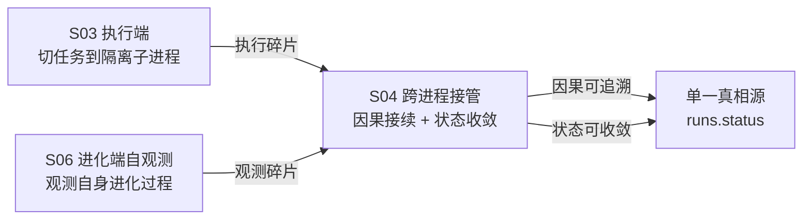
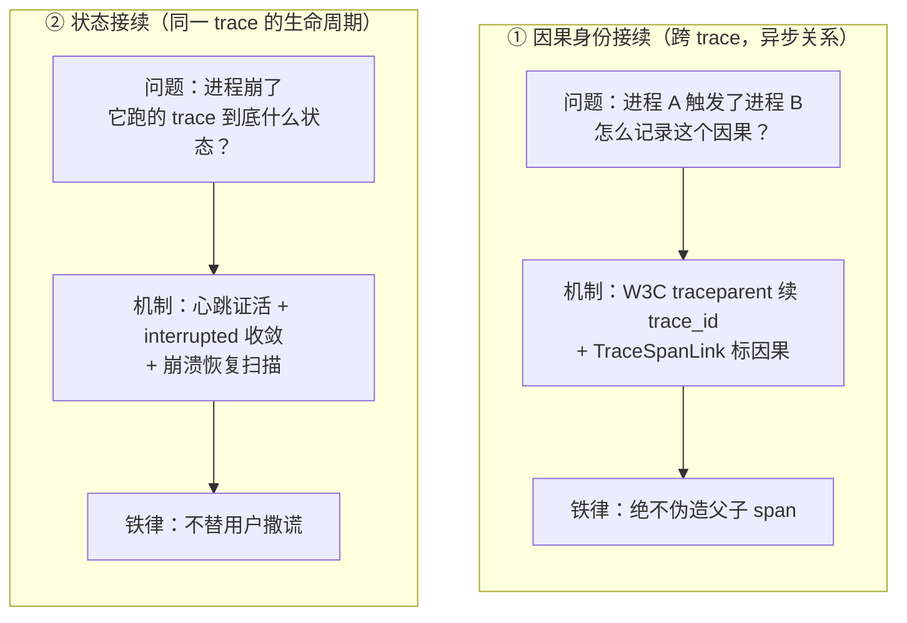
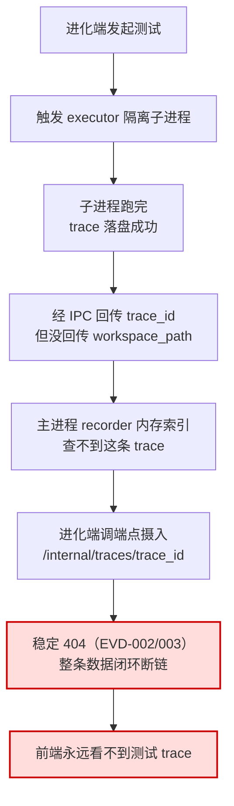
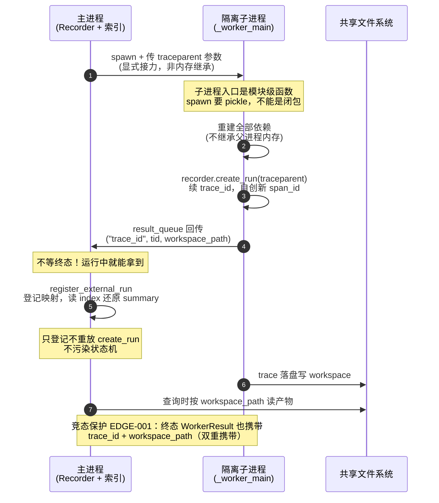
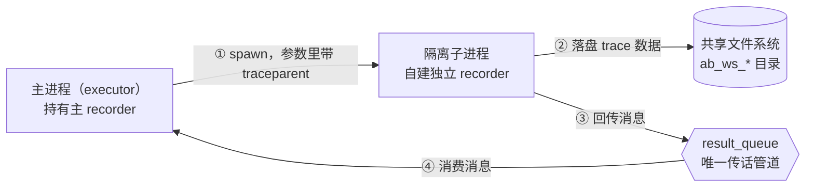
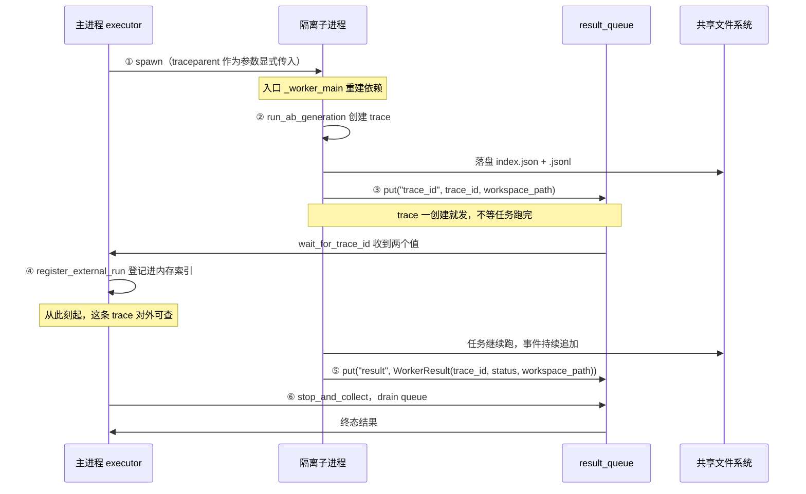
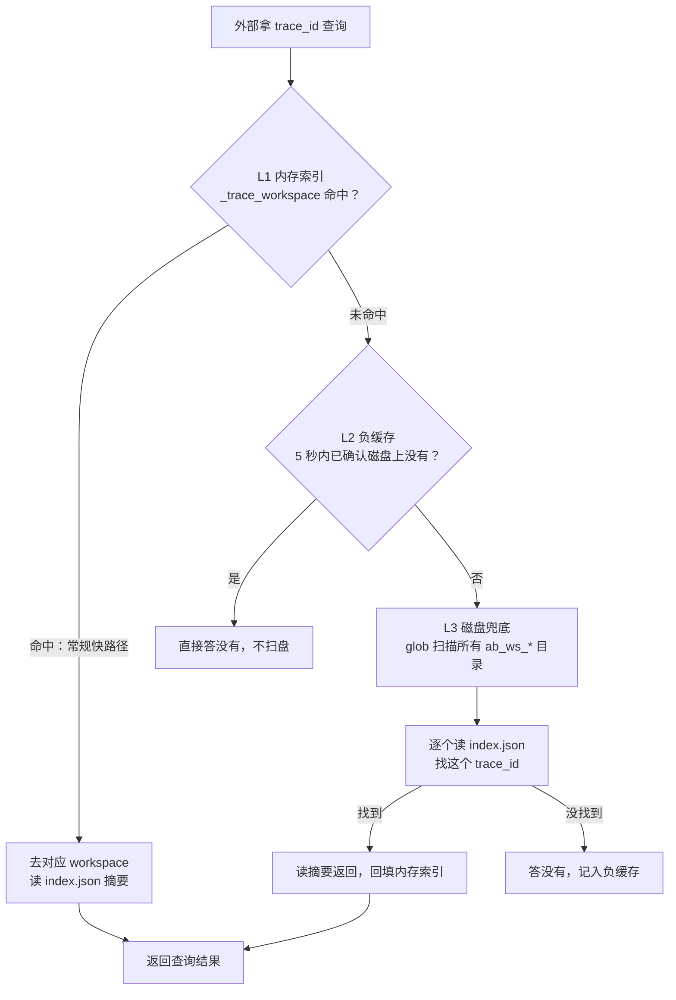
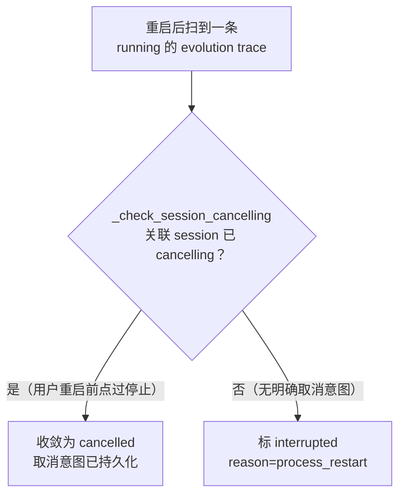
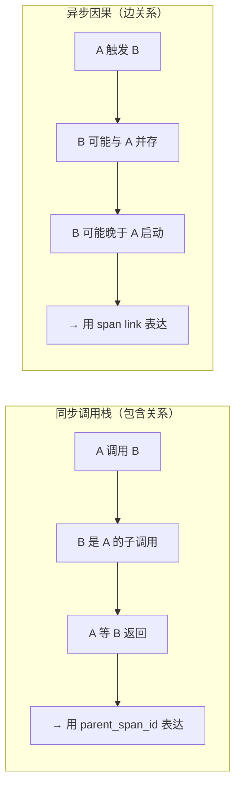
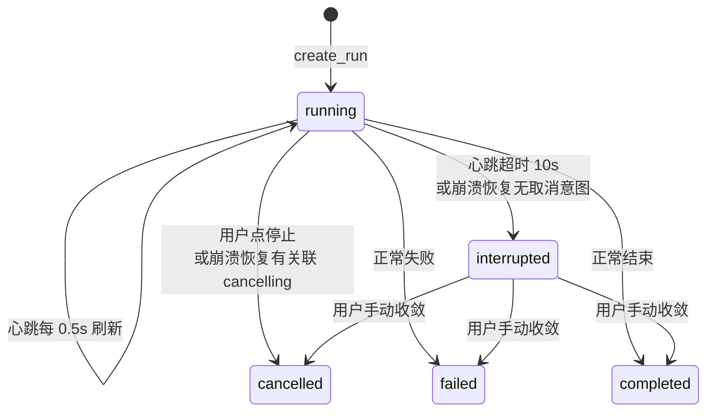

# 04 · 跨进程接管（trace 系统 深读·子块 04）

> **层位声明：本文为设计思想层（架构师视角）。** 讲的是跨进程接管为什么这么设计、因果身份与运行状态两件正交的事怎么分别处理、契约与不变量、优势弊端、可迁移原理。主动剥离环节内部微观实现。推断处标【推测】。
>
> **本子块在 trace 系统中的位置**：跨进程接管横向贯穿执行端（03）和进化端自观测（06）——让跨进程/跨服务的执行链路保持因果可追溯、运行状态可收敛。它是 trace 系统"跨边界不丢链"的保障。
>
> **编号体系**：文中会出现形如 `EVD-002`、`EDGE-001`、`FR-007`、`B4`、`A1`、`R11` 的编号。它们是项目内部给证据、边界用例、功能需求、判定规则、设计要点等条目编的索引号，用途是跟项目其他文档交叉引用。对理解本文没有任何影响，读到时不必停下来琢磨，直接跳过即可。

## 全局定位

先把 S04 放进整张地图看一眼。

先对齐一个贯穿全文的核心词：**trace**（追踪）就是一次完整执行——或者说一次用户交互——的可观测记录，由若干段 **span**（每一段具体执行）串成。在本项目里，Writer 的每一次写作执行、每一次进化测试，都是一条 trace。后文反复出现的"这条 trace""跨 trace"，指的就是它。

S03（执行端）会把任务切到隔离子进程跑——出于安全考虑：子进程崩了不能连累父进程。S06（进化端）要观测自己的进化过程，也涉及跨 trace 的因果追溯。这两端都会产生"跨进程/跨服务的执行碎片"。S04 的职责，是让这些碎片在因果和状态上都接得上。



一句话定位：**S04 不管"执行怎么跑"，只管"执行被切开后，观测身份和生命状态怎么续上"。**

---

## 第 1 步：本质锚定

### 一句话本质

让一段执行被物理切分到不同进程/服务后，它的"观测身份"和"运行时生命状态"仍能在唯一真相源上连贯接续。

注意这句话里有两个词被刻意分开——**观测身份**和**运行时生命状态**。这是理解整个 S04 的钥匙。

### 关键区分：两件正交的事

跨进程接管要处理两件完全不同维度的事，不能用同一套机制硬揽：



为什么必须分开？因为它们回答的问题根本不同：

- **因果身份**回答的是"谁触发了谁"——这是空间关系，跨不同的 trace 树。
- **状态接续**回答的是"它还活着吗"——这是时间关系，在同一个 trace 的生命周期内。

把两件事混在一起处理（比如用心跳来推断因果，或用 span 父子来表达状态），就像用温度计量距离——工具和问题对不上。

### 用类比建立心智模型

**最贴切的类比：病历随病人转科。**

想象一个病人从内科转到外科：

| 转科中发生的事 | 对应 trace 系统的概念 |
|---|---|
| 旧病历不会被重写，也不会被伪造成新病人的"父亲" | 子进程的 trace 不会塞成父进程 trace 的子调用 |
| 外科建新病历，注明"接续自内科 X 病历号" | 新 trace 自带新 trace_id，用 span link 标注因果来源 |
| 转科期间生命体征继续监测 | trace 运行中持续发心跳 |
| 监测信号中断超过阈值，标"失联待确认" | 心跳超时标 interrupted，不直接判死亡 |
| 最终判断留给医生 | 最终状态收敛留给用户，系统不替用户决定 |

这个类比的精妙之处在于"失联待确认"——系统不会因为你一秒钟没信号就宣布你死了，它只说"我联系不上你了，请你来确认"。这就是 interrupted 的精神。

**第二个类比：接力赛交接棒。**

交棒时本棒成绩不消失。下一名选手领棒继续跑，新跑的一段有独立编号（span_id），但整支队伍用同一份计时（trace_id 续）。棒就是 traceparent——它传的不是成绩本身，而是"你属于哪支队"的身份。

---

## 第 2 步：痛点动机

光说设计理念太虚。来看看**两起真实线上事故**怎么逼出这套设计。

### 事故①：跨进程不可发现（commit 3a10782）

**症状**：进化端发起一次测试 → 前端死活看不到这次测试的 trace。

这里要先说清一个词：**recorder** 是负责收集、累积、落盘 trace 数据的组件。主进程和隔离子进程各有一个 recorder；其中主进程的 recorder 还维护着一份"哪些 trace 存在、落在哪个目录"的内存索引——它是对外查询 trace 的入口。所以下文"主进程 recorder 查不到"，等于这条 trace 对外不可见，查询必然 404。

**断链路径**（一步步追）：



**根因抽象**：深层矛盾是"安全隔离"和"观测发现"的冲突。子进程为了"崩了不连累父进程"，选择自建独立 recorder、不共享父进程内存。这个安全决策是对的——但代价是主进程失去了对子进程产物的索引发现能力。

一句话总结：**一次前置的安全决策，引爆了后置的观测断链。**

### 事故②：状态分裂（commit 78472eb）

**症状**：用户最痛的不是"慢"，而是**"系统骗我"**——列表页显示 `failed`，点进详情页却显示 `running`，而且找不到停止按钮。

这不是一个 bug，是两条独立的路径各自导致了同一个症状：

| 路径 | 发生了什么 | 结果 |
|---|---|---|
| **路径 A**（manual_tests vs runs 表分裂） | 轮询超时只 mark_failed 了 manual_tests 表，没碰 runs.status | 测试页显示 failed，trace 详情永远 running |
| **路径 B**（eval/evolve session vs runs 分裂） | stop_session 调了 task.cancel 后无条件标 session cancelled，但 Agent 卡在无 await 的底层调用时 cancel 无效，recorder.cancel_run 永不执行 | runs.status 永远 running，停止按钮消失 |

**根因抽象**：当"运行状态"散落在多张表、多个进程、多层抽象里，没有**单一真相源**时，任何一层更新失败或丢失，都会导致状态分裂。用户感受到的是系统在撒谎——它说还在跑，其实早卡死了。

### 为什么引入 Pull + 心跳 + interrupted（commit ff69f2c）

SSE（服务器推送）时代有个老毛病：runs.status 不更新、event_count 不更新，前端被动等推送。推送连接一断，trace 就变成"永远运行中"的死帧。

改造方向是**把前端从被动等推送改成主动拉（Pull）**：runs.status 成唯一真相源，前端主动轮询。但改 Pull 带出一个必须解决的问题：

> 既然 runs.status 成了唯一真相源，那它说"running"就必须有**活性证明**。否则进程崩溃后，状态还写着 running，永远骗前端。

这就是**心跳**的动机——运行中的 trace 每隔一小段时间上报"我还活着"。超时不报，就标失联。

而 **interrupted** 的动机更微妙。旧版崩溃恢复的逻辑是：进程重启后，把所有没跑完的 trace 强标 `failed`。这是**撒谎**——进程重启不等于执行失败，那条 trace 可能其实已经成功了，只是没来得及写终态。interrupted 是一个诚实的中间态：

> 这条 trace 失联了。我不知道它真实结局是成功还是失败。请你来收敛。

### 核心问题（全文主线的起点）

把两起事故和三个改造串起来，S04 要解决的核心问题是：

> 让"为安全而隔离的进程"的执行产物，因果可被外部追溯、生命周期可被外部收敛，同时不破坏隔离本身。

接下来五步都在拆解这个问题怎么解。

---

## 第 3 步：模块协作与契约

S04 用五份契约分别处理"因果身份接续"和"状态接续"。先看一张宏观协作图，再逐份拆。

### 宏观协作全景

下面这张时序图展示了最核心的跨进程交互——子进程怎么把 trace 身份回传给主进程：



这张图里有几个关键设计决策，先记住它们的位置，下面逐份契约展开。

### 契约 ①：W3C 追踪上下文的"接力"语义

**职责**：给本次执行签发一个 W3C 标准身份，并决定"继承上游接力"还是"起新根"。

先解释一下术语。**W3C Trace Context**（W3C 追踪上下文）是业界标准的跨服务追踪上下文格式，核心是一个叫 **traceparent**（traceparent 头）的 HTTP 头，长这样：

```
traceparent: 00-0af7651916cd43dd8448eb211c80319c-b7ad6b7169203331-01
             ↑    ↑                                  ↑              ↑
          version  trace_id（32 hex）           span_id（16 hex）  flags
```

四个字段拼成一串：`版本-trace_id-span_id-flags`。trace_id 标识"这一次完整的用户交互"，span_id 标识"这一段具体的执行"。

`create_trace_context` 的决策逻辑：

| 输入 | 决策 | 输出 |
|---|---|---|
| 有合法 incoming_traceparent | 继承父的 trace_id 和 trace_flags，自创新 span_id，记下 parent_span_id | 接力：同一棵 trace 树的新一段 |
| 无 incoming_traceparent | 自创新 trace_id，默认 flags="01" | 起新根：一棵全新的 trace 树 |
| incoming_traceparent 全零 | 视同无父（W3C 规范里"全零=占位符"） | 起新根，防占位污染 |

**关键不变量**：拒绝零值。`parse_traceparent` 会显式校验全零 traceparent 并视同无父处理。为什么这么较真？因为 W3C 规范里"全零"是占位符的意思，如果不拦截，这个空壳会污染整棵 trace 树。

**设计动机**：用业界标准格式，让 Writer 内部的 trace 能和外部系统（比如外部的链路追踪平台）在同一棵 trace 树上对话。同时 `external_refs` 会把 `w3c_*` 信息写成 dict——这是对外暴露的"关联钩子"，让外部系统能顺着它找到 Writer 的 trace。

### 契约 ②：TraceSpanLink——六种因果关系，不伪造父子

**职责**：表达跨 trace 的异步因果关系。术语标准叫法是**因果链接（TraceSpanLink）**。

这是 S04 里最精妙的设计决策之一。先理解一个核心区分：

> **同步调用栈是"包含关系"**：A 调用 B，B 是 A 的子调用，A 等 B 返回。
> **异步因果是"边关系"**：A 触发了 B，但 B 可能和 A 并存、可能晚于 A 启动、可能在 A 结束后才启动。

如果把异步因果硬塞进同步父子轴（用 parent_span_id 跨 trace 伪造父子），会扭曲调用树——界面上会显示"B 是 A 的子调用"，但实际 B 可能在 A 结束后才启动，时间线上根本对不上。

所以 TraceSpanLink 是**边，不是父子轴**。它有六种关系类型：

| relation | 语义 | 典型场景 |
|---|---|---|
| `triggered_by` | 被触发 | B 因 A 而启动 |
| `retry_of` | 重试 | B 是 A 的重试 |
| `resumed_from` | 恢复续作 | 人机交互中用户 resume 一个暂停的 trace |
| `derived_from` | 派生 | 从源 trace 重建（如 dossier 恢复） |
| `consumes` | 消费制品 | 评估消费证据 dossier（最常见） |
| `produces` | 产出制品 | 进入 lineage 血统图 |

顺带交代反复被举例的 **dossier**（证据包）：它是 Writer 进化过程里产出的一种"证据/制品包"——比如跑一次评估，会产出一个 dossier，记录这次评估的过程与结果。dossier 本身也是某条 trace 的产物，所以才会被别的 trace"消费"（`consumes`）或"从中重建"（`derived_from`）。

> 注：六种 relation 的具体语义是【基于代码用法推测】，代码中通过枚举使用，但每种关系的精确边界以代码实际行为为准。

**设计动机一句话**：调用树管"同步包含"，link 管"异步因果"，两套机制各管各的，不能混。

### 契约 ③：跨进程 trace_id + workspace_path 回传

这份契约直接修复事故①（commit 3a10782）：**跨进程 trace 不可发现，查询稳定 404**。隔离子进程的 trace 明明落盘成功，数据就躺在磁盘上，主进程的查询接口却一口咬定"查无此 trace"。这节讲的机制就是修复它的：隔离子进程跑完后，把自己的"trace 身份"——trace_id 和 workspace_path 两个值——回传给主进程登记，让主进程能发现、能查询这条 trace。

要看懂这套机制，得先认识几个反复出现的词，和四个参与角色。

#### 先把几个词说人话

这些词后文反复出现。第一次出现就悬空的话，整节都会读得云里雾里，所以先集中接地：

| 词 | 说人话 |
|---|---|
| **trace / trace_id** | trace 是"一次执行的完整过程记录"；trace_id 是这条记录的唯一编号。像快递单号：查物流全靠单号，没有单号，这一单在系统里就等于不存在。 |
| **recorder** | 负责记录 trace 的组件，相当于"记录员"。主进程有一位总记录员（主 recorder）；子进程自建一位独立记录员，各记各的账。 |
| **spawn** | Python 里启动子进程的一种方式。关键特点：子进程**不继承父进程的内存**，一切从零开始。好处是子进程崩了不连累父进程——这是刻意要的安全隔离，也是本节问题的源头。 |
| **workspace / workspace_path** | 子进程干活的临时工作目录，目录名以 `ab_ws_` 开头（代码用 `tempfile.mkdtemp(prefix="ab_ws_")` 创建）；workspace_path 就是这个目录的路径。trace 数据也写在里面。 |
| **result_queue** | 一根 `multiprocessing.Queue`——进程间传消息的管道，用起来像一个跨进程的队列。它是子进程向主进程回传消息的**唯一通道**，像两个房间之间唯一的传话窗口。 |
| **traceparent** | W3C 标准定义的追踪上下文格式：一个字符串，装着"当前这次执行的身份"（含 trace_id），形如 `00-4bf92f35…-00f067aa…-01`，中间那段就是 trace_id。把它交给另一个进程，两边的记录才能归到同一条链上。 |
| **进化端（evolution）** | 本项目中负责"自我进化"的一端。关键在于：它会**在任务运行期间就轮询查询** trace——所以它等不及子进程跑完再拿结果。理解"为什么 trace_id 必须即时回传"时，记住这个"等不及"的角色。 |
| **ab / ab_ws_\*** | **ab = A/B 测试**，这里指"A/B 生成对比"——同一个任务生成两份结果做对比。`ab_ws_*` 是这类任务临时目录的前缀。后文 `run_ab_generation` 里的 ab 也是同一个意思。 |
| **glob** | 按通配符模式扫描文件路径的方式，比如 `ab_ws_*` 匹配所有以它开头的目录。 |

#### 四个参与角色

一张图看清谁是谁、谁跟谁打交道：



- **主进程（executor）**：持有主 recorder。主 recorder 的内存里维护一份索引，是对外查询 trace 的**唯一入口**——这份索引查不到，对外就报 404。
- **隔离子进程**：主进程 spawn 出来、专门跑"A/B 生成"任务的进程。父进程内存里的东西它一概看不到，只能自建一个独立 recorder 写盘。
- **共享文件系统**：子进程把 trace 数据落盘到这里。每个任务一个 `ab_ws_*` 目录，目录里有两类文件：`traces/index.json`（这条 trace 的运行摘要）和 `.jsonl` 事件流（JSON Lines 格式，一行一条 JSON 事件，适合边跑边追加）。
- **result_queue**：前面说的那根传话管道，子进程向主进程回传消息全靠它。

#### 根因：一次安全决策，切断了发现能力

为什么会出 404 事故？顺着因果链走一遍就明白了。

spawn 隔离的初衷是**安全**：子进程崩了、挂了，不连累父进程。但安全的代价是——子进程**不继承父进程内存**，只能自建独立 recorder。于是：

> 子进程写 trace，落盘成功 → 子进程碰不到主进程的内存，主 recorder 的内存索引里自然没有这条记录 → 主进程"不知道这条 trace 的存在" → 而内存索引又是对外查询的唯一入口 → **查询必然 404**。

一句话：**一次前置的安全决策（隔离），切断了后置的观测发现能力。** 这套回传机制要做的，就是把被切断的发现能力补回来。

#### 修复主线：完整回传流程

修复思路很直白：既然子进程不能共用主进程的内存，那就把关键信息**发消息**回去。整个流程按时间顺序走六步：



逐步展开：

1. **spawn 传身份**。主进程 spawn 子进程时，把 traceparent 作为**参数**显式传过去。注意方式：不是内存继承（spawn 做不到），是参数传递——身份靠"递纸条"，不靠"共用记忆"。
2. **子进程创建 trace**。子进程入口 `_worker_main` 先把依赖重建起来（spawn 从零开始，依赖也得重新搭），然后调用 `run_ab_generation` 创建 trace。
3. **即时回传（本机制最关键的一步）**。trace 一创建，立刻触发回调（事先注册好的函数，特定事件发生时被自动调用），往 queue 放一条消息 `("trace_id", trace_id, workspace_path)`。元组第一个元素 `"trace_id"` 是消息类型标签，后两个才是值。注意：**不等任务跑完**。因为进化端在子进程运行期间就要能查到这条 trace；如果等终态结果捎回来再登记，运行期间的查询还是 404，等于回到老路。
4. **主进程登记**。主进程 `wait_for_trace_id` 阻塞等待（内部用 `get(timeout=0.5)` 一轮轮试探），拿到 trace_id 和 workspace_path 后，立即调用 `register_external_run`，登记进主 recorder 的内存索引。从这一刻起，这条 trace 对外可查。注意它有个细节：每轮会**先检查子进程是否已退出**——进程都退出了还没等到 trace_id，说明出了问题，不能傻等。
5. **子进程跑完发终态**。任务结束后，子进程往 queue 放 `("result", WorkerResult(trace_id, status, workspace_path))`——终态里**又**带了一次 trace_id 和 workspace_path。为什么带两次？下下节解释。
6. **主进程收终态**。主进程调用 `stop_and_collect`，drain（排干，把队列里剩余消息一口气取空）queue，拿到终态结果。

#### 最大卡点：系统里有两份 "index"，完全不是一回事

流程里有两处提到 index：第④步登记"内存索引"，查询时又要"读 index 还原摘要"。名字一样，东西完全不同。这个区分必须先打牢，否则后面的三级回退整段都会读糊涂——你会卡在"刚说内存索引里没有，怎么又读 index 还原摘要"上。

- **内存索引**：主 recorder 内存里的一个 dict，叫 `_trace_workspace`。存的是 `trace_id → workspace_path` 的映射，只回答一个问题——"这条 trace 的数据落在哪个目录"。它**不含**任何摘要内容，只是一块**指路牌**。
- **落盘 index**：每个 workspace 目录里都有的一个文件 `traces/index.json`。存的是 `{trace_id: 运行摘要}`，摘要里有状态、事件数、文件路径。它是**档案本体**。

| | 内存索引 | 落盘 index |
|---|---|---|
| 是什么 | 主 recorder 内存里的 dict（`_trace_workspace`） | 每个 workspace 目录里的文件（`traces/index.json`） |
| 存什么 | `trace_id → workspace_path` 映射 | `{trace_id: 运行摘要}`（状态/事件数/文件路径） |
| 像什么 | **指路牌**：只告诉你去哪个目录找 | **档案本体**：摘要内容真存在这里 |
| 回答什么 | "数据在哪个目录" | "这条 trace 跑得怎么样" |

两份要配合才能完成一次查询：先靠内存索引（指路牌）找到目录，再去那个目录读 index.json（档案）拿摘要。走一遍示意（路径与值为示意）：

1. 要查 trace_id 为 `t_abc123` 的 trace；
2. 查内存索引：`t_abc123 → /…/ab_ws_k3p9`（指路牌说去这个目录）；
3. 去读 `/…/ab_ws_k3p9/traces/index.json`：里面有 `t_abc123` 的摘要（状态、事件数、文件路径），拿它返回。

像图书馆：前台有一套检索卡（书名 → 书架号），书架上放真书。**卡上没有这本书，不代表书不存在**——可能只是还没补卡。记住这一点，后面"磁盘兜底"那一级的存在理由就一目了然了。

所以，本文所有"读 index 还原摘要"，指的都是**落盘的 index.json**，绝不是前面判定"没有"的那份内存索引。名字撞车，东西两样。

#### 队列不是先入先出吗？result 为什么可能先被消费

第③步的 trace_id 消息和第⑤步的 result 消息，都带着 trace_id + workspace_path，这就是**双重携带**。但为什么要冗余？细心的读者会问：trace_id 在先、result 在后，队列在单生产者场景下理论上先入先出，主进程按顺序拿不就行了？

事实是，代码注释白纸黑字承认："result 在 trace_id 之后入队，却可能被先 drain（消费）"。机理有三层【以下基于代码注释 + `multiprocessing.Queue` 的语义推断，未做逐行时序验证】：

1. **`put_nowait` 不等于立刻可 `get`**。往 queue 放一个对象，它先进 Queue 的内部缓冲区；要等一个后台 feeder 线程把它 pickle（序列化，把对象转成字节串才能过管道）后写进底层管道，消费端才 get 得到。像投信进邮筒：你投完转身就走，但信要等邮差来取、分拣、装车，收件人才看得到——"投进筒"和"送达"之间有时间差。
2. **轮询窗口里的竞速**。子进程可能在 trace 创建后很快就跑完并退出；而主进程 `wait_for_trace_id` 是用 `get(timeout=0.5)` 一轮轮试探的。在这个窗口里，两条消息谁先就绪、谁先被 get 到，并没有保证——尤其在子进程提前退出时。
3. **更干脆的场景**：子进程在创建 trace 之前就失败退出了。这时根本没有独立的 trace_id 消息，queue 里只有一条 result。

既然顺序不可依赖，解法就不跟乱序较劲，而是**双重携带**：trace_id 消息带这两个值，终态 WorkerResult 里也冗余带一份。像快递单号既写在发货通知短信里、也贴在包裹上——无论你先看到短信还是先收到包裹，单号都不会丢。主进程无论先消费到哪条消息，都拿得到这两个值。

#### 查询侧：三级回退，每级防的东西不一样

登记机制保证了常规查询有路可走。但查询接口（`GET /internal/traces/{trace_id}`）还得回答一个问题：内存索引**还没有**这条记录（登记慢了一拍），甚至**丢了**（进程重启，内存索引清零）的时候怎么办？主 recorder 的答案是三级回退：



三级各自的职责必须分开说清，不能笼统一句"防竞态"带过（每一级都对应一种**已经发生过的事故**，详见第 7 步 Q&A）：

- **L1 内存索引（`_trace_workspace`）——常规快路径，不是防竞态**。查 trace_id 到 workspace 的映射，命中就去对应目录读 index.json。正常情况的查询都走这里；第④步的登记，就是为了喂饱它。
- **L2 负缓存（`_disk_miss_until`，5 秒 TTL）——防扫描风暴**。先解释负缓存：普通缓存记"有"，负缓存记"没有"，同样带有效期（TTL，记录的存活时间）。近期已经确认"磁盘上没有"的 trace_id，5 秒内再来问，直接答"没有"，不再扫盘。防的场景很具体：前端每秒轮询一个还没出现的 trace_id，如果每次都触发全盘扫描，扫描本身就能把系统拖垮。像图书馆前台挂张便签："这本书刚查过，仓库里没有"——5 秒内再问，看便签就行，不派人再跑一趟仓库。
- **L3 磁盘兜底（`_discover_workspace_on_disk`）——防内存索引缺失的窗口**。glob 扫描所有 `ab_ws_*` 目录，逐个读 index.json 找这个 trace_id；找到就读摘要返回，并**回填**进内存索引（下次就走 L1 了）。它防两种情况：回传消息还没被消费、登记慢了一拍；进程重启把内存索引整个弄丢。它兜住的是底线：**不会永久 404**——极端窗口内可能短暂 404，但兜底一找到就自愈。

#### 四道保险一览

把散落在回传和查询两侧的防线收拢，一共四道，各守一段，互不重复：

| # | 保险 | 防什么 |
|---|---|---|
| 1 | **双重携带**：trace_id 消息和 WorkerResult 都带 trace_id + workspace_path | 防消息层信息不全——子进程提前结束，没发出独立的 trace_id 消息；无论先消费到哪条，值都在 |
| 2 | **register_external_run 登记内存索引** | 建立常规快路径——登记之后，查询命中 L1，走最快的路 |
| 3 | **磁盘兜底扫描** | 吸收内存索引缺失的竞态/重启窗口——极端窗口内可能短暂 404，但兜底找到后自愈，不会永久 404 |
| 4 | **负缓存（5 秒 TTL）** | 防兜底扫描被高频轮询打爆——确认过没有的，5 秒内不再扫 |

一句话串起来：**消息层保证值不丢，内存索引保证查得快，磁盘兜底保证最终找得到，负缓存保证兜底不被打死。**

#### 收尾原则：登记是"只读式接管"，不动状态机

最后回到登记动作本身。这里藏着一条贯穿始终的诚实原则：主进程登记时，**只登记映射、读 index.json 还原摘要，绝不重放 create_run**。

create_run（正式开一条新 trace 的入口动作）不只是"记一笔"——它会启动状态机（一套"当前什么状态、什么事件触发什么迁移"的管理逻辑）、写事件、加锁。在主 recorder 上重放一遍，等于让主进程"假装重新跑了一次这个 trace"，会污染主 recorder 的状态。

所以登记是"只读式接管"。像图书馆接收一批外馆转来的书：管理员在检索系统里补一张卡片（登记映射），翻开书的目录页抄一份简介（读 index.json 还原摘要），但绝不会替这本书重新出版一遍（重放 create_run）。档案始终是子进程写的那一份；主进程只是"知道它在哪、知道里面写了什么"，一个字都不改。

### 契约 ④：心跳——活性证明

**职责**：让"running"状态有活性证明，防止进程崩溃后状态永远撒谎。

**心跳（heartbeat）** 由 `drain_loop` 每 **0.5 秒**调一次 `_heartbeat_sync`。这里有个精妙的设计（A1）：心跳和事件批写绑在同一个 tick 上——即使 Agent 长时间不产生事件（比如在等一个很慢的 LLM 响应），心跳仍然每 0.5 秒刷新一次。

每次刷新写两样东西：

- `last_heartbeat_at = now`（活性证明）
- `event_count = 当前 max sequence`（让前端轮询时看到事件数在实时增长）

**超时阈值：10 秒。** 有一个扫描器每 5 秒扫一次，找 `status=running` 且 `last_heartbeat_at < now - 10s` 的 trace，标为 `interrupted`。

**误判防护（R11）**：心跳每 0.5 秒刷一次，10 秒超时意味着 `drain_loop` 连续 20 个 tick 没刷新。正常的长任务（哪怕几十秒的 LLM 调用）不会误判——因为 drain_loop 仍在跑，心跳仍在刷。只有进程真正卡死才会连续 20 tick 不刷新。

**重要边界**：扫描器只扫 evolution 自观测 trace，不扫 executor trace。为什么？因为 executor trace 没有心跳机制，扫了必然误判。

### 契约 ⑤：崩溃恢复——interrupted 还是 cancelled

**职责**：进程重启后，收拾上次没跑完的 trace。

`recover_pending` 在进程重启后被触发，扫描 `status=running` 且 `run_purpose IN evolution_*` 的 trace。注意只碰 evolution trace，不碰 executor trace（executor trace 由兜底摄入同步，设计修正）。

对每条 trace 做 B4 判定（FR-007/EDGE-009）：



**为什么 cancelled 优于 interrupted**：`cancelling` 是用户明确表达过的意图，已经持久化在 session 表里（`self_trace_id` 是 ff69f2c 同步加的映射，重启不丢）。能确定的就别留中间态。

**为什么 interrupted 不直接标 cancelled 或 failed**：进程崩了，这条 trace 可能其实已经成功了，也可能失败了——直接标 cancelled 或 failed 都是撒谎。留给用户收敛是诚实做法："我不知道真实结局，请你来确认。"

术语澄清：**interrupted** 标准叫"失联中断态"，指无存活 owner 的历史/失联中断态，待用户收敛。它和 `cancelled`（已取消）的区别就在于"是否已知结局"——cancelled 是已知结局（已取消），interrupted 是未知结局（待确认）。

### 小结：五份契约怎么分工

把五份契约归位到两件正交的事：

| 维度 | 契约 | 解决什么 |
|---|---|---|
| **因果身份接续** | ① W3C traceparent 续 trace_id | 续"属于哪棵树" |
| | ② TraceSpanLink 六种 relation | 标"跨树的因果边" |
| | ③ trace_id + workspace_path 回传 | 让跨进程产物"可被发现" |
| **状态接续** | ④ 心跳 | 证"还活着" |
| | ⑤ 崩溃恢复 interrupted/cancelled | 收敛"失联后怎么办" |

---

## 第 4 步：决策对比

每个关键决策都不是唯一选择。来看看 S04 为什么选了这条路，而不是别的。

### 决策一：W3C 传播方式

| 方案 | 做法 | 弊端 |
|---|---|---|
| **本项目**（采纳） | traceparent 头透传，external_refs 暴露 w3c_* | 只传 trace_id+span_id+flags，业务关联须另走 external_refs |
| OpenTelemetry context propagation | W3C + baggage，SDK 自动注入 | 需完整 OTel SDK 重型依赖；隔离子进程 spawn 不走 HTTP，需自定义适配 |
| 深拷贝整个 trace context | 跨进程共享 | 共享内存队列/锁根本不可能——锁对象不可 pickle |

选 traceparent 透传的理由：轻量、标准、显式。隔离子进程不走 HTTP，所以不能用 SDK 自动注入那套，只能参数显式传。但"不能继承内存"反而成了优势——传递路径完全显式，可追溯、可测试。

### 决策二：异步因果表达方式

| 方案 | 做法 | 弊端 |
|---|---|---|
| **本项目**（采纳） | TraceSpanLink 六种 relation 枚举 | 不能重建严格调用栈（link 是边不是父子轴） |
| OpenTelemetry span links | 标准做法 | link 无标准化 relation 枚举，只有自由属性，不如本项目结构化 |
| 伪造跨 trace 父子 | 用 parent_span_id 跨 trace | 扭曲调用树，反模式，本项目明确拒绝 |
| Jaeger 因果链 | 运行时支持因果链 | 重型，需运行时支持 |

选 TraceSpanLink + 枚举的理由：既保护了调用树的"同步包含"语义纯洁，又用枚举让因果关系结构化、可查询。

### 决策三：状态收敛方式

| 方案 | 做法 | 弊端 |
|---|---|---|
| **本项目**（采纳） | 心跳 + interrupted + 用户收敛 | interrupted 需用户手动收敛，不收敛会堆积 |
| 租约 + 自动释放 | 租约到期自动判失败 | 自动判失败会撒谎（可能其实成功了），污染统计 |
| SSE 推送驱动 | 服务端推状态更新 | 通道不可靠就状态分裂——78472eb 事故根因 |
| 分布式协调（etcd） | 用协调服务管状态 | 单机场景过度设计 |

选心跳 + interrupted 的理由：它是对"判活不确定性"最诚实的表达。宁可让用户看到"我不知道"的 interrupted，也不替用户自动撒谎。

---

## 第 5 步：理论抽象

把 S04 的设计提炼成可迁移的原理。

### 原理一：分布式追踪上下文传播（W3C Trace Context）

业界标准的跨服务追踪格式。核心思想：用 `version-trace_id-span_id-flags` 四元组标识"一次完整交互"和"其中一段执行"，在服务边界上透传。

本项目用它做**接力**——续 trace_id（同一棵树）、续 span（新的一段）、暴露 external_refs（对外关联钩子）。

**可迁移的点**：任何需要"跨边界续身份"的系统，都可以用 W3C 这套标准格式，不用自己发明轮子。关键是 trace_id 续、span_id 新建、parent_span_id 记下来源。

### 原理二：异步因果 vs 同步父子（Causal Link vs Call Tree）

这是一个分布式追踪领域的经典区分：



把异步塞进同步父子轴是经典反模式。本项目用 relation 枚举显式区分两套语义——保护调用树纯洁，同时让因果关系结构化。

**可迁移的点**：任何系统里，"谁调用了谁"（同步包含）和"谁触发了谁"（异步因果）是两个不同的问题，必须用两套机制分别表达。混在一起就会扭曲调用树。

### 原理三：心跳 + 租约检测（Heartbeat / Liveness）

判"对方是否还活着"的标准手段：周期性心跳，超时判失联。

本项目的精妙切分：心跳阈值量的是 **recorder 的活性**（drain_loop 是否在跑），不是 **Agent 的活性**（Agent 是否在产事件）。所以长 LLM 调用不会误判——Agent 卡着等响应时，drain_loop 仍在跑，心跳仍在刷。

超时后不判 dead 而判 interrupted（待确认），是对"判活不确定性"的诚实表达。

**可迁移的点**：心跳超时阈值要量"正确的活性指标"。这里量的是 recorder 活性不是 Agent 活性，这是避免误判的关键切分。

### 原理四：状态收敛状态机（State Convergence）

当多个抽象层都有状态副本时，必须有**单一真相源 + 收敛规则**。本项目的设计：



三层保证最终收敛：

1. **幂等保护**——重复操作不会搞乱状态
2. **强制收敛**——崩溃恢复扫描器兜底
3. **心跳扫描**——运行中持续活性检测

interrupted 是这套设计里最有哲学意味的状态——它承认"我不知道"，而非用 cancelled/failed 撒谎。

**可迁移的点**：多状态副本的系统必须定一个单一真相源。对不确定的状态，设计一个诚实的"未知态"比强行判好/判坏更安全。

---

## 第 6 步：边界与代价

每套设计都有代价。诚实地列出来。

### 代价 1：W3C 只传 trace_id + span_id + flags

不传 baggage、不传自定义属性。业务关联（test_id、dossier_id 等）必须另走 external_refs。这是**有意的边界**——W3C 管 trace 树的完整性，业务关联管 opaque ID，各管各的。

### 代价 2：SpanLink 不能重建严格调用栈

link 是边，不是父子轴。跨 trace 想看因果，只能顺着 link 走，不能期望看到嵌套树。如果你习惯了一棵树从头看到尾，跨 trace 的因果会让你多走几步。

### 代价 3：心跳超时误判风险

10 秒是经验值。理论上 drain_loop 如果被阻塞操作卡住超过 10 秒，会误判。正常情况不该发生（批写用了 to_thread 不阻塞），但 R11 是概率论证，非绝对保证。

### 代价 4：崩溃恢复 interrupted 依赖用户手动收敛

用户不介入，interrupted 会永远停在那里。系统不替用户清理——代价是 interrupted 可能堆积。但 stats 统计会**剔除** interrupted 和 cancelled，不污染"活跃 trace"数。立场是：宁可让运维看到这堆债，也不替运维自动判死。

### 代价 5：跨进程登记有竞态窗口

子进程回传 trace_id 与父进程消费登记之间有时序窗口。项目用四道保险各防一类问题（与契约 ③ 的"四道保险一览"是同一件事）：

| 保险 | 防什么 |
|---|---|
| 双重携带（trace_id 消息 + WorkerResult） | 防消息层信息不全——子进程提前退出，没发出独立的 trace_id 消息 |
| register_external_run 登记内存索引 | 建立常规快路径（**不是**防竞态） |
| 磁盘兜底（glob 扫 ab_ws_*） | 吸收内存索引缺失的竞态/重启窗口 |
| 5 秒负缓存 | 防兜底扫描被高频轮询打爆 |

代价的真正所在：这四道**不是把竞态窗口消干净**，而是把"短暂 404"压进一个能自愈的窗口——极端竞态下仍可能短暂 404，但负缓存（5s）到期后磁盘兜底扫一次就会找回 trace 并回填内存索引，自动恢复。换句话说：**牺牲了"登记后立即可见"的强一致性，换来"不永久 404"的最终可发现性。**

### 代价 6：子进程 setsid 失败退化

POSIX `setsid` 失败时，强杀退化为单 PID kill，可能漏掉派生子进程。注释明说的取舍："漏掉派生子进程的风险 < 误杀父进程的风险"。两害相权取其轻。

### 代价 7：recover_pending 不碰 executor trace

executor trace 的状态由兜底摄入同步。但如果摄入链路本身断了，executor 的 running trace 可能永久悬挂。这是把收敛责任划给了摄入链路——链路断了就没人收。

---

## 第 7 步：吃透检验

能扛住这六个追问，才算真懂了 S04。

### Q1：既然 W3C 能续 trace_id，为什么还要 SpanLink？直接 parent_span_id 跨 trace 伪造父子不行吗？

**A**：不行。续 trace_id 和用 link 表达因果，回答的是两个不同的问题。

续 trace_id 表达的是"同一次用户交互的同一棵树"。link 表达的是"两棵不同树之间的因果边"。

举个例子：评估消费证据 dossier。如果用 parent_span_id 跨 trace 伪造父子，会把 dossier 塞成评估的子调用。但调用树错了——评估其实是在等 dossier 完成，不是"调用"dossier。用 link 的 `consumes` 关系，如实表达了"评估消费了 dossier"这个异步因果。

**调用树管同步包含，link 管异步因果，两套不能混。**

### Q2：心跳 10 秒超时太短了吧？长 LLM 调用几十秒岂不误判？

**A**：不会。关键看心跳的刷新方——不是 Agent 产事件才刷，是 drain_loop 每 0.5 秒无条件刷（设计 A1）。

Agent 卡在长 LLM 调用期间，drain_loop 仍在跑，心跳仍在刷。10 秒超时意味着 drain_loop 连续 20 个 tick 没刷新——只有进程真正卡死才会如此。

**精妙切分：阈值量的是 recorder 的活性，不是 Agent 的活性。**

### Q3：recover_pending 凭什么信 session 的 cancelling？万一 session 也分裂了呢？

**A**：`self_trace_id` 是 ff69f2c 同步加的持久化映射，重启不丢。`cancelling` 是用户明确点过停止的持久化意图。

B4 逻辑：如果用户重启前已表达停止，就尊重并收敛为 cancelled；否则诚实标 interrupted。不假设 session 绝对正确，但认为 cancelling 是比 interrupted 更强的信号——它是用户的明确意图，不是系统的猜测。

### Q4：子进程 spawn 不继承父进程状态，traceparent 怎么"传"过去？

**A**：显式传，不是内存继承。传递路径是这样的：

```
IsolatedGenerationWorker 接 traceparent 参数
  → mp.Process args 传给子进程
    → _worker_main 接收
      → recorder.create_run(traceparent)
```

W3C 续 span 靠参数显式接力。spawn 不能继承内存，这反而成了优势——传递路径完全显式、可追溯、可测试。

### Q5：find_run_by_trace_id 三级回退是不是过度设计？

**A**：不是。每一级回退对应一种**已经发生过的事故**。

- 没有负缓存 → 每次 miss 触发 glob，前端 1 秒轮询 = 每秒磁盘扫描。
- 没有磁盘兜底 → 竞态窗口内或重启后永久 404。
- 没有内存索引 → 每次都走磁盘，慢。

这不是臆想的防御，是事故驱动的设计。

### Q6：interrupted 留给用户收敛，用户不收敛怎么办？

**A**：stats 排除 interrupted 和 cancelled 是最低保障——至少不污染"活跃 trace"统计。interrupted 长期堆积确实是运维债。

但本项目的立场很明确：**宁可让运维看到这堆债，也不替运维自动判死。** 自动 cancelled 会撒谎（可能另一进程跑得好好的），自动 failed 会触发失败处理逻辑。interrupted 是如实暴露"我不知道"——把判断权留给最有可能知道真实情况的人。

---

> **一句话总结 S04**：跨进程接管处理两件正交的事——因果身份用 W3C + SpanLink 接续（不伪造父子），运行状态用心跳 + interrupted 收敛（不替用户撒谎）。核心精神是诚实：因果关系如实表达，状态不确定性如实暴露。
