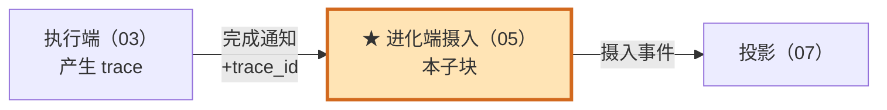
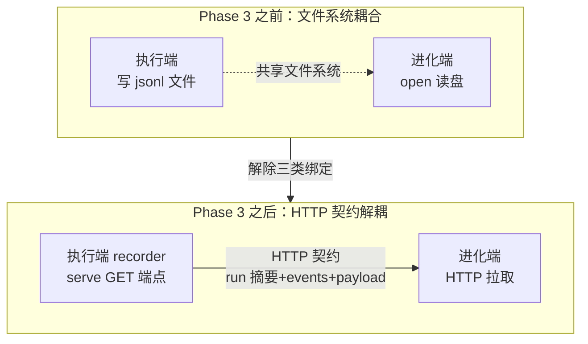
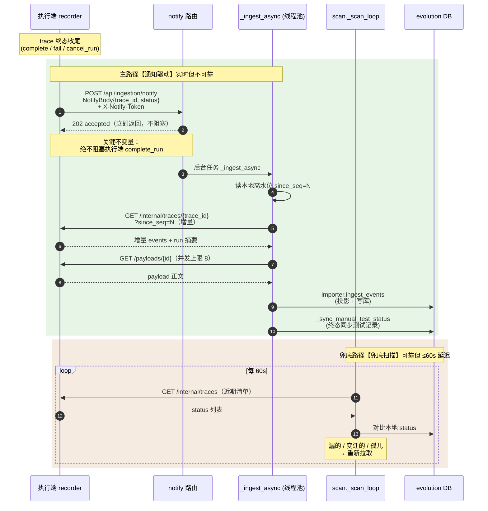
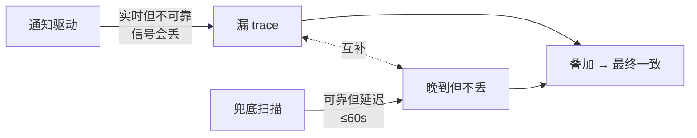
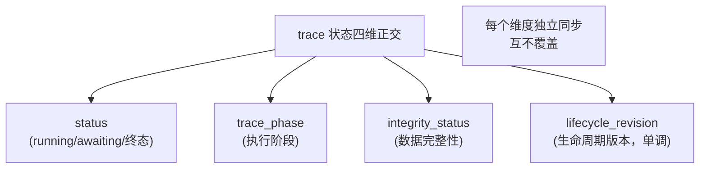

# 05 · 进化端摄入（trace 系统 深读·子块 05）

> **层位声明：本文为设计思想层（架构师视角）。** 讲的是摄入为什么这么设计、双保险怎么协作、Phase 3 解耦的决策、幂等与状态同步的契约、优势弊端、可迁移原理。主动剥离环节内部微观实现——线程池调度细节、HTTP client 实现、SQL 语句等不讲。推断处标【推测】。
>
> **本子块在 trace 系统中的位置**：摄入是 evolution（进化端）与执行端之间的**唯一数据入口**——把执行端产生的 trace 拉过来存进自己的 SQLite，变成可投影、可评估、可追溯的本地事实。上游接执行端（03），下游喂投影（07）。

> **编号图例**：`EVD-xxx`＝已归档的踩坑证据（真实线上事故/问题的证据记录）；`NFR-xxx`＝非功能需求编号（如性能）；`D-Qxx`＝深读过程中的"设计追问"编号；`f075b46` 这类 7 位十六进制＝git commit 短哈希（可直接定位修复提交）；`Phase N`＝重构的阶段编号。

## 全局定位



一句话定位：**摄入是"拉"不是"推"**——执行端只发一条轻量通知（trace_id + status，几十字节），真正的事件流、run 摘要、payload 正文，全部由进化端主动 HTTP 拉过来。通知是信号，拉取是动作。

---

## 第 1 步：本质锚定

### 一句话本质

进化端作为消费方，通过 HTTP 把执行端产生的 trace（事件流 + run 摘要 + payload 正文）拉过来落进自己的 SQLite，变成可投影、可评估、可追溯的本地事实。这是 evolution 与执行端之间**唯一的数据入口**（docstring 原文）。

落库的事件本身没法直接看——它们是 **append-only 的历史流水**，一条条躺着，只记"什么时候发生了什么"。所谓**投影**，就是把整条事件流从头到尾**重放一遍**，折叠成"这次运行**现在**是什么样子"的派生数据。trace 详情页里的节点图（`nodes` 表）、run 的最终状态，都是投影算出来的产物。

> 投影一句话：事件是**账本流水**，投影是拿整本流水重放算出的**余额报表**——流水记"当时发生了什么"，报表答"现在怎么样"。

### 用快递揽收点建立心智模型

把整个摄入过程想象成快递揽收：

| 现实角色 | 系统对应 | 干什么 |
|---|---|---|
| 发货方 | 执行端 | 把包裹（trace）放自己仓库，备好待取 |
| 发货方发短信"货好了" | 完成通知 (notify) | 一条几十字节的小消息，告诉快递公司"来收" |
| 快递公司派车上门取件 | HTTP 拉取 (fetch) | 进化端主动上门，把包裹取回自己仓库分拣 |
| 快递公司每天定时巡"未取的货" | 兜底扫描 (scan) | 短信丢了也不怕，每天定时巡逻补取 |

这张表把三个关键点一次讲清：

1. **发货方不送货**：执行端不会把完整 trace 推过来，只发"货好了"的信号。
2. **快递公司主动取**：进化端拿到信号后，自己派"车"（HTTP GET）去取真东西。
3. **有兜底**：信号可能丢（短信没人看 / 网络断了），但快递公司有定时巡逻，丢不了货。

> 这个类比贯穿全文。后面看到"通知""拉取""兜底"，请回到这张表对号入座。

---

## 第 2 步：痛点动机（Phase 3 为什么必须解耦）

### 解耦前：进化端直接读执行端的文件系统

Phase 3 重构之前，NotifyBody（通知体）里有个 `trace_path` 字段——执行端把 trace 写成 jsonl 文件，通知里带上文件的绝对路径，进化端拿到路径直接 `open(path)` 读盘。

这就像快递公司不派车取货，而是**直接拿发货方仓库的钥匙自己去翻货**。听起来简单，但踩了一堆耦合的坑。代码注释里 `trace_path` 现在标着"已废弃"，`workspace_path` 也降级为"仅 debugging 用"。

> jsonl 一句话：每行一个 JSON 对象的文本文件格式，常用于流式数据落盘。

### 四个具体的痛点（都用场景讲）

**痛点 1：部署耦合，跨机直接不可行。**

进化端要 `open(trace_path)`，前提是两端共享同一套文件系统。一旦分布式部署、容器化、跨机——进化端根本看不到执行端的盘。这就像快递公司在 A 城，发货方仓库在 B 城，钥匙再有用也开不了门。

**痛点 2：文件格式和路径强绑定。**

进化端必须知道执行端 trace 落盘的目录结构、文件命名规则、jsonl 每行格式、清洗规则。代码里 `loader.py` 整个就是"复刻执行端 recorder 的读取逻辑"——两端各维护一份读盘代码。schema 一变，两端必须同步改，谁忘了谁出 bug。

**痛点 3：进程边界穿透，可能读到半成品。**

执行端 trace 运行期是内存 + WAL 状态，未必已经 flush 落盘。进化端读文件，可能读到半成品、读到文件锁、读到正在追加的半行。而 HTTP 端点由执行端 recorder 自己 serve，能保证返回一致的快照。

> WAL（Write-Ahead Log，预写日志）一句话：SQLite 等数据库先把改动写到日志文件，崩溃后用日志恢复——所以"写完"和"落盘可见"之间有窗口。

**痛点 4：鉴权和信任边界模糊。**

文件系统读取没有鉴权——谁能 open 谁就能读。HTTP 可以挂 `X-Notify-Token`（通过 `NotifyTokenMiddleware` 中间件校验），内网专用，可审计。

### Phase 3 的核心动作：把"文件共享"降级为"HTTP 契约调用"

重构后，进化端不再读文件，改调执行端的 `GET /internal/traces/{trace_id}`（代码注释原文："重构 Phase 3：trace 内容拉取替代 evolution 读文件系统"）。

执行端 recorder 自己 serve 数据，进化端只通过契约接口拿到三样东西：

- **run 摘要**（这次运行的元信息）
- **events 列表**（事件流）
- **payload 正文**（事件引用的大块内容）

对执行端内部存储一无所知。

### 前后对比一张图



解除了**三类绑定**：

1. **部署拓扑绑定**（不再需要共享文件系统）
2. **存储格式绑定**（不再需要知道 jsonl 格式）
3. **进程生命周期绑定**（不再需要担心读半成品）

让两端可以独立部署、独立演进 schema、独立重启。

---

## 第 3 步：模块协作与契约

### 双保险的整体协作（先看一张时序图）

摄入有两条路：**主路径靠通知驱动**（实时但不可靠），**兜底路径靠周期扫描**（可靠但有 60s 延迟）。两条路叠加逼近最终一致。



上面的时序图，画的是**进程之间谁跟谁说话**——进化端作为一个整体出场。下面的七条契约，讲的是**进化端内部的函数分工**——拆开看每个函数各干什么活。两层叙事的函数名对不上：时序图里的 `_ingest_async`，契约里没有它的条款；契约里的 `_fetch_trace_content`，时序图里也没这个名字。拿着图找契约、拿着契约回图，都会迷路。所以先铺一张**主路径函数调用地图**，把两层锁在一起：

```text
入口① notify 路由（契约1）
  POST /api/ingestion/notify
  └─ _ingest_async —— 异步壳：函数体只有一行，
       把同步函数丢进线程池，防止阻塞事件循环
     └─ ingest_trace_now（契约4）—— 同步编排主函数，真正干活的是它
         1. _load_prior_events      读本地旧事件 + 当前高水位 ingested_seq
         2. _fetch_trace_content    HTTP 拉增量：run 摘要 + 事件 + payload（契约3）
            └─ 拉不到（如 404）→ 本次放弃，等 scan 补
         3. 分支：since_seq>0 且本次无新事件
            └─ 走 _sync_status_only 只同步状态维度（契约5）→ 到此结束
         4. importer.ingest_events  合并旧事件 + 全量投影 + 写库（契约6）
         5. _sync_manual_test_status  按 trace 终态同步手动测试记录

入口② 详情页按需刷新 refresh_executor_trace
  └─ 直接调 ingest_trace_now —— 汇入同一条主路径
```

> 下面的七条契约，就是这张地图上每个环节的**行为规定**——每条**主路径**契约都能在地图上找到落点（契约 7 的 scan 是兜底路径，不在主路径地图上，见时序图下半部分）。

### 主路径各环节契约（自上而下读）

**契约 1：notify 路由——立即返回，绝不阻塞。**

- **输入**：`NotifyBody{trace_id, status, task_id?, error?}` + `X-Notify-Token`（鉴权）+ `traceparent`（分布式追踪上下文头）。
- **输出**：`202 accepted`，立即返回，不等摄入完成。
- **不变量**：**绝不阻塞执行端的 `complete_run`**。
- **设计动机**：执行端 trace 收尾是关键路径（主流程），摄入是派生数据（衍生需求）。派生数据绝不能拖垮主流程——这是"派生数据降级"原则（第 5 步会展开）。

**手动测试兜底（D-Q14）**：这段涉及三方，先锚定关系——**task**=执行端跑的任务；**test**=进化端的手动测试记录（manual_tests 表）；**trace**=任务运行时的录像。test 靠 `trace_id` / `task_id` 与另外两方关联（完整的"三方对账"在契约 7 展开）。如果 `trace_id` 为空但 `task_id` 有值——说明任务在产出 trace 之前就失败了。这时调 `_mark_test_failed_by_task`，按 `task_id` 反查并把测试记录标记为失败。

**契约 2：NotifyBody 的 status——不只终态，状态变迁即推送。**

`status` 是 `Literal["running", "awaiting_input", "completed", "failed", "cancelled"]`，不只有终态。

关键的非终态：

- `awaiting_input`：HITL（Human-In-The-Loop，人在回路）场景——trace 挂起等用户输入。
- `running`：用户 resume（恢复执行）后状态变迁。

设计动机：HITL 场景下 trace 可能挂几个小时，进化端必须知道"现在在等用户"，否则详情页会一直显示运行中。

**契约 3：_fetch_trace_content——增量高水位拉取。**

> 这个函数就是上面调用地图里 `ingest_trace_now` 的**第 2 步：拉增量**——"派车取件"的环节。

- 调 `GET ?since_seq=N`，只拉 `sequence > N` 的增量事件。`N` 是本地高水位（上次拉到哪）。
- **404 处理**：返回 404 = 执行端内存索引未命中（多半是进程重启了），返 `None` 让上层靠 scan 补。
- **payload 并发拉**：上限 8 个并发。这是 NFR-003 的优化——原来串行拉，30s 超时，含多个 payload 的长 trace 单轮 refresh 拖到分钟级，详情页"卡住"。
- **超时**：30s。

> 高水位 (watermark) 一句话：像水位的刻度线，标记"上次处理到这里"，下次只处理新增的部分。典型的 CDC（Change Data Capture，变更数据捕获）/ replication（复制）模式。

**契约 4：ingest_trace_now——同步摄入主路径。**

> 消歧：时序图里的 `_ingest_async` 只是**异步壳**（调用地图上入口①下面那层壳）——函数体只有一行，把同步函数丢进线程池、防止阻塞事件循环。真正干活的是这个**同步编排函数** `ingest_trace_now`。标题里的"同步"说的是它，不是"不走后台"。

**不变量**：终态通知和详情页按需刷新**共用这一条同步路径**——两个入口（notify 的后台任务、详情页刷新）都汇到 `ingest_trace_now` 这一个函数，高水位和状态同步逻辑只维护一份，才不会有两套摄入逻辑在高水位、状态同步上产生分歧。

**增量逻辑**：

1. 读本地 `ingested_seq` 高水位
2. 只拉 `sequence > since_seq` 的事件
3. 合并旧事件，全量投影

为什么拉取是增量、投影却是"全量"？因为两者管的事不同：**拉取**只管把新事件运回来，拉新的就够；**投影**要算出正确的视图，必须基于**完整**事件流——节点图里一个节点要靠"开始事件 + 结束事件"**配对**才能落定，缺一段就配不齐。所以代码内部的做法是：先把旧节点**全删再重建**（DELETE + INSERT）。**增量拉取、全量投影**，是同一个机制的两个侧面。

**契约 5：_sync_status_only——无新事件时只同步状态。**

HITL resume 等场景下，没有新事件但 `status` 变了。这时不需要重拉数据，只同步状态维度。

★ **EVD-008 根因修复（关键不变量）**：**绝不用执行端 index 的 `event_count` 覆盖本地**。原因：执行端 index 的 `event_count` 运行中保持 0，会与本地真实摄入的高水位撕裂。为什么运行中是 0？执行端的 index **只在终态或显式中间态才更新计数**，运行中一直是初始 0。

`_sync_status_only` 只同步这几个字段。前四个是**正交维度**——各管一条时间线，互不隶属（详见 01 子块）：

- `status`：**业务状态**——任务本身走到哪了
- `trace_phase`：**记录阶段**——事件写完、封存了没有
- `integrity_status`：**完整性**——这份记录可信吗
- `cancel_audit`：**取消审计**——谁、何时、为何取消
- `lifecycle_revision`：**辅助版本号**——单调递增，防旧快照盖回新状态（它不算第五个维度）

`event_count` 不在这份名单里——它始终以本地摄入事实为准。

> 这是个踩过的坑（EVD-008）：曾经全量覆盖，把本地 `event_count`（已摄入事件条数，与高水位 `ingested_seq` 一样反映本地摄入进度）撕裂成 0。修复后变成"精确手术"——只动状态维度，不碰事件计数。

**契约 6：importer.ingest_events——实际入库。**

- **幂等键**：`event_id`（同事件重复摄入幂等）。
- **sequence**：用于连续性校验。
- **run summary 推导优先级**：终结事件 > `run_status_hint`（executor 权威 status） > 默认 `failed`。`run_status_hint` 一句话：它是 HTTP 拉回的 run 摘要（契约 3 拉增量时一并拉回的那份）里的 `status` 字段——执行端的权威状态。事件流是**历史日志**，表达不了"此刻还在跑"，只有 run 摘要知道；所以事件流没有终结事件、眼看要被默认判 `failed` 时，用它来纠正。

**契约 7：scan._scan_loop——兜底扫描。**

- **频率**：每 60s。
- **动作**：调 `GET /internal/traces` 拿近期清单，对比本地 `status`。
- **触发重拉的条件**：漏的 / 状态变迁的 / 孤儿。
- **★ EVD-009 三方对账（孤儿检测）**：两端都显示 `running`，但关联的业务对象（task/test）已经终态——说明发生了强杀或超时，产生了**孤儿**（永远 running 的 trace）。强制重拉，让 receipt（凭据）按真实事件重判。
- **f075b46 修复**：`interrupted` 是 evolution 本地判定的状态，执行端不知道。遇到本地 `status=interrupted` 一律跳过——只能用户在 UI 上手动收敛。

**EVD-009 里那个 receipt 是什么、凭什么能"重判"？拆开看——**

它就像快递签收时快递员开的那张**验收单**：核件数、查缺口、对发货清单，最后签"通过/有问题"。系统里它叫 receipt，是摄入端每轮写库时落进 `trace_receipts` 表的一份**验收记录**，记四样：事件**连续摄入到第几号**（连续前缀）、**中间缺了哪些号**（缺口区间）、与执行端**终态清单的对账结果**（哈希对没对上）、**版本号**（单调递增）。

所谓"**重判**"，就是拿重新拉到的真实事件，把这份验收**重算一遍**，得出完整性结论——`verified`（全对）/ `incomplete`（有缺口）/ `conflict`（有冲突）。孤儿 trace 正是靠这步重算，把两端虚假的 `running` 收敛成真实结局。

### 双保险为什么必要

**通知驱动**：实时性好（终态后秒级摄入），但不可靠——`_notify_evolution` 是"纯副作用彻底降级"：URL 空就不通知，任何异常静默吞。

**兜底扫描**：可靠（保证最终一致），但延迟最多 60s。

单次通知丢失是**常态**（执行端重启、网络抖动、进化端未启动）。只靠通知必然漏 trace。所以必须叠加扫描兜底。



### 幂等保证（同一 trace 重复摄入不冲突）

既然通知和扫描都可能触发同一 trace 的摄入，**幂等是铁律**。多层防御：

| 层级 | 幂等机制 | 行为 |
|---|---|---|
| 事件级 | `event_id` + `content_hash` | 同 `event_id` 同内容 → 幂等跳过；同 `event_id` 内容不同 → 进 `integrity_conflicts` 审计表，**不静默丢** |
| run 级 | `ON CONFLICT(trace_id) DO UPDATE` | 同 trace 重复写入 → 更新而非报错 |
| 生命周期 | `lifecycle_revision MAX` | revision 单调递增，取最大值 |
| payload | 内容寻址 `ON CONFLICT` | 只续期，不重复 |
| receipt | revision 单调递增 | 同上 |

> 关键设计：**冲突不静默丢弃**。同 `event_id` 但内容变了，进审计表留证据——这是"至少一次投递 + 冲突显式化"。

---

## 第 4 步：决策对比

### 四种方案横向对比

| 方案 | 本项目做法 | 优势 | 弊端 |
|---|---|---|---|
| **HTTP 拉取 + 通知 + 兜底扫描**（本项目，采用） | 执行端发轻量 notify 只带 trace_id + status，进化端主动 HTTP GET 拉，60s 兜底 | 解耦彻底；两端独立部署 / 重启；鉴权边界清晰；契约清晰；增量省带宽 | 通知可能丢（scan 补 ≤60s 延迟）；大 trace HTTP 超时风险；双链路维护成本 |
| **共享文件系统**（否，Phase 3 废弃） | 进化端直接 `open` 执行端 trace 文件 | 实现最简单，零网络 | 强部署耦合；跨机不可行；格式强绑定；无鉴权；读半成品；loader 两端重复维护 |
| **消息队列 Kafka/SQS**（否） | 执行端投递队列，进化端订阅 | 天然解耦；重试 / 堆积；at-least-once；高吞吐 | 重量级中间件；单机桌面化过重；trace 不是高频流；顺序 / 增量管理复杂 |
| **执行端直接 push 全量**（否） | notify 时把完整 trace POST 给进化端 | 省一次 round-trip | 大 trace 撑爆 HTTP body；阻塞执行端收尾；push 失败重试成本高；多消费者不灵活 |

### 选择逻辑

回答一个核心问题：**trace 是不是高频流？**

- trace 数据量：几十到几千事件——**不是高频流**，不需要消息队列的流式能力。
- 但要解决：解耦部署 + 处理大 trace + 可靠补漏。

所以"轻量通知 + 按需 HTTP 拉 + 兜底扫描"是**甜点区**：

- 比共享文件解耦（不再绑文件系统）
- 比消息队列轻（不需要中间件）
- 比 push-all 抗大 body（通知只带几十字节，数据按需拉）

---

## 第 5 步：理论抽象（可迁移的设计原理）

这 7 条原理不限于 trace 系统，任何"跨进程数据同步"场景都能借鉴。

**原理 1：通知 + 轮询双保险（notify + scan）——经典可靠性模式。**

推送保实时但不可靠，轮询保可靠但有延迟，叠加逼近最终一致。任何只靠一端都有明显短板。

**原理 2：推 vs 拉的解耦——信号轻可以推，数据重必须拉。**

notify 是"推信号"，fetch 是"拉数据"。信号轻可以推（几十字节），数据重必须拉——避免大 body 阻塞推送方，避免推送方关心消费方处理能力。

**原理 3：幂等摄入——分布式摄入铁律。**

同一 trace 可能被 notify 和 scan 重复触发，必须 `event_id` / `content_hash` 级幂等。冲突不静默丢弃，进审计表留证据——"至少一次投递 + 冲突显式化"。

**原理 4：最终一致性——BASE 而非 ACID 跨进程。**

不强求 notify 即刻可见，容忍 ≤60s 扫描延迟，换取执行端收尾不被拖垮。

> ACID vs BASE 一句话：ACID 要求强一致（原子、一致、隔离、持久）；BASE 接受基本可用、软状态、最终一致。跨进程跨机器的协调，BASE 更现实。

**原理 5：派生数据降级——派生失败绝不抛回主流程。**

trace 收尾是主流程，notify / 摄入是派生。派生数据失败静默降级，绝不影响主流程。这是契约 1"绝不阻塞 complete_run"的理论根基。

**原理 6：增量高水位——典型的 CDC / replication watermark。**

`ingested_seq` 作为本地高水位，只拉增量。任何"上游持续产出、下游周期消费"的场景都适用——数据库复制、binlog 同步、消息队列 offset 都是同一思想。

**原理 7：四维正交状态——避免一个维度覆盖另一个。**

`status` / `trace_phase` / `integrity_status` / `lifecycle_revision` 四个维度独立演化、分别同步。EVD-008 的 `event_count` 撕裂是反例——执行端 index 的 `event_count` 运行中是 0，覆盖了本地真实计数。



---

## 第 6 步：边界与代价

设计有取舍。下面 8 条边界，是"甜点区"背后的代价。

**边界 1：HTTP 拉大 trace 超时风险。**

30s 超时，大 trace 上 MB 可能超时失败，靠 scan 重试。已优化 payload 并发拉（上限 8）缓解。

**边界 2：通知丢失兜底延迟。**

scan 60s 间隔，最坏一条 trace 终态后 60s 才补摄入。详情页 / 列表可能短暂滞后。

**边界 3：执行端进程重启索引丢失（已知薄弱点）。**

GET 返回 404 = 执行端内存索引丢（多半是重启）。`list_traces` 注释明确："重启后索引不全，仅覆盖重启后的 trace——全量扫 workspace 成本太高"。

重启前已终态、未摄入的 trace，重启后 scan 也补不到。【推测】这是已知可接受窗口，靠"evolution 先摄入再让执行端重启"的运维顺序规避。执行端有 WAL 落盘，重启可重建索引——但主摄入链路对重启窗口的覆盖是已知薄弱点。

**边界 4：状态同步边界（HITL）。**

`awaiting_input` / `running`（resume）也要同步，不只终态。`_sync_status_only` 专门处理"无新事件但 status 变了"。

**边界 5：event_count 撕裂陷阱（EVD-008）。**

执行端 index 的 `event_count` 运行中保持 0，**绝不能覆盖本地 `ingested_seq`**。这是踩过坑修复后的硬不变量。

**边界 6：interrupted 不可被覆盖（f075b46）。**

`interrupted` 是 evolution 本地判定，执行端不知道。scan 遇到本地 `status=interrupted` 必跳过——只能用户在 UI 上手动收敛。

**边界 7：三方状态分裂（EVD-009）。**

task / test / trace 三个状态机没有共同对账时，强杀 / 超时只改一侧，会产生永久 `running` 的**孤儿**。scan 必须做三方对账，逻辑复杂。

**边界 8：手动测试兜底（D-Q14）。**

任务产出 trace 之前就失败——`trace_id` 为空，只能按 `task_id` 反查。这条路是单独的兜底分支。

---

## 第 7 步：吃透检验（能复述能扛追问）

**Q1：为什么不执行端 push 全量 trace，省一次 round-trip？**

大 trace body 撑爆 HTTP、阻塞执行端收尾。notify 故意只带 trace_id（几十字节），让进化端按需拉、拉失败独立重试、可增量。"推信号 + 拉数据"是刻意分工。

**Q2：notify 和 scan 都触发，会不会重复入库？**

不会。`importer` 的 `event_id` 幂等，run 级 `ON CONFLICT`，`lifecycle_revision` MAX 单调。重复摄入结果一致。内容真冲突进 `integrity_conflicts` 审计表，**不静默丢**。

**Q3：执行端重启 GET 返回 404，这条 trace 丢了？**

主链路确实补不到（内存索引丢）。设计取舍是 `list_traces` 不全量扫 workspace。【推测】执行端有 WAL 落盘重启可重建索引，但主摄入链路对重启窗口覆盖是已知薄弱点。靠 evolution 在执行端重启前完成摄入规避。

**Q4：HITL trace 挂 awaiting_input 几小时，进化端怎么知道？**

执行端状态变迁即 notify（`status=awaiting_input`），进化端 `_sync_status_only` 同步本地 status。resume 时再 notify（`running`）。非终态通知不走完整摄入，只同步状态维度。

**Q5：既然有 scan 兜底，为什么还要 notify？只靠 scan 不行吗？**

scan 有 60s 延迟。notify 提供准实时性（终态后秒级摄入）。砍 notify，所有 trace 晚 60s 可见；砍 scan，notify 丢时永久漏。两者职责互补。

**Q6：_sync_status_only 为什么不干脆全量重拉？**

全量重拉无新事件时浪费。而且执行端 index 的 `event_count` 运行中是 0，全量覆盖会把本地 `ingested_seq` 撕裂成 0（EVD-008 实际踩过）。只同步状态维度是精确手术，碰 `event_count` 即出事。

**Q7：payload 为什么事件只存引用，正文单独拉？**

事件可能引用大正文，内联 body 会让事件膨胀。引用让事件轻量，正文按**内容寻址**单独存——去重（相同内容只存一份）+ 可独立拉 + 可并发拉。

> 内容寻址一句话：用内容本身的哈希当唯一 ID（像 Git 用哈希管代码版本一样）。相同内容自然去重。

**追问：那哈希碰撞、或正文半路被换/损坏，怎么办？**

碰撞这一层不用防：`payload_id` 是**完整 SHA-256**（64 位十六进制，不截断），不同内容撞出同一哈希的概率**工程上视为零**，系统不为它设专门分支。真正防"被换/损坏"的防线在**取回时**：摄入端把正文拉回来后**重算一遍哈希**，与事件引用里声明的 `content_hash` 比对——对不上就判这份 payload **不完整**，完整性结论跟着**降级**（进不了 verified），下游照旧被**门禁**拦住。

> 一句话收束：内容寻址既管**存**（相同内容只存一份），又管**验**（取回重算哈希，即知真伪）。

---

## 小结：摄入机制的设计骨架

回到快递揽收的类比，把全文压缩成一句话：

> **执行端发短信（notify 信号），进化端派车取货（HTTP fetch 数据），快递公司每天巡逻补漏（scan 兜底）——三者叠加，让两个独立部署的进程，在容忍 60s 延迟的前提下，达到最终一致。**

承重不变量（扛追问时记牢这几条）：

1. notify 路由绝不阻塞 `complete_run`（派生数据降级）
2. `event_id` + `content_hash` 幂等，冲突进审计表不静默丢
3. `event_count` 始终以本地摄入事实为准（EVD-008）
4. `lifecycle_revision` 单调递增
5. 四维状态正交，互不覆盖
