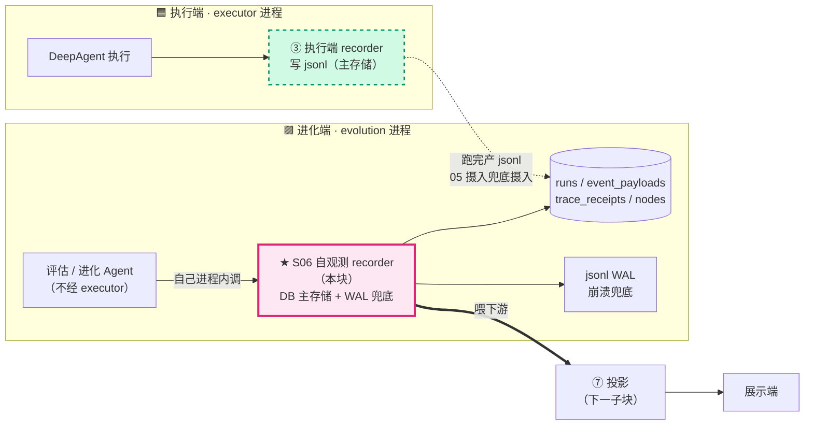
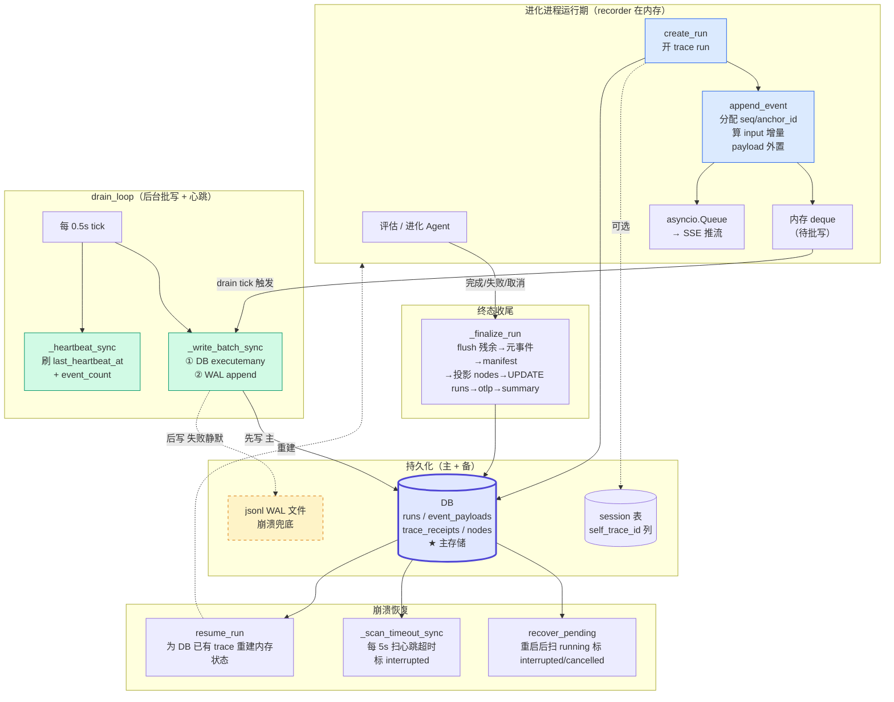
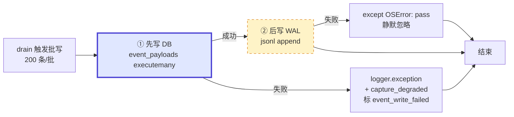
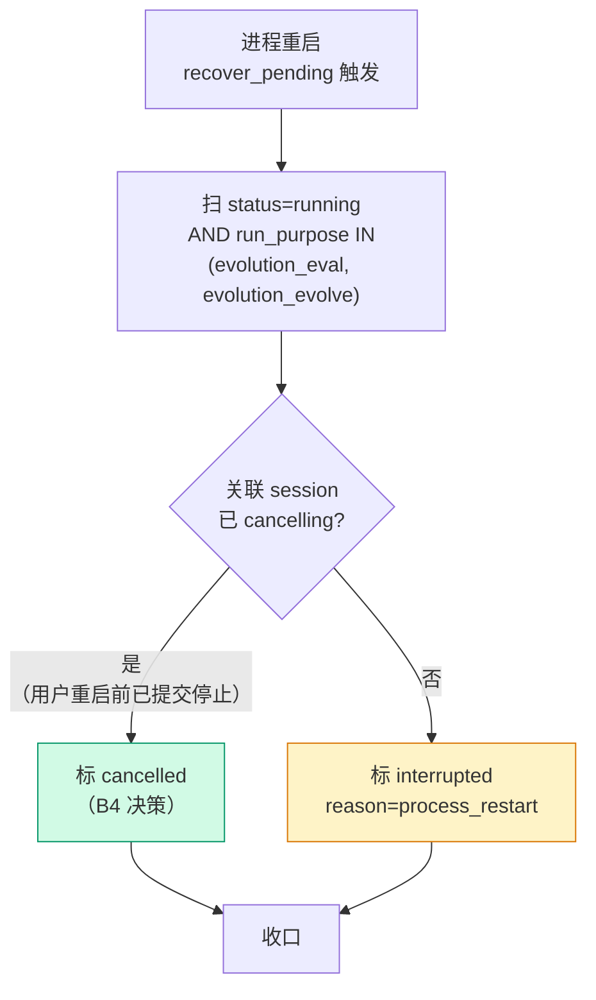
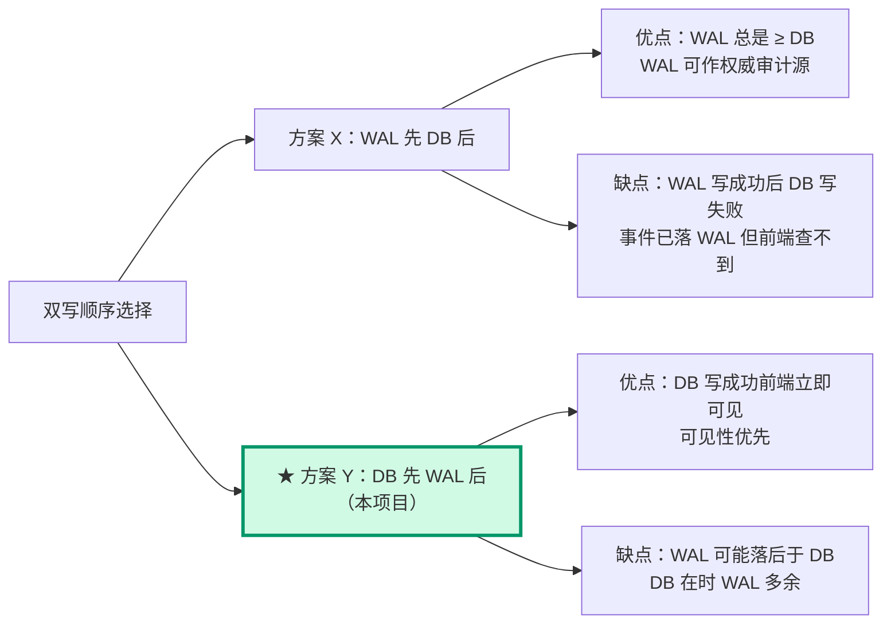
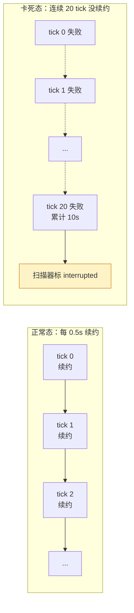
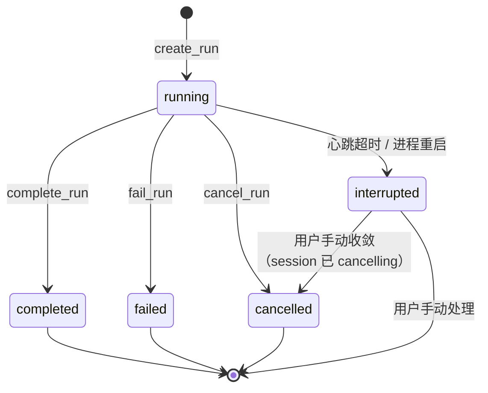

# 06 · 进化端自观测（trace 系统 深读·子块 06）

> **层位声明：本文为设计思想层（架构师视角）。** 讲的是进化端自观测 recorder 为什么自有一套、DB + WAL 双写怎么协作、心跳与崩溃恢复的契约、与执行端 drain 的对称性、优势弊端、可迁移原理。主动剥离环节内部微观实现（不贴 file:line、不贴真实代码片段）。
>
> **诚实铁律**：机制推断处标 `【推测】`，业界范式未联网核实处标注，看不清的如实说"信息不足"。
>
> **本子块在 trace 系统中的位置**：进化端自观测是与执行端记录（03）对称的**另一个事件记录源**——评估/进化 Agent 在进化进程内执行不经 executor，需要自己观测自己。产物落 DB + WAL 供投影（07）消费。

---

## 全局定位



**怎么读这张图**：

- **两侧对称**：执行端和进化端都是事件记录源。执行端 recorder 跑在 executor 进程，主存储是 jsonl 文件；进化端自观测 recorder 跑在 evolution 进程，主存储是 DB 表。两者都是"事件记录源"，但记录对象、进程归属、主存储介质不同。
- **本块焦点**：粗框的 S06 是本文主角——进化端自己进程内的 recorder，观测的是同进程跑的评估/进化 Agent。
- **下游**：自观测产物流进同一套 DB 表，再被投影（07）重建成调用树喂展示端。

---

## 第 1 步：本质锚定

### 一句话本质

> 进化端自观测 recorder 是**「在进化进程内、对自身跑的评估/进化 Agent 做事件记录的录像机」**：把 Agent 每一步作为事件，双写到主存储（DB `event_payloads` 表）和保底存储（jsonl WAL 文件），并维护一条 `runs` 行的生命周期（`running → completed / failed / cancelled / interrupted`）。

### 生活化类比：机构内部审计科 vs 外部审计

想象一家有自己内部账本（DB）的大公司，要审计两类业务：

| 角色 | 现实对应 |
|---|---|
| **外部审计**（审计外单位，看的是外单位的账） | **执行端 trace**：独立 executor 进程跑完产 jsonl 报告，由进化端兜底摄入「外部报告 → 重新入账」中转进 DB |
| **内部审计科**（审计对象就在本公司内跑，直接对着本公司 DB 账本落账） | **进化端自观测**：评估/进化 Agent 就在自己进程内跑，审计员（recorder）直接对着本机构 DB 账本落账，不需中转 |
| **审计员抽屉里另留一份手抄副本** | **jsonl WAL**：进程崩了 DB 写一半，手抄副本提供事件级原始证据 |

**关键直觉**：外部审计的产物是「报告」，得中转才能入账；内部审计科手里就有 DB 账本，直接落账即可，额外多留一份手抄副本只是为了哪天账本被烧了能对得上。

### 三个承重概念先接地

| 概念 | 一句话定义 |
|---|---|
| **自观测（self-observation）** | 观测者与被观测者同处一个进程、同一身份。区别于"外部观测"（执行端 trace 由独立 executor 记录）。代价是观测者自己也会随被观测者一起崩溃，所以更需崩溃恢复。 |
| **DB 主存储 + WAL 保底** | DB 是主查询源（强结构化、可 SQL、可被前端轮询）；WAL 是 append-only 保底日志，进程崩时提供事件级证据。"主存 + 日志"是经典模式（数据库自身的 WAL 思想被内化到应用层）。 |
| **失联中断态 interrupted** | 一种"失联待收敛"的诚实中间态——"我不知道这条 run 是真崩了还是没来得及收尾，请你（用户）来判断"。区别于直接强标 failed 的"假装知道"。 |

---

## 第 2 步：痛点动机

### 关键事实：评估/进化 Agent 根本不经 executor

评估 Agent（`eval_agent`）和进化 Agent（`evolve_agent`）都在 **evolution 进程内执行**，根本不走 executor。代码证据：这两处都直接持有 `ctx.recorder`，调用 `create_run / append_business_event / complete_run` 等方法。

也就是说，这些 Agent 的运行期事件，executor 那套 recorder 完全看不到。**没人观测它，它就是黑盒。**

### 如果不自观测，硬套执行端 trace 会怎样

**痛点 ①：进化 Agent 长链路无人记录，trace 详情页空白**

进化 Agent 在 `plan / execute` 子代理里跑长链路 LLM 调用、调一堆工具。如果没人记录这些步骤：

- trace 详情页**空白**，无法回放"它想了什么、调了哪些工具、卡在哪一步"。
- 用户只看到"进化跑完了"，但中间过程是黑箱。

**痛点 ②：评估 Agent 业务过程不可见，前端进度条/事件流无数据**

评估 Agent 跑 `read_trace → apply_edits → judge` 这种业务步骤。没自观测的话：

- 前端进度条没有事件可消费。
- 事件流面板空空如也，用户不知道评估到第几步。

**痛点 ③：硬塞给执行端 recorder 接不上**

即便强行把进化端事件发给执行端 recorder，也对接不上：

- 执行端 recorder 用 `workspace / thread` 身份模型写 jsonl 文件，跑在 executor 进程里。
- 进化进程根本没有执行端 recorder 的实例。
- 跨进程投递事件需要 IPC（进程间通信），引入网络故障面——**过度工程**。

**核心矛盾**：进化端 Agent 跑在自己进程，事件产在自己进程，自己进程就有 DB 连接。绕一圈去找 executor 的 jsonl 文件再绕回来，是反方向。

### commit 历史里的 why（d5213b5）

原本进化端有一套叫 `SessionEvents` 的内存事件总线（127 行代码），`emit_step / emit_log` 走内存事件流，**不落盘**。

痛点很直接：事件流不进 DB → 没法事后查询、没法投影、没法对接 trace 投影体系。

`d5213b5` 的解法是一刀切——"recorder 统一接管 SSE + DB 落盘，删除旧 SessionEvents 事件总线"。把中间件拦截的 LLM/Tool 事件 + 业务步骤事件统一灌进**同一条 trace 流**。

### 四个核心问题与答案

把这节的痛点收敛成四个问题：

| 核心问题 | 答案 |
|---|---|
| 进化进程内 Agent 跑动时，**谁观测它**？ | 自己进程内的 recorder 自观测。 |
| 自观测产物必须能进 DB（供投影、供前端轮询、供 stats）——**主存储选什么**？ | DB 是主存储。 |
| 进程可能崩溃——**怎么兜底**？ | WAL 兜底 + 崩溃恢复。 |
| Agent 可能卡死无人收尾——**怎么检测**？ | 心跳超时扫描器标 interrupted。 |

后面几步，就是这四个答案的具体落地。

---

## 第 3 步：模块协作与契约

> **关于文中的编号**：本节会出现 `D8 / R11 / B4 / A1` 这类「字母+数字」标签，它们是项目内部决策清单的引用锚点（引自代码注释与内部设计记录），用来回溯每个设计点的来源。**标签本身可以跳过**——每个标签旁边都已复述了该决策的实际内容，不认识编号不影响理解。
>
> 另一个反复出现的词是 **承重 / load-bearing**：它标记的是「关键支撑性不变量」——这个点若是错的，整条链就塌，像承重墙一样不能违背。

### 3.1 宏观模块协作图



**一张图看懂主轴**：Agent 调 `create_run` → `append_event` 把事件灌进内存 deque → drain_loop 每 0.5s tick 把事件批量双写（先 DB 后 WAL）→ 终态时 `_finalize_run` flush + 投影 + 写 manifest。横切关注点：心跳每 tick 刷、扫描器每 5s 扫超时、重启后 `recover_pending` 收敛悬挂 run。

下面逐个拆解每个模块的契约与不变量。

### 3.2 create_run：跑起来就要可见

**做什么**：开一条 trace run，立即写 DB `runs` 行（`status=running`），初始化全部运行期内存状态，写 `run_start` 事件，可选把 `self_trace_id` 持久化到 session 表。

**关键不变量 D8**：`runs` 行必须**立即落库**。否则前端在 trace 终态前看不到"这条 run 在跑"。

**设计动机**：执行端是「跑完才整体摄入写 runs」（事后入库）；进化端是「跑起来就要可见」（在线交互），所以 `create_run` 即写。

**`last_heartbeat_at` 创建即首次心跳**：run 一出生就有心跳，不依赖第一个事件。

### 3.3 append_event：事件入流

在讲处理顺序之前，先建立「一条事件长什么样」的模型——下面三个术语（`anchor_id`、input 增量、payload 外置）都挂在这个模型上。

把 recorder 想象成一台**录像机**：Agent 每跑一步，它就按下一次快门，得到**一帧**；一条 trace 就是同一趟运行的整盘录像。每帧事件（`TraceLogEvent`）大致长这样：

| 字段 | 作用 | 举例 |
|---|---|---|
| **类型** | 这一帧是哪一步 | `run_start` / `llm_start` / `tool_end` / `run_end` |
| **seq** | 这一帧在录像里的序号（同一条 trace 从 1 递增） | 1, 2, 3… |
| **业务正文** | 这一步真正干了什么 | 输入 input / 输出 output |

**seq** 负责「按什么顺序播、中间有没有掉帧」，**类型** 负责「这是什么镜头」。难点全压在**业务正文**上——正文既可能很重、也可能大量重复。下面三个机制都是为它服务的：

- **anchor_id——这一帧的固定门牌号。** recorder 给每条事件分配一个稳定 ID（形如 `anchor-{trace}-{seq}-{计数}`），写盘后**永久不变**。作用是：当别处（投影成调用树、或回拉某条事件的正文）要引用「这条事件、或它的内容」时，有一个不变地址可指——就像给每一帧都钉了块门牌，不管后面怎么搬运，门牌号恒定。
- **input 增量——只对 `llm_start` 做的「去重复尾巴」。** Agent 跟 LLM 多轮对话时，每轮输入 prompt 大部分重复（对话历史一路追加、前缀几乎不变）。逐条存完整 input 会大量冗余。所以 recorder 拿**这次 input** 跟**本 trace 上次的 input** 比对：公共前缀不重存，只用一个「范围引用」指回之前存过的事件，**只把新增的尾巴记下来**。示意：第 3 轮输入 ≈ 〔引用回第 2 轮的前缀〕+ 〔本轮新增的一段〕。为什么只对 `llm_start`？因为只有 LLM 输入有「逐轮累加、前缀重复」这个特点，工具调用那类没有。
- **payload 外置——正文该重，但事件该轻。** 事件的业务正文（input / output / tool_args / tool_output）可能很大。直接塞进事件记录（DB 一行 / jsonl 一行）会让事件膨胀到既难查询、又难搬运。所以 recorder 把这些大正文单独写到**按内容哈希寻址**的存储（进化端就是 `event_payloads` 表），事件行里只留一个引用（哈希）。结果：事件行保持轻量、能被 SQL 顺畅查询；真正的大正文按需再拉取。一句话——**事件该轻、正文该重，两者分家**（详见子块 02）。

带着这个模型，再看契约的处理顺序就顺了：

**做什么**：分配 `seq / anchor_id` → 增量计算（仅 `llm_start` + input）→ payload 外置 → 构造 `TraceLogEvent` → 入内存 deque（供 drain 批量落盘）→ 入 `asyncio.Queue`（供 SSE 推流）。

**关键拒绝路径**：trace 不活跃（不在 `_sequences` 注册表）时抛 `KeyError`。

**先补个背景：什么是 round？** 进化端的评估/进化是一场**对话式共创**：一次会话切成几个轮次（round）——inspect（检视）→ converse（多轮对话共创）→ finalize（收尾定稿）。每一轮是一次独立的 HTTP 请求，但它们共享同一条自观测 trace（同一个 `trace_id_self`）——同一次评估的多轮对话，录像都记在**同一条带子**里。

**为什么强调这个**：这是 converse round 跨请求崩溃的根因点。`_sequences / _locks / _queues` 是纯内存状态，进程重启或跨请求即丢。如果调用方复用了上一轮的 `trace_id_self`，但没调 `resume_run` 续内存状态，第一行 `emit_log` 就在这里崩（详见 3.10）。

### 3.4 _write_batch_sync：DB + WAL 双写（D9 承重）

**顺序契约（load-bearing）**：



**三件事一起说清**：

1. **为什么是 DB 先 WAL 后**：DB 是主查询源、可见性优先。先让前端能查到，再让 WAL 兜底。
2. **DB 写失败怎么办**：记日志 + 给涉及的 trace 打 `capture_degraded` 标记（integrity 标 `incomplete` 而非 `verified`），不阻断流程。
3. **WAL 写失败怎么办**：`except OSError: pass` 静默忽略。WAL 是「兜底的兜底」，DB 在就不需要 WAL。接受「WAL 可能落后于 DB」的弱一致性换简单性。

**线程模型**：`asyncio.to_thread` 在线程池执行批写，不占事件循环。这样 Agent 主循环跑 LLM、收事件不受 IO 阻塞。

**与执行端对称性**：执行端是按 `run_path` 分组开文件 append；进化端多了第一步 DB `executemany`。两者都是 deque + drain_loop + to_thread 模式，动机一致——不让磁盘 IO 阻塞事件循环。

### 3.5 _heartbeat_sync：心跳绑 drain tick（设计 A1）

**做什么**：drain_loop 每 0.5s 一个 tick，**无论有无事件待写**都刷活跃 trace 的 `last_heartbeat_at` 和 `event_count`。

**为什么绑定 drain tick 而非独立 task**：注释明说——即便 Agent 长时间不产事件（比如卡在长 LLM 调用上），心跳也每 0.5s 刷新。如果心跳独立 task，要担心它和 drain 的调度竞争；绑在一起，drain 在心跳就在。

**关键不变量**：`_sequences` 非空才执行（无活跃 trace 时零 DB 开销）。

**为什么顺带刷 `event_count`**：注释明确——早期前端靠**轮询（Pull）**拉取 trace 时，`event_count` 只在 drain 批写落盘后才更新，导致轮询期间看不到事件数增长（这是当时排查出的一类根因）。改成心跳每 tick 顺带刷 `event_count`，前端轮询就能实时看到事件数在涨，不用等批写落盘。

### 3.6 _scan_timeout_sync：心跳超时扫描（设计 A5）

**做什么**：每 5s 扫一次 `runs` 表，把满足这三个条件的 run 批量标 `interrupted`（`reason=heartbeat_timeout`）：

```
status = running
AND run_purpose IN evolution_*
AND last_heartbeat_at < now - 10s
```

**误判防护 R11（load-bearing）**：10s 超时意味 drain_loop 连续 20 tick（10s ÷ 0.5s）没刷新。只有进程卡死或协程阻塞才会这样——正常长任务不误判。20 倍冗余（10s 超时 vs 0.5s 续约间隔）用来吸收抖动。

**只扫 evolution 自观测**（commit 4b4ee31）：executor trace 没有心跳，扫了必误判。所以 SQL 严格限定 `run_purpose IN evolution_*`。

### 3.7 recover_pending：进程重启后收敛悬挂 run（D8 R1/B4）

**做什么**：进程重启后扫 `status=running AND run_purpose IN (evolution_eval, evolution_evolve)`，按下面决策收敛：



**B4 决策**：`_check_session_cancelling` 查 `evaluation_sessions / evolve_sessions` 的 `self_trace_id`。若关联 session 已 `cancelling`（用户重启前已提交停止），收敛 `cancelled`；否则标 `interrupted`。

**边界不变量（4b4ee31 load-bearing）**：**只标 evolution 自观测 trace，绝不碰 executor trace**。注释原话大意：evolution 重启只影响 evolution 自己的 recorder（自观测录像中断），不影响 executor 的 trace 生命周期。executor trace 的权威状态由兜底摄入从 executor 同步。

**为什么不再强标 failed（ff69f2c）**：`interrupted` 是「失联待收敛」语义，把决定权留给用户。强标 `failed` 会丢失"可能只是进程重启、Agent 本身没失败"的语义——这不是失败，是失联。如实暴露不可判定状态，而非假装知道。

### 3.8 complete_run / fail_run / cancel_run：幂等终态收尾

**三者都幂等**——trace 已终态时 no-op 返回 None（78472eb 修复，load-bearing）。

**为什么必须幂等**：注释原话大意——`stop_session` 会主动调本方法强制收敛（即便 `task.cancel` 未生效）；而 Agent 后续若在 await 点抛 `CancelledError` 会**再次**调本方法。必须容忍这种正常的双重调用。

**统一收尾流程 `_finalize_run`**：


**八步里有两步需要单独说清**：

- **写元事件——录像机给自己写的备注。** 收尾时，recorder 会补写几条**关于这次录像本身**的事件：不是 Agent 的业务步骤，而是录像机对自身的备注。具体两种：① 记下这次用了哪个 prompt 版本，补一条 `run_meta` 事件；② 采集过程发生了降级（payload 外置失败、DB 写失败、终态事件缺失等），补一条 `capture_degraded` 事件把降级原因列清楚。它们和业务事件排在同一条流里，但标记的是录像自身的元信息，而非 Agent 干了什么。
- **调度 otlp——把录像导出给业界标准后端。** otlp 即 **OpenTelemetry Protocol**（业界标准的可观测数据上报协议）。收尾时 recorder 把这条 trace 转成标准 OTLP 格式，导出给外部可观测后端（如 OTel Collector、Langfuse 这类系统）——它是项目内部 trace 对接业界标准可观测栈的**桥梁**。叫「调度」是因为这一步在**后台异步**执行，不阻塞收尾主流程：录像带已经封存，导出慢慢送出去就行。

**为什么从 DB 加载全量再算 manifest**：内存里的 deque 可能已经被 drain 清掉了。DB 是真相源（single source of truth），从它加载才能算出正确的 events_hash。

### 3.9 _persist_self_trace_id：session 映射持久化

**做什么**：把 `session_id → trace_id` 映射持久化到 session 表 `self_trace_id` 列。

**为什么需要**：原映射纯内存，进程重启即丢，导致 `stop` 端点无法反查 session 收敛 trace。

**失败不抛错**：session 行可能还没 INSERT（业务上合法），只记 WARNING。

### 3.10 resume_run：为已存在 trace 重建内存状态（2ce4dda 修复）

**做什么**：为 DB 已存在但内存状态丢失的 trace 重建运行期内存状态（`_locks / _sequences / _queues`）。

**为什么 load-bearing**：

- `converse / finalize round` 每次请求从 DB 重建 ctx，复用 inspect round 创建的**同一个 `trace_id_self`**。
- 但 recorder 的 `_locks / _sequences / _queues` 是纯内存，进程重启或跨请求即丢。
- 结果：`append_business_event` 在 `_lock_for` 抛 `KeyError`，converse round 第一行 `emit_log` 就崩，前端永远看不到消息更新。

`resume_run` 的存在就是为了补这个洞。

**幂等**：内存状态已注册直接返 True。

**sequence 续上**：从 DB 当前 `MAX(sequence)` 续，不会重复分配 seq。

**为什么不让 `create_run` 自动幂等**：`create_run` 是"新建一条 run"（INSERT + 新 trace_id），`resume_run` 是"为已存在 DB 行重建内存状态"——语义不同。混一起让 `create_run` 契约模糊。代价是调用方必须显式判断 `trace_id_self` 是否已存在，再决定调哪个。

---

## 第 4 步：决策对比

### 决策点：进化端自观测 recorder 怎么设计？

**本项目选择**：进化端自有一套 recorder，DB 主存储 + WAL 双写。

下面把三个被否决的方案放一起对比：

| 方案 | 描述 | 优点 | 否决理由 |
|---|---|---|---|
| **A 统一一个 recorder 服务**（被否） | 进化端事件也发给执行端 recorder | 单一记录源，代码复用 | 执行端 recorder 用 workspace/thread 模型写 jsonl，跑在 executor 进程；进化进程没它的实例，跨进程投递需 IPC 引入网络故障面。进化端自观测产物就是要直接进自己 DB 给投影/SSE/stats 消费，绕一圈 executor 再绕回来是反方向。 |
| **B 进化端也只写 jsonl 靠摄入回路同步**（被否） | 与执行端完全对称，复用摄入代码 | 代码完全对称复用 | 进化端 trace 跑完就要立即给前端轮询看（event_count 实时增长、status 实时变），跑完才摄入太迟。执行端跑完产 jsonl 合理（独立批处理进程），进化端是交互式在线服务，**必须** DB 主存储。 |
| **C 进化端直接写 DB 无 WAL**（被否） | 少一份写放大，代码简单 | 代码简单、IO 减半 | DB 是主查询源但不是审计级持久保证。jsonl WAL 是「崩溃保底/审计」——进程在 DB 写到一半崩溃时，WAL 提供事件级原始证据。代价是写放大，但值得。 |
| **★ 本项目选择** | DB 主 + WAL 双写 | 在线可见（DB）+ 崩溃兜底（WAL）兼顾 | 代价：每条事件落两次，写放大；WAL 失败静默忽略接受弱一致。 |

### 三个否决方案背后的三条共性教训

把三个否决理由翻成更通用的设计原则：

1. **方案 A 否决教训**：跨进程投递事件的成本，远高于本地直接落库。当被观测对象就在自己进程内、自己手里就有 DB 时，不要绕远路。
2. **方案 B 否决教训**：「跑完才摄入」对批处理进程合理，对在线交互服务是灾难。**服务的延迟特性决定主存储选型**——交互式必须选可实时查询的存储。
3. **方案 C 否决教训**：「主存储 + 日志」是经典组合：主存储管可用性（查询），日志管耐久性（崩溃兜底）。两者不可互相替代。代价是写放大，但这是为「审计级耐久」支付的合理代价。

### 为什么是 DB 先 WAL 后的顺序



本项目选 DB 先，因为**可见性优先**：进化端是交互式在线服务，前端能查到比 WAL 完整更重要。WAL 本来就是「兜底的兜底」，DB 在的时候 WAL 用不上，所以让步的弱一致性放在 WAL 这边【推测：若要求 WAL 作为权威审计源、WAL 必须 ≥ DB，顺序应反过来，但本项目不是这个场景】。

---

## 第 5 步：理论抽象

把前面讲的具体设计，抽成五条**可迁移**的原理。理解了这五条，换一个项目也能套用。

### 原理 1：自观测（self-observation）——观测者与被观测者同进程

**定义**：观测者与被观测者同处一个进程、同一身份。区别于"外部观测"（被观测者跑在独立进程，由独立观测者记录）。

**核心代价**：观测者自己也会随被观测者一起崩溃。所以自观测系统**比外部观测更需崩溃恢复机制**——这就是为什么进化端自观测需要 `recover_pending / resume_run / interrupted` 一整套，而执行端（外部观测）不需要。

**可迁移判断**：当你设计一个观测系统时，先问"观测者跟被观测者是不是同进程？"。是 → 必须额外设计崩溃恢复；否 → 可以靠独立的兜底摄入（如本项目 05）兜住。

### 原理 2：主备存储（DB 主 + WAL 备）——经典"主存 + 日志"模式

**定义**：DB 是主查询源（强结构化、可 SQL），WAL 是 append-only 保底日志。

**本质**：这是数据库自身的 WAL 思想被内化到应用层。数据库自己写盘前先写 WAL（保证崩溃可恢复），应用层把这个模式又套了一遍——应用层事件先/后写 jsonl WAL 文件，作为 DB 的保底。

**可迁移判断**：当一个存储介质管「可用性」（查询），另一个介质管「耐久性」（崩溃兜底）时，就用主备存储模式。代价是写放大。

### 原理 3：心跳租约（heartbeat lease）——lease-based liveness 标准模式

**定义**：running trace 持有「租约」，每 0.5s 续约；10s 不续约视为失联，转 `interrupted`。

**标准模式**：lease-based liveness。租约期（10s）必须远大于续约间隔（0.5s）以吸收抖动——本项目用 20 倍冗余。

**可迁移判断**：任何需要"判断对方是否还活着"的系统（分布式锁、心跳保活、故障检测）都用租约模式。关键是**租约期 ≫ 续约间隔**，否则抖动就误判。



### 原理 4：崩溃恢复状态机——interrupted 是诚实中间态

**完整状态机**：



**三条路径讲清三种崩溃**：

| 路径 | 触发 | 含义 |
|---|---|---|
| running → completed/failed/cancelled | 正常终态 | Agent 自己跑完收尾 |
| running + 进程重启 → interrupted（默认）/ cancelled（session 已 cancelling） | 进程崩溃后重启 | `recover_pending` 收敛。默认 interrupted，把"真崩了还是只是慢"判断权交用户 |
| running + 心跳超时 → interrupted | 进程卡死但没重启 | `_scan_timeout_sync` 收敛 |

**核心设计哲学**：`interrupted` 是「失联待收敛」的诚实中间态。它**不**直接强标 `failed`，因为强标 `failed` 是「假装知道」——其实系统不知道是真崩还是没来得及收尾。把不可判定状态如实暴露给最知情的人（用户），是「宁可保守也不撒谎」的体现。

### 原理 5：幂等收尾——分布式终态收敛标准模式

**定义**：`complete_run / fail_run / cancel_run` 对已终态 trace 是 no-op（返回 None）。

**为什么需要**：容忍「`stop_session` 强制收敛 + Agent 后续在 await 抛 `CancelledError` 再次调用」这种正常的双重调用。

**可迁移判断**：任何终态收敛函数都应幂等。分布式系统里"消息可能重复投递"是常态，幂等是消化重复的标准手段。本项目把这个原则用在了进程内的终态收尾上——因为 `stop_session` 和 Agent 的 `CancelledError` 路径都可能调用同一个收尾函数。

---

## 第 6 步：边界与代价

每一项设计都付了代价。把这些代价摊到台面上：

### 代价 1：DB + WAL 双写写放大

每条事件落两次（DB + WAL）。WAL 写失败 `except OSError: pass` 说明 WAL 可用性优先级低于 DB。

- **代价**：磁盘空间 + 双倍 IO。
- **缓解**：批量写（200 条/批）+ `to_thread` 不阻塞事件循环。
- **接受理由**：换「崩溃保底」值得。

### 代价 2：心跳超时误判风险

10s 阈值的依据是「drain_loop 连续 20 tick 没刷新才触发」。

- **边界**：如果 event loop 被同步长任务阻塞超 10s（不该发生但理论可能），会误判。
- **权衡**：用确定性换简单性。要消除这个理论风险，得引入独立心跳 task 或 watchdog，复杂度上升，本项目选择不引入。

### 代价 3：interrupted 依赖用户收敛的体验代价

`recover_pending` 标 interrupted 后**不会自动推进**，必须用户手动点停止按钮收敛。

- **代价**：用户看到"中断态" trace 悬在那里需要处理。
- **好处**：不误杀可恢复 trace，把"真崩了还是只是慢"判断权交给最知情的人。
- **本质**：用一次用户介入，换不误杀的可信度。

### 代价 4：recover_pending 必须只碰自观测 trace 的边界（4b4ee31 踩坑）

**原版坑**：无差别扫所有 `status=running`，把 executor trace 也标了 interrupted。结果监控大盘显示 executor 还在跑，trace 详情却显示 interrupted，**数据源分裂**。

**修复后**：`run_purpose IN (evolution_eval, evolution_evolve)` 严格限定。

**通用教训（load-bearing）**：**恢复逻辑的作用域必须等于 recorder 自身的作用域，不能越界。** 进化端 recorder 只管自己进程内跑的 Agent，恢复逻辑也只能碰这些 run 的 trace。越界就会破坏别的 recorder 的权威状态。

### 代价 5：resume_run 内存状态丢失的隐式契约

`_locks / _sequences / _queues` 纯内存，跨请求/重启即丢。

- **契约**：converse round 复用 inspect round 的 `trace_id_self` 时，必须显式调 `resume_run` 续内存状态，否则抛 `KeyError`。
- **代价**：调用方必须知道这个隐式契约。漏调就崩。
- **缓解方向【推测】**：可以让 recorder 在 `append_event` 遇到 `KeyError` 时自动尝试 `resume_run`，但当前实现没做，留给调用方显式处理。

### 代价 6：capture_degraded 降级语义

payload 外置失败 / DB 写失败 / 终态事件缺失都进 `capture_degraded`，integrity 标 `incomplete` 而非 `verified`。

- **代价**：trace 完整性是「尽力而为」而非「全或无」。
- **好处**：留 degraded 标记可审计，不假装完美。这是「宁可保守也不撒谎」的又一体现。

---

## 第 7 步：吃透检验

用 Q&A 把容易追问的细节钉死。每个回答都讲清「为什么」。

### Q1：执行端也写 jsonl，进化端为什么还要写 WAL？重复造轮子？

**A**：目的不同。

- 执行端写 jsonl 是**「主存储」**——它没 DB 可写（DB 在进化端），jsonl 就是它的全部产物。
- 进化端写 WAL 是**「崩溃兜底」**——主存储是 DB，WAL 只是保底。

进化端**不能**没 DB（在线交互要实时查询），**也不能**没 WAL（崩溃后要事件级证据），所以双写必然。不是重复造轮子，是两种介质承担不同角色。

### Q2：心跳 10s 太短？长任务被误杀？

**A**：不会。心跳由 drain_loop 每 0.5s 刷，与 Agent 是否产事件**无关**。

10s 意味 drain_loop 连续 20 tick 没跑——只有进程卡死才会。正常 LLM 长调用期间，drain_loop 照常跑，心跳照常刷。这是 lease-based liveness 的标准用法：租约期 ≫ 续约间隔。

### Q3：recover_pending 为什么不直接强标 failed？interrupted 让用户手动收敛是甩锅？

**A**：不是甩锅，是**诚实**。

- 强标 `failed` 会丢失「可能只是进程重启、Agent 本身没失败」的语义——这不是失败，是失联。
- `interrupted` 是诚实中间态：「我不知道它真崩了还是没来得及收尾，你来判断」。
- session cancelling 已持久化（用户重启前已提交停止）才收敛 `cancelled`（B4 决策），其余留给用户。

**核心原则**：如实暴露不可判定状态，而非假装知道。把判断权交给最知情的人（用户），不是甩锅，是尊重事实。

### Q4：drain_loop 既要批写事件又要刷心跳，会不会互相阻塞？

**A**：串行同一 tick。

UPDATE 走全局 `_lock`，与事件批写串行（SQLite 单连接无写锁竞争）。代价是不能并行，但都 SQLite 单连接，并行也没意义——瓶颈在 DB 不在调度。

### Q5：双写时 DB 写成功但 WAL 写失败？

**A**：DB 是主，WAL 失败 `except OSError: pass` 静默忽略。

- 后续 DB 也崩了，这份 WAL 不完整——但 WAL 本来是「兜底的兜底」，DB 在时不需要 WAL。
- 接受「WAL 可能落后于 DB」的弱一致性，换简单性。
- 【推测】若要求 WAL 先于 DB（WAL 作权威审计源），顺序应反过来。但本项目 DB 优先，因 DB 是查询源、可见性优先。

### Q6：4b4ee31 边界踩坑——未来新增第三种 run_purpose（如 evidence_compile）会又漏修？

**A**：会。这是一个潜在下次踩坑点。

`recover_pending` 和 `_scan_timeout_sync` 都硬编码 `run_purpose IN (evolution_eval, evolution_evolve)`，没用更宽的判定（如 `service='evolution'`）。`evidence_compile` 在 `_workload_for_purpose` 有分支，但恢复点没列入。

【推测】更稳的做法是用 `service` 列过滤，覆盖所有 evolution 子类型。当前实现是显式但脆——加新类型必须同步改恢复点，否则又会越界或漏修。这是显式枚举 vs 元数据过滤的经典权衡。

### Q7：resume_run 为什么不让 create_run 自动幂等？

**A**：语义不同。

- `create_run` 是**「新建一条 run」**（INSERT + 新 trace_id）。
- `resume_run` 是**「为已存在 DB 行重建内存状态」**。

混一起会让 `create_run` 契约模糊——调用方不知道这次调用是新建还是续上。代价是调用方必须显式判断 `trace_id_self` 是否已存在，再决定调哪个。这是把语义清晰度放在了调用方便利度之上。

---

## 收口：三句话记住进化端自观测

1. **本质**：进化进程内的 recorder 自己观测自己进程内跑的评估/进化 Agent，DB 是主存储（在线可见），WAL 是崩溃兜底（事件级证据）。
2. **关键设计**：DB 先 WAL 后的双写（可见性优先）、drain_loop 每 0.5s 刷心跳（绑 tick 不绑事件）、10s 超时标 interrupted（20 倍冗余吸收抖动）、进程重启收敛悬挂 run（默认 interrupted 把判断权交用户）。
3. **核心性格**：与执行端对称但独立（不绕远路）、主备存储分工明确（DB 管可用性 WAL 管耐久性）、interrupted 是诚实中间态（不假装知道）、作用域严格不越界（恢复逻辑只碰自观测 trace）。

---

*本文为 trace 系统深读·子块 06（进化端自观测）。机制推断处已标【推测】，业界范式（lease-based liveness、主备存储、幂等终态收敛）未联网核实。代码演进后机制可能变化，以代码为最终准绳。*
