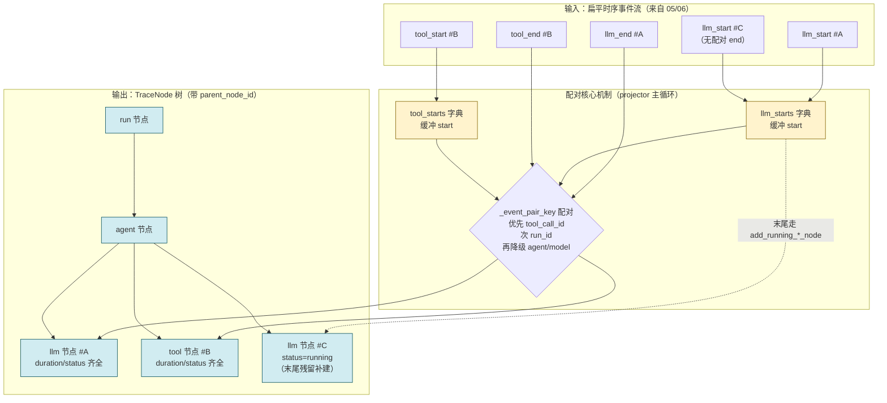
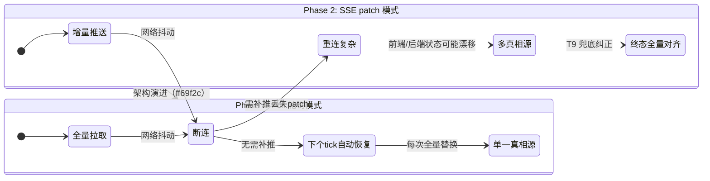
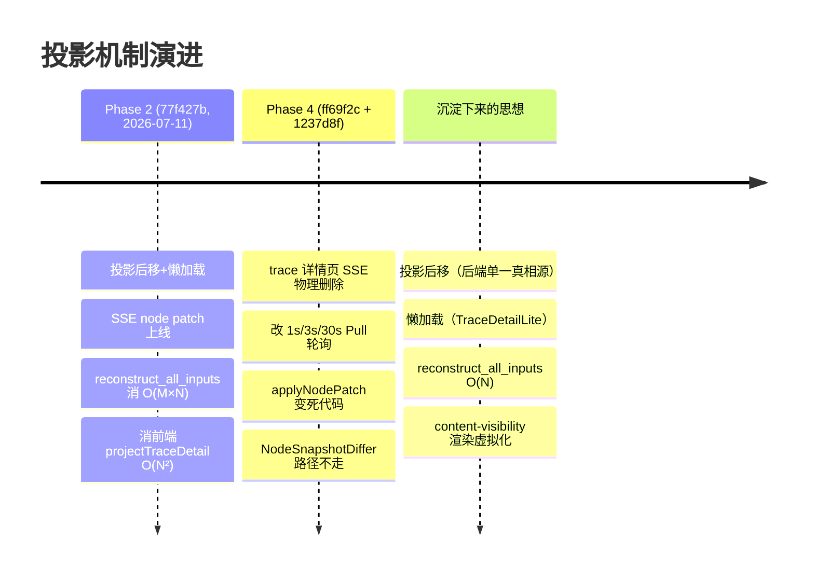

# 07 · 投影与投影 diff（trace 系统 深读·子块 07）

> **层位声明：本文为设计思想层（架构师视角）。** 讲的是投影为什么这么设计、扁平事件流怎么还原成节点树、投影后移消除 O(N²) 的根因、SSE→Pull 的演进校正、优势弊端、可迁移原理。主动剥离环节内部微观实现。诚实铁律：推断标【推测】，看不清如实说"信息不足"。

> **本子块在 trace 系统中的位置**：投影是 trace 面向"人"的消费出口——把机器写的事件流翻译成人能理解的调用链树。上游接摄入（05）/自观测（06）的事件，下游给前端/进化证据。

> **重要演进提示（贯穿全篇）**：本机制经历两轮架构变更：
> - **Phase 2**（commit 77f427b，2026-07-11）：投影后移 + 懒加载 + SSE node patch（NodeSnapshotDiffer 增量推送）。这是 commit message 详述的"金矿"。
> - **Pull 主导重构**（commit ff69f2c + 1237d8f，Phase 4）：trace 详情页 SSE 被物理删除，改 1s/3s/30s 分频轮询 `get_trace_detail`（后端每次全量投影返回 TraceDetailLite）。
>
> **结果**：Phase 2 的"投影后移 + 懒加载"思想沉淀下来了；但"SSE node patch（增量推送）"在 trace 详情页已废弃（前端每次拿全量 nodes 整体替换），`applyNodePatch`/`applyNodeSnapshot` 变成无调用方的死代码，`NodeSnapshotDiffer` 仍在 recorder 但 Pull 模式不走它。本文会逐处诚实标注这个演进。

---

## 全局定位

```
S05(摄入) ──┐
            ├──事件流──▶ ⑦ 投影 (project) ──▶ 节点树 + diff patch ──▶ UI / 进化证据
S06(自观测) ┘                       │
                                    ├─ project(events) → TraceProjection{nodes, context, todos}
                                    ├─ NodeSnapshotDiffer → {appended, updated} patch（Phase 2，详情页已废弃）
                                    └─ TraceDetailLite 懒加载（events/context 按需拉）
```

**一句话本质**：投影（project）= 把**扁平时序事件流**（一条条散落的 `llm_start`/`llm_end`/`tool_start`/`tool_end`）按 **start↔end 配对 + 因果归属**，还原成**树状节点结构**（`run → agent → llm/tool/skill/error`），供人/UI/进化按"调用链"而非"事件流"消费。

---

## 第 1 步：本质锚定

### 1.1 投影做什么（契约层）

投影是一个**纯函数式变换**：

```
project(run: TraceRunSummary, events: list[TraceLogEvent]) → TraceProjection
```

输出 `TraceProjection` 包含三块：

| 字段 | 形态 | 用途 |
|---|---|---|
| `nodes` | 树状（每个 node 带 `parent_node_id`） | 给人看的"调用链目录" |
| `context` | 按事件顺序铺开的"内容片段"（带 `anchor_id`） | LLM 的 input/output 等大块文本，按需定位 |
| `todos` | todo 快照 | 任务清单 |

关键设计：**节点轻、内容重、按需拉**。节点只持 `anchor_id` 引用，真正的 LLM input/output 文本在 `context` 段里。这样树本身很轻可以全量传，重内容等用户打开抽屉才拉。

### 1.2 三个类比，挑一个最贴你脑的

类比是为了让"扁平→树"这个抽象变换在你脑子里立刻有画面。三个角度同一件事：

**类比一：流水账整理成章节目录**。
事件是流水账——"某时刻开始调 LLM…某时刻返回…某时刻开始调 tool…"。投影把它整理成有层级、有归属、有起止的目录树。读目录（节点树）比读流水账（事件流）快得多。

**类比二：散落珍珠串成项链**。
每条事件是一颗珍珠，单独看没意义。投影按 start/end 配对 + agent 归属，把它们串成节点项链——每颗项链节点都是一个"完整动作"。

**类比三：会计对账**。
流水是单笔收支（一笔一笔的事件），投影把单据配平成"一笔完整交易"（一个 start + 一个 end = 一个有 duration 的节点）。配不上的单子挂账为 `running`。

---

## 第 2 步：痛点动机（为什么需要重做投影）

Phase 2（commit 77f427b）不是凭空重构，是被**两个 O(N²) 瓶颈 + 一个一致性债**逼出来的。我们一个一个讲。

### 2.1 瓶颈一：后端 `_reconstruct` 是 O(M×N)

**症状**：重建每个增量 LLM 事件的完整 `input` 时，要遍历该 trace 的**所有事件**回溯 anchor 链。

**为什么会这样**：LLM 的 input 在事件流里是**分块累加**的——先来一条全量起点，后面跟着一堆增量尾部。要还原第 k 个增量事件的完整 input，朴素做法是从头扫到第 k 条，把所有增量拼起来。一条增量事件 O(N)，M 个增量事件就是 O(M×N)。

**结果**：事件越多，每条增量事件重建越慢，整体指数级劣化。

**方案：`reconstruct_all_inputs`**——单次正向遍历维护一个累加器：遇全量起点重置、遇增量事件 extend 并快照。每条事件摊销 O(1)，总计 **O(M×N) → O(N)**。

> 这条单独是个值得深挖的优化，第 7 步 Q4 会再讲一遍"为什么旧法做不到、新法怎么做到"。

### 2.2 瓶颈二：前端 `projectTraceDetail` ~800 行投影

**症状**（commit 标题原话）：**"白屏进不去详情页"**。

**根因**：前端收到每条 SSE 事件后，做**全量 filter + sort + 重投影**整个 nodes 列表。也就是说：每来一条事件，就把已经攒下的所有事件重新投一遍。

**为什么是 O(N²)**：N 条事件 × 每条触发一次 O(N) 重投影 = O(N²)。事件越多，每条新事件触发的重投影越贵。

> 给个具象场景：一次写作生成可能产上千条事件。前端那套投影在第几百条事件时已经卡到界面转不动，用户以为死机了又点一次，结果重复请求——这就是"白屏进不去"的真实体感。

### 2.3 双投影债：三套投影逻辑各投一遍

Phase 2 之前，项目里有**三套投影**：

| 投影位置 | 谁投 | 问题 |
|---|---|---|
| 执行端 projector | executor | 一份代码 |
| 进化摄入端 projector | evolution | 一份几乎相同的代码 |
| 前端 `projectTraceDetail` | 浏览器 | 第三套，还 O(N²) |

**债在哪**：三套投影逻辑要保持一致是巨大维护成本。前端那套还性能爆炸。77f427b 标题直指：**"投影逻辑统一到后端，消除双投影债"**。

### 2.4 核心问题三连击

把三个痛点收口成一句话，Phase 2 要同时解决：

```
① 性能       —— 消除两个 O(N²)（后端 reconstruct、前端重投影）
② 一致性     —— 投影真相源单一化（后端），前端不再自投
③ 传输量     —— 详情接口砍掉 events/context 两大头（可达几十 MB），只返精简 nodes/todos
```

第 ③ 条直接引出下一节的"懒加载"。

---

## 第 3 步：模块协作与契约

### 3.1 宏观图：扁平事件流怎么变成节点树



读图三步：① start 事件先进字典挂着；② end 事件来了按 key 找到对应 start 配对；③ 配对成功建一个有 duration 的节点，配不上的残留 start 末尾补成 `running` 节点。

### 3.2 TraceProjector.project：无状态纯函数式投影

**契约**：

```
TraceProjector.project(run, events) → TraceProjection
```

**核心不变量：无状态**——每次调用都全量重投，不缓存任何中间结果。

> 为什么"无状态"这么重要？它是后面所有路线（投影后移、Pull 每秒重投、终态全量对齐）的前提。如果 projector 有状态，每次查询就不能现投，整套架构不成立。这是"无状态"换"任意时刻可重建"的经典权衡。

**配对核心机制**：维护 `llm_starts` / `tool_starts` 两个 dict 缓冲 start 事件。end 来了用 `_event_pair_key` 配对：

- 优先 `tool_call_id`（最精确）
- 次 `run_id`
- 再降级 `agent/model` 组合（兜底）

配不上的残留 start，末尾走 `add_running_*_node` 标 `running`。在 evolution 端，会按 run 终态进一步改成 `cancelled`/`interrupted`（EDGE-008，详见 3.7 和第 7 步 Q5）。

### 3.3 `_ProjectionState`：投影期累积状态

注意区分两个概念：

| 概念 | 寿命 | 存什么 |
|---|---|---|
| `TraceProjector` 无状态 | 跨调用 | 什么都不存 |
| `_ProjectionState` 投影期状态 | **单次** project 调用内 | agent 去重、task 调用栈、计数器、context 序号 |

`_ProjectionState` 在每次 `project` 调用时新建一份，调用结束就丢。它管这些事：

- **agent 节点去重**：同一个 agent 出现多次不重复建节点。
- **task 调用栈**：处理嵌套委托（主 agent 把活委托给子 agent，子 agent 又委托给更深的子 agent）。
- **agent 实例计数器**：区分同一 subagent 被多次委托的不同实例。
- **context 序号**：给内容片段编号。

**关键不变量（节点 ID 规则）**：

```
Meta-agent        → node_id = agent:{name}              （全局唯一）
Subagent 实例     → node_id = agent:{name}:{counter}    （按 task 调用拆分）
evaluation agent  → 挂到对应 primary subagent 下
```

这条规则保证：同一个 subagent 被委托 3 次，会得到 3 个独立节点（`agent:outline:1`、`agent:outline:2`、`agent:outline:3`），而不是混成一坨。

### 3.4 节点构建器：`add_llm_node` / `add_tool_node` / `add_mechanism_node`

**契约**：吃 `(start: _PendingEvent | None, end: TraceLogEvent)`，产出 1 个 `TraceNode` 追加到 `projection.nodes`，按需往 context 追加内容片段并返回 `anchor_id` 挂节点上。

**为什么必须是 start/end 配对成功才能建节点**——只有配对了才能算出这些关键字段：

| 字段 | 怎么算 |
|---|---|
| `duration_ms` | end 时间 - start 时间 |
| `started_at` | start 的时间戳 |
| `ended_at` | end 的时间戳 |
| `status` | 看是否有 error / 是否被 cancel |

**节点轻、内容重、按需拉**（再次强调）：input/output 分别落 context 段，节点只持 `anchor_id` 引用。这直接支持后面的懒加载——节点树可以先全量传给前端，重内容等抽屉打开才拉。

### 3.5 NodeSnapshotDiffer：Phase 2 增量 diff 引擎

**★ 现状提示**：这是 Phase 2 的 SSE 增量推送核心组件。Pull 主导重构后，trace 详情页前端已无调用 patch 路径，differ 在 recorder 的 `project_and_diff` 仍在，但 Pull 模式走 `get_trace_detail` 全量返回，**不再经 SSE 推 patch**。详见第 7 步 Q1。

**它做什么**：维护单 trace 的 nodes 快照（`node_id → 字段签名`）。每次全量投影后调 `.diff`，产出 `{appended, updated}` patch。

**签名只取易变字段**（不是全字段比对，省成本）：

```
status / duration_ms / ended_at / error / usage tokens / chain_summary
```

**三态**：append（新增）/ update（变更）/ **不支持 delete**。

**复杂度**：单次 O(N)。

### 3.6 `project_and_diff` vs `project_full_nodes`：两条尾巴

两者共享同一条前置管线 `reconstruct_all_inputs → 全量 project`，区别只在**末尾是否 diff**：

| 函数 | 末尾做什么 | 设计意图 | 用在哪 |
|---|---|---|---|
| `project_and_diff` | flush 残余 → project → `differ.diff` 出 patch | 供 SSE 周期推增量（Phase 2 设计为 0.5s 节流） | Phase 2 SSE 路径（详情页已废） |
| `project_full_nodes` | 全量 project，不 diff，返回完整 nodes | 终态发全量 snapshot 强制前端对齐（T9） | Pull 模式主力路径 |

> 设计意图值得记住：**增量是省带宽的常态，全量是兜底的非常态**。Phase 2 期望运行期推 patch 省流量，终态一发全量纠正所有漂移（T9）。Pull 化后变成"每次都全量"——兜底逻辑反而成了常态，但换来了幂等和断线自愈（第 4 步会讲这个权衡）。

### 3.7 投影后移：核心决策

**决策**：后端统一投影。执行端有 projector、evolution 摄入端有 projector（两份几乎相同代码，evolution 多 EDGE-008 取消态处理、`middleware_assembly` 噪音过滤）。**前端不再投影**。

**消除了什么**：前端那套 `projectTraceDetail` ~800 行 O(N²) 投影——最大的债。

**没消除什么**：后端两份 projector 仍在，是"双投影债"的另一半（详见第 6 步 6.6 和第 7 步 Q2）。这是"部分消除，非完全"。

### 3.8 懒加载（TraceDetailLite）：详情接口只返三件套

**接口契约**：

```
GET /traces/{id}           → { run, nodes, todos }     （TraceDetailLite，不含 events/context）
GET /traces/{id}/events    → [...events]               （按需拉，可用 raw_event_ids 批量）
GET /traces/{id}/context?anchor_id=...                  （按需拉，单条内容片段）
```

**动机**（view/traces.py 注释原话精神）：events 和 context 是 trace 最大的两块——上千事件 × 完整 input/output，可达几十 MB。**用户不打开抽屉就不需要这两块**。

**前端怎么知道拉哪些**（第 7 步 Q6 详答）：节点上有 `raw_event_ids`（该节点对应哪些事件）和 `context_anchor_id` / `output_context_anchor_id`（输入/输出内容锚点）。打开抽屉时拿这俩 ID 调上面两个接口。

### 3.9 SSE node patch（Phase 2 设计，trace 详情页已废弃）

**原设计**（Phase 2）：

| 数据源 | 推什么 | 节流 |
|---|---|---|
| evolution 源 | 推 node patch（增量） | 0.5s |
| executor 源 | 推原始 event（前端再投） | 2s |

终态再发全量 snapshot 强制对齐（T9）。

**现状**【据 commit ff69f2c / 1237d8f】：trace 详情页 SSE 已物理删除，改 Pull 轮询。`applyNodePatch` / `applyNodeSnapshot` 在 `lib/trace.ts` 保留但**无调用方**——死代码。

> 为什么 SSE 被砍？commit ff69f2c 给了明确理由——SSE 断连恢复复杂、状态机多真相源；Pull 幂等轮询"断了下个 tick 自动恢复，状态机单一真相源"。这是**运维简洁性 > 极致实时性**的权衡。第 4 步详细对比。

---

## 第 4 步：决策对比

### 4.1 四维决策表

| 维度 | 本项目选择 | 业界替代 | 取舍理由 |
|---|---|---|---|
| **投影位置** | 后端统一投（投影后移） | 前端实时投影（旧方案 O(N²) 已否决）/ GraphQL 按需字段 | 前端那套 O(N²) 是直接痛点；GraphQL 引入 schema/resolver 复杂度，Python 单体 + 本地 SQLite 不划算【推测】 |
| **增量传输** | Phase 2 SSE node patch（diff）→ 现 Pull 全量 nodes | 全量重发（简单费带宽）/ 游标增量拉取（`/events/since`，评估/进化工作台用了） | Pull 幂等、断线自愈、状态机单一真相源；用带宽换运维简洁 |
| **渲染虚拟化** | `content-visibility: auto`（CSS 层零 JS） | JS 虚拟列表（react-window 需手动管滚动）/ 不虚拟化 | CSS 层零 JS 成本，但只解决渲染不解决内存（见 6.4） |
| **真相源** | 后端单一投影真相源 | 前端各自投 | 一致性优先，前端不再持有投影逻辑 |

### 4.2 关键权衡深挖

**为什么选后端统一投而非 GraphQL？**【推测】

Python 单体 + 本地 SQLite 的栈下，GraphQL 要引入 schema 定义、resolver 编写、查询解析一整套复杂度。而后端 projector 已经是成熟实现，搬一份到 evolution 摄入端比搭 GraphQL 栈轻得多。本质是"复杂度收益不匹配"——GraphQL 的灵活性在这个单体场景用不上。

**为什么 Phase 2 选 SSE patch 最终又被 Pull 取代？**

这是本文最重要的一条决策演进。用一张状态对比图说明：



读图：SSE 模式的复杂度集中在"断连后怎么补推丢失的 patch、怎么对齐前后端状态"；Pull 模式直接消除这个问题——每次全量拉、全量替换，断了下个 tick 自然恢复。

**核心权衡一句话**：**用"每秒一次全量投影 + 全量传输"的成本，换"无状态机、幂等、断线自愈"的运维简洁**。ff69f2c 明确选了这边。代价是后端多扛一次投影（见 6.1）。

---

## 第 5 步：理论抽象（可迁移的设计原理）

这四个抽象能帮你把这套机制迁移到别的系统。

### 5.1 物化视图（Materialized View）

**原理**：`nodes` 表就是 `event_payloads` 的物化视图。

```
event_payloads（源，append-only 事实）──投影──▶ nodes（派生，可重建）
```

- `event_payloads` 是真相源（source of truth），只追加不修改。
- `nodes` 是派生产物，可以从源重建。
- 终态批量投影 = 物化视图刷新（refresh）。

**可迁移**：任何"事件溯源 + 读模型"的场景都适用。比如订单系统：订单事件流是源，"订单详情视图"是物化视图，可以随时从事件重算。

### 5.2 写时投影 vs 读时投影

本项目两种都用，对应不同场景：

| 模式 | 什么时候投 | 用在哪 | 例子 |
|---|---|---|---|
| **写时投影** | 终态批量写 nodes 表 | 历史查询 | evolution recorder 的 `_project_and_write_nodes` |
| **读时投影** | 每次查询现投 | 实时观测 | `get_trace_detail` / `project_and_diff` |

**为什么两种都要**：写时投影摊到写阶段，查询时零成本但数据有延迟（终态才落库）；读时投影每次查询都算，但能反映实时状态。本项目用"写时落库供历史，读时现投供实时"组合拳。

### 5.3 增量计算（Incremental Computation）

`reconstruct_all_inputs` 是经典增量计算。

**朴素做法**（O(M×N)）：每个增量事件独立回溯，从头扫到目标。每事件 O(N)，M 个事件 O(M×N)。

**增量做法**（O(N)）：维护累加器，新输入只做 `extend` 而非全量重算。一次正向遍历：遇全量起点重置、遇增量事件 extend 后快照。每事件摊销 O(1)。

**关键洞察**：利用消息链的**单调累加性**——后一条 input = 前一条 input + 增量尾部。把"重复扫描"变成"单遍累积"。

**可迁移**：任何"后一项依赖前一项累加"的计算都能用这个模式。比如运行总和、滚动窗口聚合、增量哈希。

### 5.4 CQRS（命令查询分离）

```
写侧：append_event（追加事件到 event_payloads）    ← 命令
读侧：project（投影成 nodes 树）                    ← 查询
```

读写模型分离。读模型可以有多个版本（调用链视图、统计视图、时间线视图），都从同一份事件流投影出来，互不干扰。

**可迁移**：任何"写入简单、读取需要多种视角"的系统都适合 CQRS。代价是读模型有重建成本，收益是读写各自优化。

---

## 第 6 步：边界与代价

每个设计决策都有代价。诚实列出本机制的限制。

### 6.1 投影后移把负担压到后端

**代价**：每次 `get_trace_detail` 都要 `reconstruct_all_inputs` + 全量 project。

**放大效应**：Pull 模式 1s 轮询 = 每秒一次全量投影。事件上千时单次 O(N) 仍不便宜。

**兜底**【推测】：靠 SQLite 本地访问快 + nodes 规模可控兜底。但这是新的性能压力点——如果 trace 规模继续增长，可能需要再加缓存层或写时投影兜底。

### 6.2 diff 引擎复杂度变成"沉没成本"

**代价**：`NodeSnapshotDiffer` 要维护快照、签名比对、reset 时机。本身有实现复杂度。

**现状**：Phase 2 引入 Pull 化后，这条路径在 trace 详情页已不走——**复杂度付出但收益路径被砍**。

> 这是架构演进的常见现象：上一代的优化机制在新架构里成了冗余。代码上没清干净就是技术债（见第 7 步 Q1）。

### 6.3 终态全量 snapshot 对齐（T9）的必要性消失

**Phase 2 设计**：运行期 patch 可能丢（SSE 断连 / 前端不在线），终态一发全量纠正所有漂移。这是增量推送架构的**标配兜底**。

**Pull 化后**：每次本就全量，兜底自然消失。逻辑上没毛病，但 Phase 2 那套"增量 + 终态兜底"的精巧设计在新架构里不再需要。

### 6.4 `content-visibility` 兜底的局限

`content-visibility: auto` 只解决**渲染虚拟化**（不画屏外节点），不解决：

- ❌ 数据传输（nodes 数组仍全量传）
- ❌ JS 内存（nodes 数组仍全量在内存）

节点极多时仍是瓶颈。它是渲染层的**最后防线**，非根治方案。

### 6.5 不支持 delete

`NodeSnapshotDiffer` 注释明确：**不支持删 node**。

**当前没问题**：投影逻辑不删 nodes（只增）。`{appended, updated}` 两个状态够用。

**未来扩展点**：如果要支持节点合并 / 折叠（比如把多个连续 LLM 调用合并成一个"对话段"节点），需要扩展 delete 语义。

### 6.6 双 projector 漂移风险（"投影后移但没完全统一"）

**遗留债**：执行端 projector 和 evolution 摄入端 projector 是两份代码。已发现的差异：

- **EDGE-008 取消态处理**：evolution 端有，执行端没有（第 7 步 Q5）。
- **`middleware_assembly` 噪音过滤**：evolution 端有。

**风险**：投影规则改动要同步两处。如果只改一处，同一份事件流会投出不一致的节点树——数据正确性问题。

**为什么没合并**【推测】：分层边界——executor 不依赖 evolution。物理合并意味着打破分层。这是"消除双投影债"承诺的**未完成一半**。

---

## 第 7 步：吃透检验（扛追问 Q&A）

### Q1：既然 Pull 化了，NodeSnapshotDiffer 和 applyNodePatch 为什么还在代码里？

**答**：这是**重构未完成的残留**。

Pull 主导重构（ff69f2c / 1237d8f）物理删了 SSE 端点，但两处代码没清：

- `lib/trace.ts` 的 `applyNodePatch` / `applyNodeSnapshot`——前端无调用方（死代码）。
- recorder 的 `project_and_diff` / `NodeSnapshotDiffer`——differ 仍被 recorder 持有（`_differs` dict），但 Pull 模式 `get_trace_detail` 不调它，前端也不调 `applyNodePatch`。

**诚实定性**：死代码 / 待清理。不是"为未来 SSE 复活预留"，就是没清干净。

### Q2：投影后移说"消除双投影债"，可执行端和 evolution 端还是两份 projector，债消了吗？

**答**：消的是**前端那套**（`projectTraceDetail` ~800 行 O(N²)）——最大的债。

后端两份 projector（执行端 / evolution 摄入端）**仍在**，是"双投影债"的另一半。设计承认这两份"几乎相同"，但**物理没合并**。

**为什么没合并**【推测】：分层边界——executor 不依赖 evolution。合并意味着让 executor 引用 evolution 的代码（或反过来），打破分层。

**结论**：投影后移是**部分消除**，不是完全消除。前端那份 O(N²) 没了，后端两份仍在漂移（6.6）。

### Q3：1s 轮询全量投影，事件上千时不比 SSE patch 更卡？

**答**：要分清"卡在哪"。

**后端**：单次 O(N)（reconstruct + project）在本地 SQLite 上千级事件可接受（毫秒级）。后端不卡。

**SSE patch 省的是什么**：
- 网络传输（patch 比全量小）
- 前端重渲染（patch 只动变化的节点，全量要整体 diff）

**Pull 的权衡**：用"后端每秒投一次全量"换"无状态机、幂等、断线自愈"。运维简洁性 > 极致实时性，ff69f2c 明确选了这边。

**结论**：Pull 在后端投影成本上比 SSE 略高（每秒一次全量 vs 按需 diff），但在运维和前端状态管理上简单得多。整体权衡 Pull 胜。

### Q4：reconstruct_all_inputs 的 O(N) 怎么做到？为什么旧 O(M×N) 做不到？

**答**：核心是**利用消息链的单调累加性**。

**旧法 O(M×N)**：对每个增量事件独立回溯——从头扫到目标位置拼 input。每条增量事件 O(N)，M 条 = O(M×N)。

**新法 O(N)**：一次正向遍历，维护累加器：
- 遇全量起点 → 重置累加器
- 遇增量事件 → `extend`（追加尾部）后快照当前累加器作为该事件的完整 input

每条事件摊销 O(1)，总计 O(N)。

**关键洞察**：后一条 input = 前一条 input + 增量尾部（单调累加）。旧法没利用这个性质，每次都从头算；新法利用了，把"重复扫描"变成"单遍累积"。

**可迁移模式**：任何"后一项依赖前一项累加"的计算（运行总和、滚动窗口）都适用。

### Q5：为什么 evolution projector 多 EDGE-008 取消态处理，执行端没有？

**答**【据代码注释】：EDGE-008 是 evolution 端边界——

**场景**：run 已终态（`cancelled` / `interrupted` / `failed`）时，可能残留未配对的 LLM/tool start。

**错误做法**：把这些残留投成 `running` 节点——会**假装还在跑**，与 run 终态矛盾。

**正确做法**（evolution 端）：按 run 终态把残留标成 `cancelled` / `interrupted`，反映"因取消/中断未完成"。

**为什么执行端没这逻辑**【推测】：执行端 trace 在 run 终态时不残留未配对 start（运行期 start/end 配对更完整），或这个边界在执行端不构成问题。

**这正是双 projector 漂移的实例**（6.6）。两份代码处理不同边界，长期看是债。

### Q6：懒加载的 events/context，前端怎么知道拉哪些？

**答**：节点上挂着索引：

| 字段 | 含义 | 怎么用 |
|---|---|---|
| `raw_event_ids` | 该节点对应哪些原始事件 | 打开抽屉 → 调 `/events` 批量拉 |
| `context_anchor_id` | 输入内容锚点 | 调 `/context?anchor_id=...` 单条拉 |
| `output_context_anchor_id` | 输出内容锚点 | 同上 |

**心智模型**：**节点是索引，内容按需拉**。节点树全量在内存（轻），重内容（LLM input/output 文本）等用户真的打开抽屉才请求。

这也呼应 3.4 的设计：**节点轻、内容重、按需拉**——节点只持引用，重内容在 context 段。懒加载是这套设计的自然延伸。

---

## 附录：关键机制速查表

| 机制 | 一句话 | 现状 |
|---|---|---|
| `TraceProjector.project` | 无状态纯函数：扁平事件 → 节点树 | 在用（后端主力） |
| `_event_pair_key` 配对 | start/end 按 tool_call_id → run_id → agent/model 配对 | 在用 |
| `_ProjectionState` | 单次投影期状态（agent 去重、task 栈、计数器） | 在用 |
| `add_running_*_node` | 配不上的残留 start 末尾补 running 节点 | 在用 |
| `reconstruct_all_inputs` | O(N) 批量重建 LLM input（累加器单遍） | 在用（消除后端 O(M×N)） |
| 投影后移 | 后端统一投，前端不再投 | 在用（消前端 O(N²)） |
| 懒加载（TraceDetailLite） | 详情只返 nodes/todos，events/context 按需拉 | 在用 |
| `NodeSnapshotDiffer` | 维护快照、签名比对、产出 patch | recorder 仍在，Pull 模式不走 |
| `project_and_diff` | project + diff 出 patch（SSE 用） | Pull 化后详情页不走 |
| `project_full_nodes` | 全量 project 不 diff（终态/T9） | Pull 模式主力路径 |
| SSE node patch | 增量推 patch（0.5s 节流） | **已废弃**（详情页 SSE 物理删除） |
| `applyNodePatch` / `applyNodeSnapshot` | 前端应用 patch | **死代码**（无调用方） |
| `content-visibility: auto` | CSS 层渲染虚拟化 | 在用（渲染层兜底） |

---

## 附录：演进时间线



读图：Phase 2 的精巧设计（增量推送 + 终态兜底）在 Phase 4 被简化成"每次全量"——精巧换简洁。但"投影后移 + 懒加载 + O(N) 重建"这些核心思想沉淀下来了，是真正改变架构认知的部分。
