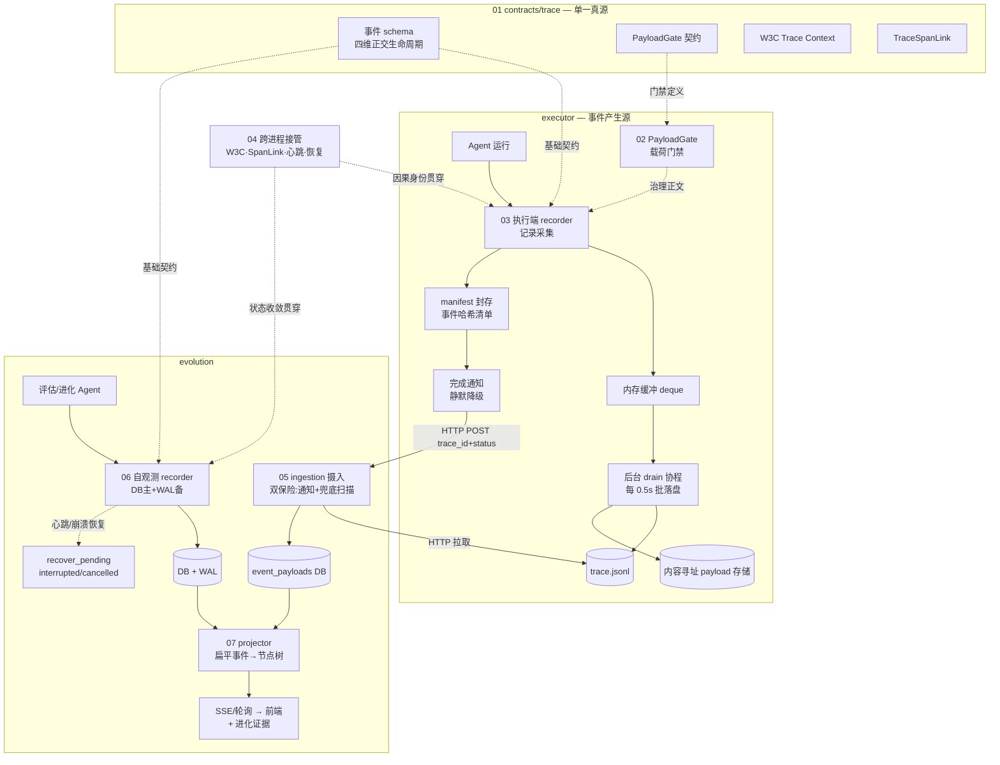
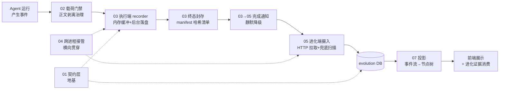

# trace 观测系统 · 深读总文档

> **层位声明：本套深读为设计思想层（架构师视角）。** 讲的是 trace 系统为什么这么设计、宏观怎么运转、各子块怎么协作、契约与不变量是什么、优势与弊端、背后的可迁移原理——读完能回答"换一个项目遇到同类问题，我该往哪个方向想"。
>
> 主动剥离环节内部微观实现（不钻步骤序列、不列字段级数据结构、不贴行号代码）。若需实现层补充（具体步骤、字段、行号定位），可另行要求——这会覆盖本层定位。

---

## 这个机制整体是什么

**trace 观测系统**是一套跨 contracts / executor / evolution 三端的**内容寻址事件日志观测系统**。它用受治理的事件流 + 内容哈希寻址 + W3C 因果上下文，让一条跨进程、跨服务、可崩溃的 Agent 执行链路变得**可记录、可摄入、可投影、可收敛**。

一句话讲清它干什么：**把"一次有界运行到底发生了什么"完整、可信、可追溯地记录下来，让下游（证据编纂、评估、进化）能放心消费。**

### 用一个类比建立全局心智模型

把整个 trace 系统想象成一套**带审计的快递物流体系**：

| 角色 | 物流体系里的对应 | trace 系统里的对应 |
|---|---|---|
| **发货方** | 工厂生产商品 | Agent 运行产生事件 |
| **分拣中心** | 包裹先堆分拣线，班车定时整车发走 | 执行端 recorder 的内存缓冲 + 后台 drain（子块 03） |
| **大件仓库** | 大件货物单独存柜，快递单只写柜号 | 内容寻址载荷存储，事件只持 payload 引用（子块 02） |
| **封箱清单** | 每票货发完盖封存章附清单 | manifest 终态清单 + 事件哈希（子块 01/03） |
| **取件通知** | 发货方给快递公司发短信"货好了来收" | 执行端 notify 进化端（子块 03→05） |
| **揽收点** | 快递公司派车上门取件入自己仓库 | 进化端 ingestion HTTP 拉取摄入（子块 05） |
| **分拣派送** | 把包裹按收件人归类整理 | 投影把扁平事件流整理成节点树（子块 07） |
| **物流单号传递** | 转给下游承运商时新单号能回溯上游单号 | W3C traceparent 续 trace_id + SpanLink 因果链接（子块 04） |
| **内部监控** | 机构自己跑的车队也要记录 | 进化端自观测 recorder（子块 06） |
| **合作合同** | 双方签字的唯一合同文本 | 契约层 schema（子块 01） |

这张表是阅读全套深读的"地图钥匙"——每个子块深入时都可以回到这张表对号入座。

---

## 全局架构图

这是把 7 个子块深挖后回填的完整架构图。**建议先看这张图建立全局，再按导航索引钻进各子块。**

### 数据流主干（一张图看懂事件的一生）

一条事件的完整一生：**产生 → 门禁治理 → 缓冲落盘 → 终态封存 → 通知摄入 → DB 落库 → 投影成树 → 消费**。跨进程时由 04 樯持因果与状态，全程结构由 01 契约定义。

---

## 导航索引（按什么顺序读）

| 编号 | 子块 | 一句话定位 | 建议阅读顺序 |
|---|---|---|---|
| **01** | [契约与数据模型](01_契约与数据模型_深读.md) | 三端共享的事件 schema 与四维正交生命周期契约（全系统地基） | **先读**——建立结构认知 |
| **02** | [内容寻址载荷治理](02_内容寻址载荷治理_深读.md) | 受治理正文不内联事件，哈希寻址、定向剥离推理/拒绝密钥 | 第二——理解"事件该轻、正文该重" |
| **03** | [执行端记录采集](03_执行端记录采集_深读.md) | 事件产生源：内存缓冲 drain 解耦写盘、manifest 封存、通知 | 第三——理解事件怎么产生落盘 |
| **04** | [跨进程接管](04_跨进程接管_深读.md) | W3C 传播、SpanLink 异步因果、心跳、崩溃恢复（横向贯穿） | 第四——理解跨边界不丢链 |
| **05** | [进化端摄入](05_进化端摄入_深读.md) | 从执行端 HTTP 拉取摄入 DB：双保险、解耦、幂等 | 第五——理解数据怎么跨端 |
| **06** | [进化端自观测](06_进化端自观测_深读.md) | 进化端自己跑 Agent 时的自观测：DB主+WAL备、崩溃恢复 | 第六——理解另一个记录源 |
| **07** | [投影与 diff](07_投影与diff_深读.md) | 扁平事件流→节点树、投影后移消除 O(N²)、SSE→Pull 演进 | **最后读**——理解面向人的消费出口 |

**阅读建议**：
- **想建立全局**：先读本 README，再按 01→07 顺序通读。
- **想理解某端**：直接钻对应子块（如只关心执行端看 03，只关心跨进程看 04）。
- **想扛追问**：每块第 7 步"吃透检验"是面试级尖锐问题，通读这些最能检验理解深度。

---

## 统一术语表

阅读各子块时如遇术语疑问，回这里查询。所有子块都遵守这套标准叫法。

| 术语 | 标准叫法 | 一句话定义 | 主要出现在 |
|---|---|---|---|
| **事件** | trace 事件 (TraceLogEvent) | trace 的最小记录单元，一条 jsonl 行 / 一条 DB 记录 | 01 定义, 03/06 产生, 05 摄入, 07 投影 |
| **anchor** | 锚点 (anchor_id) | recorder 为事件分配的稳定 ID，写盘后永久不变，供回溯上下文 | 01 定义, 03 分配, 07 按锚点拉内容 |
| **payload** | 载荷 (TracePayloadRef) | 受治理的业务正文，不内联事件，用内容哈希寻址存储 | 01 定义引用, 02 治理, 03/06 外置 |
| **manifest** | 终态清单 (TraceManifest) | trace 终态时写的事件哈希清单，供 evolution 校验完整性 | 01 定义, 03 写, 05 校验 |
| **span link** | 因果链接 (TraceSpanLink) | 跨 trace 的异步因果关系，不伪造为父子 span | 01 定义, 04 详讲传播 |
| **四维正交生命周期** | 四维生命周期 | 业务状态 / 记录阶段 / 完整性 / 取消时间线 四个独立维度 | 01 详讲, 05/06 消费 |
| **drain** | 后台落盘 (drain) | 把内存缓冲队列的事件成批写盘的后台机制，解耦事件循环 | 03/06 核心 |
| **投影** | 节点投影 (project) | 把扁平事件流按因果/时序还原成树状节点结构供消费 | 07 核心 |
| **W3C Trace Context** | W3C 追踪上下文 | 业界标准的跨服务追踪上下文（traceparent 头） | 04 详讲 |
| **心跳** | 心跳 (heartbeat) | 运行中 trace 周期上报"还活着"，超时即判失联 | 04/06 |
| **interrupted** | 失联中断态 (interrupted) | 无存活 owner 的历史/失联中断态，待用户收敛 | 04/06 |
| **WAL** | 预写日志 (WAL) | write-ahead log，事件先/后写日志文件保底 | 06 |
| **幂等** | 幂等 (idempotent) | 同一 trace 重复摄入结果一致，不重复不冲突 | 05 |
| **PayloadGate** | 载荷门禁 (PayloadGate) | 写入前检查载荷，剥离推理/拒绝密钥 | 02 |
| **内容寻址存储** | 内容寻址存储 (CAS) | 用内容本身的哈希当文件名，内容变则文件名变 | 02 |
| **zombie** | 僵尸 trace | awaiting_input 超时未 resume 的 trace | 03 |

---

## 整体认知概述（把一块块理解升级为整体心智模型）

读完 7 个子块，你应该能建立起这样一套**整体认知**：

### trace 系统解决的核心矛盾

这套系统的所有设计，都在回应一个核心矛盾：**Agent 执行链路是"跨进程、跨服务、可崩溃"的，但下游消费（证据编纂、评估、进化）需要"完整、可信、可追溯"的事实。**

要让一个本会被物理切断的执行过程，变成一条连贯、可信、可追的观测链路——这就是 trace 系统存在的意义。

### 七个子块怎么协作形成整体

把七个子块分成三层来看：

**① 地基层（01 契约 + 02 载荷治理）——定义"是什么"**
- 契约层（01）是双方签字的唯一合同：事件长什么样、生命周期有哪些正交维度、完整性怎么判定、跨 trace 因果怎么表达。所有子块的结构定义都来自这里。
- 载荷治理（02）落地"事件该轻、正文该重"原则：业务正文经门禁治理后用内容哈希寻址存储，事件只持引用。门禁对推理键定向剥离（保全文）、对密钥整包拒绝（fail-closed），是安全与完整的平衡。

**② 记录层（03 执行端 + 06 进化端自观测 + 04 跨进程接管）——产生并落盘事件**
- 执行端 recorder（03）是主产生源：内存缓冲 drain 解耦写盘（不拖垮事件循环）、终态同步 flush 保证完整、manifest 封存给下游可校验凭证。
- 进化端自观测 recorder（06）是与执行端对称的另一个记录源：进化进程内的评估/进化 Agent 不经 executor，需要自己观测自己，落 DB 主+WAL 备，配心跳与崩溃恢复。
- 跨进程接管（04）横向贯穿两端：W3C traceparent 做因果身份接续（续 trace_id 续 span）、TraceSpanLink 表达异步因果（不伪造父子 span）、心跳+interrupted 做运行状态收敛、崩溃恢复处理失联 trace。

**③ 消费层（05 摄入 + 07 投影）——把事件变成可用的东西**
- 摄入（05）是进化端与执行端的唯一数据入口：轻量通知 + HTTP 拉取 + 兜底扫描的双保险，Phase 3 从读文件系统解耦为契约调用，幂等保证重复摄入不冲突。
- 投影（07）是面向"人"的出口：把扁平事件流按 start/end 配对 + 因果归属还原成树状节点结构，投影后移消除 O(N²) 瓶颈，懒加载让详情接口轻量。

### 贯穿全局的设计思想（可迁移的原理家族）

这套系统浓缩了几个可举一反三的工程范式，换一个项目遇到同类问题都能往这些方向想：

1. **单一真源 + 版本化契约**：多写入方跨进程的系统，靠共享契约对齐"什么是真相"，靠 schema_version 平滑演化。（01）
2. **正交状态机**：把混在一起的生命周期拆成独立维度，避免状态爆炸，每个维度可独立单调化。（01）
3. **内容寻址 + 门禁前置**：大块正文用哈希寻址外置，写入前过安全门禁，天然去重/可校验/防篡改。（02）
4. **写盘解耦 + 终态 flush**：生产期异步缓冲（不阻塞主流程），终态同步落盘（保证完整）——把实时性和完整性用不同机制分别满足。（03/06）
5. **推信号 + 拉数据 + 双保险**：通知是轻量推信号，数据是主动拉取；推送求实时，轮询兜底求可靠。（05）
6. **异步因果不伪造父子 + 心跳租约 + 诚实中间态**：跨 trace 用 link 表达因果保护调用树纯洁；心跳判活，超时标 interrupted（诚实未知态）而非 cancelled/failed（撒谎），把判断权交给最知情的人。（04）
7. **物化视图 + 投影后移 + 懒加载**：读模型（节点树）是写模型（事件流）的派生物化视图，投影真相源单一化（后端），重内容按需拉取。（07）

### 这套系统的代价（没有完美机制）

诚实讲，这套设计也付出了代价：
- **契约升级的大爆炸协调成本**：改一个字段两端同步改（01）。
- **drain 周期内崩溃丢最近 0.5s 数据**：trace 是可重建派生数据可接受，但需 manifest 诚实标记（03）。
- **双写的写放大**：进化端 DB+WAL 双写、payload 内容寻址去重需引用计数 GC（02/06）。
- **interrupted 依赖用户手动收敛**：系统不替用户撒谎也不替清理，是运维债（04/06）。
- **投影后移增加后端负担 + 双 projector 漂移债**：Pull 模式每秒全量投影，执行端/进化端两份 projector 没完全统一（07）。

每个代价都是**有意识的 trade-off**，不是缺陷——理解这些代价，才算真正吃透这套系统。

---

## 诚实声明

- 本套深读的所有内容均来自仓库证据（contracts/executor/evolution 三端源码 + git 历史 commit message + 代码注释里的设计反思）。
- 推断处（基于代码事实 + 工程范式理解的推演）在各子块中显式标注 `【推测】`。
- 子块 07 包含一处重要的演进校正：Phase 2 的 SSE node patch 机制在 Pull 主导重构后已废弃（applyNodePatch/NodeSnapshotDiffer 成死代码），文档诚实标注了当前状态而非讲述一个已被自家代码推翻的机制。
- 本套深读为**设计思想层**，不钻环节内部微观实现。若需实现层补充（具体步骤、字段、行号），可另行要求。
