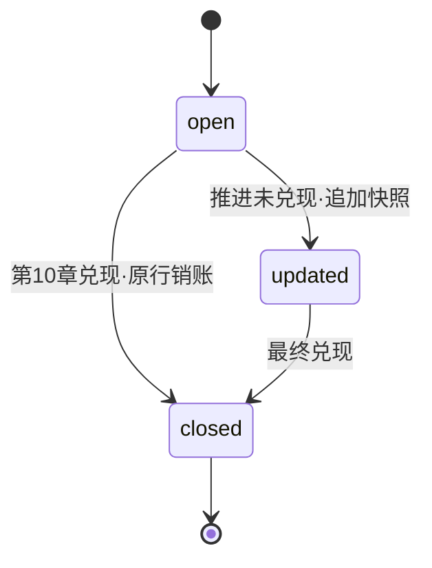

# 记忆系统 01 · 概念与数据模型：记忆的语言

> **两步制说明**：本文按两步深度吃透法组织——第 1 步讲是什么、为什么；第 2 步讲怎么运转。

> **层位**：设计思想层（架构师视角），实现细节已剥离。

> **系列位置**：记忆系统四子块之一。本篇只讲"记忆的语言"：8 类 records 契约与时间语义。写入流程见 02，库表物理结构见 03，检索见 04。

---

## 开篇故事：场记的八种表格

长剧拍到第 40 集。导演（writing 子代理）记性有限：上周谁受了伤、坑填没填，全想不起来。场记（抽取器 extractor）来救场——每集收工，把发生过的事填进表格。

场记的资料室（memory.db）里立着 8 种表格（8 类 records）。每张管一类事：角色卡、场景单、关系簿……

资料室门上钉着铁律。曾有编剧偷翻后面的表格，把大结局剧透进了中段。从此每条记录盖集数戳（因果锚点 source_chapter）。写第 11 集时，后面的表格上锁。

另一条铁律：每条记录旁贴一句场记原话（evidence_span）。没原话的记录算谣言，当场撕。

坑账本（PlotPromise 状态机）要单说：它是 8 种表格里唯一在原条上动笔的。第 3 集"复仇之约"挖坑登记。第 40 集兑现——原条销账，不另贴新条。

其余表格只许贴新条，旧条全留着。开拍前导演来翻卡（registry 视图）：每个名字只看最新一张。第 8 集记下的玉佩位置，到第 50 集仍是答案。


### 映射表

| 文档难点 | 故事元素 | 对应说明 |
|---|---|---|
| 8 类 records | 8 种表格 | 每张表管一类事 ↔ 每类 record 管一类叙事事实 |
| 因果锚点 source_chapter | 集数戳 | 后面的表格上锁 ↔ 读取只放行不晚于当前章的记录 |
| evidence_span | 场记原话 | 没原话当场撕 ↔ 没原文引用的记录不收 |
| PlotPromise 状态机 | 坑账本 | 原条销账不换条 ↔ closed 在原行 UPDATE 回填 |
| 只追加（除坑账本的 7 类） | 只贴新条、旧条全留 | 贴新条不撕旧条 ↔ 永远 INSERT、历史行全在 |
| registry 视图 | 翻卡 | 每名字只看最新一张 ↔ 每实体取最新有效一行 |
| old-but-still-current | 第 8 集玉佩位置 | 到第 50 集仍是答案 ↔ 中途无新记录则旧记录仍有效 |
| memory.db | 资料室 | 一剧一室 ↔ 一作品一库 |
| 抽取器 extractor | 场记 | 收工后填表归档 ↔ 定稿后抽记录入库 |
| writing 子代理 | 导演 | 开拍前翻卡取材 ↔ 写作前查记忆 |

### 映射边界声明

本故事只映射表格语言的时间纪律与读取语义。检索的匹配算法、向量与全文索引，不在对应物里。资料室的物理布局同理。

### 情境自测

1. 若写第 11 集时，翻卡翻到了第 15 集才拍的表格，会出什么事？机制靠哪两道工序挡住它？（指路：第 1 步第二堵墙、第 2 步环节 4）
2. 林晚的位置只有第 3 集一张卡，之后 46 集没更新。第 50 集翻卡显示哪张？换成滚动摘要为什么就丢了？（指路：第 2 步环节 4）

---

## 地基：十个承重词

正文要用的承重词，先在这里立牢。按依赖分层，从基层往上垒。

**第一层（不依赖别人）**

- **executor**：跑写作任务的宿主进程，资料室真正的主人。场记、导演、资料室，全在它的屋檐下。
- **NWM**：Narrative World Model，一篇论文（arXiv:2607.05577）。它是这套记忆语言的学术蓝本。剧组照着行业规范手册定表格。
- **8 类 records**：把一章小说拆成 8 种固定格式的表格行。每行只记一类事。就是故事里的 8 种表格。

**第二层（站在 8 类 records 上）**

- **因果锚点（source_chapter）**：每条记录盖的"抽取自第几章"章号。就是故事里的集数戳——写第 N 章，只许看不晚于 N-1 章的记忆。
- **evidence_span**：每条记录必附的一句正文原文。就是故事里的场记原话——没出处的记录不收。
- **叙事学一等公民字段**：通用图没有的 5 个专用槽位。谁知道什么、坑填没填、视角人物、戏剧拍子。外加事件序对揭露序。如 unknowns 记"林晚还不知道玉佩来历"。
- **三层契约同构**：同一份 8 类契约写三遍。机器校验、存储表、人类可读元信息，各占一遍。三处字段必须对齐。像同一剧本的三份拷贝。

**第三层（时间语义与状态）**

- **有效期切片（valid_at / invalid_at）**：记录"从第几章开始有效、第几章被推翻"的两栏。像合同的生效日与失效日。失效栏当前预留未启用。
- **PlotPromise 状态机**：伏笔专用的三态账本。三态分工——open 挖坑登记、closed 填坑销账、updated 推进追加。就是故事里的坑账本，唯一有生命周期的记录。

**第四层（读取）**

- **registry 视图**：按实体分组读取，每组只取最新一条有效记录。就是故事里的翻卡——每人只看最新一张。

---

## 第 1 步：是什么、为什么

### 本质：一套叙事学的表格语言

十个词合起来，是一件东西：executor 记忆系统的数据模型。executor（跑写作任务的宿主进程）是资料室真正的主人。

它本质上是一套叙事学表格语言。8 类固定格式的表格，立在 4 根公共柱上。

两个"取代"能点破它的性格。用"每实体取最新有效行"取代"修改覆盖"。用章号取代时钟。

主线例子登场：第 3 章定稿，场记抽出两行。一行记林晚的状态，一行记复仇之约的坑。第 2 步全程跟着它走。

### 没有它会怎样

#### 第一堵墙：这次拿掉的是"叙事学专用槽位"

旧语言是通用实体/边图——只会记"A 和 B 有关系"的图。论文拿 64 道叙事学私有问题考它，全部弃答。

更狠的是：标准答案所需的事实，根本不在它翻出的证据里。不是推理错了，是语言里没这格——表征缺失。

失败全集中在谁知道什么、何时揭露、坑填没填。私有多跳题：新语言 0.898，通用图 0.574。

换便宜抽取器重灌，通用图分数不动——差距出在语言。仓库旧版 Graphiti 只活了 3 天就被推倒，部署也重。

#### 第二堵墙：这次拿掉的是"集数戳"

记忆没有章号约束。写第 11 章时，第 30 章定稿后的记忆照样被端上来。

主角第 30 章才黑化的记录漏进来，情节被未来剧透。"只看旧章"只能靠纪律约束——靠不住。

#### 第三堵墙：这次拿掉的是"只追加 + 翻卡"

改成覆盖式更新：新状态一到，旧行就没了。玉佩第 8 章进了袖中，之后 40 章没再提。

写第 50 章想查玉佩——早被覆盖了。论文管这种记录叫 old-but-still-current：翻卡保得住，滚动摘要会漏。

另一面：覆盖让任意时刻的历史状态，永远无法重建。

### 墙表

| 拿掉什么 | 撞上的墙 | 机制回应（第 2 步） |
|---|---|---|
| 叙事学专用槽位 | 64 道叙事学题全弃答，答案根本不在证据里 | 8 类表格 + 一等公民字段（环节 1） |
| 集数戳 | 写第 N 章被后面的记忆剧透 | 章号盖进每行 + 读取双过滤（环节 1、4） |
| 只追加 + 翻卡 | 旧事实被覆盖或挤掉，历史不可重建 | 追加式落库 + registry 视图（环节 3、4） |

### 收拢

三堵墙指向同一件事：给叙事事实一套语言。可查询、可溯源、不剧透——一样都不能少。

一等公民字段管可查询，场记原话管可溯源，集数戳管不剧透。这就是本子块的使命——定义语言，后面三个子块只是用它。

---

## 第 2 步：怎么运转——一条记录的一生

这套语言怎么被用起来？跟着一条记录走一生，四站：填表 → 归档 → 更新 → 翻卡。


### 环节 1：填表——一条记录的语法

第 3 章刚定稿，场记拿到正文，开始填表。

每条记录固定三段式：实体列、语义字段、公共四柱。实体列传"这行记谁"。语义字段传"记了什么事"。

```
第 3 章的 character_state 一行：
  实体列    name = 林晚
  语义字段   status = 受伤   unknowns = [不知玉佩来历]
  公共四柱   source_chapter = 3   evidence_span = "她把玉佩塞进袖中"
```

四柱是 8 类表格共用的表尾：

| 柱 | 语义 | 备注 |
|---|---|---|
| source_chapter | 抽取自第几章 | 集数戳；防剧透的过滤键 |
| valid_at | 从第几章开始有效 | 默认同 source_chapter |
| invalid_at | 第几章被推翻 | 当前恒空——预留 |
| evidence_span | 附带的原文句 | 场记原话；缺了不收 |

8 类表格的实体列各不相同：

| 表格 | 实体列 | 管什么 |
|---|---|---|
| character_state | 角色名 | 角色状态：目标、知道什么、还不知道什么 |
| plot_promise | 伏笔语义 ID | 挖坑与填坑 |
| narrative_function | 场景号 | 视角人物、戏剧拍子、读者知晓 |
| scene | 场景号 | 地点、人物、故事序与揭露序 |
| relationship_state | 角色A | 一段关系的方向与极性 |
| object_state | 物品名 | 物主、位置、状况 |
| world_fact | 设定陈述本身 | 世界规则 |
| chapter_digest | 章号 | 每章必一条的摘要 |

对照表里还藏着通用图没有的槽位。这 5 个，论文称一等公民字段：

| 一等公民字段 | 落在哪张表 |
|---|---|
| 谁知道什么 / 还不知道什么 | character_state 的 knowledge / unknowns |
| 事件序 vs 揭露序 | scene 的两栏序号 |
| 坑填没填 | plot_promise 的 status |
| 视角人物 | narrative_function 的视角栏 |
| 戏剧拍子 | narrative_function 的拍子栏 |

已知边界：机器契约写给 LLM 填，glm 常把无值字段返 null。契约设了防御——文本字段 null 转空串，数字与列表照报错。

**不变量：每条记录必答四件事。记谁、记什么、第几章、原文在哪。缺一，资料室不收。**

### 环节 2：归档——三份拷贝与题材包

表格填好了。归档之前，先看这套契约写在哪里。

同一份 8 类契约，三处各写一遍——像同一剧本的三份拷贝：

| 拷贝 | 写在哪 | 给谁用 | 谁能改 |
|---|---|---|---|
| 机器契约 | pydantic 模型 | 校验 LLM 的抽取输出 | 锁死 |
| 存储契约 | SQLite 表结构 | 资料室的表与分区键 | 锁死 |
| 策略契约 | harness 元信息 | 题材策略、字段描述 | 可进化 |

表中第三份策略契约，就是地基说的"人类可读元信息"。一份东西两个名字。策略契约住在 harness——外层工程仓库，放可进化资产。

分工用意：数据结构锁死，契约才稳。代码里明写着——不改数据结构，那是固定契约。能进化的只有策略。

策略的一页是题材策略：不同戏路配不同表格包。言情不开物品表——没有关键物品的戏，不填那张表。

已知边界：三份拷贝有一处没对齐。world_fact 的章号范围列，机器契约里没这字段——那列永远空着。

**不变量：数据结构只在 executor 一处定义。策略随便改，表不许动。**

### 环节 3：更新——坑账本与只追加

时间快进到第 10 章。《复仇之约》在这一章兑现了。

其余 7 类表格照旧贴新条。唯独坑账本，要在原条上动笔——三态如下：



| 状态 | 意思 | 资料室动作 |
|---|---|---|
| open | 本章新挖坑 | 贴新条 |
| closed | 本章兑现旧坑 | 原条销账：回填兑现章与描述 |
| updated | 推进但未兑现 | 追加一条新快照 |

updated 最绕。前面说坑账本"在原条上动笔"，单指 closed 的销账回填。updated 虽属坑账本，动作仍是贴新条。

贴新条即走追加、不改原条。翻卡取最新，效果上等于"推进"。顺序异常时（兑现先于铺设）降级贴新条，不卡死。

状态机成立有前提：同一个坑，所有章节用同一个 ID。这靠抽取提示词约束——ID 不稳，销账就对不上。

为什么其余 7 类只追加不覆盖？历史全在，任意时刻的状态都能重建。另一层收益【设计推演】：重抽一章只需再贴一批，旧条不丢。

**不变量：坑账本是唯一在原条上动笔的表格。其余 7 类只许追加——"覆盖"由翻卡实现。**

### 环节 4：翻卡——每实体最新有效

第 11 章开写前，导演来资料室翻卡。

翻卡规则一句话：按实体分组，每组只取最新有效的一条。"最新"看章号，"有效"看两道闸。

闸一：章号不晚于当前进度——墙 2 的剧透在这里挡住。闸二：没被作废。

翻卡有个反直觉的好性质。林晚的位置最后记在第 3 章，之后没新记录。到第 50 章翻卡，那条仍是最新有效位置。这就是墙 3 里保住玉佩的性质，论文叫 old-but-still-current。

翻卡一卡一答，但不是每个字段都答得完：

| 字段类 | 例子 | 翻卡够吗 |
|---|---|---|
| 替换语义 | status、location | 够——最新一张就是答案 |
| 累积语义 | knowledge | 不够——第 5 章知道的加第 8 章新知道的，要跨行合并 |

累积的账算在消费方。数据模型只存增量行。

**不变量：翻卡永远取"每实体最新有效一条"。历史行全在，任意时刻状态随时可重建。**

### 收尾复盘

一条记录的一生走完了：第 3 章被抽出、盖章、归档；第 10 章销账或追加；第 11 章前被翻卡取用。

8 类表格、4 根柱、1 本坑账本。合起来是一套不剧透的记忆语言——可查询、可溯源。

语言定了。下一子块讲这套表格怎么被批量造出来、送进资料室。

---

## 篇尾：延伸阅读

| 相邻子块 | 一句话定位 | 与本篇的衔接点 |
|---|---|---|
| 02 写入管道 | 定稿章节到入库的旁路流水线 | 本篇的契约由它执行：谁来填表、怎么批量入库 |
| 03 存储层 | memory.db 的结构与连接管理 | 表格在资料室里的物理形态：表、向量、全文索引 |
| 04 检索回填 | 按查询取记忆、有界注入写作上下文 | 翻卡语义在它那里扩展成四阶段检索与证据袋 |
