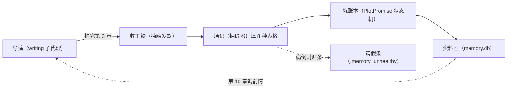
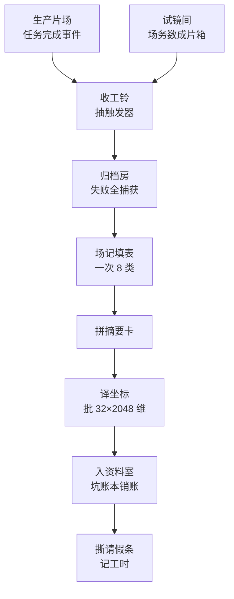

# 记忆系统深读 · 02 写入管道：定稿章节怎么变成记忆

> **两步制**：第 1 步讲是什么、为什么；第 2 步讲怎么运转。已知瑕疵与边界，在第 2 步讲到相关环节时一句话带出。

> **层位**：设计思想层，取架构师视角。不含字段清单与代码级实现细节。

> **系列位置**：记忆系统第 2 篇。前置 01（8 类 records 详解），后接 03（存储层）、04（检索回填）。

> **类比家族**：剧组拍长剧——本篇的侧面是“收工归档”。

## 开篇故事：第 3 章收工之后

剧组开拍百章长剧。导演（writing 子代理）记性有限，前情装不下。没有归档班底，第 10 章他忘了"复仇之约"。那是第 3 章埋的坑，就此烂尾。

剧组在片场外辟一间归档房（后台工作线程），收工后专职归档。拍戏归拍戏，归档归归档。

收工铃（抽触发器）一响，班底开工。铃声两条道都能送到。片场听无线电报信，铃当场就响。

试镜间（A/B 对照实验）听不到无线电。场务便挨个数成片箱（目录扫描），数出新的就摇铃。

第 3 章收工，场记（抽取器）读一遍成片。他只出场一次，就填完整章 8 种表格（8 类 records）。

表格里两笔伏笔账同时落定：“复仇之约”新挖，登记入账；“玉佩秘密”兑现，当场销账。账记在坑账本（PlotPromise 状态机）上。

表格誊成摘要卡（search_text），译成坐标，归进资料室（memory.db）。第 10 章开拍，导演随手调得出前情。

某晚归档房里场记病倒，戏照拍。门上只多一张请假条（.memory_unhealthy）。取档案的人见到条，改用总剧本大纲兜底。下一章归档成功，条被撕掉——自愈不用人管。

### 故事主线定格图



### 故事映射表

| 文档难点 | 故事元素 | 对应说明（一句话） |
|---|---|---|
| 导演上下文有限 | 导演记性有限 | 脑子装不下百章前情 ↔ 上下文窗口装不下全书正文 |
| 旁路流水线 | 片场外的归档房 | 房在片场外、病倒不叫停 ↔ 管道挂创作主链路外，失败不外溢 |
| 收工铃统一双路径 | 收工铃 + 无线电/数成片箱 | 同一只铃、两条报信道 ↔ 同一入口函数，生产事件与试镜间扫描两路触发 |
| 场记单次多输出 | 场记只出场一次 | 一次填完整章 8 种表格 ↔ 单次 LLM 调用抽全 8 类 records |
| 坑账本状态机 | 坑账本两笔账 | 挖坑登记、兑现销账，同坑同页 ↔ open 登记新行，closed 更新同一伏笔行 |
| 摘要卡与入库 | 誊卡、译坐标、归资料室 | 表格誊卡归柜 ↔ search_text 拼接、向量化、写入 memory.db |
| 请假条降级 | 门上的请假条 | 贴条照拍、见条换大纲 ↔ 写 .memory_unhealthy，检索降级兜底 |
| 检索兜底蓝图 | 总剧本大纲 | 见条改用老剧本 ↔ ContextAssembler 静态蓝图兜底（04 子块） |

### 映射边界声明

本故事只映射"收工归档"里各角色与写入管道各环节的关系。归档房不是真房间，誊卡也不是纸面抄写。名下细节以正文为准。

### 情境自测

1. 若第 3 章归档时场记病倒，第 4 章开拍会受什么影响？（指路：第 2 步环节二与环节七的降级表；病倒＝模型调用失败）
2. “复仇之约”第 3 章挖、第 9 章才兑现。坑账本上这两笔各怎么落？（指路：第 2 步环节六）

## 地基：先把几个名词立住

第 2 步的叙述踩在这些名词上。它们分三层：下层不依赖谁，上层踩着下层。

**第一层**：

- **8 种表格（8 类 records）**：记忆的统一格式。覆盖角色、关系、伏笔、场景等八类。就是故事里场记一次填完的那八张（字段详见 01 篇）。
- **摘要卡（search_text）**：把一条记录的关键字段，拼成一句自然语言。检索就靠它。就是故事里誊出来的那张卡。
- **坑账本（PlotPromise 状态机）**：伏笔的生命周期账。挖坑登记（open）、填坑销账（closed）、推进记一笔（updated）。就是记"复仇之约"的账本。
- **旁路流水线**：写入管道挂在创作主链路之外，失败绝不打断写作。就是"归档房在片场外、着火不烧片场"。

**第二层**：

- **收工铃（抽触发器）**：章节抽取入库的统一入口，谁触发都摇它。就是故事里一响班底开工的铃。
- **请假条（.memory_unhealthy）**：归档失败后留下的标记文件。检索侧见条即降级。就是归档房门上那张条。
- **场记单次多输出**：一次 LLM 调用同时抽出整章全部 8 种表格。就是"场记只出场一次"。

**第三层**：

- **双路径触发**：生产走任务完成事件，试镜间走目录扫描。殊途同归，都到收工铃。就是"无线电与数成片箱"。
- **甩线程收口**：把同步管道甩进线程池执行，异常全捕获、不外溢。就是"归档房独立房间、只递条出来"。
- **坐标翻译官（嵌入器）**：把摘要卡批量译成 2048 维向量坐标。每批最多 32 条，译完逐条验尺寸。就是故事里“译成坐标”那道工序。
- **进化系统**：跑 A/B 试镜间实验来迭代配置的机制。哪套配置更好，实验说了算。后文的“进化端”，指的就是它。
- **trace**：贯穿流程的执行记录流。每步干了什么、结果如何，都记一笔。环节七的“记工时”，记的就是它。

## 第 1 步：是什么、为什么

### 一句话点破

写入管道，本质上是剧组的收工归档班底。

导演每拍完一章，班底把这章正文填成 8 种表格。表格逐条归进资料室，成为可检索的记忆。

全程挂在拍摄之外：归档出事只留请假条，绝不叫停片场。

> **主线例子**：某剧第 3 章定稿落盘。本章埋下"复仇之约"、兑现"玉佩秘密"——两笔账都归这条管道。

### 没有它会撞上的三堵墙

#### 第一堵：拿掉“旁路保障”——记忆故障等于创作停摆

这不是假设，是旧世界的实录。旧系统架在外部服务上，三处依赖坑真实炸过。

哪三处？抽取协议不兼容，一抽就全报错；备用模型认死别家；外部库连不上，写作当场中断。作者写到一半卡死——重构决策明言推翻这种硬中断。

#### 第二堵：拿掉“统一收工铃”——两条路径各自为政

只剩两个下场。试镜间若复用生产线，生产副作用会跟着进来。结算规则、推流帧格式，样样都是污染。

另一条路：自己另写一套触发，又和生产重复维护。更糟的是干脆不接写入：实验里永远没有记忆事件。进化系统对记忆要素盲飞——测都没测，谈何进化。

#### 第三堵：拿掉“归档班底”——连续性全靠导演硬扛

导演的上下文窗口有限，装不下几十万字。第 3 章埋的坑，到第 10 章早被挤出记忆。伏笔烂尾、设定打架，观众只好弃剧。

### 墙与回应

| 拿掉的墙 | 机制怎么回应（方向） |
|---|---|
| 记忆故障 = 创作中断 | 旁路流水线 + 全捕获收口：失败只写请假条，不上抛（环节二） |
| 双路径触发分叉、进化盲飞 | 收工铃统一入口：生产与试镜间复用同一抽取逻辑（环节一） |
| 长剧连续性丢失 | 场记逐章填 8 种表格 + 坑账本管伏笔一生（环节三、六） |

### 收拢

三堵墙指向同一件事：长剧需要逐章累积的结构化记忆。这道工序又只配当旁路——帮片场记事，不给片场添乱。记忆要全，片场要稳：这就是写入管道的核心使命。

## 第 2 步：怎么运转——第 3 章的一次完整归档

### 全景

还是第 3 章那一晚。输入是一份定稿正文，去向是资料室里的记录行。全程四段：摇铃、进归档房、四道工序、收尾。先看全景，再逐环节走。



### 环节一：摇铃——定稿信号怎么到收工铃

归档的第一步不是动手，而是知道"该归档了"。这一步，生产与试镜间听信号的方式完全不同。先看对照。

| 维度 | 生产片场 | 试镜间 |
|---|---|---|
| 听什么信号 | SSE 事件流（服务端持续下推的消息）里的任务完成事件 | 听不到事件——跑的是裸流，没有事件可听 |
| 章节号哪来 | 从任务描述正则提取；失败按导演出场序推断 | 文件名自带章号 |
| 怎么发现新章 | 事件推着走 | 每个拍摄节点后扫一遍章节目录（数成片箱） |
| 怎么摇铃 | 甩进线程池调用收工铃 | 节点边界同步直调收工铃 |
| 怎么防重抽 | 事件天然一次 | 差集幂等：抽过的章不再报 |

生产侧一句话：导演的任务一结束，片场监听器当场摇铃。章节号从任务描述里认；认不出，按导演第几次出场推断。

试镜间侧一句话：场务每个节点后来数一遍成片箱。目录里谁落了盘、还没归档，就报谁；报出来的章，当场摇铃。

笨办法附带一个好处：铃摇在节点边界，正好当取消检查点。中途叫停时，完成的章已入库、未完的不触发。

**收底：两条路径摇的是同一只铃——一套抽取逻辑，永不分叉。**

### 环节二：进归档房——甩线程与全捕获

铃响了，活在哪干？归档房——片场外的独立房间。

生产片场把铃甩进线程池：主线不被占住，别的连接照常服务。当前这条流会等归档完再走。章节已定稿，等这一下无妨【基于设计理解推演】。

试镜间不甩线程，在节点边界原地摇铃。两条路进的是同一间房：房内另起一个事件循环跑管道。

房门上的规矩只有一条：全捕获。抽取失败、入库失败，一律转成一张请假条加一条日志。异常绝不外溢到片场。

请假条贴在作品目录门口。谁来看？下一次检索——见条就退回总剧本大纲兜底（04 子块的故事）。

```
归档房（收口）: 管道任意一步失败 → [保证: 转请假条 + 日志, 永不上抛] → 调用方拿到空统计
```

**收底：管道任何一步失败，片场只会看到一张请假条；推流永不断。**

### 环节三：场记填表——一次调用抽全 8 类

进了归档房，第一件事读正文。第 3 章文件在、非空，场记才开工。文件缺失或场记未配置，都静默跳过。没素材、没启用，都不算病。

场记只出场一次：单次 LLM 调用，一口气填完整章 8 种表格。八次独立调用又贵又慢，一次看全抽得更准【基于设计理解推演】。另用独立配置的抽取模型，非思考模式、低随机性。

阅卷也要降级：这些模型不支持严格 schema 阅卷。场记改用答题卡——锁死 JSON 输出，附上字段说明和示例骨架。填表指南挂在进化端，可被新版覆盖。

> **小例·第 3 章抽出的伏笔**

```json
{
  "promise_id": "复仇之约",
  "status": "open",
  "setup_chapter_hint": 3,
  "promised_payoff": "林晚与赵默的十年之约",
  "evidence_span": "「这笔账，我记下了。」"
}
```

已知踩坑：模型爱把"无值"字段返成 null，曾让整章作废。修复后前置容错，字符串 null 转空串——空栏画斜杠。

已知瑕疵：写入侧指南取生产缓存包，读取侧却取候选包。生产缓存包是已生效的版本，候选包是实验里的新版。于是实验测不到新版抽取指南。

调用失败、JSON 不合法、校验不过，统一抛同一个异常。上层转请假条。**收底：场记的产出要么是整章 8 种表格，要么是一个异常；每条还带场记原话，可回溯正文。**

### 环节四：拼摘要卡

8 种表格到手，共十几条记录。入库前要先抄一遍——抄成摘要卡。

抄法按类型套模板：把关键字段拼成一句自然语言。角色表不抄 JSON，抄成"角色林晚，目标复仇，知道玉佩秘密"。

为什么要多这一道？JSON 的花括号与引号是结构噪音，直接嵌入会污染向量。自然语言一句话，语义匹配反而更准（决策：语义拼接）。

同一道工序里，表格被展平成待写条目。类型、实体、字段、摘要卡、原话，一一就位。8 类各一套模板，没见过的类型走兜底拼法。

> character_state → "角色林晚，目标复仇，知道玉佩秘密、赵默罪行。状态：潜逃"
> plot_promise → "伏笔复仇之约：主线伏笔，状态 open。林晚与赵默的十年之约"

已知预留：拼卡方法与启用哪几类表格，接口都留了自定义参数。但至今无人传入——题材驱动还停在图纸。

**收底：每条记录必配一张摘要卡。全文、向量两路检索，起点都是它。**

### 环节五：译坐标

一叠摘要卡备好，接下来译坐标。这活归坐标翻译官。

翻译官批量接活：每批最多 32 张，译成 2048 维向量。维度显式指定，不赌供应商默认。每条译完当场验尺寸。

为什么较真到每条验尺寸？向量要填进资料室的固定格式。默认值一漂移，整库错位。

超长另有防御：单条截断在 8000 字符。摘要卡远短于此，截断只是保险。

```
坐标翻译官: 摘要卡列表 → [批 32 · 显式 2048 维 · 逐条验尺寸 · 超 8000 字截断] → 向量列表（缺席则全空）
```

已知降级：翻译官缺席或失手，本批向量整批置空，记录照常入库。代价只是少一路向量召回，全文检索照旧。

**收底：向量要么 2048 维整批入，要么整批为空——绝不带病入库。**

### 环节六：入资料室——坑账本销账

卡片与坐标齐了，最后入柜。普通 7 类表格直接上架：每条追加一行，只增不改。

第 8 类坑账本例外——伏笔有生命周期。挖坑和填坑，必须落到同一笔账上。

| 场记报的状态 | 落库动作 | 账本语义 |
|---|---|---|
| open（本章新挖） | 登记新行 | 挖坑记账，记下铺设章 |
| closed（本章兑现） | 销账：更新已有 open 行 | 填坑，写明兑现章与兑现方式 |
| updated（推进未了） | 追加一行快照 | 推进记一笔，旧账不动 |
| closed 但查无 open 行 | 降级登记新行，并警告 | 兑现先于铺设，顺序异常 |

第 3 章的两笔正好各走一路。"复仇之约"报 open，登记新行；"玉佩秘密"报 closed，给第 1 章那行销账。

【推测】updated 快照行不会被销账触及——销账只认 open 行。

柜里怎么建索引，属 03 存储层——本文讲到归档原语为止。**收底：销账只改 open 行，其余只追加；除受控销账外，账目永不涂改。**

### 环节七：收尾——撕条与记工时

全部条目落柜，归档只剩两件小事。都不起眼，但都有来历。

第一件，撕请假条：本章成功，此前的病就算好了。下一章检索自动回正轨——自愈不用人管。

第二件，记工时：往 trace 写一条入库统计。哪章入库几条、耗时多少、成败与否，进化复盘全靠这条。

已知踩坑：统计设施建好后长期没接线，回调从没传进来。进化端只见"记忆缺席"误报，查无实据。

试镜间另有收尾：每次实验用临时资料室，run 终态即清理。实验的账，最终只记在 trace 里。

| 情形 | 管道行为 | 片场感受 |
|---|---|---|
| 场记未配置 | 静默跳过，不写条 | 记忆功能关闭，无感 |
| 翻译官缺席或失手 | 向量整批置空，照常入库 | 少一路向量召回，全文照旧 |
| 抽取或入库失败 | 写请假条，返回空统计 | 下次检索退回大纲兜底 |
| 本章归档成功 | 撕掉旧请假条 | 自动痊愈 |

**收底：收尾自身出错（如埋点失败）也不拦入库。成败与否，trace 都留痕。**

### 复盘

复盘这一晚：摇铃、进房、填表、抄卡、译坐标、入柜、撕条。一份定稿正文，变成带坐标、带原话的结构化记忆。哪怕中途病倒，也只留一张请假条——第 4 章照常开拍。

## 延伸阅读

| 相邻篇 | 一句话定位 | 与本文的衔接点 |
|---|---|---|
| 01 概念与数据模型 | 8 类表格的字段与时间语义 | 本文说"场记填 8 种表格"，表格长什么样看 01 |
| 03 存储层 | 资料室 memory.db 的结构与连接管理 | 本文止于归档原语调用，柜内构造看 03 |
| 04 检索回填 | 四阶段检索与证据包注入 | 请假条的下半生——见条降级、大纲兜底，在 04 |
