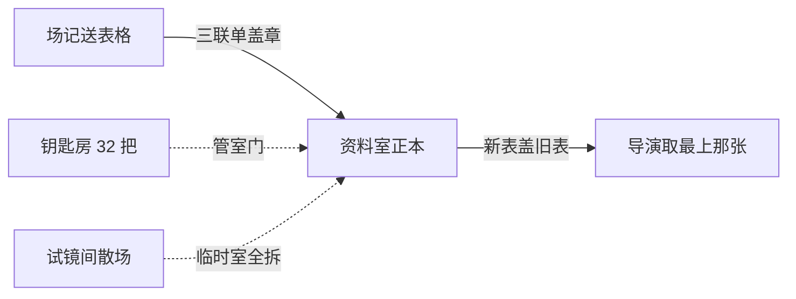
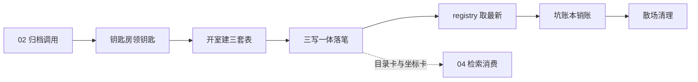

# 记忆系统 · 03 存储层：一个作品，一个 SQLite 文件

> **两步制**：本篇按两步深度吃透法写成。第 1 步讲「是什么、为什么」，第 2 步讲「怎么运转」。

> **层位**：设计思想层（架构师视角），剥离实现细节；使用视角微例 ≤5 行。

> **边界**：讲 memory.db 的结构与连接管理。不讲记录怎么产生（01/02 篇）、检索逻辑（04 篇）。输入 = 02 的归档调用，输出 = 可检索库（04 消费）。

---

## 开篇故事：一剧一室的片库

片库有条铁规矩：一部剧，一间资料室（memory.db）。室里只收这一剧的 8 种表格。

收工铃响，场记（抽取器）抱着第 3 章的表格冲进来。保管员不收散页，只认三联单（三写一体）。垫上复写纸，一次盖章。

三联是正本、目录卡（FTS5）、坐标卡。保管员有条死规矩：少一联，整单作废。

转天导演（writing 子代理）来问：到第 3 章为止，林晚人在哪儿？保管员抽出林晚的档案夹（registry 视图），只递最上面那张。

为什么是最上面那张？新表永远盖在旧表上面。翻第 3 章的账，绝不会带出第 5 章的事。

片库门口守着钥匙房（MemoryStorePool），全楼统共 32 把钥匙。要进资料室，先领钥匙；最久没人用的那把，先被收回。

隔壁试镜间（A/B 实验）每场临时搭一间小资料室。归档照走三联单。散场铃一响，成也罢败也罢，连室带三联全拆。片库里的正片资料室，一根毫毛不少。



| 文档难点 | 故事元素 | 对应说明 |
|---|---|---|
| memory.db 一作品一库 | 资料室 | 一剧一室、只收本剧表格 ↔ 一作品一文件、库内无他家记录 |
| 三写一体（主干） | 三联单 | 一次盖章、少一联整单作废 ↔ 单事务三处同写、异常整体回滚 |
| ├ FTS5 目录卡 | 三联之目录卡联 | 复写出的第二联供翻查 ↔ 词汇检索索引（复合映射：三联的组成联） |
| ├ sqlite-vec 向量表 | 三联之坐标卡联 | 复写出的第三联按语义归档 ↔ 向量近邻检索（复合映射） |
| registry 视图 | 档案夹取最上那张 | 新表盖旧表、只递最上面 ↔ 按章号倒序、每实体取第一名 |
| MemoryStorePool | 钥匙房 | 全楼 32 把、久用先收 ↔ LRU max=32、驱逐最久未用 |
| A/B 临时库生命周期 | 试镜间 | 散场必拆、正片无损 ↔ run 终态清理三件套、命名隔离 |
| 抽取器（02 篇） | 场记 | 抱表格来归档的人 ↔ 归档调用的发起方 |
| writing 子代理（04 消费侧） | 导演 | 开拍前来查档 ↔ 写新章前取记忆 |
| 8 类 records | 8 种表格 | 一表一种叙事要素 ↔ 一类记录一张宽表 |
| 抽触发器（02 篇） | 收工铃 | 铃响才归档 ↔ 章节收工触发抽取 |

**映射边界声明**：本故事只映射归档与查档的角色协作。资料室的锁具、房间布局等细节不对应任何机制；「复写纸」也不暗示库内的具体写入顺序。

**情境自测**（答案可从故事 + 映射表 + 正文推出）：

1. 如果盖章盖到第二联印泥没了（写入中途失败），室里会留下什么？（指路：第 2 步第三站）
2. 如果全楼同时有 33 部剧要开室，第 33 部会怎样？它的表格会丢吗？（指路：第 2 步第一站）

---

## 先认识几个词（分层地基）

**第一层：基层概念，谁也不依赖。**

- **memory.db**：一作品一个独立 SQLite 文件，库即文件、文件即作品。就是故事里的资料室，一剧一室。
- **8 类 records**：8 张强类型宽表，一表管一种叙事要素（01/02 篇详解）。像 8 种格式各异的表格，各填各的栏。
- **FTS5 目录卡**：SQLite 的全文索引扩展，按词找记录。像资料室里的总目录卡柜，全室共用。
- **sqlite-vec 向量表**：SQLite 的向量扩展，按语义相近找记录。像按语义坐标归档的卡片。

**第二层：有了资料室和卡片。接着讲怎么写、怎么算有效期、怎么管钥匙。**

- **三写一体**：一条记录同写主表、FTS、向量，包在同一个事务里。像三联单一次复写，要么全成要么全撤。
- **有效期切片**：每条记录带 valid_at / invalid_at 两个章号戳，支撑「第 N 章时世界什么样」。像表格标注「自第几集起有效」。
- **MemoryStorePool**：进程级单例 LRU 池（最久未用的先收回），最多同时开 32 个库连接。就是故事里的钥匙房。

**第三层：最后三个词，管「查」「并发」与「散场」。**

- **registry 视图**：用 SQL 窗口函数取「每个实体最新一条」。它是运行时查询，不是库里的对象。像档案夹只抽最上面那张表。
- **双锁互斥**：线程锁把门，事件锁排队，防两边同改池字典。像钥匙房两道门：外道排队、内道上闩。
- **A/B 临时库**：进化试镜用的临时 memory.db，run 终态必删。像试镜间，散场连室全拆。

---

## 第 1 步：是什么、为什么

存储层是一座片库：一作品一个 SQLite 文件，库即文件，文件即作品。8 张强类型宽表是骨架，FTS5 与向量索引是两翼，窗口函数是时间刀。一剧一室，室室自带全套档案，互不串味。

它的前身是 Graphiti 加 FalkorDB 图数据库：要独立 docker 服务，部署重。又是泛型实体边模型，缺叙事类型。查「林晚第 3 章的目标」要图遍历，再应用层拼装。宽表一条 SQL 就够。

本篇跟一部《林晚复仇记》走完全程。第 3 章落库，第 4 章前取旧账。第 10 章销账，最后看试镜间散场。

---

## 第 2 步：怎么运转——一部作品从开室到散场



这一趟运转从 02 的归档调用出发。先向钥匙房领钥匙，再开室建表，然后一条记录三处落笔。写新章前用 registry 视图取旧状态，伏笔兑现时销账，散场时还钥匙拆库。全程六站。

### 第一站｜进资料室：一作品一库，钥匙归钥匙房

第一站先回答：这部作品的资料室在哪，钥匙归谁管。

钥匙房 MemoryStorePool 是进程级单例，管多作品并发开库。每个作品领到一个 MemoryStore——一个库的访问封装。隔离不靠查询条件，靠文件名：一个 workspace 一个 db 文件。

领钥匙是惰性的：池里没有就新建。此刻并不连接，首次真正操作才连——注释写明，避免持锁过久。池上限 32 把。超了就收回最久没用的那把，关它的连接；库文件原封不动。

为什么家当全押一个单文件库？三重理由都有落点。

| 选型理由 | 落到实处 |
|---|---|
| 零部署零网络 | 进程内嵌，与元数据库同栈；无 docker、无网络往返 |
| 隔离即文件 | 删作品 = 关连接删三件套；备份迁移 = 拷一个文件 |
| 不放进 workspace | workspace 可能是远程文件系统；库统一放本地 data 目录 |

**不变量：一作品至多一个活跃 store；超过 32 个，最久未用的先回收——只收钥匙，不动资料室。**

### 第二站｜开室：三种物理表，一次建齐

钥匙到手，资料室还空着。首次进门动工，先把表建齐。

首次连库，这一环保证三件事：WAL 已开、sqlite-vec 已加载、全套表已建。WAL（日志预写模式）让检索读不挡抽取写。库里住着三种物理表，分工如下。

| 物理角色 | 数量 | 管什么 |
|---|---|---|
| 宽表正本 | 8 张 | 一类记录一张，强类型栏位 |
| 目录卡（records_fts） | 1 张 | 全类型共用，词汇检索 |
| 向量表 | 8 张 | 一类一张，语义近邻检索 |

扩展从哪来？进程启动最早处，标准库 sqlite3 已被 pysqlite3 顶替——原版装不了扩展。

驱动为什么用同步版？SQLite 驱动分同步、异步两版，异步版加载不了向量扩展。所以特意用同步版。扩展加载必须同步调，记忆操作又全在后台线程。

建表 DDL 里藏着一处设计演进：设计稿本有 workspace_id 列，实现删了。文件名已是隔离键，行内再放一列就是重复记账。收益：每条查询少一个恒等过滤，索引更瘦。

| 维度 | 设计稿 | 实现 |
|---|---|---|
| 共享时序列 | 含 workspace_id TEXT NOT NULL | 无此列 |
| FTS 表 | 带 workspace_id UNINDEXED | 不带 |
| 分区键 | PARTITION BY workspace_id, name | 只按实体列 |
| 删作品 / 迁移 | 行级过滤、逐行删 | 删 / 拷整个文件 |

已知边界：语义字段一律存 TEXT，list/dict 转 JSON。设计稿的 event_order 本是 INTEGER。实现省了类型分支，代价是数值字段不能直接排序运算。

**不变量：DDL 全带 IF NOT EXISTS，建表重跑无害；库内永不出现 workspace_id 列。**

### 第三站｜三写一体：一次事务，三处落笔

资料室备好，场记抱来第一张表格。内容是《林晚复仇记》第 3 章，林晚的角色状态。

store_record 管落笔：一条记录同时进三个地方。正本进宽表，摘要进目录卡，向量进坐标表。写一次，三路检索同源。像三联单一次复写：三联要么同盖一个章，要么一张不留。

```
store_record("character_state", "林晚",
  fields={"goal": "查清父亲死因"},
  source_chapter=3, search_text="林晚 目标 …",
  embedding=[…])
→ record_id = 17   # 三处同写完成
```

三个 INSERT 包在同一个 BEGIN/COMMIT 里。任何一步失败，整体回滚。向量这一联可选：embedding 缺席就跳过，检索降级为纯词汇。进门先验栏位：清单外的字段名滤掉并告警，防抽取器夹带私货。

**不变量：三联原子——主表、目录卡、向量表同进退。「两缺一」指写入中途失败的残缺，库里不会有；向量这一联设计上可缺席，缺席即无此联，不算残缺。**

### 第四站｜取最新：registry 视图按章切旧账

第 3 章落了库。第 4 章动笔前，写作端来问旧账：截至第 3 章，林晚什么样？

get_current_state 管取旧账：按章号切世界快照，返回每个实体最新那一条。像查档案夹只抽最上面那张表。

实现落在 SQL 窗口函数上。按实体分区、按章号倒序，取第一名；cutoff（截至章号）传值两次，一次卡章号上限、一次卡失效线。

它叫「视图」，却不是库里的 CREATE VIEW。设计稿草案正是视图，其注释「运行时填 cutoff」自曝矛盾。

矛盾在哪？视图是静态 schema 对象，cutoff 每章都变，填不进去。SQLite 也没有参数化视图【基于设计理解推演，无直接 git 证据】。实现改成了参数化方法。

| 维度 | CREATE VIEW 草案（设计稿） | get_current_state（实现） |
|---|---|---|
| cutoff | 烧死在定义里，注释自曝「运行时填」 | 绑定参数，每次调用现传 |
| 章号变化 | 换章就得换视图【推演】 | 同一方法任意 cutoff |
| 实体列 | 写死 name | 按记录类型动态选 |
| 物理形态 | 库内 schema 对象 | 每次执行的运行时查询 |

已知边界：

- invalid_at 全库恒 NULL——没有任何 UPDATE 会填它。「取代」实际由章号倒序兜住；valid_at 只写不读，双时序目前是半接线。
- relationship_state 的分区键只取 char_a。真对它取最新，旧关系会被第一名挤掉。当前无人这么调，属潜伏瑕疵。

**不变量：任何时刻返回的，都是 cutoff 前每实体最新一条——旧世界绝不见新章。**

### 第五站｜坑账本销账：只改一行，不动三联

旧账取到，第 4 章顺利开写。快进到第 10 章：一条伏笔要兑现。

update_plot_promise_status 管销账：不添新行，只改同一行。状态从 open 改 closed，顺手填兑现章号与描述。伏笔的 open/closed 是一等状态字段，销账就是改这一行。WHERE 里带着 status='open'：已销的账，不会二次销。

```
update_plot_promise_status(
  promise_id="P-玉佩", status="closed",
  payoff_chapter=10)
→ True（命中 open 行）；再调 → False（防二销）
```

销账只动了主表这一联——不是省事，是漏改。已知边界：目录卡与向量表仍留着 open 时的旧快照。已兑现的伏笔走检索路还是旧面貌；主路不受影响。

**不变量：一条伏笔至多销一次账——第二脚必然踩空。**

### 第六站｜还钥匙与拆试镜间：库的生死

归档、查档、销账都齐了。最后看两个收尾：删作品，和试镜散场。

删作品走 drop：关连接、池里除名、删 db/-wal/-shm 三个文件。文件级隔离的红利在这里兑现——删库即删文件，无残留。

拆库的不只是事件循环——A/B 清理跑在同步线程，拿不到 asyncio.Lock。为什么拿不到？这种锁只能在事件循环里用，同步线程摸不到。

解法是给池字典上双锁。字典的读改写由 threading.Lock 把门，谁来都得过。异步路径要过两道。先过事件锁，再拿同一把线程锁。像钥匙房两道门：外道排队，内道上闩。

试镜间每场 run 都搭临时资料室：库名固定前缀 ab-evolve_ 接临时目录名。无论成功、失败、取消，finally 一律关连接、删三件套。

为什么删得这么干净？注释写明动机：进化复盘只看 trace。这个库只是执行期的临时工作记忆。

| run 终态 | 临时库下场 |
|---|---|
| 成功 | 删（关连接 + 三件套） |
| 失败 | 删 |
| 取消 | 删 |
| 池未初始化 | 静默跳过，系统清理兜底 |

已知边界：子进程不继承池单例，A/B 曾静默跑在无记忆模式。修复是在入口幂等补建（重复执行也安全），失败不阻断。

**不变量：试镜间散场三件套必删；生产库靠命名隔离，毫发无损。**

### 收束

回看全程：领钥匙、建室、三联落笔、取旧账、销账、拆室。一作品一文件，让隔离与生死都退回到文件层。三写一体加窗口函数，让世界状态变成一条 SQL 能问出来的东西。

---

## 延伸阅读：本篇交出去什么，邻居怎么接

存储层向 04 交出五只读原语，检索逻辑本身在 04 篇展开：

| 读原语 | 管什么 | 已知边界 |
|---|---|---|
| get_current_state | 每实体最新有效一条 | 双时序半接线（见第四站） |
| fts_search | 词汇检索（BM25） | 2 字词退化 LIKE 兜底，无排序 |
| vec_search | 语义近邻（KNN） | 先 KNN 后过滤，返回数可能少于 limit【推测】 |
| fetch_records_by_ids | 按 id 批量回填 | — |
| count_records | 按类型计数 | 供 trace 埋点与健康探针用 |

| 相邻篇 | 一句话定位 | 与本篇的衔接点 |
|---|---|---|
| 01 数据模型 | 8 类 records 的字段语义 | 本篇的 8 张宽表照它建模 |
| 02 写入管道 | 记录怎么产生 | ingestion 调 store_record 与销账 |
| 04 检索回填 | 库怎么被查、怎么注入 | 消费本篇五只读原语 |
| 系列 README | 全机制总览 | 系列级瑕疵汇总表在那边 |
