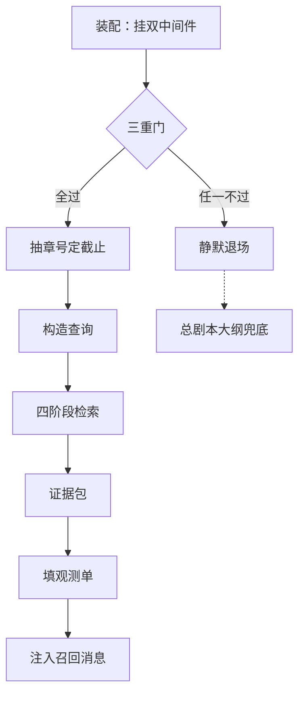

# 04 · 检索回填：开拍前的资料袋递送

> **两步制文档**（2026-08-17 新规范轮重写）：本文分两步。第 1 步讲「是什么、为什么」。第 2 步讲「怎么运转」。

> **层位**：设计思想层。讲设计动机、模块协作与契约，剥离实现细节。

> **边界**（拆分契约）：讲检索前置、四阶段检索、双中间件兜底链。还讲降级语义、memory_quality 观测、harness 装配注入。不讲库表结构（03 篇）、不讲记录怎么产生（01/02 篇）。

> 输入 = memory.db + 当前章号；输出 = 证据包 + 观测事件。

---

## 开篇故事：递袋员的第 5 集差事

**第一幕。** 开拍前夜，导演（writing 子代理）拿到第 5 集的任务单。

递袋员（MemoryRecall 召回中间件）起身就跑，先过三查（三重门前置检查）。

这袋送过没、门上有没有请假条（降级标记）、锁开不开得顺。三查全过，他推门进了资料室（memory.db）。

**第二幕。** 翻检有铁规程：只许动第 4 集及以前的柜子。他伸手要拿"第 5 集"的卷宗，被规程拦下。本集还没拍，先看就是剧透。

他改用两套索引。目录卡（FTS5）按字面翻出"林晚"；按意思找卷宗的检索员（向量检索）配出"医院重逢"。

两份榜单折算汇总（RRF 融合）。再顺着"林晚"顺藤摸瓜（one-hop JOIN）：旧关系、玉佩各抄一份。全部装进资料袋（证据包），超重的裁掉。

**第三幕。** 出门前填一张取件单（memory_quality 事件），送制片方（进化复盘）。

某天锁坏了，他空手退场，一声不吭。导演照样开工——手边总剧本大纲（ContextAssembler 静态蓝图）没缺席过。

### 映射表

| 文档难点 | 故事元素 | 对应说明 |
|---|---|---|
| writing 子代理 | 导演 | 接任务单、动笔写本章的人 |
| task（写作任务描述） | 任务单 | 递袋员一切动作的出发点 |
| MemoryRecall 召回中间件 | 递袋员 | 每次写作调用前跑一趟检索、送袋 |
| 三重门前置检查 | 三查 | 任一不过就整趟不去 |
| .memory_unhealthy 降级标记 | 请假条 | 门上贴着，递袋员掉头就走 |
| memory.db | 资料室 | 存全部旧记忆的库房，一剧一室 |
| causal cutoff（≤ N-1） | 只动旧柜的规程 | 伸向本集卷宗的手被拦，防剧透 |
| FTS5 检索 | 目录卡 | 按关键词翻卡片，抓字面 |
| 向量检索 | 按意思找卷宗的检索员 | 按意思远近配卷宗 |
| RRF 融合 | 两榜折算汇总 | 两份榜单按名次折成分数、合起来排 |
| one-hop JOIN | 顺藤摸瓜抄关联 | 从命中卷宗顺带抄一层关系卷宗 |
| 证据包 EvidencePacket | 资料袋 | 装好的有界一袋记忆 |
| 字符预算截断 | 超重的裁掉 | 袋超 12000 字符就硬裁 |
| memory_quality 事件 | 取件单 | 每趟填一张，送制片方复盘 |
| 降级语义 | 空手退场一声不吭 | 失败不报错、不停工 |
| ContextAssembler 静态蓝图 | 总剧本大纲 | 永远在手边的兜底上下文 |
| 进化复盘 | 制片方 | 收取件单、改进下一季检索 |

### 边界声明

本故事只映射写作前检索回填的角色分工与失败兜底。资料室内部怎么摆柜（库表结构），归 03 篇。卷宗怎么写进去（写入管道），归 01/02 篇。都不在故事内。

### 情境自测

1. 递袋员在折算榜单后、装袋前病倒（检索中途抛异常）。导演这集拿到什么？写作会停吗？（答案在第 2 步末尾「退场口全景」表）
2. 任务单写的是"第 1 集"，旧柜规程会让他装出什么袋？取件单怎么记？（答案见环节四与退场口全景表空袋行）

---

## 地基：十个承重概念

后面两步的论证全踩在这十个概念上。按依赖分三层：先基层，再组合。

**第一层（基层）**

- **因果锚点与 causal cutoff（≤ N-1）**：每条记忆带 source_chapter（所属章号）。写第 N 章只许命中 ≤ N-1 章的。像只看已播剧集，不看未播剧本（锚点 01 篇已详解）。
- **幂等前缀**：注入消息带专属开头"记忆召回："。已有同前缀就不再注入——文件盖了章，见章不重复发。
- **降级标记 .memory_unhealthy**：workspace 里的标记文件。它存在即代表记忆系统病了，检索整趟跳过。像门上贴的"检修中"（故事里的请假条）。
- **RRF（1/(60+名次)）**：两套榜单各给名次。得分 = 各榜单 1/(60+名次) 之和。像评委只看排名、不看绝对分。
- **one-hop JOIN**：命中的记录（锚点）只向外扩一层关系。像查到一个人物，顺带复印他出场的那几页。
- **harness 可进化要素**：检索的三张规程页（query_builder、join_rules、packet_formatter），进化端可改、装配时注入。第四件 narrative_schema 作用于数据契约侧，不在读路径。

**第二层**

- **四阶段检索**：因果截止 → 双路排序融合 → 一跳扩边 → 有界装袋。它就是资料室整套翻检规程：一条流水四道工序。

第二层由第一层的截止、排序、扩边串成流水；第三层是流水的产出与挂载方式。

**第三层**

- **证据包 EvidencePacket**：检索结果容器。排版文本给写作用，全套审计字段给复盘用（袋子加袋内清单）。
- **双中间件兜底链**：静态蓝图中间件永远注入；记忆召回中间件条件追加、失败静默退场。像总剧本大纲在手，资料袋尽力而为。
- **memory_quality 事件（13 字段）**：每次检索后写给进化复盘的观测快照。基础 7 项记"查了什么、成没成"。审计 6 项记"怎么成的"。

---

## 第 1 步：是什么、为什么

检索回填，是写作调用前的一道送料工序。动笔前，中间件把本章任务单变成查询。查到的相关旧记忆，装成一份有界证据包塞进对话。像递袋员开拍前按剧情取一袋卷宗，递给导演。

没有它，写作只剩静态蓝图可依。写到第 40 章，角色旧伤早愈，模型忘了，又让他捂一次。记忆系统出了故障也不能停工——失败静默退场，蓝图保底。

全程跟一个例子：导演接到"写第 5 章，林晚在医院重逢顾言"。这一袋怎么送出去，下文逐步看。

---

## 第 2 步：怎么运转——一次完整的递袋

一次完整运转分六站：装配、三重门、查询构造、检索、交付、复盘。输入是任务单加章号，输出是证据包加一张观测单。先看全景。

### 环节一 · 装配：递袋员编入剧组

开机前先得把递袋员编进剧组——这一环管分工。检索骨架固定，住执行端 executor。规程页可进化，住 harness 包：怎么写查询、怎么扩边、怎么装袋。

运转是三级接力。执行端装配时备好 ctx（装配上下文）：backend（记忆门面）加递袋员类。harness 装配时注入本包的规程页。再给导演挂上双中间件。

双中间件就是兜底链：一个永远在场，一个尽力而为。分工如下。

| | ContextAssembler（静态蓝图） | MemoryRecall（记忆召回） |
|---|---|---|
| 住处 | 执行端平台层，固定 | harness 包，随版本进化 |
| 递什么 | 大纲、剧情线、人设等静态文件 | 按本章检索的动态记忆 |
| 挂载 | 永远挂载 | backend 可用才挂 |
| 失败时 | ——它是兜底方 | 静默退场，蓝图照递 |
| 幂等前缀 | "写作前置上下文：" | "记忆召回：" |

真坑一："只注入一次"保护让旧版规程页锁死位置，新版永不生效。修复为每次装配重新注入，并加锁防并发。

真坑二：backend 建在规程页注入之前。构造时就绑定检索器，会冻结旧版规程页；修复为检索那一刻才解析规程页。

**不变量：检索规则随当前 harness 版本走。拿不到 backend，递袋员根本不上岗——纯蓝图开工。**

### 环节二 · 三重门：出发前三查

开机后，导演每次动笔前递袋员都被叫醒——但先过三查。作用是省力加止损：明显不该跑的趟，出发前就拦下。

| 门 | 查什么 | 判据 |
|---|---|---|
| 门 1 · 幂等 | 这袋送过没 | 对话已有"记忆召回："开头的消息 |
| 门 2 · 病假条 | 资料室病没病 | workspace 存在 .memory_unhealthy |
| 门 3 · 健康 | 门锁开不开 | 数一遍 chapter_digest 表 |

> 例：写第 5 章是本章首次调用。对话里无召回消息、门上无请假条、数表通过——三关全过。

前缀的由来是防重复【基于设计理解推演】。对话消息只增不减，重试会再注入——有章不重发，一对话一袋。

已知边界：门 2、门 3 退场时的观测单不带章号，成功路径带。复盘时少一层定位信息。

**不变量：任何一查不过立即静默退场。不报错、不停工，导演转用蓝图。**

### 环节三 · 任务单变检索单

三查全过，递袋员掏出任务单，做两步加工。第一步抽章号：三组正则认"第 5 章"，也认中文数字。

章号减一得因果截止。写第 5 章，只许用第 4 章及以前的记忆。防的是剧透自己——本章以后的记录，一条不许进袋。

第二步把任务单变成查询。harness 的 query_builder 优先。它出异常时回退内置策略：任务原文截断两千字。

> 例：任务单含"写第 5 章……医院"。抽出章号 5，截止值 4。查询为原文截断。

已知边界：现版 query_builder 就是截断原文。TODO 自认待改进——应提取角色名做焦点、滤掉指令噪声。

另一边界：正则全不中就没有章号，截止落空、退化为全库检索。代码注释自认"不推荐，违反论文"。

**不变量：截止值把未来挡在门外。第 5 章之后的记录，检索全程不可见。**

### 环节四 · 检索（上）：圈范围、排座次

检索单开好，递袋员进资料室。四阶段规程中，第一阶段圈范围：各表只留 source_chapter 不超过截止值的记录。总量为零——比如刚开书——直接交空袋。

> 例：库内第 4 章及以前共百余条，放行进入下一阶段。

第二阶段排座次：从上百条里挑最相关的十条。两套索引各出一份榜单。FTS5 路抓字面："林晚""医院"直接命中。向量路抓语义：换个说法的相关记忆也配得上。

两份榜单怎么合？用 RRF 折算：得分等于各榜单 1/(60+名次) 之和。两路都青睐的记录，分数叠起来自然靠前。

| 记录 | FTS5 名次 | 向量名次 | RRF 得分 |
|---|---|---|---|
| 林晚 · 角色状态 | 1 | 3 | 1/61+1/63 ≈ 0.032 |
| 医院 · 场景 | 2 | 未上榜 | 1/62 ≈ 0.016 |

为何只看名次？两路量纲不可比：名次与距离没法直接相加。这一动机为【基于设计理解推演】。向量路另配额：默认十条、八类各一——保类型多样，但类间不竞争。

这套规程是自研的：通用图数据库的检索分不清叙事学类型（25de1a6 重构理由）。自研四阶段换个说法——每步的命中都可解释、可审计。

**不变量：字面漏的语义接住，语义漏的字面接住。融合后前十名成为锚点。**

### 环节五 · 检索（下）：顺藤摸瓜、装袋

前十名锚点定了，但孤点拼不出故事——第三阶段把点连成网。一跳扩边：每个锚点只向外扩一层，扩什么由类型决定。

| 锚点类型 | 扩出什么 |
|---|---|
| 角色状态 | 参演场景 + 人物关系 + 随身物品 |
| 场景 | 参演角色 |
| 伏笔 | 不扩（显式简化） |
| 其余类型 | 未见扩边规则记载 |

> 例：锚点"林晚"扩出她与顾言的关系。还扩出医院场景、随身玉佩。各带（关联）标记，与直接命中区分。

第四阶段装袋。全部记录按叙事优先级排版。角色状态、人物关系、场景事件一路往下。排版超过 12000 字符就硬截断，并打上截断标记。

已知边界：伏笔锚点不扩边，注释自认"简化：不深挖"。论文限定 one-hop；多跳是注释作者的展望。

另一边界：截断是纯切片，可能落在句子中间。有标记可查，但袋尾可能残句。

**不变量：袋子有界——12000 字符硬顶，上下文永不因记忆而爆。**

### 环节六 · 交付：填单与递袋

袋子装好，递袋员办两件事：填单、递袋。取件单是给进化复盘的观测快照，每趟必填。进化端靠它看到"召回了什么"，而不只是"召回了几个"。

| 群 | 字段（共 13） | 回答什么 |
|---|---|---|
| 基础 7 | 章号 / 查询 / 成败 / 错误 / 袋大小 / 命中数 / 扩边数 | 这次查哪章、查了什么、成没成、袋多大 |
| 审计 6 | 截止值 / 范围内总量 / 锚点清单 / 扩边条数 / 是否截断 / 命中摘要 | 具体怎么成的：圈多少、挑了谁、扩没扩、裁没裁 |

然后递袋。排版文本加引导语，冠"记忆召回："前缀。它作为一条独立消息（HumanMessage）追加进对话。同一帧里蓝图消息已在前面——两条前缀不同，互不干扰。

> 例：注入消息开头是"记忆召回：（当前写第 5 章）"。其后接【角色状态】林晚……等条目。

第三个坑：观测单漏了必填 status 字段，上报即抛错、又被静默吞。埋点从未落进 trace（调用全程的观测记录），成功召回被误报成丢失；修复只补一个字段。

顺带一提：袋大小按字符数乘 1.5 粗估，仅作观测、不参与控制。

**不变量：注入是追加一条独立消息，绝不动写作指令本身。空袋不注入、不报错。**

### 退场口全景：降级语义复盘

一路看下来，退场口比比皆是。把全部失败路径摆进一张表，兜底语义一目了然。

| 触发 | 行为 | 观测单 | 导演拿到什么 |
|---|---|---|---|
| 这袋已送过（幂等命中） | 跳过 | 不写 | 原有召回消息 |
| 门上有病假条 | 退场 | 失败，error=unhealthy_flag，无章号 | 纯蓝图 |
| 健康探针失败或抛错 | 退场 | 失败，error=health_check_*，无章号 | 纯蓝图 |
| 查询为空 | 退场 | 不写 | 纯蓝图 |
| 检索抛异常 | 退场 | 失败，error=异常详情，带章号 | 纯蓝图 |
| 检索成功但空袋 | 退场 | 成功，计数全零 | 纯蓝图 |
| backend 拿不到（pool 未初始化） | 递袋员不上岗 | 不写 | 纯蓝图 |
| 向量化失败 | 不退场 | 正常写 | 双路变单路 |

注意空袋与失败是两种语义：空袋记成功，失败记失败。进化端据此区分"没查到"与"查不了"。前者是检索质量问题，后者是系统故障。

回看全程：任务单进，资料袋出。三重门拦趟、截止值挡未来、双路扩边挑相关、预算裁超重。

失手呢？链路失手静默退场、蓝图保底；向量化失败，双路变单路。写作永不零上下文、永不中断。

---

## 篇尾：延伸阅读

| 相邻篇 | 一句话定位 | 与本文的衔接 |
|---|---|---|
| 01 概念与数据模型 | 8 类 records 的字段与因果锚点 | 本文检索、扩边、排版消费这些类型 |
| 02 写入管道 | 记录怎么产生、病假条谁贴 | 病假条由写入侧创建，本文只检测 |
| 03 存储层 | memory.db 的结构与连接管理 | 本文只消费它的检索原语 |
| 进化复盘（他篇） | memory_quality 事件的消费侧 | 本文的取件单是它归纳失败模式的原料 |
