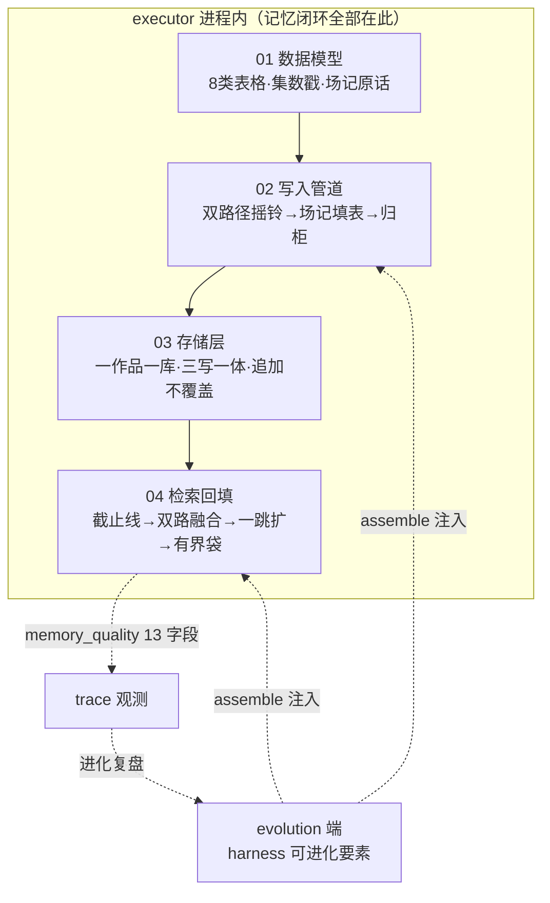
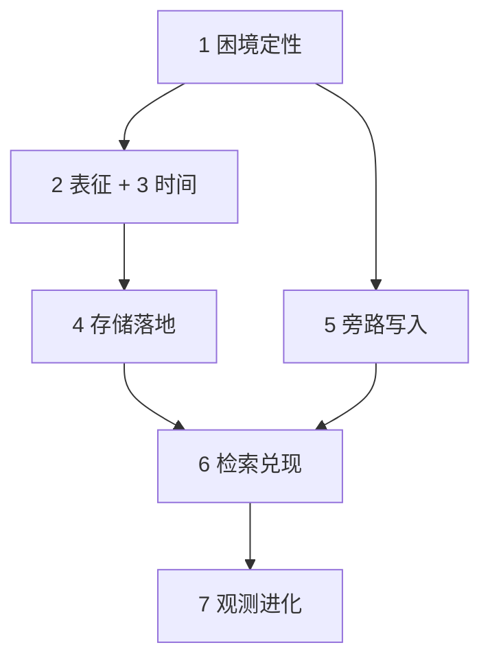

# 记忆系统深读 · 总览

> **一句话认识**：记忆系统 = **剧组连续性保障班底**。

> 导演（写作 agent）拍第 50 集，还记得第 3 集的细节。

> 靠的不是导演记性好，是班底：场记收工归档（写入）。

> 一剧一柜的资料室（存储）；开拍前装袋递档案（检索回填）。

> 本系列共 4 篇，按数据流拆分。**先读本篇建全局，再按 01→02→03→04 读**。

> 每篇两步制：第 1 步「是什么、为什么」。第 2 步「怎么运转」。

---

## 全局架构图

先认两个端点。**executor** 跑写作任务，记忆闭环全在它这里。
**evolution** 产"可进化的零件"，不碰记忆数据。

两者只在 **harness 装配**时发生一次注入。
（harness = 组装写作代理的工程框架。）

**数据流主干**：章节正文 →（02 抽取）8 类 records。
records →（03 存储）memory.db。
memory.db →（04 检索）证据包。
证据包 →（04 回填）写作 prompt。

---

## 导航索引

| 篇 | 一句话定位 | 讲透什么 |
|----|-----------|---------|
| [01 概念与数据模型](01_概念与数据模型_深读.md) | 记忆的"语言"——8 种表格各记什么 | 8 类 records 契约；因果锚点为何是章节号；为什么弃 Graphiti |
| [02 写入管道](02_写入管道_深读.md) | 每集收工，场记的夜班 | 双路径统一摇铃；一次 LLM 填 8 表；坑账本；失败降级不打断写作 |
| [03 存储层](03_存储层_深读.md) | 一剧一柜的资料室 | SQLite 单文件选型；三写一体；"最新有效"怎么取；A/B 临时柜生灭 |
| [04 检索回填](04_检索回填_深读.md) | 开拍前的那只资料袋 | 四阶段检索；双中间件兜底链；降级路径；memory_quality 观测 |

**阅读顺序**：01 是地基，后三篇都消费它的术语。
02/03 按数据流自然衔接，04 收口闭环。
赶时间只读一篇 → 选 01（它解释系统"为什么长这样"）。

---

## 统一术语表

| 标准叫法 | 一句话定义 |
|---------|-----------|
| NWM | Narrative World Model，叙事学结构化的长篇写作记忆系统（arXiv:2607.05577） |
| 8 类 records | CharacterState / PlotPromise / NarrativeFunction / Scene / RelationshipState / ObjectState / WorldFact / ChapterDigest |
| 因果锚点 | record 的 source_chapter 字段；检索据此防未来泄漏 |
| 有效期切片 | valid_at / invalid_at 章节号；invalid_at 当前恒 NULL（预留） |
| evidence_span | record 携带的原文引用，记忆可回溯到正文 |
| 抽触发器 | trigger_chapter_ingestion，章节抽取入库统一入口（DEC-002） |
| 抽取器 | extractor，LLM 把章节正文抽成 8 类 records |
| PlotPromise 状态机 | 伏笔生命周期：open 登记新行 / closed 销账 UPDATE / updated 追加快照 |
| memory.db | 一作品一个的 SQLite 记忆库 |
| sqlite-vec / FTS5 | SQLite 向量检索扩展（暴力 KNN）/ 全文检索扩展（BM25） |
| 三写一体 | 一条记忆在单个事务里一次写齐三处：主表、目录卡（FTS）、向量表（见 03） |
| registry 视图 | 跨 8 类表取"每实体最新有效"的逻辑视图（get_current_state 参数化查询，非 CREATE VIEW） |
| MemoryStorePool | 按 workspace_id 管理连接的 LRU 池（max=32） |
| 四阶段检索 | ① causal cutoff ② FTS5+vec RRF ③ one-hop JOIN ④ bounded packet |
| causal cutoff | 检索只取 source_chapter ≤ 当前章-1，杜绝未来泄漏 |
| RRF | Reciprocal Rank Fusion，两路召回按名次积分融合（1/(60+名次)） |
| one-hop JOIN | 沿 record 间引用做一跳 SQL 扩展，模拟图边遍历 |
| 证据包 / EvidencePacket | 检索最终产物，hits + 排版文本，供注入 prompt |
| 双中间件兜底链 | ContextAssembler（静态蓝图，总挂载）+ MemoryRecall（动态记忆，条件追加） |
| 降级 / .memory_unhealthy | 抽取/落库失败写 flag → 检索退回蓝图兜底 |
| memory_quality 事件 | 每次召回（成败皆记）写 trace 的 13 字段审计事件 |
| harness 可进化要素 | evolution 端 6 个记忆要素，assemble 时注入 executor |
| A/B 临时库 | A/B 按临时 workspace_id 隔离的 memory.db，run 终态清理 |

---

## 整体认知：一串互相咬合的设计决定

### 1. 困境定性质：给什么比存什么更是杠杆

长篇写作的根本难题是持久叙事状态。

NWM 论文做过对照实验。同一记忆库，考多跳题——要连推两步才能答的那种。

全量倾倒进上下文，准确率 0.358。按查询检索再喂，0.898。

**给什么比存什么更是杠杆**（conditioning > capacity）。

它同时定了两件事。存要结构化（第 2 条）。读要精编排（第 6 条）。

### 2. 表征决定上限：8 类 typed records

Graphiti 这类通用图的败因不是检索，是事实抽不出来。

"谁知道什么""坑填没填"在通用图里没有位置放。8 类表格就是为这些状态定制的。

2026-07-17 从引入到推倒只隔 3 天（commit 25de1a6）。

typed records 本身就是图的节点和边。要的是图的语义，不是图的数据库。

### 3. 时间语义服从写作本质：因果锚点是章节号

写作的唯一硬约束：写第 N+1 章，只能尊重前 N 章。

每条记录带整数章节号。检索时一条 WHERE 就杜绝未来泄漏。

故事内时间与 wall-clock 都被刻意放弃。

### 4. 存储服从表征与部署：SQLite 单文件三理由合力

一，8 类记录天然是关系表形状，不需要图库。

二，一作品一库，文件即隔离。

三，"最新有效"靠窗口函数追加式取得，免 UPDATE 竞争。

附带收益：零部署、透明可审计。

### 5. 写入是旁路 ETL：记忆永远不许打断写作

抽取挂在"章节定稿"事件上，甩进后台线程跑。

任何失败只贴请假条、当章作废，绝不中断主线。场记病了，戏照拍。

生产与 A/B 复用同一收工铃（DEC-002）。进化实验与生产行为同源。

### 6. 读路径是杠杆的兑现：四阶段检索 + 双中间件兜底

因果截止，用第 3 条的锚点。

FTS5 与向量两路召回、RRF 融合。关键词保准，语义保全。

one-hop JOIN 模拟图遍历，用第 2 条的关系表。

12000 字符有界打包，剂量受控。

注入侧双链共存：动态记忆失败就退场，静态蓝图永远在。

**writing 永不零上下文**是硬承诺。

### 7. 闭环可观测、部分可进化：分界本身是设计

memory_quality 13 字段事件，让进化系统看得见每次召回的成败。

6 个 harness 要素开放进化：schema、query 构造、JOIN 规则、排版、抽取 prompt、middleware。

8 类数据契约、存储基础设施、降级语义固定不动。

进化能优化"怎么抽、怎么查、怎么排"。不能动"记什么、存哪、坏了怎么办"。

### 心智模型收口：一场接力

七条关系一图：

困境定性（1）把任务拆成"存好"与"读好"两半。

表征（2）+ 时间语义（3）决定存的形状。存储（4）是物理落地。

写入（5）保证存的过程不打扰主业。检索（6）兑现存的全部价值。

观测与进化分界（7）让整条链可持续变好。

任何一环单独替换，都会与邻环失配。这是一套系统，不是一堆组件。

---

## 已知的诚实瑕疵与预留（全系列汇总）

各篇正文讲到相关环节时一句话带出。此处汇总备查。

标注「未展开」的条目，是环节预算从正文砍掉的，仅在此备案。

| 事项 | 所在篇 | 定性 |
|------|------|------|
| invalid_at 恒 NULL，全库无写入路径 | 01/03 | 设计预留，未生效机制 |
| updated 快照可能把"已兑现"显示成"推进中"【推测】 | 01/02 | 实现扩展带来的结构性张力 |
| A/B 写入侧抽取指南取生产包，候选版测不到 | 02 | 已知盲区 |
| 题材参数（search_text_builder / record_types_enabled）已建未接线 | 02/04 | 进化预留 |
| prompt 缓存与热加载语义冲突（未展开） | 02 | 已知瑕疵 |
| update 销账不回写 FTS5；2 字中文词靠 LIKE 兜底 | 03 | 已知边界 |
| 实体列索引缺失（注释与代码不同步）；pysqlite3 缺失静默回退 | 03 | 小瑕疵 |
| health_check 仅轻探针（未展开） | 03 | 已知边界 |
| query_builder 现版仅 task 原文截断 2000 字（TODO 自认） | 04 | 检索质量第一杠杆位 |
| 向量路 8 类均分配额，大类可能被挤掉；伏笔 anchor 不扩圈 | 04 | 实现简化的代价 |
| 有界袋硬截断可截句中；降级路径埋点丢章号 | 04 | 已知边界 |
| harness 版与 executor 默认版近乎重复代码 | 04 | 维护性瑕疵 |
| 进化端 retrieval_fail 建议残留 FalkorDB 话术（未展开） | 04 | 已知瑕疵 |
| ContextAssembler 动态回调能力未被 writing 使用（未展开） | 04 | 已建未接线 |
| group_id 死参；cutoff 兜底 999999 无断言；token 粗估 ×1.5（未展开） | 04 | 已知瑕疵 |
| 若干注释超前/滞后于实现（状态机注释、索引注释等） | 01/03 | 小瑕疵，如实记录 |
