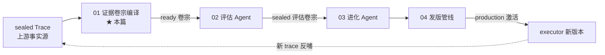
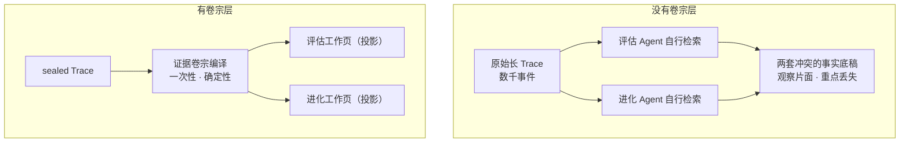
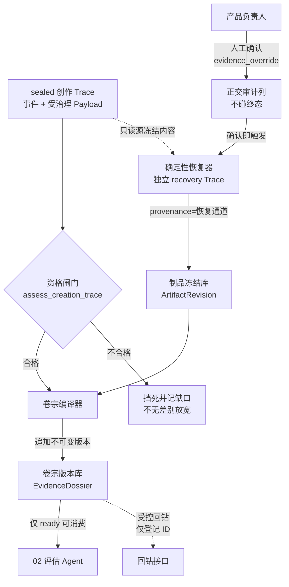
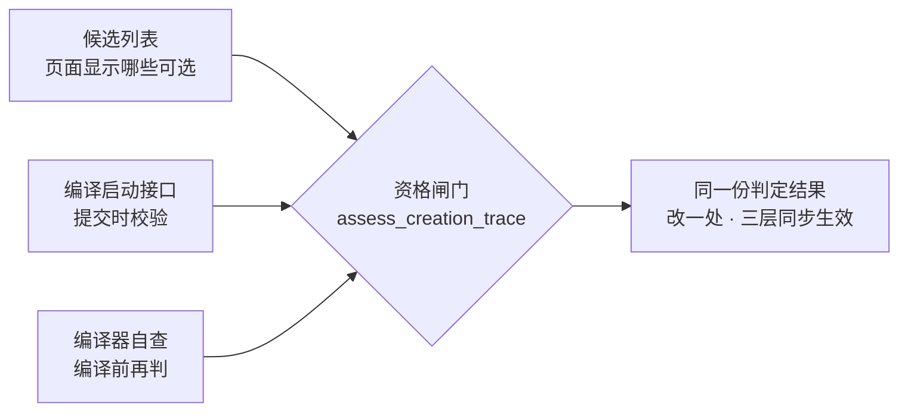
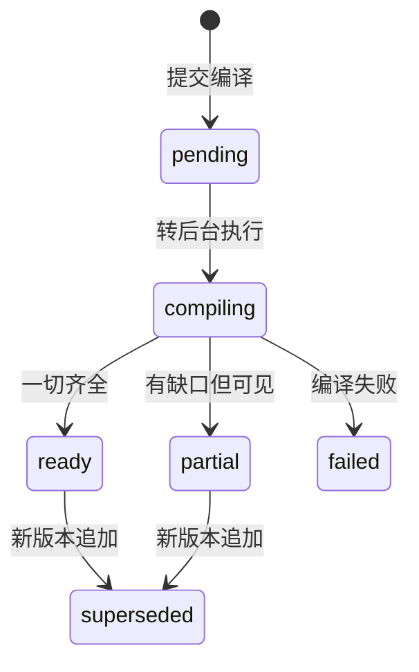
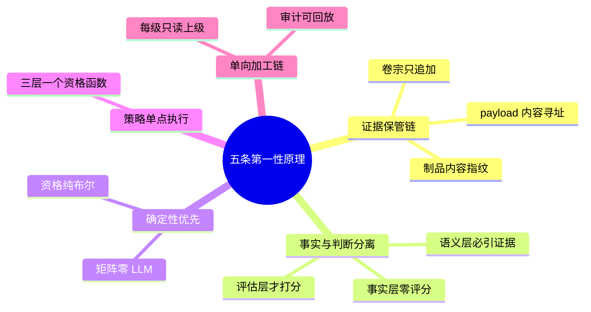
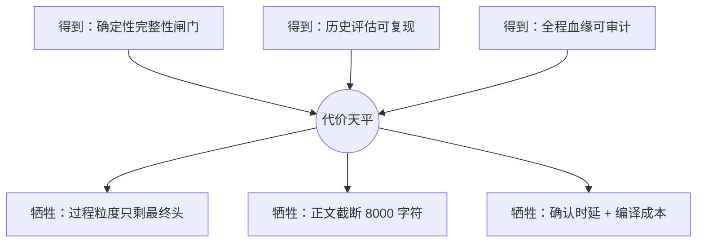

# 子块 01：证据卷宗编译（dossier）

> **层位声明**：本篇属于「进化系统深读」的**设计思想层（架构师视角）**——讲为什么这么设计、宏观怎么运转、环节间契约与不变量、优劣与可迁移原理，主动剥离环节内部的微观实现（代码位置、字段定义、内部步骤序列）。如需实现层补充，可另行要求。
> **读者假设**：你会编程、懂 Agent 与后端通用概念（HTTP、JSON、trace 日志），不需要预先了解本项目。
> **编号说明**：文中 CON-/DEC-/EVD-/EDGE-/RSK-/FR- 及 commit 短哈希均为项目需求文档与仓库的条目/提交编号，保留以便溯源。

## 本子块在全局链路中的位置

Writer 的进化系统是一条**单向加工链**：上游 executor（写作执行器）每跑完一次创作，留下一条已封存的 Trace；此后整条链围绕“这份事实如何被加工成进化决策”展开。本篇讲第一环——**sealed Trace 进来，ready 证据卷宗（EvidenceDossier）出去**。trace 怎么被封存（上游摄入）、评估怎么打分（下游 02），本篇只以衔接点出现。

高频术语先接地，全文按此叫法：

| 术语 | 一句话接地 |
|---|---|
| sealed Trace | 已封存的执行轨迹：一次运行全过程的不可变事件记录。“封存”= 单事务原子写入，写完不可改 |
| EvidenceDossier 证据卷宗 | 本子块产物：不可变、可版本化、只含事实不含评分的证据包 |
| ArtifactRevision 制品版本 | 某文件某次写入时的不可变快照，带内容指纹——类比 Git 的一次提交 |
| assess_creation_trace 资格闸门 | 判定“一条 trace 有没有资格被编译成卷宗”的唯一函数 |
| contract_coverage_matrix 契约覆盖矩阵 | 把“承诺了什么 vs 实际交付什么”逐项对成一张布尔表 |
| structural_omission 结构性缺失 | 契约要求出现的机制（如记忆系统）在证据里完全没出现的一类缺陷 |
| evidence_override 人工确认 | 产品负责人认可“这条被用户停止的 trace 有价值，准许入证” |
| provenance 血缘 | 数据“从哪来”的记录：谁生成、依据哪些原始证据 |

---

## 第1步 本质锚定：它本质上是什么

**证据卷宗编译，本质上是进化系统的“证据编纂官”**：把一条已封存（sealed）、传输校验通过（verified）的 executor 创作 Trace，单向加工成一份**不可变、可版本化、只含事实不含评分**的证据包（EvidenceDossier），作为评估与进化两个下游**唯一的共享事实底座**。

拆开这句话里的三个关键词，各配一面镜子。

**关键词一：唯一共享事实底座——像“同一本案卷 + 两个岗位工作页”。**
这是需求文档原文确认的模型。一场官司只允许一本案卷：卷里是物证与证词，谁都不能改。检察官（评估 Agent）和法官（进化 Agent）各自领一张工作页阅卷——工作页是同一本案卷的**投影**。需求原文说得极硬：“共享事实底座是唯一的客观证据来源，评估 Agent 与进化 Agent 只能从其投影各自的工作视图，不能各自再生成独立事实底稿。”

**关键词二：不可变、可版本化——像法医的证据保管链（chain of custody）。**
现场取证（从 Trace 冻结 ArtifactRevision）→ 物证封袋编号（不可变卷宗版本）→ 检察官与法官各自阅卷 → 谁也不能改证词，发现新证据只能**追加一本新卷**（版本追加，旧卷转只读）。证据一旦采集即冻结，全程血缘可溯。

**关键词三：编译——它真的是一个编译器。**
确定性规则提取是编译前端（规则固定、可复现）；LLM 语义归纳是带预算上限的优化 pass（只能归纳、次数有限、每条结论必须引用证据）；契约覆盖矩阵是类型检查（不通过就不发 ready）；受控回钻索引是 debug info（想看细节，只能沿登记的证据 ID 回去翻）。

| 类比 | 照亮的侧面 |
|---|---|
| 司法卷宗 + 岗位工作页 | 唯一事实底座，下游只投影、不另立事实 |
| 法医证据保管链 | 采集即冻结、只追加不改写、全程血缘 |
| 编译器 | 确定性规则打底，LLM 受限参与，类型检查式闸门 |

带着这三面镜子，看它为什么非存在不可。

---

## 第2步 痛点动机：没有它，会发生什么

六个场景，全部来自项目需求与代码实证。每一个都是具体事故，不是干指标。

**场景 A：长 Trace 塞不进上下文，两个 Agent 各自翻案卷。**
一条线上创作 Trace 动辄几千个连续事件，一次装不进任何下游的上下文。若评估 Agent 和进化 Agent 各自去检索原始 trace：各自只看到片段，不知道全局覆盖了没有、也不知道该深入看哪些细节——最后各自拼出一份“事实底稿”，两份底稿互相冲突、重点丢失。这是需求文档立项的核心诉求原文。

**场景 B：verified 骗过了闸门——trace-90 事件。**
线上 trace-90：5528 个连续事件、传输回执 verified、75 次成功 write_file 加 173 次 edit_file——但制品版本数为 0。卷宗编译报“无任何产物交付物”。可这不是 Agent 没交付，是观测提取链**漏了采集**——“真没交付”与“观测漏采”两种性质相反的情况，报出来的却是同一句话：这条 trace 要么被误杀，要么错误结论污染下游。
同一类混淆还有另一端（commit 41766d3 记载）：未跑完的 trace（failed/cancelled）混进候选，“**没资格编译**”（资格问题）被误报成“**编译发现无产物**”（数据问题）——又是一对性质不同的错误被混为一谈。

**场景 C：证据编纂吃自己。**
候选列表漏过滤时，证据编纂自己的 Trace 会出现在证据候选里，而且“越新的编纂 Trace 越靠前，容易被误认为最新创作记录”。自观测数据混进业务证据——来源认知污染。

**场景 D：结构性缺失，全链路失明。**
用户原话：“架构蓝图是有记忆系统的，但是 trace 中根本没有出现记忆机制，但是进化 agent 没有提出来。”为什么没人发现？评估的 28 维 rubric 全是内容维度，“根本没问”这件事；进化只消费评估报告，“看不到”这件事。三级管道逐级有损压缩，把这类缺失压得无影无踪。

**场景 E：用户主动停止的半成品被一刀切丢弃。**
用户原话：“创造一半，点击停止，那剩下一半也是有价值的。”没有例外通道时，cancelled trace 被闸门完全挡死，有价值的创作证据白白流失。

**场景 F：旁路直读 workspace，历史评估不可复现。**
没有卷宗作唯一事实底座时，评估打分读的是“当前 workspace”。workspace 是可变的——运行后用户或系统改了文件，事后修改会被当成当次运行产物，历史评估从此不可复现。

一句话收束，也是整个子块存在的理由：

> 在“不可信的当下”（可变的 workspace、可能漏采的观测、与下游同源自带 bias 的 LLM）与“下游决策”之间，插一个**确定性优先、不可变、可审计**的证据冻结层。

| 痛点 | 事故画面 | 对应机制（第3步展开） |
|---|---|---|
| A 各自检索片面 | 两套冲突事实底稿 | 集中编纂 + 角色投影 |
| B verified 骗过闸门 | “漏采”误报成“没交付”、“没资格”误报成“无产物” | 资格闸门分层判定（传输/证据两正交维度 + 资格/产物分层文案） |
| C 编纂吃自己 | 编纂 Trace 混入候选 | workload 自反闭合 |
| D 结构性缺失失明 | 记忆机制缺失无人发现 | 覆盖矩阵 + structural_omission |
| E 半成品一刀切 | 停止即丢弃 | 人工确认 + 确定性恢复 |
| F 旁路读 workspace | 历史评估不可复现 | 只认冻结制品、禁止补读 |

---

## 第3步 模块协作与契约：宏观怎么运转

### 3.1 宏观协作图

读图三条线：**主干**（Trace → 闸门 → 编译器 → 卷宗库 → 仅 ready 交给评估）；**半成品通道**（人工确认 → 恢复器 → 制品库 → 重新过闸门）；**回钻通道**（虚线：下游看细节只能沿卷宗登记的证据 ID，不能任意搜 trace）。

### 3.2 全图唯一被三处共用的部件：三层同源

三层消费全部收敛到**同一个资格函数**。反面是多套各自实现的语义：页面显示可选但提交失败、绕过页面直接编纂成功。需求实证里三层语义分散正是事故温床（EVD-002/003/004）：页面漏过滤、接口靠 workload 闸门侥幸拦住、编译器只查 completed——“不维护第二套前端黑名单”由此而来。

### 3.3 八个环节的契约

每环节按「职责 / 输入→输出 / 不变量 / 设计动机」讲。**不变量是每个环节的核心价值**：不管谁来运行、运行多少次，这条保证永远成立。

#### ① 资格闸门 assess_creation_trace——唯一判定入口

- **职责**：一次判定三件事——来源资格、传输完整性、业务证据完整性；结果作为**计算缓存**落运行记录（算出来的状态，不是人工状态）。
- **输入 → 输出**：sealed Trace → 合格/不合格 + 缺口清单。
- **来源资格不变量**：schema 版本不低于 2、来源服务必须是 executor、工作负载必须是创作类、传输完整性必须 verified——同时成立才合格。终态放行仅两条路：标准路径 completed；停止 trace 路径须四条件**同时**成立——cancelled + 审计记录证明是用户主动停止 + 人工确认已批准 + 未撤回。超时取消、中断、无停止审计记录的一律挡死——“不无差别放宽闸门”。
- **业务证据不变量**：每一次成功写（以补全后的事件判定；工具执行报业务错误的写不算成功）都必须对得上同一次调用、同一路径的 ArtifactRevision，且内容指纹一致；恢复产物必须覆盖全部期望路径；无重号无冲突。
- **为什么传输与证据放一个函数里判**：【基于设计理解推演】二者是同一资格谓词的两个维度，且证据状态缓存要求一次重算同时刷新两层语义，拆开会变成两层缓存互相打架（需求 CON-006 只禁止语义混写，不禁止同函数共判）。
- **动机**：痛点 B 的直接解法——“没资格”与“无产物”从此是两层不同的话。

#### ② 事实提取器——只从不可变制品冻结事实

- **职责**：从 sealed Trace 提取事实包——契约、交付物、review 链、revise 推断、恢复链、流程指标、记忆质量、覆盖统计。
- **输入 → 输出**：已物化的 ArtifactRevision + 受治理 Payload（由内容寻址存储管理、按指纹存取的消息负载）+ 事件流 → 冻结的事实集合。
- **不变量**：交付物冻结 = 每个逻辑路径只留**最终**那份不可变修订，带内容指纹与截断标记（8000 字符上限）；每条事实带稳定证据编号（evidence_id，可回钻到具体事件）；推断类事实（如 revise 时序推断）显式标注 confidence=inferred，不冒充确定性证据；血缘分级——trace_time（运行时原件）与 compile_time_snapshot（编纂时快照）分开，历史 trace 不冒充运行时原件。
- **铁律**：禁止读 workspace 补事实。模块自述原文：“workspace 是当前态，无法证明它就是这次运行交付的内容。任何断裂都是可信链断裂，必须让卷宗编译失败而不是产生被污染的事实。”（痛点 F 的解法）
- **动机**：评估打分只凭冻结正文——这是下游“切断 workspace 旁路”的前置条件。

#### ③ 编译器——编排者与确定性闸门

- **职责**：编排整条编译链，驱动状态机 pending → compiling → ready/partial/failed（一生见 3.4 图）。
- **契约覆盖矩阵是确定性闸门**：不依赖 Agent 自述——即使 Agent 声称完成，检查未通过仍不能成为完整卷宗。维度四项：承诺产物逐项、适用阶段逐项、契约字段可得性、**structural_omission 结构性缺失**。求值纯布尔/成员/计数，**0 次 LLM 调用**。
- **structural_omission 三项**：memory_recalled（记忆被召回）、subagents_complete（子代理跑完）、review_executed（评审被执行）。期望值全部来自 demand.md（创作需求契约文档——本次创作的“承诺书”）中人工/可信通道维护的结构性期望（structural_expectations），**进化侧禁写**——需求原话：“契约是评估的确定性依据，进化改契约 = 自己改考卷”（防 reward hacking）。实际值来自已冻结的事实。判定规则：契约未声明 → na（不惩罚，“契约盲区诚实记录”）；声明需要但事实不符 → missing（缺失性缺陷，下游转结构性 finding）。命名词汇借自 MASFT 的 omission 分类，但求值是纯确定性的。
- **LLM 的受限角色**：每卷宗最多 20 次调用，超额降级 partial、不无限重试；语义层每条结论必须引 evidence_id，无引用直接丢弃（证据引用铁律）。
- **确定性与推断分仓存放**：覆盖矩阵（确定性判定）写 manifest 层；契约解析结果（来自 LLM）挂 semantic 层——两类结论不混放。
- **终态判定不变量**：契约覆盖缺口、证据缺口、语义层降级，任一存在即 partial。矩阵不是把卷宗打成 failed 而是打成 partial——“缺失要可见，不是要隐藏”。
- **动机**：痛点 A（集中编纂）与痛点 D（结构性缺失检测）的主战场。

#### ④ 记忆计数——三处协作的一个布尔

- **协作链**：流程指标埋点（从运行元信息的 memory_quality 埋点计数）→ 提取器冻结逐章明细进事实包（让进化侧切断后仍可读，不直读运行元信息）→ 编译器判定（优先消费事实包里的 memory_participated，兜底聚合统计的成功计数 ≥1）。
- **不变量**：memory_participated 只看**成功召回**（retrieval_ok 为真）至少 1 次，不数失败/降级路径——因为它要提供“契约可判定的客观布尔信号”。
- **动机与最脆的依赖边**：痛点 D 标本案例的直接解法。但整条链依赖上游埋点真实写入——需求实证：埋点曾因事件缺字段被异常处理静默吞掉，“评估逻辑本身正确，是无米之炊”。

#### ⑤ 确定性恢复器——"绝不猜测"的半成品重建

- **职责**：仅依据源 Trace 自身的受治理 Payload（成功写参数 + 读快照 + 事件偏序），**确定性重放**出每个受治理路径的唯一最终头（final head）。
- **为什么会有多种顺序可穷举**：trace 只记录了部分先后约束——事件之间是“偏序”（谁先谁后只部分确定），“线性化”就是把偏序排成一列完整顺序的一种合法排法。穷举全部排法，是为了确认无论真实先后如何，每个文件的最终内容都唯一。
- **不变量（核心）**：每个路径穷举全部合法线性化后必须**收敛到恰好一个最终内容哈希**，否则抛错拒绝恢复——绝不猜测。恢复事实写入**新的 recovery Trace**（绝不向 sealed 源 Trace 追加任何事件）；恢复产物落制品库，provenance=trace_payload_recovery，带完整支撑事件/负载血缘；不伪造原运行不存在的逐次修订——trace-90 是 248 次写，恢复产出 75 个最终头，而不是伪造 248 个修订。
- **可放宽项**：人工确认开关打开时接受已确认的停止 trace——“hash 校验与重建算法完全不变，只放宽来源终态准入”。
- **动机**：证据必须证明当次运行实际写入的内容，而非编纂时碰巧存在的内容。

#### ⑥ 人工确认 evidence_override——正交审计，不碰状态机

- **职责**：产品负责人对“用户主动停止”的 trace 发起有价值确认 → 原子写入一组**正交审计列**（谁批的、何时批、什么理由、是否撤回），**绝不触碰终态 status**——终态单调性不被人为操作破坏 → 立即触发恢复（确认成功即产物就绪，恢复失败提前暴露，而不是编纂中途炸）。
- **不变量**：并发确认靠原子更新保证只有一个 approver 生效；幂等（已有恢复产物则跳过）；**撤回只退标记，不删已恢复产物与已编卷宗**（决策可逆、证据不可逆——对标 GitLab approve 撤回 / Jenkins aborted build 产物保留范式）；恢复全部失败时确认标记保留、编纂照常因产物空而失败（闸门不削弱）；确认人身份从登录会话取，不接受请求体自报。
- **卷宗级语义**：源 trace 带有效确认 → 编出的卷宗 provenance=partial（“基于停止 trace 恢复的半成品”，独立枚举值，让产品负责人一眼区分）。

#### ⑦ 卷宗仓储——不可变版本

- **职责**：卷宗表的增删查改；一条 trace 多版本**追加不覆盖**，最新 ready/partial 为当前推荐（is_current），旧版转 superseded 只读。
- **不变量**：终态卷宗（ready/partial/failed/superseded）**不可原地修改**——任何原地修改都会被拒绝并报错，纠错只能发新版本；**只有 ready 可消费**（需求 DEC-007 明确收紧：“降级卷宗只能诊断或重跑，不得消费”）；同 trace 同编译规则版本幂等（已有 ready 直接返回、编译中直接返回）。

#### ⑧ 编译 API——入口与受控回钻

- **职责**：启动（受理即返回、编译转后台异步、幂等）/ 查询 / 停止 / 受控回钻 / 人工确认。
- **不变量**：回钻受控——evidence_id 必须在卷宗索引层登记 + 操作者权限校验，“无 ID 的任意 trace 搜索不属于下游能力”；编译自身也起独立 Trace 并标记“消费”关系，其工作负载标为 evidence_compile，**永远进不了自己的候选**——闸门自反闭合，堵死痛点 C。

### 3.4 卷宗的一生

注意 superseded 不是“改”——是版本角色的转移（当前推荐 → 退役只读），内容本身从未变过。

### 3.5 环节间数据流语义变换

原料一句话串联（原文）：

> sealed verified creation Trace（+内容寻址 Payload + 人工确认正交列）→ 经资格闸门从“全部 Trace”收敛为“合格创作事实源”→ 提取器把可变运行史冻结为不可变事实（每文件只留最终 revision + 指纹）→ LLM 只做两件受限的事（从 demand.md 提契约期望、给冻结事实做带证据引用的归纳）→ 确定性覆盖矩阵把“承诺 vs 交付”变成布尔矩阵 → 投影出两个角色工作页 → 以不可变版本落库为 ready EvidenceDossier，交给评估 Agent。

逐环节看“数据在这里变成了什么”：

| 环节 | 语义变换 |
|---|---|
| 资格闸门 | “全部 Trace” → “合格创作事实源”（不合格挡死并记缺口） |
| 人工确认 + 恢复 | “被停止的半成品” → “带血缘的最终制品”（只放宽准入，不改编码） |
| 事实提取 | “可变运行史” → “不可变事实”（最终修订 + 指纹 + 截断标记） |
| LLM 归纳 | “自然语言契约 + 冻结事实” → “带证据引用的语义结论”（无引用即丢弃） |
| 覆盖矩阵 | “承诺 vs 交付” → “纯布尔矩阵”（0 LLM） |
| 投影 | “同一事实底座” → “评估/进化两个角色工作页” |
| 仓储 | “一次编译结果” → “不可变版本”（仅 ready 可消费） |

---

## 第4步 决策对比：为什么不用现成的

**本项目方案一句话**：自研“四层卷宗（manifest 结构清单与确定性判定层 / facts 冻结事实层 / semantic 语义归纳层 / index 可回钻索引层）+ 两个角色工作页视图 + 确定性优先 + 不可变版本 + 受控回钻”的证据编译层——程序负责全部结构事实与覆盖判定，LLM 只做语义归纳且每条必引证据 ID，产物以内容指纹 + append-only 版本封存。

**业界替代方案**（项目需求 20260726 自带工业对标调研，2026-07 核验；标“未联网核实”者为模型知识补充）：

1. **LangSmith / Langfuse 的 trace+feedback 挂载模型**：不可变 trace 作底座，评估/实验挂载其上。本项目采纳其“事实层不携带结论、评估只投影”的边界划分，拒绝其“下游各自检索”模式，改为集中编纂。
2. **OTel GenAI 语义规范 + Phoenix/Weave 的层级摘要 + span 检索**：本项目采纳“结构化摘要先看全局、用 ID 精确回钻”，落地为索引层 + drill 接口，并把回钻收紧为“仅卷宗登记 ID”——比工业界更严。
3. **【未联网核实】MLflow / LangSmith Dataset 版本化**：三轴独立版本（证据包/rubric/报告）与其同构，本项目额外把“编译规则版本”作为幂等键。
4. **【未联网核实】Git 的内容寻址 + append-only 历史**：制品的内容指纹、payload 内容寻址存储、卷宗 superseded 只读，是 Git 范式在证据域的移植。

| 方案 | 解决的核心问题 | 主要代价 | 适用场景 |
|---|---|---|---|
| 本项目：自研证据编译层 | 把超长 trace 确定性加工成唯一共享事实底座，且带完整性闸门 | 自研维护成本；编译分钟级耗时 + LLM 预算；粒度与截断牺牲 | Agent 自进化闭环需要可审计事实底座 |
| LangSmith/Langfuse 挂载 | 不可变 trace 底座 + 评估实验挂载 | 下游各自检索 → 观察片面 | 通用 LLM 应用观测 |
| OTel GenAI + Phoenix/Weave | 层级摘要看全局 + ID 精确回钻 | 只做检索、不做完整性闸门 | 分布式与 Agent tracing 生态 |
| 【未联网核实】Dataset 版本化 | 证据/rubric/报告三轴版本化 | 原料未展开 | 实验与数据集管理 |
| 【未联网核实】Git 范式 | 任意内容用指纹标识、历史只追加 | 原料未展开 | 源码与制品版本管理 |

**关键异同**：需求调研的判定是——工业界**没有现成产品**把“超长 trace 消化给评估/进化 Agent”作为完整能力，都是可组合多层，所以本项目是“采纳思想、改造落地”。最大的自研增量有三处：①确定性覆盖矩阵作为**完整性闸门**（工业界只做检索不做闸门）；②三层同源资格谓词；③停止 trace 人工确认 + 确定性恢复的“半成品入证”通道——工业界均无对应物。

---

## 第5步 理论抽象：它站在哪些原理上

1. **证据保管链（chain of custody）**：证据一旦采集即冻结、只追加不改写、全程血缘可溯。每一层——payload 内容寻址 → 制品 sha256 指纹 → 卷宗 append-only 版本——都是同一原理的实例化。
2. **事实与判断分离**：事实层零评分、语义层必引证据、评估层才打分——判断永远可回溯到冻结事实，防“立场污染事实层”。
3. **确定性优先于概率**：资格与覆盖判定是纯确定性求值，LLM 被限制在“归纳+提取”且受证据绑定约束——用布尔世界给概率世界兜底，免疫偏好泄漏。
4. **策略单点执行**：三层消费全部收敛到一个资格函数——安全架构里“policy 不分散”原则的教科书式落地。
5. **单向加工链**：trace → dossier → eval → evolve，每级只读上一级——信息有损但可控、审计可回放。

**可迁移原理**（讲给任何系统都成立）：

| 原理 | 一句话 | 本项目实例 |
|---|---|---|
| 传输完整 ≠ 业务完整 | 分层状态、各自诚实，是一切 ingestion 系统的通用教训 | trace-90：verified 与 0 制品同时为真 |
| “没资格” ≠ “无产物” | 两类错误必须在不同层、用不同文案拦，否则误导排障方向 | 资格闸门分层判定 |
| 人工干预用正交审计列 | 不改状态机，终态单调性不破 | 人工确认只写审计列 |
| 决策可逆、证据不可逆 | 撤回只退决策标记，不删已派生产物——两个时间轴分开 | 撤回后产物与卷宗保留只读 |
| 宁可失败、不可猜测 | 重建必须收敛到唯一确定结果，否则拒绝 | 恢复器多解即抛错 |

---

## 第6步 边界与代价：它什么时候不灵

### 失效场景（具体画面）

1. **Payload 过保留期**：受治理 Payload 有保留期（trace-90 的 payload 过期日为 2026-10-27）。过期后恢复读不到内容 → 确认成功但恢复全败 → 编纂因产物空失败——机制不崩溃，但这次确认是“白操作”。
2. **写序歧义无法收敛**：某路径的写顺序穷举后得到不止一个最终哈希 → 该文件恢复失败 → 整卷不 ready。
3. **契约盲区**：demand.md 没写结构性期望 → structural_omission 全部 na → 缺失检测退化——检测能力上限 = 契约写了什么（诚实记录，但不惩罚）。
4. **上游埋点静默失败**（需求实证）：memory_quality 事件被吞 → memory_participated 为假 → 契约声明需要记忆时**误报 missing**——确定性判定会放大上游数据缺失，不会自己发现“无米”。
5. **LLM 未配置/超额**：语义层降级 → 卷宗只能 partial → partial 不可消费，只能诊断或重跑。
6. **legacy schema v1 trace**：只读审计，永不入证——“兼容路径不得发明 V2 事实”。

### 副作用与牺牲了什么

1. **历史粒度牺牲**：恢复只产出每路径的最终头，不重建逐次修订时间线（75 头 vs 248 次写）——中间版本的过程证据在 V2 恢复场景不可得。【基于设计理解推演 + FR-006 原文“不得伪造 248 个”】
2. **正文截断**：交付物冻结上限 8000 字符（“过长章节截断后仍具代表性”的明确权衡）——超长正文评估只能看到前 8000 字符。
3. **确认 API 的时延代价**：确认 = 写标记 + 同步全量恢复（秒级，大 trace 更久）；性能要求 P95 ≤ 30s、超 50 产物应转异步——当前实现仍是同步路径。
4. **编译成本**：每卷宗最多 20 次 LLM 调用 + 分钟级真实耗时——为此专门给编译自身建了 Trace 观测。
5. **撤回后的认知陷阱**：撤回只退标记，那份 partial 来源的卷宗仍在列表里——需要前端标注“源确认已撤回”防误导（EDGE-004 预案）。
6. **三层同源是优势也是单点**：资格语义全部押在一个函数上，函数自身有 bug 则三层同时中招（commit 14567a4 的 hydrate 误判案例：一处判定错，候选列表和闸门一起误报）。【基于设计理解推演，有 commit 实证佐证】

---

## 第7步 吃透检验：扛得住追问吗

六问，每问按“一句话点题 → 机制怎么保证 → 代价权衡”三段作答。

**Q1：integrity_status=verified 已经证明 trace 完整了，为什么还要 evidence_status 再判一遍？是不是重复防御？**

**点题**：不是重复防御，是两个正交维度——verified 管传输，evidence_status 管业务。
**机制**：verified 只证明“事件序列连续、hash 对得上、payload 可读”（传输层）；evidence_status 核对“每一次成功写是否有对应的不可变制品修订”（业务层）。trace-90 是铁证：传输 verified 与 0 个制品修订同时为真。需求 CON-006 明文：任一层失败不得覆盖另一层的真实结果。
**代价**：多判一层意味着多一类缓存与缺口文案；换来的是“漏采”与“没交付”不再互相冒充。

**Q2：为什么不直接读 workspace 拿最终文件？内容明明就在那里，何必搞内容寻址 Payload + 线性化重放这么重？**

**点题**：workspace 证明不了“当次运行写了什么”。
**机制**：workspace 是当前态——运行结束后用户或系统可能改过。证据要回答“当次运行实际写了什么”，只有当次冻结的写参数与读快照能证明。读 workspace = 用“编纂时碰巧存在的内容”冒充“运行时证据”，历史评估全部不可复现。
**代价**：内容寻址 + 确定性重放确实重；换来的是每条证据可复现、可审计——对自进化系统，这是不可让步的底线。

**Q3：恢复器穷举线性化，复杂度不是爆炸吗？为什么敢这么做？**

**点题**：敢，因为三重保险把复杂度兜住，且立场是“宁可失败，不可猜测”。
**机制**：①事件偏序（工具调用区间不重叠）天然裁剪合法顺序数；②读快照做一致性过滤，砍掉与现实矛盾的时间线；③探索有硬上限，超限直接抛错拒绝恢复。
**代价**：极端歧义时该文件恢复失败、整卷不 ready——牺牲可用性换正确性，换回“恢复结果必然可信”。

**Q4：契约覆盖矩阵为什么让 LLM 提取期望、却用确定性代码判定？直接让 LLM 一把判了不是更省事？**

**点题**：职责按“可信度天花板”分配——LLM 只做它非做不可的事。
**机制**：demand.md 是自然语言，提取期望只能 LLM 做（结果带溯源）；而“期望 vs 实际”的判定是布尔/计数题，确定性求值免疫模型偏好泄漏（CON-003）。更深一层：契约是评估的考卷——若判定逻辑可被 LLM 影响，等于允许进化“自己改考卷”，这是 reward hacking 防御。
**代价**：两段式比“一把判”多一步、多一次 LLM 调用与一个分层存储约定；换来判定结果不可被污染。

**Q5：停止 trace 人工确认后编出的卷宗是 partial 还是 ready？撤回确认后这份卷宗怎么办？**

**点题**：provenance=partial 是“来源轴”，状态机照常走——两个轴别混。
**机制**：确认后的卷宗带 provenance=partial 标记“基于半成品”，但只要证据齐全，状态机照常走到 ready、可被评估消费。撤回只退确认标记：已恢复制品和已编卷宗保留只读（DEC-003：决策可逆、证据不可逆）；该 trace 不能再新增编纂，除非重新确认——重新确认不重复恢复，幂等。
**代价**：撤回后列表里那份 partial 来源的卷宗还在，需要前端标注“源确认已撤回”防误导（EDGE-004 预案）。

**Q6：memory_participated 为什么只数成功召回？失败的召回难道不算“参与了记忆系统”？**

**点题**：这个布尔是给契约判定消费的——“契约说该用记忆、系统也真的成功用上了”才叫参与。
**机制**：失败/降级路径恰恰是缺陷信号。混进计数，会把“装配了记忆系统但全部召回失败”洗成“参与了记忆系统”，掩盖缺陷。配套教训：整条链依赖上游埋点真实写入——确定性判定救不了没写进 trace 的事实（需求实证：埋点被静默吞掉，“评估逻辑正确，是无米之炊”）。
**代价**：契约判定只认“成功参与”这一个信号；召回质量高低的细分，要靠冻结的逐章明细在下游另行分析。

---

## 衔接下一子块

到这里，一份 ready 的 EvidenceDossier 已经落库：事实冻结、覆盖判定完毕、只待消费。下游 02 评估 Agent 如何只凭这份事实底座打分、如何把评分结论封存成评估卷宗，见子块 02。
