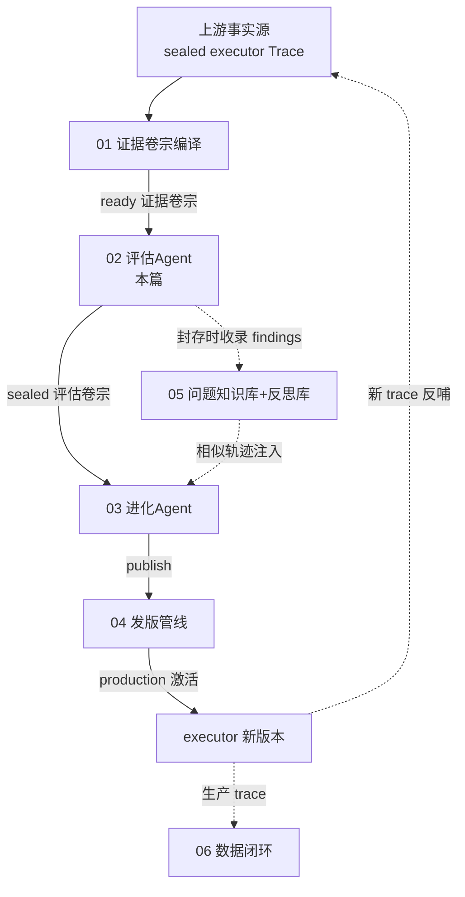
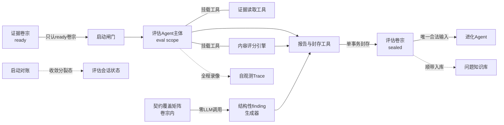
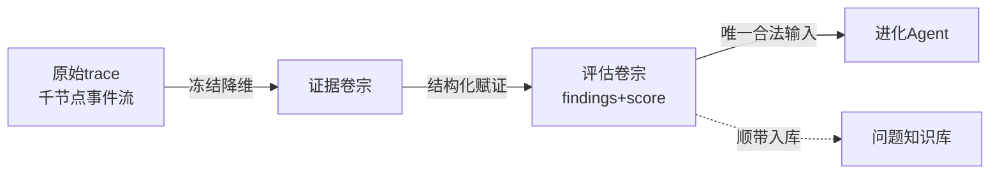
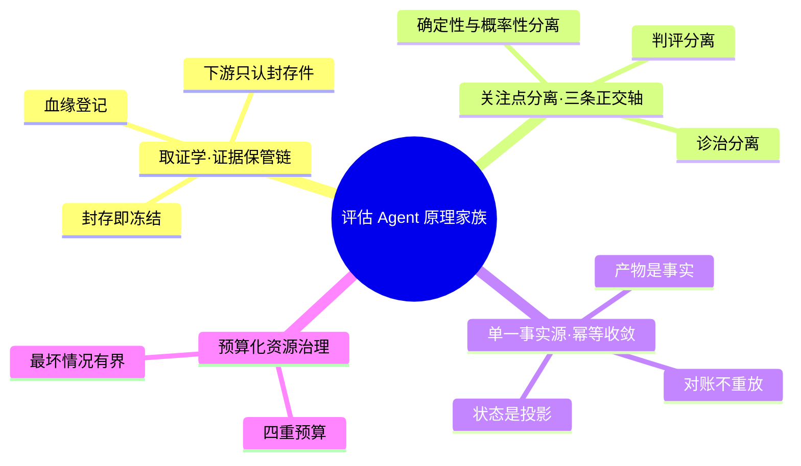

# 子块 02：评估 Agent（eval_agent）

> **层位声明**：本篇属于「进化系统深读」的设计思想层（架构师视角）——讲评估 Agent 为什么这么设计、宏观怎么运转、环节之间靠什么契约咬合、边界与代价在哪。环节内部的微观实现（具体文件、代码行、内部步骤顺序）已主动剥离；如需实现层补充，可另行要求。

## 你现在在哪：先看一眼全局地图

进化系统是 Writer（AI 长篇小说写作系统）的自我进化引擎，主干是一条单向加工链。评估 Agent 是第二段：上游「01 证据卷宗编译」把封好的 ready 证据卷宗递过来，它判完，把 sealed 评估卷宗递给下游「03 进化 Agent」。上游怎么编卷宗、下游怎么消费 findings，都只作为衔接点出现，本文不展开。

## 开读之前：先把四个承重概念接地

后面的讲解全部踩在四个概念上：**证据卷宗与封存**、**判评分离与同源偏好**、**契约覆盖矩阵与结构性缺失**、**评估终态唯一判据与启动对账**。它们在第 2、3、4、6、7 步反复出现，不先弄懂，后面每一段都会悬空。每个概念都按「先用直觉做法当挂钩 → 再给定义和类比 → 最后跑一个小例子」展开。

### 概念一：证据卷宗（EvidenceDossier）与封存（seal）——只认单据，不认现货

- **新旧对照**：直觉的评估方式是「看现场」——把写作过程的原始 trace 直接丢给评委看。本项目反着来：评估只看「卷宗」。
- **一句话定义**：证据卷宗 = 把一次写作 executor 的完整 trace（上千节点的事件流）由上游编译成一份结构化、封存后不可改的档案。封存（seal）= 盖下不可回改的章：从此这份档案是唯一事实，谁也不许再动。
- **类比**：期货交割仓库的仓单。评估不直接看田里的粮食（workspace、原始 trace），只认入库时冻结好的仓单；自己出手的产品（评估卷宗 EvaluationDossier）也再开一张新仓单。单据流转，现货永不直通。
- **小例子**：一条 1854 节点的 trace，上游编译后变成「清单与契约矩阵 / 冻结指标与正文 / 可回钻索引 / 评估工作页」四个层次，绑上版本号封存。此后评估读到的每一个字都来自这份冻结件。
- **前向预告**：为什么宁可「有损」也要这么干——第 2 步的死锁事故和第 7 步 Q1 会正面回答。

### 概念二：判评分离（eval scope 独立）与同源偏好（PLS）——阅卷老师与考生异校

- **新旧对照**：多数 LLM 评审实践是「谁强谁当评委」，经常变成生成模型自评或近亲互评。本项目规定：判分的模型家族必须与写小说的、改代码的**都不同**。（至于写作与进化两方彼此之间是否同源，不在判评分离的约束范围内——这是它「必要不充分」的已知边界，第 6 步展开。）
- **一句话定义**：判评分离 = 评估 Agent 的模型走独立配置的 eval scope，物理上不与写作/进化共用底座。PLS（Preference Leakage，同源偏好）= 模型系统性偏爱「像自己写的」输出，本该判不合格的也被轻轻放过。
- **类比**：阅卷老师与考生异校。自己人给自己人阅卷，手会不自觉地松——而且松得无声无息，事后查不出来。
- **小例子**：写作用 A 家族模型，评估换成 B 家族。A 写出的平庸段落，B 不会因为「这像我学生写的」而抬手放行。
- **前向预告**：「异家族」在第 4 步是对比主轴，在第 6 步会暴露它「必要不充分」的口子。

### 概念三：契约覆盖矩阵（contract_coverage_matrix）与结构性缺失（structural_omission）——先开工序验收单，再让医生问诊

- **新旧对照**：LLM 评委擅长抓「出现了什么问题」（文笔、逻辑），抓不住「该出现的东西没出现」——回顾式评审看不见「缺席」。缺席要靠事先写好的期望来抓。
- **一句话定义**：契约覆盖矩阵 = 把「系统本该表现出哪些行为」（记忆机制该参与、子任务该全部完成、评审该被执行）写成可机器求值的断言清单。结构性缺失 = 某条断言不满足——本该出现的工序没出现。
- **类比**：装修验收单。工人漏铺了一根水管，你盯着成品看不出来；但验收单上「水管铺设」那格是空的，空格本身就是证据。这一格不需要任何评委意见，空着就是报警。
- **小例子**：架构蓝图要求记忆系统参与写作，trace 里记忆机制出现 0 次。矩阵里这一格记 false，转成一条 high 严重度的结构性 finding——全程 0 次 LLM 调用。
- **前向预告**：「契约优先、不受 LLM 偏好影响」是第 3、4 步的支点；「契约没写的缺失照样漏」是第 6 步的头号失效边界。

### 概念四：评估终态唯一判据与启动对账（reconcile）——成功只认签收单，不认嘴上说

- **新旧对照**：直觉做法是用「状态字段」标记成败。但状态词会被旧代码、崩溃、并发写成互相矛盾的值。本项目把「成功」锚定在不可变产物的存在性上。
- **一句话定义**：评估终态唯一判据 = 业务 completed 且存在有效 sealed_dossier_id，两者齐备才算成功；Agent 正常跑完但没封存，一律算 failed。启动对账（reconcile）= 每次启动时扫描一遍，把「卷宗已封存但业务状态不是 completed」的分裂记录收敛到与事实一致。
- **类比**：快递公司判定「订单完成」只看签收单是否存在，不看各环节系统里的状态词；每天早上再拿签收单对一遍系统状态，有出入以签收单为准。
- **小例子**：封存事务提交成功后、收尾代码改状态前进程崩溃——库里出现「卷宗在、业务 failed」。下次启动对账扫到它，按 sealed 卷宗的存在把状态纠正过来，不重跑任何模型。
- **前向预告**：第 2 步事故四、第 7 步 Q4 都靠这对概念收口。

两个轻量术语，一句话接地，随用随取：

- **评分预算**：给评分环节的 LLM 调用事先划定资源上限（并发数、单次超时、重试次数、总时长），超了就判失败——像给评委的沙漏和钱包，时间与钱花完就必须交卷。
- **ready 状态（可消费）**：证据卷宗通过业务、来源 trace、编译 trace 三方校验后的状态，意思是「这份卷宗可以被下游安全消费」。

另：文中括注编号（EVD/DEC/CON/EDGE/FR/RSK 等）分别对应需求文档中的证据、决策、约束、边界、功能需求、风险条目编号，仅作出处标注，不影响理解正文。

## 第 1 步：本质锚定——它到底是什么

**一句话本质**：评估 Agent 本质上是进化流水线第二段的「独立主考官」——只读上游封存的 ready 证据卷宗，用「确定性契约层 + 异家族 LLM 评分层」双轨诊断，把「这条写作 trace 好不好、问题在哪、多严重」封存成一份不可变的 sealed 评估卷宗（findings + score），作为下游进化的唯一合法输入。

**类比：阅卷老师与考生异校**。写作的 executor 是考生，进化的 harness 是补习老师，评估 Agent 是主考官。主考官与考生不同校（判评分离）；只看冻结的答题卡，不去翻考场录像原件（只认卷宗）；交出的是盖章后不可涂改的成绩单（sealed 评估卷宗）。

这台机器有四个侧面，原料给了四张「照片」，后文会一一展开：

| 照片（类比） | 拍到的侧面 | 对应章节 |
|---|---|---|
| 阅卷老师与考生异校 | 判评分离：模型家族必须异源 | 第 2、4 步 |
| 期货交割仓库的仓单 | 消费边界：只认冻结单据，现货永不直通 | 第 3、7 步 |
| 体检报告双轨制 | 双轨检测：仪器指标与医生问诊分开出；仪器报警哪怕医生说没事，报告也必须写 | 第 3、4 步 |
| 公证处单事务盖章 | 封存：盖章（写卷宗）、回填执照（把 completed/sealed_dossier_id 写回业务状态）、登记血缘、score 落账四件核心动作一个事务，要么全成要么全无；旁挂的知识库收录虽同事务但带失败隔离——它失败只记日志，不拖垮封存 | 第 3、7 步 |

## 第 2 步：痛点动机——没有它会怎样

第 1 步的每个侧面都不是凭空设计的。以下五类事故在本系统历史里真实发生过，每一类对应今天评估 Agent 的一条硬防线。

### 事故一：自己人给自己人放水（判评同源）

早期评估与进化在代码级硬绑定同一套 scope 配置，写作的 executor scope 又默认是它的复制副本——三个 Agent 同底座模型。同源偏好（PLS）让「本该判不合格的输出」被自己家族的 judge 轻轻放过，而且完全静默：系统不报错，也不自省。需求文档引述的调研数据是 PLS 会带来 18-29% 的静默水份（EVD-004；数值为需求文档调研引述，未核实原始论文出处）。用户看不到任何异常，只是进化一直在低质量样本上打转。

### 事故二：「本该出现的东西没出现」三级漏判

一个用户实证案例：架构蓝图里明确有记忆系统，但 trace 里根本没出现记忆机制——进化 Agent 对此只字未提。拆开看，这个缺陷连闯三关：

卷宗没提取这条事实（编纂漏）→ 评估的 28 个维度全是内容与文学维度，根本没问「记忆系统参与了吗」（评估漏判，EVD-005）→ 进化只读评估卷宗，看不到就永远不知道（进化盲区）。漏判沿着链条逐级放大。「缺席型」缺陷不是调参能救的——它是结构性盲区（EVD-002/003）。这条事故直接催生了契约覆盖矩阵。

### 事故三：工具循环死锁（2026-07-20 真实事故）

评估 Agent 面对一条 1854 节点的大型 trace。读取工具名义上给「摘要」，实际给的是 28 万字符的全量树。模型在 23 分钟里反复调用这个工具 225 次，输入从 4696 token 膨胀到 98057 token。它在 trace 里明确「哀嚎」自己一直卡在循环里，却别无选择。最终用户手动停止。教训：后来修的是工具的信息架构（证据卷宗与受控回钻、评分预算），不是给模型加步数限制。

### 事故四：状态词分裂制造「假失败」

收尾层旧代码只认 `done` 这个状态词，而封存成功后写的是 `completed`——于是已经封存成功的评估被硬改回 failed。数据库里出现三方分裂：业务标 failed、sealed 卷宗已存在、Trace 却是 completed（commit 6f136c4 根因）。没有统一判据和对账时，库里会积累一批「其实成功却被标失败」的脏状态，进化入口据此拒绝可用样本——成功被系统性浪费。

### 事故五：部分失败伪装成功

早期内容评分串行且无预算。某个评分组超时或失败时，会以普通字符串返回，框架把它记成工具调用成功——缺了维度的残缺分数照样封存进卷宗。下游进化拿到的是「看似完整、实则缺角」的证据，污染无声无息（commit 6f136c4，DEC-002/CON-003）。

### 五类事故指向同一个升级

把「评估」从流水线里一个含混的 LLM-judge 环节，升级为一份**可信、可审计、自证成功**的质量判决书：

| 目标 | 靠什么 |
|---|---|
| 可信 | 判评分离 + 双轨检测 |
| 可审计 | 证据引用强制 + 单事务封存 |
| 自证成功 | 评估终态唯一判据 + 启动对账 |

## 第 3 步：模块协作与契约——宏观怎么运转

第 2 步的五类事故，没有一类是靠「换更强的模型」解决的——它们被拆成九个各守一条不变量的环节。

### 3.1 宏观协作图

一句话读图：卷宗从左进，闸门验证后才放行；Agent 主体带着工具干活，其中契约覆盖矩阵走的是完全独立于 Agent 的确定性通道；所有 findings 与评分汇到封存工具，单事务盖章出卷宗；启动对账与自观测 Trace 是两个常驻守护角色。

### 3.2 各环节契约（职责与输入→输出 / 不变量 / 动机）

| 环节 | 职责（输入→输出） | 关键不变量（核心价值） | 设计动机 |
|---|---|---|---|
| 启动闸门 | 按卷宗启动评估：dossier_id → eval_id + 后台任务 | 只接受 ready 且三方（业务/来源 trace/编译 trace）verified 的卷宗；partial/failed/不存在一律 409；**永不降级为直读 trace**；来源是进化端自观测 trace 一律拒（防递归评估）；单卷宗同时只有一个活动任务 | 消费边界在入口物理执行：不合法的评估根本启动不了，而不是启动了再防 |
| 评估 Agent 主体 | 独立顶层 Agent，自主完成从读证据到写报告的整段诊断：评估上下文（卷宗+自观测 recorder）→ 调用报告工具或失败 | 模型走独立 eval scope（FR-007）；无子代理、无文件系统工具；评估终态唯一判据 = 业务 completed + 有效 sealed_dossier_id，正常结束但未封存 = failed | 评估是「一把手单干」不搞委托链；判评分离在构建期就生效 |
| 证据读取工具 | 给模型看卷宗工作页 + 受控回钻：卷宗 → 可读文本 | 回钻只能沿卷宗 index 登记的 evidence_id，任意 ID 直接拒 | 死锁事故的根治：信息架构从「全量树」改成「工作页+可寻址片段」 |
| 内容评分引擎 | 28 维五级锚点 LLM-judge，按交付物适用组异步执行：冻结正文 → 机器可读组级结果 | 冻结数值评分预算：≤2 组并发、每组单次 60s、失败组最多重试 1 次、150s 总墙钟；成功/终态组缓存；任一必需组失败或预算耗尽 → 整体 failed，绝不封存 partial；缓存身份由 eval_id + rubric 版本 + 冻结正文 hash 共同决定——同一计算身份下重复取分零重算，身份变了（新评估、新 rubric、新正文）不会误用旧缓存 | LLM 是最贵最不稳的资源，必须预算化 + 幂等化（幂等 = 同一操作重复执行，结果不变——故重评可安全复用已成功组的缓存）；「错误不伪装成功」是硬闸门 |
| 结构性 finding 生成器 | 消费契约覆盖矩阵，把 structural_omission 违反转成显式 finding：矩阵 → finding 列表 | **0 次 LLM 调用，纯确定性加工**（CON-003）；内容维度全绿也照样产出；severity 一律 high；证据引用指向契约违反 ID | 契约违反是「仪器报警」，不受 LLM 主观判断与同源偏好影响（DEC-008 契约优先） |
| 报告与封存工具 | 组装 findings+评分，单事务封存：findings + 内容分 + 卷宗事实 → sealed 评估卷宗 | 每条 finding 必带指向卷宗冻结证据的 evidence_ref，缺了封存直接抛错；单事务 = 写卷宗 + 回填 completed/sealed_dossier_id + 血缘登记 + score 落账四件核心操作，任一步失败整体回滚；问题知识库收录虽挂在同一事务里，但带失败隔离（整体捕获异常）——收录失败只记日志、不阻断封存提交，丢失部分靠事后对账补录；一个尝试最多一份卷宗；finding id 由工具强制生成，不信任模型自编号 | 封存是评估成功的唯一标志；完整性校验保证进化凭评估卷宗就能归因，无需回钻 |
| 启动对账 | 启动时一次性扫描，收敛「封存成功但业务非 completed」的分裂态：会话 × 卷宗 → 对账报告 | 只以「sealed_dossier_id 存在且指向 sealed 卷宗」为事实；不重跑模型、不改卷宗内容、不改历史 trace 事件；整批 UPDATE 单事务 | 封存后收尾崩溃是运行期必然概率事件（EDGE-003），需要常驻收敛机制兜底 |
| 历史一次性纠正 | 修旧判据 bug 造成的存量误标：多方不可变事实 → 精确纠正 + 审计 | 目标集合必须由「有效 sealed 卷宗 + 完整内容 + 成功 Trace 终态」多方共同证明，绝不按单字段批量改写（RSK-003） | migrations 修历史缺陷，reconcile 处理运行期分裂，两者共用封存有效性判定 |
| 评估自观测 Trace | 评估过程自身的全程录像：recorder + 观测桥 → 同一条评估 Trace | 确定性阶段与绕过 Agent 框架的直连模型调用也写进同一条 Trace（CON-001 统一观测边界）；观测桥异常绝不向上传播 | 消灭「评分 trace 只有头尾两行、中间一片漆黑」的观测盲区 |

读表提示：每行最重的不是职责，而是「不变量」列——那是这一环无论怎么实现都不许破的承诺。九条不变量叠起来，才撑起第 2 步末尾的三个目标。

### 3.3 数据流的语义变换——每经一站，数据变成什么

- **原始 trace → 证据卷宗（上游完成，只看语义）**：事实被「冻结并降维」——信息量有损，但换来可审计、可复现、防上下文淹没；启动时绑定 dossier_id + 版本，之后不可变。评估端从「看现场」变成「看卷宗」。
- **卷宗 → 评估卷宗（封存）**：模型的自由文本诊断被「结构化并赋证」——每条 finding 被强制落到可校验的断言上（什么维度、多严重、该往哪个方向看），证据引用缺了封存就抛错；id 由工具重编号；契约违反 finding 机器追加；证据片段冻结进卷宗。语义从「模型说了什么」变成「每句话都指得回一条卷宗内冻结证据的可审计断言」。
- **评估卷宗 → 进化（边界外）**：sealed 评估卷宗是进化的唯一合法输入，进化按 eval_dossier_id 启动并永久绑定；冻结证据让进化不回钻也能归因。
- **评估卷宗 → 问题知识库（旁挂）**：封存事务内同库收录 findings 为不可变问题实例，收录失败绝不阻断封存。语义是「顺带入库」，不是「入库才算成功」。

## 第 4 步：决策对比——为什么不是别的方案

**本项目方案一句话**：评估只认卷宗不认现场（消费边界物理化）+ 判评分离（eval scope 独立配置，异家族警告/降级）+ 双轨检测（确定性契约层兜底 + LLM 评分层）+ 单事务封存与唯一终态判据（封存成功即唯一成功事实，对账兜底崩溃分裂）。

四个业界替代方案逐个对照：

| 方案 | 解决的核心问题 | 主要代价 | 适用场景 |
|---|---|---|---|
| 本项目：卷宗 + 判评分离 + 双轨 + 唯一判据 | 评估可信、可审计、自证成功三合一 | 一次评估分钟级、九环节复杂度、契约覆盖面有限 | 长流水线中作为下游唯一事实源的判决环节 |
| 单 judge 直评原始输出（多数 LLM-as-a-judge 早期实践）（基于模型已有知识，未联网核实） | 快速给任意输出打分 | 上下文淹没（本系统有死锁实证）、无证据引用约束、无同源偏好防护 | 轻量、一次性、低风险的快速质检 |
| OR-ensemble 异源多 judge 并集（ReaLMistake 等研究结论，EVD-008） | 3-5 个异家族小模型取并集，拉高漏判召回 | 纯 LLM 轨，漏判上限仍在；多倍调用成本 | 已列为阶段 2 计划（FR-011/DEC-013）；当前 MVP 用「单 judge 异家族 + 契约层」替代——契约层是唯一不受 PLS 影响的轨道 |
| 程序化评估函数（AlphaEvolve 式确定性测试） | 完全确定性、便宜、可复现 | 写作质量无 ground truth，程序化只适用于「结构性期望」（EVD-009 否决直接迁移；该洞察被吸收为契约覆盖矩阵的确定性求值） | 有明确正确性判据的领域（代码、数学） |
| 自我批评式同体评估（Self-Refine / Self-critique） | 零额外成本、迭代内闭环 | 自评 = 确定发生同源偏好（EVD-004；判评分离决策 DEC-007 直接反着来） | 对偏差完全不敏感的场景 |

**关键异同**：本项目的独特性不在「用了 LLM-judge」，而在两处——①把「确定性兜底」做成**契约层**而非测试层，并把它与 LLM 判分放进同一次封存里分层仲裁：契约命中即 finding，不被内容全绿覆盖（DEC-008）；②终态处理比多数开源实践多走两步——唯一判据 + 启动对账，把「评估成功」变成数据库里可证明的不可变事实，而非进程退出码。

## 第 5 步：理论抽象——这些设计背后的原理家族

把第 4 步的取舍再往上抽一层，四条原理浮出水面。

- **单向不可变证据链（chain of custody，取证学原理）**：证据一旦经手必须封存并记录血缘，下游只消费上游封存件。封存时的血缘登记（源卷宗 → 评估方 → 评估卷宗 → 分数）就是法律意义上的「证据保管链」。
- **关注点分离的三个正交轴**：谁来评（判/评分离——异家族模型）、评完干什么（诊/治分离——评估只诊断，方案归进化）、用什么评（确定性/概率性分离——契约层与 LLM 层盲区互补）。三条轴指向同一个词：**防利益冲突、防自我证实**。
- **单一事实源 + 幂等收敛（分布式系统 crash-recovery 范式）**：把「sealed 卷宗存在」作为唯一写入事实，业务状态只是它的投影；投影与事实分裂时由对账幂等收敛，而不是重放产生事实的动作（不重跑模型）。与账本系统「交易日志为准、余额可重算」同构。
- **预算化的资源治理**：对不可控外部依赖（LLM）施加「并发上限 + 单次超时 + 有限重试 + 总墙钟」四重预算，配合幂等缓存——本质是把最坏情况执行时间从无界变成有界，用失败可见性（机器可读状态）换确定性。

**四条可迁移原理**（脱离本项目依然成立）：

1. **裁判与选手必须异源**——自评系统必然退化为奖励黑客或偏好放水；物理隔离（独立 scope 配置）比提示词约束可靠一个量级。
2. **「没出现的问题」用先验契约抓，「出现的问题」才靠 judge 抓**——缺失性缺陷对回顾式评审天然免疫，必须把「系统本该怎样」显式写成可求值断言。
3. **成功要有唯一判据，且由原子动作写入**——多个状态词并存时，收尾代码一定会在某个版本里认错词；判据只能锚定在不可变产物的存在性上。
4. **崩溃不是异常是常态**——封存成功与收尾完成之间存在时间窗，启动对账以产物为事实收敛，比重跑便宜且更诚实。

## 第 6 步：边界与代价——它什么时候不灵

原理越硬，越要看清它什么时候不硬。五个失效场景，每一个都是具体画面。

### 何时失效

1. **契约作者盲区（EDGE-001）**：结构性期望得有人事先写进需求。契约里没写的 omission，契约层对它全绿——「记忆缺失」案例的原始形态，就是连契约也没写。当前 MVP 没有面向 omission 的 LLM 法官（推迟到阶段 2），纯确定性轨道对「契约没料的缺失」失明。
2. **判评分离是必要不充分（已知限制 F-012）**：它只切断「评估 ↔ 写作/进化」的同源边，而「进化 ↔ 写作」仍同源——进化改完的代码，仍由写作侧同源的配置去跑。评估能报「记忆缺失」，但进化是否正确响应，仍受自身同源偏好影响。
3. **降级路径重新引入 PLS**：eval scope 未配置时降级用进化侧配置（EDGE-005，只警告不阻塞）；同家族判定本身只是模型名前缀的粗粒度启发式——部署者配错时，防线只剩日志告警。
4. **消费边界换来的信息有损**：评估只见卷宗冻结的事实与片段（回钻限定 index 白名单、快照截断），卷宗编纂漏提的事实评估永远看不到——上游召回是评估召回的天花板，且沿「编纂漏 → 评估漏 → 进化盲」三级放大。
5. **rubric 未校准**：校准状态明确标注为 uncalibrated。28 维分数只能用于诊断，不得参与跨版本回归比较——把评分当「进化是否变好」的客观标尺是误用。

### 代价天平

| 这一侧得到 | 那一侧付出 |
|---|---|
| 可信判决（异家族 + 双轨） | 一次评估 = 一轮完整 Agent 运行 + 多组 LLM-judge + 封存事务，天然分钟级；预算把它压进 150s 墙钟，代价是超预算的评分组直接 failed、整次不得封存——宁可不评估，不评估一半 |
| 可审计（证据引用强制） | 卷宗 sealed 后不可修正：发现评估错了只能重新跑一次新评估，旧卷宗连同错误结论永远留着【基于设计理解推演，依据 seal 语义与「不改卷宗内容」多处铁律】 |
| 确定性兜底不受偏好影响 | 结构性检测只有契约覆盖到的 omission 三条（memory_recalled / subagents_complete / review_executed），召回上限有限（实现注释自己承认） |
| 单卷宗单任务、永不直读 | 进化锁死风险残留：进化侧另有规定——每项改动必须附一条来自评估的证据引用（evidence_ref），原本只认评估 finding 编号，评估漏判无 finding 时进化被锁死；FR-004 把合法证据源放宽为「finding id ∪ 契约违反 ID」两源——契约命中时进化仍可改。但契约与评估同时漏判时（EDGE-002 双重漏判）本轮不可捕获，只能诚实记「本轮未覆盖」——系统不做全知承诺 |

## 第 7 步：吃透检验——五个尖锐问题

以下问题若都能用自己的话答出，这一子块就算吃透了。参考答法按「一句话点题 → 机制怎么保证 → 代价权衡」三段展开。

### Q1：为什么不干脆让评估 Agent 直接读原始 trace？卷宗这层不是白白有损压缩吗？

**一句话点题**：这层「有损」是花大价钱买来的三重保险。**机制**：①可审计——评估结论必须能指回冻结证据，直接读现场等于让判决建立在流沙上；②上下文工程——死锁事故实测 28 万字符全量树把模型淹到循环 225 次手动停止，「工作页 + 受控回钻」是根治而非缓解；③信任边界即消费边界——评估拿到的事实与上游编纂的事实严格同源，出了问题能定位是编纂漏还是评估漏。**代价权衡**：接受信息有损、上游召回成为天花板（第 6 步边界 4）——用覆盖面换可审计与可定位。

### Q2：判评分离为什么只警告、不强制拦截同家族？这不是留了个大口子？

**一句话点题**：这是配置可用性与评估可信度之间的显式取舍，且背后有分层防线兜着。**机制**：强制拦截会让没配 eval scope 的部署直接不可用（EDGE-005 选择降级 + 警告）；同家族判定是模型名前缀的粗粒度启发式，误拦截比漏警告代价更高。真正兜底的是分层：确定性契约层完全不受 PLS 影响，LLM 层就算放水也只影响主观维度，结构性缺失照样被抓。**代价权衡**：系统把风险显式喊出来（日志告警），而不是替用户做不可逆决定——部署者配错时防线变薄，是接受的残余风险。

### Q3：内容评分「失败组不封存 partial」会不会太苛刻？28 维里 1 维超时就要整次重跑？

**一句话点题**：既不重跑，也不苛刻——这是在「显式失败」与「隐性残缺」之间选前者。**机制**：成功组有缓存，重评只重算失败组；「绝不封存 partial」护的是下游语义——评估卷宗是进化的唯一输入，缺角分数会以「看似完整」的姿态进入归因链，污染是静默的。**代价权衡**：这次 failed 是显式、可重试的；一份隐性残缺的 sealed 卷宗却是不可撤销的。宁可显式失败，不留隐性污染。

### Q4：封存已经是单事务原子操作了，为什么还需要启动对账？事务不是保证一致性吗？

**一句话点题**：事务管得住「封存这一组写操作」的原子性，管不住事务外的多个写点。**机制**：评估终态分属多个写入时机——业务状态、评估卷宗、自观测 Trace 终态各写各的；封存提交成功后、收尾代码写 Trace 终态前进程崩溃，就产生「卷宗在、业务 failed」的分裂（EDGE-003）。对账的思路是承认崩溃必然发生，以不可变产物为唯一事实做幂等收敛。**代价权衡**：不重跑模型——重跑既贵，又可能产出不同结论，反而破坏可复现性；对账只对齐投影，不重放事实。

### Q5：评估只许诊断、连改进建议都不许提，那 direction 字段不就自相矛盾？

**一句话点题**：不是矛盾，是「处方」与「方向」的精确切分。**机制**：给出具体方案（改哪行 prompt、换哪个 middleware）会替代进化自己的方案阶段、把评估偏见注入设计；但完全切断方向信号，让受同源盲区影响的进化从零推断，又矫枉过正（DEC-012 翻转了业界「发现+方向一体」的旧决策）。direction 是「该往哪个方向看」的强先验，进化可以拒绝；且绝不准指向评估器或契约代码——进化建议改考卷，等于自己给自己判分（CON-002，防 reward hacking）。**代价权衡**：接受方向信号可能带评估偏见，换取进化起点不被完全锁死；以「可拒绝 + 禁自指」把滥用面压到最小。

## 附录：证据出处与诚实标注

- 关键 commits：7faca5d（缺失性缺陷检测 MVP + 判评分离）、6f136c4（评估终态一致性与观测根治）、416951c（评估只读证据卷宗 + 原子封存）、03a92fc（进化只读评估卷宗 + 永久绑定）、bc70058（评估/进化拆成两个独立 Agent）、20260720_203244（工具循环死锁实测）。
- 诚实标注：6f136c4 引用的部分编号在仓库中未找到对应原始需求文档，内容由 commit message + 代码注释 + 系统文档三方互证；「PLS=18-29%」数值出自需求文档 EVD-004 的调研引述，未核实原始论文出处。
