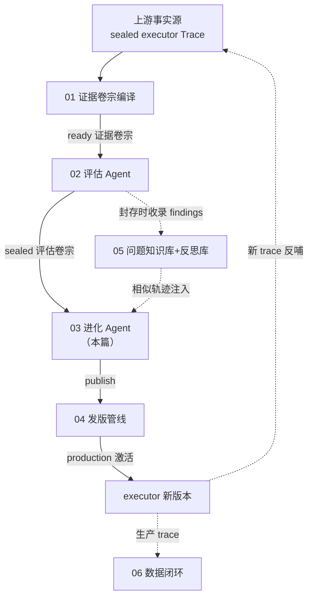
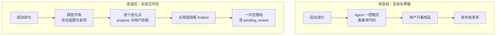
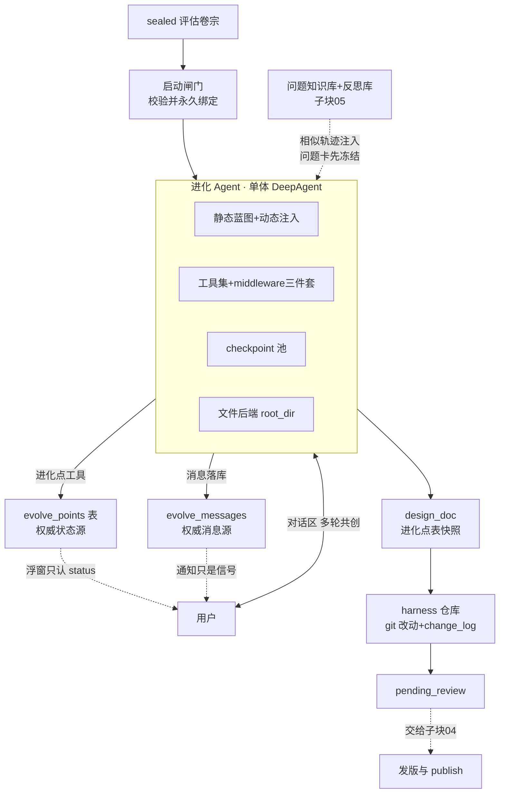
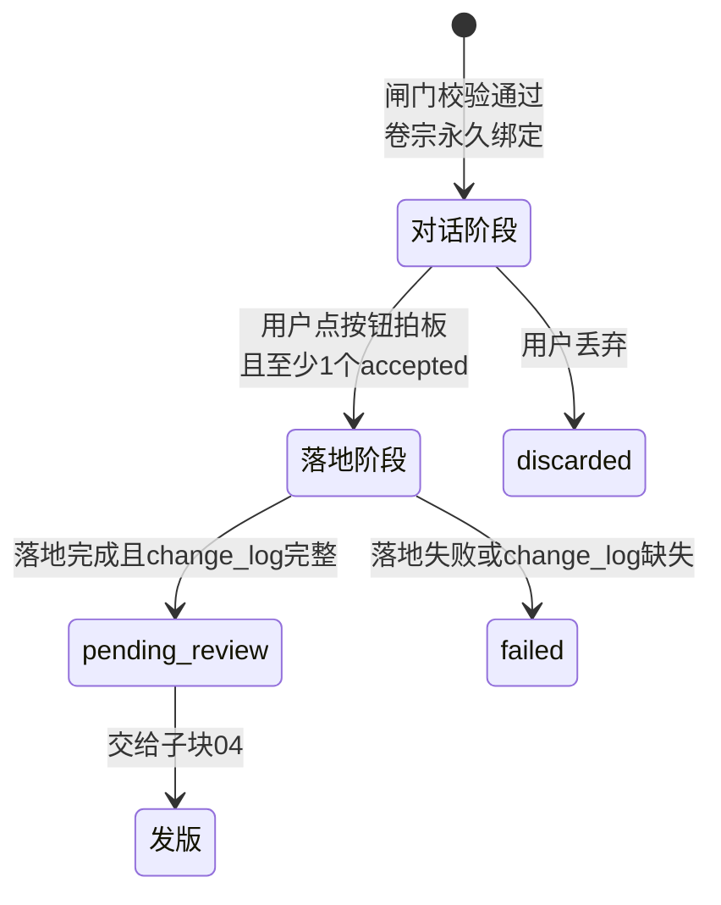
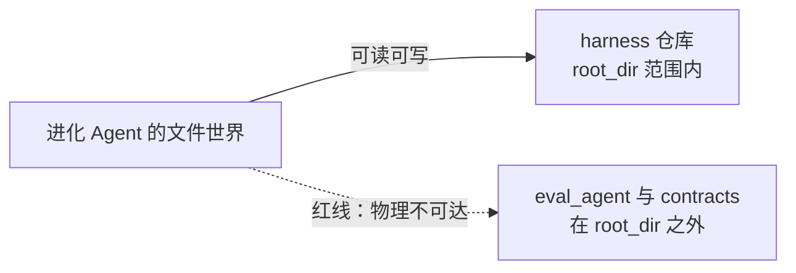
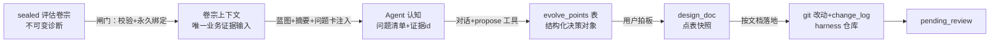
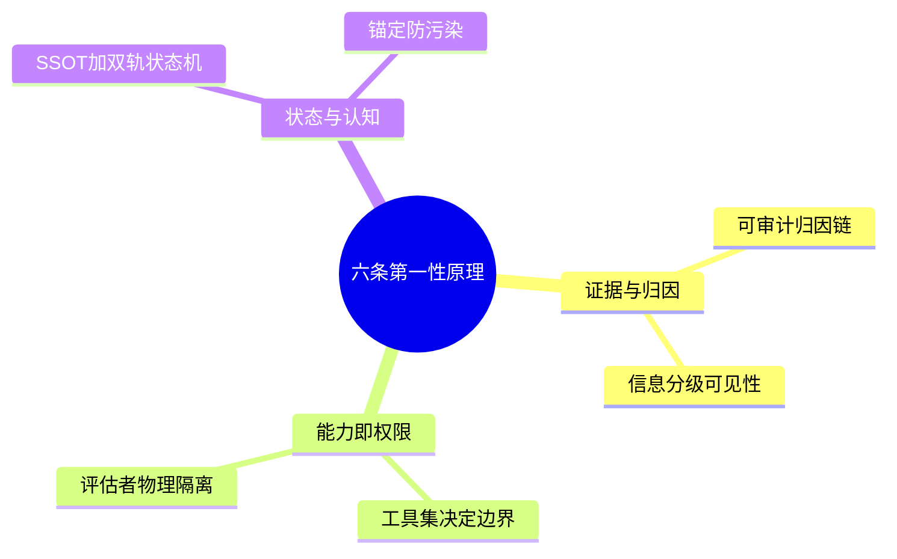
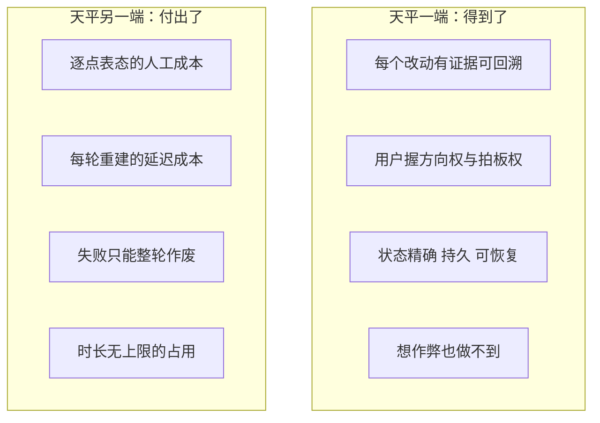

# 子块 03：进化 Agent（evolve）

> **层位声明**：本篇为**设计思想层（架构师视角）**——讲“为什么这么设计、宏观怎么运转、契约与不变量、优劣与可迁移原理”，主动剥离环节内部微观实现（不涉文件行号、代码片段与字段清单）。如需实现层补充，可另行要求。
>
> **前置知识**：读这篇只需要两件事——Writer 是一个 AI 长篇小说写作系统；executor（执行器）是里面真正写小说的那台创作 Agent 机器。进化系统是这台机器的自我进化引擎，本篇讲它的第三段。

## 全局位置：本子块在进化系统中的坐标

进化系统主干是一条单向加工链：信息只从上往下游，每一级只看上一级的封装产物。

本篇只讲 03。04（发版门禁）与 05（知识检索管线）只作为衔接点出现。

---

## 第1步 本质锚定

### 1.1 一句话本质

进化 Agent 本质上是一个**懂整台创作 Agent 机器内部结构的进化工程师**。它是一个单体 DeepAgent（单一 Agent 实例，不拆子代理），只消费 sealed 评估卷宗，与用户多轮对话共创出结构化的“进化点”，经用户逐点拍板（finalize）后，一次性修改 harness 仓库里的代码，产出 pending_review 会话等用户发布。

放到整条链上看，它是第三段加工：**把评估的诊断结论，变换成可审计的代码改动**。

### 1.2 主类比：主治医生与家属会诊

| 会诊里的角色与动作 | 进化 Agent 里的对应物 |
|---|---|
| 医生只看封装好的检查报告，不能自己回档案室翻原始胶片 | 只读 sealed 评估卷宗，原始 trace 永不直读 |
| 提出 2-4 个治疗方案并标注推荐 | 进化点 propose：2-4 个结构化备选 options + recommendation |
| 家属逐个方案拍板（同意 / 否决） | 用户逐个进化点 accept / reject |
| 全部确认后才安排一次手术 | 拍板 finalize 后一次性落地改代码 |
| 术后还需病理审查才能出院 | 落地完进 pending_review，发布权交给下游 |

还有一个补充类比，留给安全设计：**装修设计师与业主**。设计师能改的只有房子本身（harness 仓库），改不了验收规范（评估器与契约代码）——谁改验收规范，谁就等于给自己放水。

### 1.3 本质三支柱

- **认知支柱**：一份静态蓝图让它理解整台机器——系统由什么组成、怎么运转、它能改什么不能改什么。
- **共创支柱**：方向决策权在人——Agent 提案，用户拍板。
- **安全支柱**：输入端只读 sealed 卷宗，输出端只写 harness 仓库，两端都收窄。

### 1.4 先备地基：五个反复出现的概念

后面六步全部立在这五个概念上。这里不弄懂它们，第3步的契约和第7步的追问都会悬空。对照锚定：如果你熟悉 GitHub PR 和 code review，你已经有了挂钩——进化点比 PR 更靠前一步，评估卷宗比 diff 更上游一步。

**① sealed 评估卷宗（EvaluationDossier）**
- 是什么：评估 Agent 对一次运行做完诊断后，把结论**封存**成的不可变数据包。“sealed”就是封存动作——封存后任何人（包括进化 Agent）都改不了它。
- 像什么：医院封装好的检查报告。医生据它开方案，但不能回档案室改数字。
- 跑一遍：进化会话创建时记下卷宗 ID，此后**永久绑定**。哪怕第二天有了更新的评估，旧会话也不会自动换成新卷宗。

**② 进化点（evolution point）**
- 是什么：一条结构化改进提案，带 2-4 个备选方案（options）和一个推荐（recommendation）。状态三态：proposed → accepted / rejected。
- 像什么：治疗方案单。一张单子一个治法，家属逐张签字或划掉。
- 跑一遍：Agent 在对话里调 propose 工具，浮窗出现一张“方案卡”，状态 proposed；用户点同意变 accepted，点拒绝变 rejected。

**③ 双轨制（DB 权威 + 对话联动）**
- 是什么：决策状态的**唯一权威在数据库表**（evolve_points），对话文字只是讨论过程，不构成状态。
- 像什么：法庭。控辩双方说什么都不直接改变判决——落笔在判决书上的才算数。判决书是 DB 状态，庭审发言是对话。
- 跑一遍：Agent 在对话里说“用户同意方案 B 了”，但只要没调状态变更工具，浮窗纹丝不动（第7步会专门追问这个例子）。

**④ harness 仓库（evolution/harnesses/repo）**
- 是什么：执行器的“身体”——提示词、中间件、工具、技能等要素所在的代码仓库，也是进化 Agent 唯一被允许修改的对象。
- 像什么：装修案例里的房子：能动房子，动不了验收规范。

**⑤ reward hacking 与物理隔离（CON-002）**
- reward hacking 是什么：被考核者修改考核标准来给自己加分——学生自己改考卷，运动员自己当裁判。
- 物理隔离是什么：让“改考卷”这条路在能力层**根本不存在**——评估器与契约代码被放在进化 Agent 文件世界的边界之外，而不是口头叮嘱“别改”。
- 跑一遍：进化 Agent 试图改评估器代码——一般文件工具的请求在能力层就到不了那个目录（root_dir 圈外物理不可达）；改源码工具则另有显式前缀拒绝这道纵深防线，命中禁改前缀会得到一句明确报错“这是防 reward hacking 的红线……自己改考卷”。两道防线分工见第 3 步环节 11。

前向预告：②③是第3步与第7步的主角；⑤在第5步（理论）与第6步（代价）回响；①在第2步（痛点）先立起来。

---

## 第2步 痛点动机

本质立住了。接下来回到改造前的世界，先痛一下，看它为什么要长成这样。

### 2.1 核心痛点：全自动进化的“不可控 + 不可见”

具体场景（改造前的真实体验）：

用户点下“开始进化”，界面沉默。后台里 Agent 一路狂奔：自己归因、自己定方案、自己改代码，中途不停、不问。十几分钟后甩出一个成品。用户面对的是一道二选一选择题：**整体发布，或整体丢弃**。想问“你为什么改这里”——没有对话过程可看。想拒掉其中一条改动——做不到，只能整轮报废。方向错了？等全部跑完才发现，整轮 token 与人工审查成本全部浪费。

改造的核心诉求是两样东西：
- **可见性**：用户看不到“它懂什么、能改什么、正在按什么思路改”，信任无从建立。蓝图可视化就是为建立信任。
- **可控性**：把交互单元从“跑完的成品”改成“一个可单独否决的进化点”。

### 2.2 次级痛点：七个各有实锤的病灶

1. **进化旁路污染**：改造前进化能直读原始 trace / 完整证据卷宗——等于绕过评估权威自行归因，两套归因会打架。更糟的是按 trace_id 动态拼“最新评估”，输入会在用户不知情时悄悄变化（需求 R15）。→ 对策：只读 sealed 评估卷宗 + 永久绑定。
2. **评估漏判死局**：evidence_ref（证据引用，每条改动必须引用的证据源编号）原来写死只认 finding id（评估发现编号）。评估漏判、没产出 finding 时，进化连 design_doc 都产不出——改进动力明明存在，却不许改（EVD-007 定性：这是“记忆缺失进化没提”用户案例的直接代码根因）。→ 对策：FR-004 多源松绑。
3. **Reward hacking 敞口**：若进化能改评估器/契约代码，它就能改评分依据给自己放水。→ 对策：CON-002 物理隔离。
4. **对话文字 ≠ 状态变更**：方案在自由文本里讨论，刷新即丢，前端浮窗也无法可靠渲染——浮窗只认工具调用带来的 DB 状态。→ 对策：双轨制。
5. **Agent 误等文字指令**（git 8b7dffa 实锤）：prompt 没讲清两阶段制时，Agent 误以为要等用户在对话里发"finalize"文字。叠加 FlowGuard 拦截落地工具，用户看到的是“点了开始进化没反应 + 对话被禁止”的死锁。
6. **消息流断裂**（git 2ce4dda / fa561d9 实锤）：消息记录组件的状态放在内存里，跨请求就丢，前端因此从不刷新。教训：**可见性链路也是承重链路——它坏了，用户以为 Agent 死了**。
7. **工具接口 JSON 反模式**（git 51e276a）：早期工具参数靠模型手写嵌套 JSON 字符串，解析失败频发，propose / design_doc 高频报错。→ 对策：结构化参数。

一句话收束：七个病灶指向同一个设计结论——**过程要可见、状态要精确、边界要物理、失败要诚实**。第3步就看这四个词怎么落成模块契约。

---

## 第3步 模块协作与契约（信息密度最高的一步）

### 3.1 宏观模块协作图

图上三件事值得先点破：
- **DB 是权威、对话是通道、改动进 git**。evolve_points 与 evolve_messages 两张表是状态与消息的唯一真相，前端浮窗和通知帧都只是投影。
- **知识库的注入有一条纪律线**（虚线）：相似历史轨迹只在“当前问题卡冻结之后”进入上下文，防锚定（见环节 3）。
- **血缘关系**：进化自己起一条新的根 trace，以 consumes 关系链接到评估卷宗（Span Link——链路追踪里把两条独立轨迹关联起来的血缘关系）。也就是说，进化 Agent 的每次运行自己也是被观测的。

### 3.2 会话生命周期：两阶段制的骨架

进化会话（evolve session）宏观上就是“先会诊、后手术”两个阶段，由用户点按钮换轨：

| 收场方式 | 语义 | 什么情况进入 |
|---|---|---|
| pending_review | 落地完成，等发版 | 落地成功且 change_log 完整 |
| failed | 没收敛 / 落地失败 | recursion 触顶、落地失败、change_log 缺失 |
| cancelled | 用户主动停止 | 用户停止 |
| cancel_timeout | 取消超时（不谎报成 cancelled） | 取消没在时限内完成 |
| discarded | 整会话丢弃 | 用户丢弃（同时清理 checkpoint 文件） |

注意换轨是**单向的**：进入落地阶段后不能回对话、不能改进化点——拍板即清单冻结。failed 之后没有“续跑”，只能丢弃重开。

### 3.3 逐环节契约

以下按数据流顺序过一遍十一个环节。每个环节给四件事：职责、契约（输入 → [保证的不变量] → 输出）、核心不变量、设计动机。**不变量是每个环节的核心价值，不能省。**

#### 环节 1：会话启动闸门

- **契约**：sealed 评估卷宗 → [保证：绑定永久不可变] → 绑定了卷宗的进化会话
- 职责：校验卷宗封存完整；无结构化 findings 直接拒绝；来源卷宗属于“取消”类运行时必须人工显式确认；单会话锁（同一时刻只允许一个活跃会话）；写入绑定关系。
- 不变量：**进化会话永久绑定该评估卷宗 ID，禁止自动使用最新结果，禁止会话创建后切换输入**。recorder（过程录像组件）不可用时直接拒绝启动——宁可不开进化，不可无录像。
- 动机：把“进化的输入”从模糊的 trace 关联，变成一个不可变、可审计的版本化对象。

#### 环节 2：Agent 构建与认知注入

- **契约**：绑定后的卷宗上下文 → [保证：Agent 认知有边界、有历史、有观测] → 一个知道自己能干什么的进化 Agent
- 构成：静态蓝图（共 8 段，覆盖角色定位、两阶段拍板机制、能力边界、九要素全景、运转机理、State 约束、工业五阶段流程、工具说明）+ 动态注入（反思库摘要——按 findings 的 dimension 查、每类 top3；相似历史问题轨迹；当前会话与评估摘要）。
- 蓝图独立暴露：打开进化页即可看，不依赖会话存在。**这就是“Agent 怎么知道系统能改什么”的答案**——蓝图明确划出可改要素（prompts / middleware / tool / subagents / skills，外加 memory 横切文件）与不可改项（State 直接改、assemble、manifest），并写明一句关键原则：“你能做什么，完全由你挂载的工具集决定。”
- 随身装备三件套 middleware（框架里包在工具调用外面的拦截层）：禁框架文件系统工具、FlowGuard（阶段门控）、Trace（自观测）；文件后端 root_dir 指向 harness 仓库、开虚拟模式（虚拟模式 = 所有文件操作都被圈进 root_dir 划定的虚拟文件世界，圈外路径对 Agent 不存在——物理隔离的实现载体）。
- 不变量：recursion 上限显式调到 200——框架默认 25 会误杀长进化；触顶兜底标 failed，不谎报。进化不设总超时护栏，让它自然跑完。

#### 环节 3：知识注入子系统（消费侧）

- **契约**：当前问题 + 历史知识库 → [保证：独立分析不被历史污染] → 带事实轨迹参照的上下文
- 顺序不变量（DEC-15）：**先冻结当前问题卡，再检索注入相似历史轨迹**。问题卡是“当前问题的独立分析锚点”，内容覆盖问题、直接证据、根因假设（带置信度）、替代解释、未知项，由规则启发式生成、不调生成模型；历史比较只能追加记录，不能覆盖快照。
- 注入纪律（DEC-18）：只陈述事实轨迹（确认状态、匹配依据、效果验证阶段），不生成经验对象 / 等级 / 推荐；降级不说谎——检索失败时注入“知识检索不可用”，不得表述为“无历史问题”；每组最多做 1 次 embedding（文本转向量做相似检索），结果缓存复用。
- 动机：R16 风险原文——“历史案例在当前问题独立分析前进入上下文，会锚定本次归因并放大历史错误”。这是对抗锚定偏差（anchoring bias：先入信息绑架后续判断）的工程化。

#### 环节 4：inspect round（探查）

- **契约**：trace_id + 绑定卷宗 → [保证：只读、不提案] → Agent 开场白 + 会话进入对话阶段
- 职责：Agent 主动开场，总结评估发现并提出讨论方向；开场白作为 assistant 消息落库。
- 不变量：本阶段禁调落地工具、禁 propose，探查只读——“先让用户了解全貌”。
- 动机（决策 J）：把用户拉进对齐循环，而不是等成品。

#### 环节 5：converse round（对话共创）

- **契约**：单条用户消息 → [保证：并发安全 + 状态可恢复] → Agent 回复 + 可能的进化点工具调用
- 不变量：仅对话阶段可发消息；并发 round 保护返回 409（防孤儿任务与 checkpoint 竞态）；**对话史不随消息传递，全凭 thread_id 从 checkpoint 恢复**——业务上下文（卷宗/会话状态）不常驻，每个请求从 DB 重建，模型对话史则由 checkpoint 池恢复。
- 动机：无状态 runner + 状态全在 checkpoint / DB，进程重启自然恢复。

#### 环节 6：进化点双轨制

- **契约**：对话中的方案讨论 → [保证：状态精确、持久、可渲染] → evolve_points 表里的结构化决策对象
- 职责：Agent propose（options 2-4 个结构化备选 + recommendation）；用户表态后 accept（记录 chosen_option）或 reject。`evolve_points` 表是**权威状态源**，前端浮窗只认 DB status（决策 B / T7）。
- 不变量：status 三态 proposed → accepted / rejected；seq 会话内单调。propose 时顺带做问题知识库归属登记——一个进化点只归属一个目标问题，表达“为什么提出该计划”，与是否采纳无关；解析失败不阻断。
- 对话联动：进化点工具的调用结果落 tool 消息并携带 related_points（前端对话与浮窗双向高亮）；自由文本探讨不进浮窗。
- 动机：把“讨论过程”（对话）与“决策状态”（DB）解耦——讨论可以发散，状态必须精确、持久、可渲染。

#### 环节 7：消息通道与事件通知

- **契约**：Agent 的流式输出帧 → [保证：DB 是唯一真相] → evolve_messages 权威消息 + 通知信号
- 职责：流式帧派生两类副作用——①持久化消息到 evolve_messages（**权威消息源**；白名单工具才落 tool 消息，只读探查不污染对话史）；②发 message_updated 通知帧，前端收到后按 after_seq 增量拉取权威消息。
- 不变量：消息 seq 会话内单调（唯一约束）；无 token 流，前端轮询。
- 动机：曾因 token 流入 trace 造成观测污染。重构后的原则是“DB 是唯一真相、通知只是信号”。

#### 环节 8：checkpoint 池

- **契约**：会话 ID → [保证：对话史完整可恢复] → 每会话独立的持久化状态存储
- 职责：每个 session 一个独立 SQLite，thread_id 即 session_id，Agent 框架据此恢复完整对话史；惰性创建、线程安全、discarded 时删除文件（决策 I / T5）。
- 与 evolve_messages 的分工：checkpoint 供 Agent 框架恢复**模型视角**的对话上下文，evolve_messages 供前端渲染与审计**人视角**的权威消息——两份存储各司其职、互不替代。
- 动机（docstring 明言）：单会话锁保证同时只有 1-2 个活跃 session，无需 LRU 上限（缓存淘汰策略）；另设防御性兜底 saver 上限——真超了说明状态机出 bug，日志告警。

#### 环节 9：finalize 拍板落地

- **契约**：全部 accepted 进化点 → [保证：清单冻结 + 文档先行 + 可审计] → pending_review 会话
- 前置：对话阶段 + 至少 1 个 accepted；触发**只能是用户点界面按钮**，由 API 层推进状态——防止 Agent 越权自催落地。
- 变换：accepted 进化点变成 design_doc（每个点映射为一条改动说明——改哪个目标、改什么、为什么、证据哪来、预期什么变好什么变差），并回填 point 的 design_ref，形成“点 ↔ 文档”双向可追溯；随后进入落地阶段（FlowGuard 解锁落地工具），Agent 按 design_doc 逐条改代码、校验改动、写 change_log，最后进 pending_review。
- 不变量：落地阶段不能回对话、不能改进化点（拍板即清单冻结）；change_log 缺失 → failed；FlowGuard 强制 design_doc 先于 change_log。
- 动机：design_doc 有双重身份——既是给 Agent 的落地指令，也是下游 review / publish / registry 的兼容契约（“design_doc 作为进化点表快照”）。

#### 环节 10：FlowGuard 硬门控

- **契约**：工具调用请求 → [保证：未拍板不可能改码] → 放行或拦截
- 不变量：“未拍板不改码”是 middleware 拦截的**硬约束，不靠提示词自律**（决策 T9 / Z）；nudge（拦截后的提醒引导）上限 3 次，防死循环。
- 动机：prompt 是软约束，模型会漂移；框架层拦截是确定性边界。

#### 环节 11：CON-002 物理隔离

- **契约**：Agent 的文件操作 → [保证：评估依据物理不可达] → 只落在 harness 仓库内
- 主隔离：文件后端 root_dir 限定为 harness 工作目录 + 虚拟模式——eval_agent / contracts 在 root 之外**物理不可达**。纵深防御：edit_source 显式禁改前缀拒绝，命中即报“这是防 reward hacking 的红线……自己改考卷”；AC-012 / 019 要求违规拒绝并记录违规尝试。

- 动机【基于设计理解推演，代码注释部分确证】：防 reward hacking 不能只靠 prompt 声明——prompt 可被注入、会漂移，必须让违规路径在能力层不存在。root_dir 物理隔离保证“想做也做不到”；前缀拒绝是给 Agent 清晰报错 + 防未来配置回归的双保险。

### 3.4 环节间数据流语义变换

把整条链串起来读，每个环节都改变了数据的“形态”：

一句话版本：闸门把卷宗变成“绑定的唯一证据输入”；注入把输入变成 Agent 认知；propose 把认知变成表里的决策对象；拍板把决策对象冻结成文档快照；落地把快照变成 git 改动；change_log 让改动可审计；pending_review 把发布权交给下游。而**原始 trace 在这条链上永远不出现**——进化能看到的，只有评估卷宗里冻结的片段。

---

## 第4步 决策对比

契约看清了。把镜头拉远：同样的需求，业界还有哪些解法？

**本项目方案一句话**：对话式共创 + 结构化进化点双轨制 + 拍板后一次性落地——人机各掌一半权（Agent propose、人 accept），状态进 DB、过程留对话、改动进 git。

三个业界替代方案（**未联网核实，基于模型已有知识**）：

1. **全自动自进化闭环**（如 Voyager 的 skill library 自动提炼+验证、AutoGPT 式循环）：改动由机器自己验证、自己采纳。省人力，但缺价值对齐——AI 写作系统的“好”标准本身在演化（写作风格取舍），全自动会把“改进”漂移成“迎合评估器”。本项目选择把方向决策权留给人。
2. **Agent 出 PR、人 code review**（Claude Code / Copilot Workspace 范式）：本项目其实吸收了这一范式——pending_review + design_doc + change_log 正是“PR + 描述文档 + 变更记录”三件套的对应物。但更进一步：在**方案设计阶段**（而不只是代码阶段）就引入人，通过进化点 options 把“怎么改”的分歧前置到对话里解决。
3. **纯 HITL interrupt 阻塞式**（LangGraph interrupt——Agent 跑到关键点暂停等人）：本项目不用 interrupt 而用“按需触发 round”（决策 T2）：每条用户消息一次调用，跑完即止——无长驻会话、无超时管理负担、进程重启无损。

| 方案 | 解决的核心问题 | 主要代价 | 适用场景 |
|---|---|---|---|
| 本项目：对话式共创+双轨制+拍板落地 | 方向对齐与过程可控——改进什么、怎么改由人逐点把关，每个改动有证据链 | 人工交互负担重；每轮重建有延迟；失败不可回退 | “好”的标准本身在演化的系统（如写作风格），高价值低频进化 |
| ① 全自动自进化闭环 | 省人力，进化频率可以很高 | 缺价值对齐，“改进”易漂移成“迎合评估器”；归因链弱 | 目标函数清晰、可机器验证的领域 |
| ② Agent 出 PR + 人 review | 人握最终合并权，审查界面成熟 | 人的介入晚——只在代码阶段，方案分歧没前置 | 通用软件开发协作 |
| ③ HITL interrupt 阻塞式 | 关键点暂停等人，实现直观 | 长驻会话、超时管理、重启恢复都要自己扛 | 短生命周期流程内的单点确认 |

**关键异同**：与②的共同点是“人都握最终发布权”；差异是本项目把交互单元从“一次 diff”细化到“一个进化点的一个 option”。与①的共同点是都信“运行事实驱动改进”；差异是本项目每个诊断都可回溯到 sealed 证据 id（evidence_ref 必填），而全自动方案通常缺归因链。

---

## 第5步 理论抽象

对比之后，把本项目的选择提炼成可带走的原理。六条第一性原理，分三个家族：

1. **可审计归因链**：每个代码改动必须引用至少一个证据源 id（finding id ∪ cv-id——cv-id 即契约覆盖矩阵命中违规项的编号，如“记忆系统未参与”这条契约违规）。“改动必有证据”是 FR-004 松绑后仍守住的底线。对应 RLHF / 评估系统里“policy 变更需绑定 reward 证据”的思想——行为变了，必须能回答“因为什么变了”。
2. **能力边界即权限边界**：蓝图原文“你能做什么，完全由你挂载的工具集决定”。安全不靠承诺，靠“违规工具根本没挂载”：禁框架文件系统工具、不给改 State 的工具、root_dir 物理隔离——路径不存在，即做不到。
3. **防 reward hacking 的评估者隔离**：被优化对象（进化 Agent）与评估依据（eval_agent / contracts）物理分离——同强化学习里“reward model 不能让 policy 读写”的经典约束。
4. **SSOT + 双轨状态机**：决策状态唯一权威在 DB（evolve_points.status），对话、浮窗、事件流都是它的投影；消息通道同理（evolve_messages 权威，通知帧只是信号）。
5. **信息分级可见性（单向有损加工链）**：原始 trace → 证据卷宗 → 评估卷宗 → 进化，每级只看上一级的封装产物。对标 OTel / LangSmith“原始遥测与派生评估数据分离”（需求原文自认）。
6. **锚定防污染**：先冻结独立分析（问题卡）再注入历史——对抗上下文注入带来的 anchoring bias。可直接迁移到任何 RAG 辅助决策场景。

**可迁移原理（拿走就能用）**：
- **硬约束下沉到 middleware，软约束留给 prompt**——模型自律会漂移，确定性边界要放在框架拦截层。
- **按需触发 + checkpoint = 无状态长对话**——runner 无状态、状态全在持久层，这是 Agent 服务水平扩展的前提。
- **结构化对象作为人机交接面**——自由文本适合探讨，结构化记录适合追溯与渲染，两轨并存各取所长。
- **失败诚实分级**——recursion 触顶 = failed（Agent 没收敛）、用户停止 = cancelled、取消超时 = cancel_timeout（不谎报成 cancelled）。终态语义不混并，是可运维的前提。

---

## 第6步 边界与代价

原理听起来都很美。这一步专讲它们什么时候失灵、代价是什么。

### 6.1 何时失效：六个具体场景

1. **双重漏判（EDGE-002 原文）**：“评估器漏判但契约校验也漏（双重漏判）→ 若 drill-down（下钻复核）也未能发现，该缺陷本轮不可捕获。”FR-004 松绑只解了“评估漏但契约命中”，解不了“都漏”。画面：某结构性缺陷评估没出 finding、契约也没拦住，进化这边证据源全空，只能明确报死局并指引重新评估。
2. **进化时长无上限**：明注“不设总超时护栏”。recursion 上限 200 是唯一兜底，且触顶即整会话 failed——丢全部上下文，不能续。画面：一次落地卡在反复尝试里，用户只能干等或主动停止。
3. **finalize 失败不可回退（决策 I）**：落地失败 → failed → 只能丢弃重开（git reset + clean），对话与拍板成果作废。画面：聊了一小时、拍板五个点，落地到第三条挂了——整轮重来。
4. **单会话锁的连锁阻塞**：ACTIVE 状态包含 pending_review，发版管线侧的旧两阶段门禁（三件套门禁，子块 04 的机制——不是本篇的对话/落地两阶段制）曾导致 session 永卡 pending_review、锁死后续所有新进化（85af690 确证，属子块 04 交界）。画面：上一轮忘发布，下一轮进化怎么都启动不了。
5. **stop 的脏文件边界（注释自认）**：“Agent 若停在改源码中途，harness 仓库下可能留脏文件，本端点不清理。”画面：强停之后 git 工作区一片狼藉，要手工收拾。
6. **知识注入降级**：向量 / 全文检索不可用时注入降级说明——历史参考缺席但进化继续（且不谎报“无历史问题”）。

### 6.2 副作用与牺牲

- **人工成本**：每个进化点需用户表态、拍板需点按钮——共创的自由度换来交互负担。
- **Token / 延迟成本**：每条消息都要重建上下文、重建 agent、重组 system prompt（蓝图+反思+轨迹注入每次重算，仅 embedding 有缓存）【重建部分代码确证，成本量级为推测】。
- **seq 分配竞态窗口**：evolve_messages / evolve_points 的 seq 用 MAX+1 非原子分配，靠单会话锁 + 并发 round 409 保护才安全——锁若失效会撞唯一约束【基于设计理解推演，并发保护代码确证】。
- **checkpoint 文件残留**：failed 会话不主动清理 checkpoint（仅 discard 清理），孤儿文件可能残留【代码确证】。
- **消息派生失败静默**：消息持久化异常只记 ERROR 不中断——前端可能暂时看不到 Agent 动作。

### 6.3 诚实标注：一个“存在过但不在现行 HEAD 里”的机制

「架构层问题上报」（六要素硬尺子判定 + 落盘 + 前端面板）在 commit 6911c25 实现过，但该 commit 只存在于分支，**未合入当前 HEAD**。理解和使用时都不要把“上报机制”当作现行能力。

---

## 第7步 吃透检验

最后用六个尖锐问题自检。每个答法三段：一句话点题 → 机制怎么保证 → 代价权衡。

**Q1：进化 Agent 明明是“最懂系统”的 Agent，为什么连原始 trace 都不让读？**
一句话：因为评估卷宗是唯一评估权威，直读 trace 等于绕过权威自行归因。机制：①两套归因会打架，所以进化只消费封存的诊断；②封存时 finding 引用的证据片段已冻结进 frozen_evidence，归因够用；③防输入漂移——按 trace_id 拼“最新评估”会让历史会话的输入悄悄变化（R15），所以永久绑定 dossier_id。代价张力：只信评估卷宗，意味着进化视野受限于评估的查全率——这正是后来“评估漏判”问题的代价来源，系统用 FR-004（cv-id 多源）打了补丁。

**Q2：用户在对话框里打“开始落地吧”，会发生什么？为什么这么设计？**
一句话：什么都不会发生——Agent 不能也不会因此开始落地。机制：FlowGuard 在对话阶段硬拦截全部落地工具；prompt 铁律还要求 Agent 明确引导用户去点浮窗底部按钮（8b7dffa 的教训）。拍板是状态机推进权，属于 API 层。代价权衡：若 Agent 能靠对话文字触发落地，就等于 Agent 自己能催自己落地（越权），且文字指令无法持久化“谁在何时拍板”——审计链会断，所以宁可让用户多点一次按钮。

**Q3：双轨制里，Agent 在对话里说“用户同意方案 B 了”但不调状态变更工具，浮窗会怎样？这个设计防的是什么？**
一句话：浮窗毫无变化。机制：前端只认 evolve_points 表的 status，自由文本不进浮窗（决策 B）。防三件事：①对话状态不可靠——模型转述可能出错或幻觉；②不可渲染不可恢复——刷新就丢；③不可审计——“谁在何时选了哪个 option”没有结构化记录。代价：用户必须用按钮表态，多一次交互，换三个保证。

**Q4：evidence_ref 为什么必填？“无 finding 死局短路”为什么曾是 bug，现在怎么解的？**
一句话：必填保“每个改动必有证据”的归因底线。机制：它防盲改、防迎合性改动。原实现只认 finding id，评估漏判（如记忆系统缺失这类结构性问题）时进化被锁死——改进动力存在但不许改；FR-004 松绑为 finding id ∪ cv-id。这里有个容易拧住的点：cv-id 的载体是卷宗里的**结构性 finding**——它由契约覆盖矩阵确定性生成（0 次 LLM），跟 LLM 评估层有没有产出 finding 是两回事。所以“LLM 评估漏判无 finding、但契约命中”时，结构性 finding 照样存在、cv-id 照样合法（AC-005：此时进化仍可产出 design_doc）；只有卷宗里根本没有对应结构性 finding 时的凭空引用才被拒。代价：所有证据源都空时仍是明确死局并指引重新评估——松绑有底线。

**Q5：进化 Agent 为什么禁写 eval_agent / contracts？只靠 prompt 说“别改”会怎样？**
一句话：防“给自己改考卷”。机制：进化在优化 harness，评估在给进化打分——被优化者若能改打分依据，进化会漂移成“改评估器比改 harness 更容易涨分”。只靠 prompt 不够：prompt 可漂移、可被注入。所以做双层：root_dir 物理隔离（违规路径物理不存在）+ forbidden-prefix 显式拒绝（清晰报错 + 防配置回归的纵深），AC-012 / 019 还要求记录违规尝试。代价：多一层配置复杂度，Agent 偶尔撞墙要吃一次明确报错——换“想做也做不到”的确定性。

**Q6：为什么要先冻结问题卡再注入历史轨迹，顺序反过来会怎样？**
一句话：先独立考试，再看答案。机制：反过来就是历史案例先进上下文，Agent 会拿历史方案套当前问题（anchoring bias），根因假设被带偏还自以为有据。冻结问题卡之后，历史只用于事后比较差异，且比较只能追加记录、不能覆盖快照；一期只注入事实轨迹、不注入经验结论——因为未验证的经验是双倍的风险。代价：少了“站在历史肩膀上”的捷径，用归因速度换归因独立性。

---

## 证据与已知缺口（诚实边界）

**证据锚点（择要）**：bc70058（单体进化 Agent 重构起源）；aa8edba / d5ed8ef / f87f128 / 1859535（对话式共创分阶段落地）；093b381（蓝图九要素 + recursion 200）；f640d72（trace / 消息双通道分离）；03a92fc（只读评估卷宗 + 永久绑定）；7faca5d（FR-004 松绑 + CON-002 前缀）；51e276a（工具去 JSON 反模式）；5993ebf（发版链路加固）；85af690（发版单阶段，交界子块 04）。

**证据不足处（如实声明）**：
- 「单体 vs 三体」重构的完整决策文档未找到（决策编号只存在于代码 docstring），动机只能从 commit message + 单体架构优势推演【含推测成分】。
- 反思库注入的实际效果没有运行数据佐证。
- 「seq 并发安全完全依赖单会话锁」这一推断，未见专门的并发测试验证。

**下一站**：pending_review 之后的发布、门禁与回滚，交给子块 04（发版管线）。
