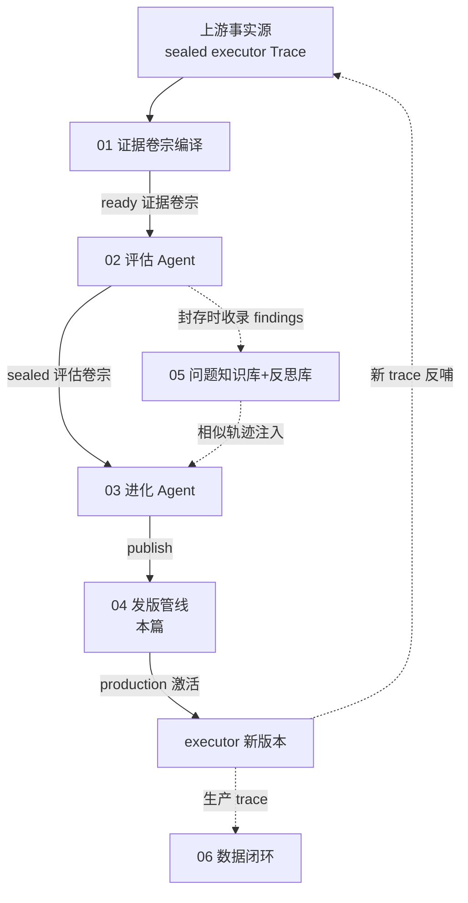
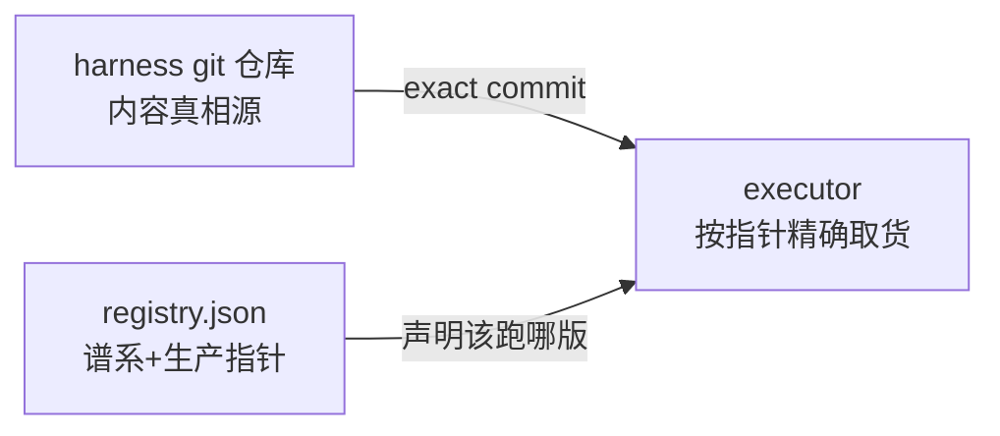
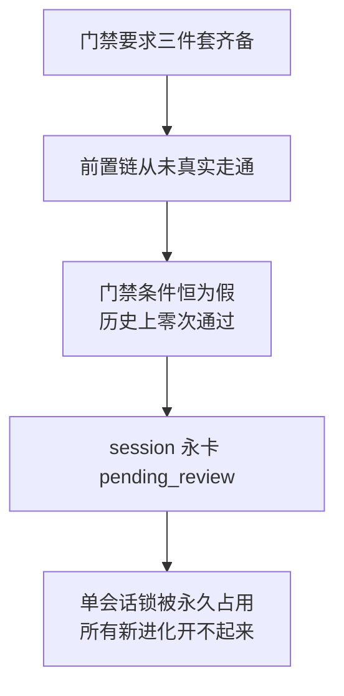
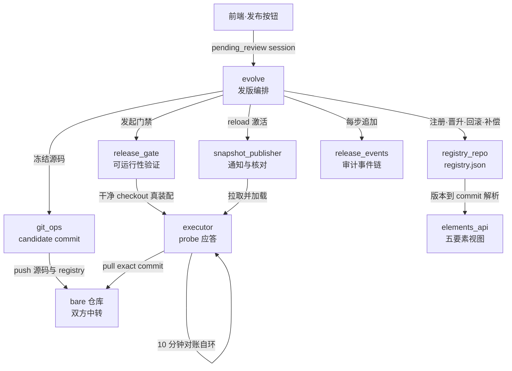
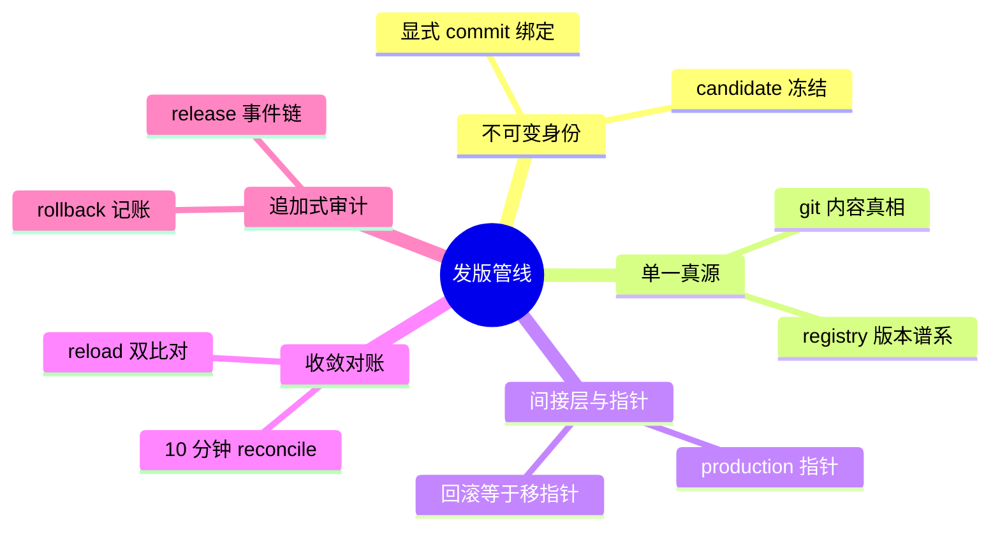

# 子块 04：发版管线（versioning）

> **层位声明**：本篇为设计思想层（架构师视角）讲解——讲“为什么这么设计、宏观怎么运转、环节间契约与不变量”，主动剥离环节内部微观实现（不进函数体、不给 file:line、不列字段清单）。如需实现层补充，可另行要求。

## 它在进化系统里的位置

进化系统是 Writer 的自我进化引擎，主干是一条单向加工链。发版管线是这条链的第四棒：



与上下游的衔接只需两句话：

- **上游**：03 进化 Agent 在 harness 仓库的工作区里改完代码，交出一个 pending_review 状态的 session（pending_review——进化 Agent 交卷后、正式发版前的“待发版”状态）。
- **下游**：本管线激活新版本后，executor 产出的每个新生产 trace（trace = executor 一次任务的完整运行记录、事件流日志——不是报错堆栈）都自带新版本身份，反哺整条进化闭环。

本篇只讲中间这一截：怎么把“工作区里的脏代码”安全地变成“executor 全局唯一的生产版本”。进化 Agent 怎么改代码（03）、executor 内部装配细节，只在衔接点出现。

## 先定调：哪些是现役链路，哪些不是

今天真正在跑的发版路径只有一条（各环节契约见第 3 步）：

**publish_session（发版编排）→ commit_candidate（冻结源码）→ probe_candidate（唯一门禁）→ registry 注册与晋升（版本谱系）→ reload_executor（激活）→ 失败走补偿恢复**

仓库里还有几个名字很像、容易走错的门，提前关上：

| 名字 | 它实际上是什么 | 在不在现役链路 |
|---|---|---|
| improvement 模块 harness_repo 的 promote_to_production | 早期 D17 人工批准时代的 DB 标签翻转，无生产调用方、仅被测试调用，improvement 模块也没有任何路由挂载 | 不在，遗留模块 |
| app 下的 promote 接口 | “trace 标注入数据集”的闸门（子块 06 的内容），只是名字里也有 promote | 与发版无关 |
| versioning 包内 snapshot_repo、config_diff、version_changes_repo，以及 registry_repo 的 publish_version 与 bind_version_commit 两个函数 | 去 DB 重构前的 SQLite 时代层 / 早期“回填”方案，均无生产调用方 | 不在，死代码 |

本篇只讲现役链路，以上遗留不作为环节出现。（注意：**“显式 commit 绑定”这个机制是现役的**，死掉的只是实现它的旧回填函数——现役做法是 candidate 注册时直接写入已知哈希，见地基四。）

## 开工前：四个地基概念

后面六步全部立在这四个概念上。这四个不弄懂，第 3 步的每份契约都会读得似懂非懂。本节讲四个：**harness 仓库、registry、版本三态（candidate / production / retired）、显式 commit 绑定**。另有五个动作词（probe 门禁、reload、回滚 rollback、补偿恢复、单会话锁）会在正文首次出现处各给一句话点破。

### 地基一：harness 仓库——进化系统的货仓

- **大白话定义**：一个 git 仓库，装着 executor 干活所需的整套“大脑部件”源码——提示词、技能、工具、中间件、子代理五类目录（中间件 = 夹在 Agent 执行链上的功能层，如产物快照采集）。进化 Agent 改代码，就是在这个仓库的工作区里改。
- **类比**：工厂的成品仓。进化 Agent 是车间，改出的货先堆在成品仓（工作区）；发版管线负责报关、验货、摆上主货架。
- **小例**：进化 Agent 调整了一个 prompt 文件，工作区出现“未提交改动”——这就是发版的全部起点原料。
- **形态补充**：这个体系里有两个仓——work 仓库（evolution/harnesses/repo，进化 Agent 改代码之地）和 bare 仓库（中转仓：进化侧 push、executor 侧 pull）。registry.json 住在 work 仓库根目录。

### 地基二：registry——版本的家谱账本

- **大白话定义**：一个 JSON 文件，记两件事——历次版本的家谱（版本谱系），加一个指明“谁是目前生产版本”的指针。它是版本谱系的单一真源：一切“现在该跑哪版”的争议，都以它为准。
- **新旧对照**：你熟悉的 git tag 是贴在某个 commit 上的不动标签；registry 里的 production 指针则是一个**会移动的标签**——晋升就是把标签从旧 commit 挪到新 commit，家谱和 git 历史一字不动。
- **小例**：账本写着“现役 = v8，v8 对应 commit 5f3a…”。executor 看账本，去仓库精确取 5f3a… 这一箱；账本挪到 v9，executor 下次对账就会跟上。
- **为什么必须单一真源**：没有它，“该跑哪版”就会出现两个说法（进化侧一个、executor 侧一个），分裂不可避免——第 2 步有真实事故为证。

### 地基三：candidate / production / retired——一个版本的三种身份

- **大白话定义**：候选版本 candidate = 已冻结、待门禁验证的版本；生产版本 production = 指针正指着的那个，全局唯一；retired = 当过生产、现已让位的退位历史版本。
- **关键机制**：三态不是刻在每个版本身上的死标签，而是**由指针动态推导**——谁等于指针，谁就是 production。
- **类比**：身份是职位，不是纹身。production 是“现任”，retired 是“前任”，candidate 是“候选人”。谁在任，由“任”这个事实决定；而每个版本条目永远留在花名册（谱系）上。
- **小例**：v8 晋升，v7 自动从 production 变 retired；日后回滚到 v7，v8 变 retired、v7 重新成为 production。全程没有任何版本被删除。

### 地基四：显式 commit 绑定——版本号钉死在 commit 上

- **大白话定义**：每个版本条目都白纸黑字写明自己对应哪个 git commit 哈希。版本与代码的对应是“写死的”，不是“推算的”。
- **新旧对照**：旧做法按位置推导——“第 N 个 git commit 就当它是 vN”。听着省事，历史一复杂就失真（真实事故见第 2 步）。现役做法是显式绑定：candidate 注册那一刻源码哈希已知，直接写入，早期“先提交后回填”的函数已废弃。
- **类比**：快递单号印在包裹上，而不是靠“第 8 个发货的就算 8 号单”去猜。
- **小例**：v8 与 5f3a… 写死。之后无论 git 历史怎么追加、怎么重整，v8 永远解析到 5f3a…。

## 第1步 本质锚定：发版管线到底是什么

**一句话本质**：发版管线本质上是把「进化 Agent 改出的工作区代码」变成「executor 全局唯一、可审计、可回滚的运行版本」的单向晋升装置。全部家当只有两样东西——一个 git 仓库（内容真相源：代码长什么样）+ 一个 registry.json（元信息真相源：哪版是生产）：



一图一要点：代码的真相在 git，版本的真相在 registry，executor 只认这两处。

靠“exact commit 冻结 + 真实装配 probe + 指针晋升”这套机制，保证一件事：**executor 跑的每一行代码，都能被一个不可变 commit 指认**。

### 主类比：货运报关

| 发版世界 | 报关世界 |
|---|---|
| 进化 Agent | 工厂车间（造货） |
| harness 仓库 | 海关保税仓（货放这里，出仓要手续） |
| candidate commit | 铅封集装箱——封了就不许动 |
| registry 条目 | 报关单（登记这箱货） |
| probe 门禁 | 开箱验货——而且是“拟开业的店铺亲自把货装配一遍” |
| 晋升 production | 放行，摆上主货架 |
| retired | 移到后备货架，永不销毁 |
| reload | 店铺换上新货，并回执“我摆的确实是这箱” |
| 回滚 rollback | 指针指回旧货架，台账照记一笔 |

### 第二锚点：GitOps

registry.json 约等于 GitOps 里的 desired state（声明哪个 commit 是 production）；executor 的周期对账约等于 reconciliation loop（不断把 actual state 拉齐到声明状态）。这不是讲解者附会——代码注释自己引用的就是“GitOps 第 4 原则 Continuously Reconciled”，是设计者自述。

## 第2步 痛点动机：没有这条管线，世界坏成什么样

把时间拨回管线成型前。进化 Agent 改完代码，“发版”就是直接拿工作区代码当生产跑。下面六件事都是本项目真实发生过的事故，不是思想实验。

### 主菜事故：一道从未有人通过的门禁，锁死了整条进化流水线

早期发版用的是两阶段门禁：晋升 production 前，必须集齐三件套——snapshot trace、ready 证据卷宗、sealed complete 评估卷宗（这三个名词来自上游 01/02 环节，这里只需理解为“三份齐备的官方文书”）。听起来很严谨。结果是：**这道门禁历史上从未有一次通过**。

为什么从未通过？三件套要求一条完整前置链（单次测试 → 编纂 → 评估）全部精确走完、各状态全部精确落位。这条前置链本身在真实环境从未完整走通过。于是门禁条件恒为假——不管进化 Agent 干得多好，session 永远停在 pending_review。

真正的杀伤在后面：pending_review 属于活跃状态，而系统有单会话锁——同一时刻只允许一个活跃 session。这个永远发不出去的 session 把锁永久占住，**后续所有新进化全都开不起来**：



一个“为了质量”设计的理想化门禁，级联成整条进化流水线的永久断点。根治方案（85af690）：把门禁收缩为“probe 通过即晋升”。release_gate 模块的 docstring 至今保留这段失败史——设计者把教训刻在了门上。

**教训内核**：门禁的每个条件都必须在正常路径上真实可达；永不满足的条件，等于永久下线开关。（第 5 步会把它提炼成可迁移原理。）

### 其余五种死法（均为真实事故）

| 死法 | 事故画面 | 直接后果 | 现役管线怎么堵 |
|---|---|---|---|
| 版本与代码对不上（EVD-007） | registry 按“第 N 个 commit = vN”的序号推导映射；线上 6 个版本对应 8 个 commit，v6 实际解析到旧提交 5eba42e | 测试结果、Trace 证据、版本谱系全部失去可信性；两次“补登记”补丁均属治标 | 显式 commit 绑定（9740297），registry 注释原话：“不再用 git log 序号猜测——线上已证明此映射失真” |
| 承重文件不在 git 里（EVD-001/002/003） | 早期升级脚本用 cp 拷贝承重中间件却从不 git add；产物快照采集中间件长期 untracked。生产按 HEAD 取代码，装配**不报错而是静默跳过**它 | 生产长期跑着残缺代码，产物快照采集是哑的；直到发版时 git 校验失败才暴露 | commit_candidate 的承重文件完整性校验（必须进提交树）+ probe 的承重中间件在场核对 |
| 落地改动不原子 | Agent 改了调用处，但定义处的改动漏进 candidate commit | executor 干净 checkout 装配，直接 TypeError | candidate commit 的树必须自洽：一次落地的相关文件同进同出 |
| 通知不可靠 | 发版后靠 HTTP 通知 executor reload，通知一丢 | executor 永停旧版，无人知晓 | 通知彻底降级 + 10 分钟 reconcile 对账兜底 |
| 激活成功不等于生效成功 | reload 返回 200，但 executor 实际加载的可能是别的 commit（网络竞态、pull 失败被吞） | “假激活”：registry 说新版，机器跑旧版 | reload 后双比对（commit + 身份摘要）。【基于设计理解推演：双比对正是针对“指针已晋升但实际跑旧代码”的分裂态——指针与运行事实两个真相源必须收敛】 |

### 收束：这条管线保证四件事

一句话——把「进化产出」安全地变成「生产运行」，同时保证：

| 保证 | 靠什么 |
|---|---|
| 每个版本指向不可变 exact commit（可复现） | 显式绑定 + candidate 冻结 |
| 上线前真的装得起来（真实装配验证） | probe 门禁 |
| 失败随时可退（谱系完整 + 补偿恢复） | registry 谱系 + 补偿链 |
| 全过程留审计事实 | release 事件链（追加式） |

## 第3步 模块协作与契约：宏观怎么运转

上一步看到“为什么疼”，这一步看“药怎么配”。先看全景，再逐环节给契约。

### 3.1 宏观协作图



读图三句话：

1. 编排者只有 evolve 一个（正文契约里的 publish_session 是它的发版编排入口函数），它按“冻结 → 门禁 → 晋升 → 激活”的宏观协作顺序调用四个执行环节。
2. executor 与进化侧不共享文件系统，全靠 bare 仓库中转：进化侧 push，executor 按声明的 exact commit pull。
3. 事件链挂在编排者旁边，每个动作落一笔——审计与动作同步生长。

**输入输出边界**：输入 = 一个 pending_review session（用户在前端点一次“发布”）；输出 = executor 运行 exact production commit——此后每个新生产 trace 自带新版本身份，反哺整条进化闭环。

### 3.2 主链环节契约

**① publish_session（发版编排者）**

- 契约：pending_review session →［保证：只有 pending_review 可发；round 未清即 409 拒绝；单 session 只注册一个版本、进程重启后按 source_session 恢复同一版本］→ activated，或“带补偿结果的失败”。
- 不变量核心：幂等 + 并发拒绝。“幂等”接地：同一操作重复执行，效果和执行一次一样。“round”接地：进化 Agent 的一次执行轮（一轮对话处理或一轮落地执行），“未清”指该轮尚未跑完落定——未清时再受理新请求，两轮并发写共享状态会互相覆盖。round 未清即拒，防的是 registry 丢失更新与 checkpoint 竞态（checkpoint——进化 Agent 执行进度的存档点，并发轮同时写同样会互相覆盖）。
- 设计动机：因为 registry 是全局单一 JSON 文件、没有数据库事务，所以应用层必须把幂等和并发守卫做足——用户连点两次“发布”，不能造出两个版本。

**② git_ops.commit_candidate（冻结源码）**

- 契约：工作区全部源码改动 →［保证：candidate commit 树自洽（相关文件同进同出）；承重文件必须在提交树内，缺失时报错可定位根因（区分 gitignore 误排除、磁盘缺失、跟踪态损坏三种）；提交后零漂移（工作区不许残留未固化源码）；显式排除 registry.json］→ 不可变 commit hash。
- 不变量核心：冻结后的 commit 就是这版源码的唯一身份，后续一切环节只认它。
- 设计动机：源码与 registry 分成两个 commit，是对“自引用问题”的结构性解法（第 7 步问题一展开）。

**③ release_gate.probe_candidate（唯一门禁）**

- 契约：candidate commit →［保证：门禁依据真实执行结果而非静态检查；checkout 不干净即失败；应答的 harness_commit 必须等于冻结 commit；装配必须成功；承重中间件必须在场］→ “可运行性已验证” + runtime_identity（identity_digest）存档。
- 它在做什么（接地）：让拟发布的 executor 亲自在 candidate commit 的**干净临时 checkout** 上、用假模型真实执行一次最小装配。“假模型”接地：不真调 LLM，只验证装配链路本身。
- 设计动机（演进故事的正面一半）：门禁只问“能不能跑”，不问“跑得好不好”——后者是上游评估与下游 Trace 闭环的事。这是从“证据完备性门禁”到“可运行性门禁”的哲学转变。

**④ registry_repo（registry 读写层，版本谱系单一真源）**

- 契约：注册 / 晋升 / 回滚 / 补偿 / 启动收敛指令 →［保证：内容真相在 git commit、元信息真相在 registry.json；三态由指针推导；回滚不改写 git 历史、不删版本条目；回滚目标必须非 candidate 且有显式 commit 绑定；无 commit_hash 的旧版本标记不可执行、不得被指针引用］→ 指针事实 + 完整谱系。
- 注册与晋升拆开：注册只登记 candidate（带 commit_hash 与 probe_identity——即 ③ probe 时存档的身份摘要 identity_digest，三个名字同一个东西），**不动 production 指针**；晋升才移指针、存 runtime_identity、旧 production 退 retired。
- 设计动机：单 JSON 文件 + git 保存，天然获得“覆盖写 + git 留全史”的审计性——这是去 DB 轻量化重构（91bcb12）的核心取舍。

**⑤ commit_registry_and_push（提交 registry）**

- 契约：registry.json 变更 →［保证：只提交 registry；夹带任何源码漂移即报错］→ 对 executor 可见的 registry commit。
- 设计动机：与 commit_candidate 互为镜像、互相排他。因为两个提交函数各自拒绝对方的内容，所以源码身份与 registry 变更永远不会互相污染。

**⑥ snapshot_publisher：reload 与 notify（激活与通知）**

- reload 契约：registry 声明的 exact commit →［executor 拉取、清缓存重载、返回实际 commit 与 runtime_identity］→ 运行事实。reload——executor 切到新 production 的激活动作。
- notify 契约：通知 →［未配置或网络失败一律静默吞、返回 False 不报错］→ 只加速，不承载正确性。
- 设计动机：通知只是加速器；正因为正确性有 10 分钟对账兜底，通知才敢彻底降级。

**⑦ 激活核对与补偿（publish 的收口段）**

- 契约：reload 应答 →［保证：实际 commit == 冻结 commit，且实际 identity_digest == probe 时存档的 digest；任一不符即按激活失败处理，补偿恢复原 production（registry 补偿写 + registry 提交 + reload 原版本 + 再核对一遍）；首次发版无前序 production 时，production 置 None 并明示需人工确认，绝不 reload 幽灵版本（FR-007 / EDGE-003）］→ 两个真相源收敛一致。
- 不变量核心：绝不允许“registry 说 activated、executor 跑的却是别的 commit”的分裂态存活。
- 设计动机：每一步远程副作用之后都验证、失败就反向补偿回一致——分布式“指针对账”的标准手法：每步都配一条反向恢复路径。

**⑧ 手动回滚入口（rollback_snapshot）**

- 契约：目标版本 →［保证：前置校验——非当前、非 candidate、有 commit 绑定；任何一步失败都反向恢复并记 rollback_activation_failed_restore；成功记 rollback_activated］→ 指针回拨 + rollback_log 记账。
- 设计动机：回滚与发版走同一套“指针移动 + reload + 核对 + 补偿”骨架，不是另一条特殊路径——回滚不是紧急后门，是同一装置的逆向使用。

### 3.3 支撑环节契约（executor 侧与旁路）

**executor 侧两个端点（只讲契约）**

- probe 端点：给定 source_commit → 干净 checkout + 真实最小装配 → 返回身份。executor 同时担任“验货员”——只有它能证明这版代码在它身上装得起来。
- reload 端点：按 registry 声明的 exact production commit 精确 checkout 并加载 → 返回实际身份。注意一个措辞：executor **始终按 registry 的 commit_hash 精确取货，不盲跟 bare main 的最新**——“最新”不等于“声明”，这正是防漂移的关键。

**reconcile（executor 后台，10 分钟一轮）**：周期比较“本地正在跑的 commit”与“bare 仓库声明的 production commit”，不一致自动 reload。自我定位是“GitOps Continuously Reconciled 的轻量实现”。它是通知降级之后，正确性的最后防线。

**release_events_v2（事件链）**：committed → registry_promoted → executor_refresh_ack → activated →（可再）rollback_activated；失败走 activation_failed（可从 registry_promoted 重试）。状态机强制合法转移，非法转移直接抛错。设计动机：发版全程是追加式审计事实，与 Trace 体系同构——发生过什么，永远可回放。

**elements_api（要素视图，旁路查询）**：按版本的显式 commit 绑定，从 git 读真实源文件、静态投影装配结构（Prompt / Skills / Tools / Middleware / Subagents 五要素）。两个不变量：只静态解析、绝不执行历史代码；因 commit 不可变，视图按版本做进程内缓存（性能背景：未缓存时每次请求要开 20-40 个 git 子进程、耗时 2-5 秒，缓存把它摊平）。设计动机：给前端看的是“真实运行的 agent 源文件”，不是死配置的投影。

**docker-entrypoint 启动收敛**：每次容器启动时收敛谱系——把无 commit 绑定的不可执行历史条目清出、把当前 worktree HEAD 绑定为 production 基线。设计动机：迁移期的坏历史（如本地 registry 里没有 hash 的 v6 条目）必须能自愈，否则 executor pull 必崩。

**harness git 仓库形态**：work 仓库（进化 Agent 改代码之地，五类目录形态）+ bare 仓库（evolution push → executor pull 的中转）+ registry.json 住在 work 仓库根。“candidate 按 exact commit 冻结、谱系可回溯”这两件事，全靠这一个仓库体系承担。

### 3.4 数据流的语义变换：一条“固化”链

这是理解整条管线的钥匙。每个环节都在把前一环节的**临时状态**固化成**永久事实**；补偿是唯一的逆向流：

```mermaid
flowchart LR
    A[工作区脏代码] -->|commit·固化内容| B[不可变 commit<br/>身份从此固定]
    B -->|probe·固化可运行性| C[验证通过<br/>身份存档]
    C -->|promote·固化现役身份| D[指针事实<br/>registry 声明]
    D -->|reload·固化生效| E[运行事实<br/>executor 实际身份]
    E --> F{双比对}
    F -->|一致| G[activated<br/>真相源收敛]
    F -.不符| H[补偿恢复<br/>逆向去固化]
```

语义一句话串联：脏代码经 commit **固化内容**（这版代码从此完整存在于一个哈希里）→ 经 probe **固化可运行性**（并留下身份存档）→ 经晋升**固化现役身份**（“谁是生产”从口头变账本）→ 经 reload **固化为运行事实**（账本宣言落地）→ 双比对让指针与运行事实收敛；失败则沿原路**去固化**，恢复到上一个一致状态。正向逐级固化，失败逆向解固——整条管线就这一个动作模式。

## 第4步 决策对比：为什么不用业界现成的发布方案

**本项目方案一句话**：用「git commit 当内容身份 + registry.json 指针当版本谱系 + 拟发布执行端真实装配 probe 当唯一门禁 + reload 双比对 + 全程补偿」，实现一套轻量级 GitOps 式自进化发版。

三个业界替代方案（基于模型已有知识，未联网核实）：

| 方案 | 解决的核心问题 | 主要代价 | 适用场景 |
|---|---|---|---|
| **本项目**：git commit + registry 指针 + probe 门禁 | 单体 executor 的自进化版本管理：身份不可变、真实装配验证、可回滚可审计 | 无灰度（probe 过即全量切换）；质量回归靠下游闭环事后发现 | 被自动发布的“整包装备”（harness）、单体执行端 |
| 蓝绿/金丝雀 + 流量切换（Argo Rollouts / Spinnaker / Flagger 类） | 新旧并行跑真实流量，按指标渐进放量，坏版本影响面可控 | 需要可切分的流量与多实例；链路、观测复杂 | 有真实用户流量、可分批放量的在线服务 |
| 容器镜像不可变发布（image digest + K8s Deployment） | 版本 = 镜像 digest，发布 = 改声明；天然不可变、声明式 | 需要镜像构建、注册表、编排全套设施 | 任何容器化服务，业界默认 |
| 数据库版本化迁移（Flyway / Liquibase 式线性版本表） | schema 变更有序、可审计 | 迁移只能向前，回滚困难 | 数据库 schema 演进 |

关键异同，三点点破：

1. **与蓝绿/金丝雀同属“指针切换 + 可回滚”家族**，但本项目是单体服务、没有可分流量，且进化改动是“整包 harness”粒度——所以选“probe 通过即全量切换”，**牺牲灰度换链路简单**。
2. **与镜像发布同享“不可变身份”思想**（commit ≈ 轻量版 image digest）。不用镜像，是因为被发布对象是被 Python 进程动态 import 的 harness 包——git commit 就是它最直接的不可变身份证。
3. **比 Flyway 式迁移多了显式回滚通道**（谱系只追加、指针可回拨、rollback 记账）——因为数据库不需要频繁“退 schema”，而 harness 需要快速退回旧行为。

本项目独有的一处反教条决策：门禁选“executor 真实装配”，而非“测试套件全绿”或“证据文档齐备”。这不是教科书选择，是从三件套永不通过的失败中习得的——**门禁的每个条件都必须在正常路径上真实可达，否则门禁本身会变成最大的 bug**。另一处独有取舍：“通知降级 + 周期对账”是 GitOps 拉模式对推模式的经典取舍——推负责快，拉负责对。

## 第5步 理论抽象：这条管线站在哪些原理上

**范式归属**——三个经典思想的合体：

1. **不可变事实 + 单一真源 + 指针切换**。内容冻结成不可变 commit，元信息集中到单一 registry，换版本 = 移指针而非改内容。加一层指针间接（indirection），让“换版本”从大动作变成小动作。
2. **GitOps / 声明式发布范式**。desired state（registry 声明谁是 production）与 actual state（executor 实际在跑什么）分离，靠 reconcile 周期收敛。
3. **事件溯源（审计侧应用）**。release_events 只追加、状态机拒绝非法转移——“发生了什么”本身就是数据。



**五条可迁移原理**（每条带本项目的事故锚点）：

1. **身份与内容的绑定要在发布前显式固化**。任何“按位置/顺序推导身份”的方案（vN = 第 N 个 commit）都会在历史变复杂后失真——EVD-007 用线上事故证明了这一点。
2. **自引用身份用“结构分离”解决**。registry 无法记录“包含自己的 commit”（循环依赖）。本项目试过“先 commit 后回填”，最终选择更彻底的结构分离：源码提交与 registry 提交拆开、两个提交函数互相排他。
3. **门禁的可通过性是门禁的生死线**。设计门禁先问“正常流程走完，这个条件天然满足吗”。永不满足的条件等于永久下线开关（85af690 的教训）。
4. **推模式优化，拉模式保正确**。通知丢了没关系，只要 actual state 会周期向 desired state 收敛——推负责快，拉负责对。
5. **回滚是记账不是删除**。谱系完整让“回到过去”永远可行且可审计；靠删历史换来的省事，都会在审计时加倍偿还。

## 第6步 边界与代价：它什么时候不管用

### 何时失效（具体画面）

1. **probe 只保证“装得起来”，不保证“写得好”**。画面：一个把文风改坏的 prompt 版本，装配完全正常、probe 通过、全量上线。单阶段门禁移除三件套后，质量回归完全依赖下游 Trace/评估闭环**事后**发现——坏版本在被发现前，可能已经产出带错误版本标签的 Trace。这是 85af690 明确接受的取舍；原料同时注明：eval 门控在 registry 里仍是 pending 占位，这道闸尚未补上。
2. **probe 用假模型做最小装配，运行期问题不在门禁覆盖内**。画面：某中间件与真实 LLM 调用路径的交互缺陷、长链路下的状态污染——这些只有真跑才暴露。【基于设计理解推演：这是“装配可验证”与“行为可验证”的边界——后者成本高得多，被有意留在闭环里而不是门禁里】
3. **首次发版失败没有自动恢复**。画面：系统第一次发版就激活失败——没有“原 production”可供恢复，只能把 production 置 None、明示需人工确认 executor 状态（FR-007 / EDGE-003，代码确证），绝不调 reload 去拉一个幽灵版本。
4. **registry 是单 JSON 文件，跨进程无数据库级事务**。并发正确性全靠应用层守卫（round 锁 + 单 session 单版本）。画面：绕过 API 直接手改 registry.json——没有任何保护，改坏就是改坏了。【基于设计理解推演】
5. **reconcile 周期 10 分钟**。画面：通知失败的那次发版，executor 最长 10 分钟还在跑旧版，窗口内产出的 trace 都带旧版本身份。窗口有界，但不为零。

### 副作用与牺牲（代价天平）

| 得到（左盘） | 付出（右盘） |
|---|---|
| 防重复注册、重启可恢复的幂等发版 | 每个 session 永久绑定一个版本号；失败重试沿用同一 candidate；“同 session 二次进化”不可能，必须开新 session |
| 版本号单调，Trace 里可排序可追溯 | 回滚后版本号不回收：回滚到 v3 再发新版得到 v(n+1)，谱系呈“分叉再前进”形态。【基于设计理解推演：与“版本号只递增”的传统发布语义一致；桌面侧 8a7fe05 版本倒挂问题从反面印证了单调语义的分量】 |
| 启动自愈，executor 永不 pull 到不可执行版本 | prune 启动收敛会**物理删除**无 commit 绑定的不可执行历史条目（含关联 rollback_log 项）——谱系完整性的唯一例外，仅限本来就跑不了的死条目 |
| harness 版本管理独立、轻量 | harness 版本体系与桌面 App 版本号（0.2.x + updater）是两套独立体系，无联动机制 |
| 源码身份与 registry 变更永不互污 | “一个版本”对应两个 git commit（源码 commit + 若干 registry commit）；读 git log 需理解这个拆分，两个提交函数的排他校验是持续代价 |

### 证据不足处

- 桌面端 updater 与 harness registry 之间是否存在间接联动——未探查 desktop 代码，原料未给结论，本篇不作断言。

## 第7步 吃透检验：五个尖锐问题

每个问题给三段式参考答法：一句话点题 → 机制怎么保证 → 代价权衡。

**Q1：为什么不把 registry 和源码放进同一个 commit？那样不是更原子吗？**

- 点题：做不到——这是自引用悖论。
- 机制：registry 条目若与源码同 commit，这个 commit 的哈希取决于 registry 内容，而 registry 内容又想写这个哈希——循环依赖。早期用“先 commit 后回填”绕行；现役改用结构分离：冻结源码的提交显式排除 registry，提交 registry 的函数拒绝夹带任何源码漂移，两者互为镜像排他。candidate 注册时源码哈希已知、直接写入，回填步骤彻底消失。
- 代价：一个版本对应两个 commit，git log 需要解读；换来的是身份永不互污。

**Q2：旧三件套门禁错在哪？“测试通过才能上线”难道不对吗？**

- 点题：方向对，可达性错。
- 机制：三件套要求发版前完整走通“单次测试 → 编纂 → 评估”前置链且各状态精确落位；这条链在真实环境从未走通，门禁条件恒假——session 永卡 pending_review，单会话锁再级联堵死所有新进化。修复不是降低质量标准，而是把“能不能跑”（probe 可自动满足，门禁守它）与“跑得好不好”（闭环事后验证，不设为门禁）拆开。
- 代价：放弃上线前的质量闸门，质量回归后移到 Trace/评估闭环——延迟发现，换取流水线永不断流。

**Q3：reload 都返回 200 了，为什么还要双比对？比什么？**

- 点题：200 只证明 executor 进程应答了，不证明它加载的就是刚晋升的那个 commit。
- 机制：比两组——实际 commit vs 冻结的 source_commit；实际 runtime_identity 的 identity_digest vs probe 时存档的 digest（后者还能覆盖依赖版本漂移）。任一不符按激活失败处理并触发补偿。否则“registry 说 v8、executor 跑 v7”的分裂态存活，Trace 里的版本标签全部不可信。
- 代价：每次发版多一轮核对、多一套恢复路径；换来指针与运行事实必然收敛。

**Q4：回滚会把坏版本删掉吗？为什么回滚目标还有前置校验？**

- 点题：不删——回滚是记账，不是删除。
- 机制：回滚 = 指针回拨 + rollback_log 记一笔；坏版本条目留在谱系里（retired），git 历史一字不动——谱系完整是可审计的根基。两个前置校验各防一种事故：目标是 candidate（从未过 probe 门禁）则拒绝，防止用回滚通道绕过门禁；目标无 commit 绑定则拒绝，因为 executor 无法 checkout 不可执行版本，指过去等于制造一次必然失败的 reload。
- 代价：谱系只增不减（唯一例外是启动 prune 清死条目）；换来“回到过去”永远可行且可审计。

**Q5：发完版，通知 executor 失败了会怎样？**

- 点题：不怎样——这正是设计点。
- 机制：notify 彻底降级，失败静默吞。正确性由 executor 每 10 分钟的 reconcile 兜底：比较本地运行 commit 与 bare 仓库声明的 production commit，不一致自动 pull + reload。推模式负责快，拉模式负责对——通知丢失最多延迟 10 分钟，不会永久漂移。
- 代价：10 分钟内的版本漂移窗口（窗口内 trace 带旧版本身份）；换来通知链路可以无限简化。

**附加追问：promote 之后为什么还要单独提交一次 registry？失败了怎么办？**

- 点题：晋升只改了进化侧内存与磁盘上的 registry.json，必须 commit + push 到 bare 仓库后才对 executor 可见。
- 机制：这一步失败触发补偿——恢复旧指针、再提交恢复、再 reload 原版本核对；若补偿也失败，错误信息带上补偿失败详情（双重故障明示人工介入）。
- 代价：多一次提交与推送；换来 executor 永远只从“已推送的声明”取货。

---

**带走的一句话**：发版管线 = 用 git 冻结内容、用 registry 冻结身份、用 probe 冻结可运行性、用 reload + 双比对固化生效——每一步都是“把临时状态变成永久事实”，失败就沿原路去固化，谱系永不删除。
