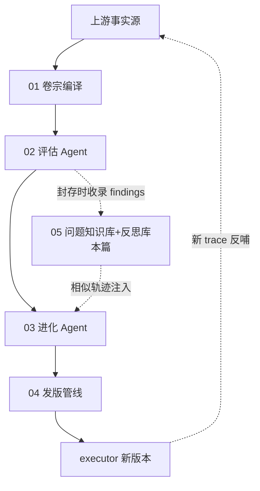
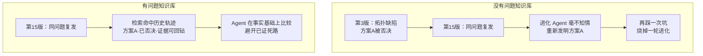
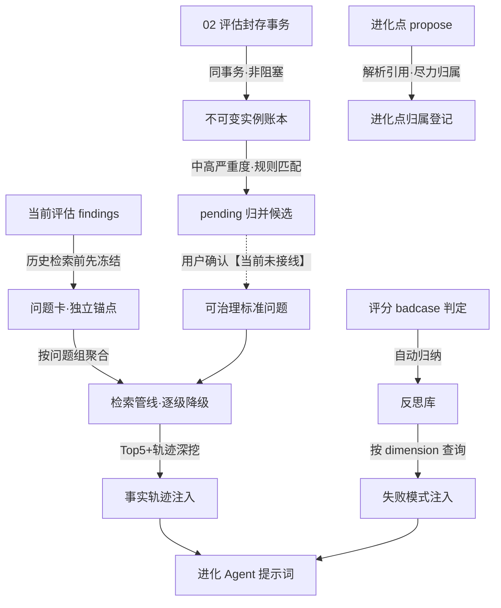
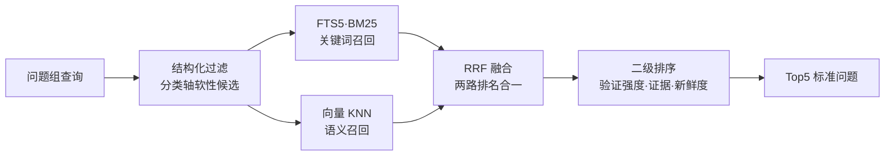
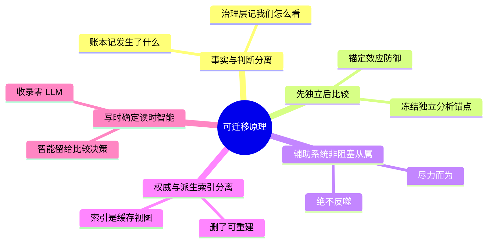
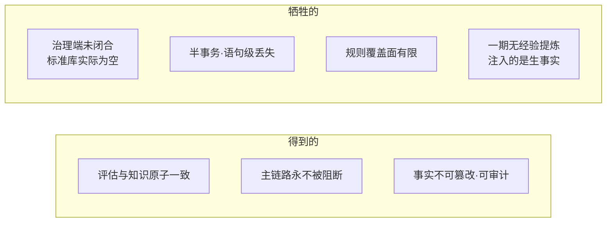

# 子块 05：问题知识库与反思沉淀（problem_kb + reflection）

> **层位声明**：本篇为**设计思想层（架构师视角）**讲解，主动剥离环节内部微观实现——不含 file:line、真实代码、字段清单，聚焦“为什么这么设计、宏观怎么运转、契约与不变量、优劣与可迁移原理”。如需实现层补充，可另行要求。
>
> **诚实提示**：文中保留原料中的推测/推演标注（【基于设计理解推演】、【基于代码事实推演】、未联网核实等）。尤其注意第 6 步：problem_kb 一期是“事实底座已建成、治理消费端未闭合”的**半成品状态**，本文按实然状态如实呈现，不讲成完整闭环。

---

## 先站稳位置：本篇讲什么、在全局哪里

进化系统的主干是一条单向加工链：上游 trace（executor 的执行记录）编译成证据卷宗（01），评估 Agent 产出 findings 并封存（02），进化 Agent 制定进化计划（03），发版管线验证上线（04），新版本再产生新 trace 反哺上游。

本子块**不在主干上**。它是从 02 的封存点上“长”出来的两条侧线：

- **problem_kb（问题知识库）**——把封存卷宗里的 findings 冻结成不可变账本，聚合出可治理的标准问题库，进化时把相似历史的事实轨迹注入进化 Agent。它是系统的“长期记忆器官”，本篇主角。
- **reflection（反思库）**——一条更早、更轻的辅助线。评分 badcase（表现不达标的案例）时自动归纳“失败模式”，进化时按 dimension 注入。它是一种被动沉淀的快速反馈回路。

先接地几个贯穿全篇的术语：**findings**——评估 Agent 在卷宗里逐条写下的“问题发现”，像体检报告上的异常项；**dimension（维度）**——评估 Agent 考察作品的不同侧面（如情节一致性），也是反思库的分类轴；**sealed（封存）**——写入不可篡改档案的动作，封存后的卷宗就是评估结论的权威事实源。另：文中 DEC/AC/REQ/R-xx 等编号为需求真相源文档中的决策、验收标准、需求与风险条目编号，仅作出处标注，不影响阅读。

---

## 第 1 步：本质锚定——它到底是什么

### 1.1 一句话本质

**problem_kb 本质上是进化系统的长期记忆器官**。它做三件事：把每次封存评估卷宗里的 findings 原样冻结成**不可变的问题实例账本**；经用户确认归并后，聚合为**可治理的标准问题库**；进化时先冻结当前问题卡，再把相似历史问题的「问题—计划—结果」**事实轨迹**（只给事实，不给经验结论）注入进化 Agent。历史失败由此变成可检索、可回钻、可比较的事实底座。

**reflection 本质上是一条更早、更轻的辅助记忆线**。评估 badcase 时自动归纳失败模式写入反思库，进化 Agent 启动时按 dimension 查询注入——典型的 Reflexion 式被动沉淀（Reflexion：Agent 领域“从失败反馈中提炼文字反思、带入下一轮”的自我改进范式）。

### 1.2 地基概念一：双层模型（先懂这个，后面全靠它）

后面每一个环节都立在这个结构上，不先弄懂它，第 3 步的契约全悬空。

**大白话定义**：问题的记录分两层。底层是“每次实际发生的原始记录”，写完永不修改；上层是“归类整理后的标准档案”，可以合并、拆分、否决，但每一步都留痕。

**生活类比——医院病历**。每次就诊记录（实例）写完就封存，永不改写；确诊的慢性病档案（标准问题）由医生确认建立，可以修订但每次修订都留记录；复诊时医生“先查体，再翻旧病历”——先有自己的判断，再看历史。

**跑一遍（worked example）**：
- 第 3 版评估发现“协作拓扑缺陷”→ 账本里多一条就诊记录（问题实例）；
- 第 15 版又发现相似问题 → 又一条记录，账本只追加；
- 用户确认两条是同一问题 → 归并到一个标准问题档案下，该问题的“正式频率”变为 2（按独立 trace 去重计数）；
- 若日后发现归并错了 → 拆开链接即可，两条就诊记录原封不动。

这个结构在工业界有现成同构：**ITIL Known Error Database**（IT 运维的“已知错误库”——工单归一到已知错误、保留每次发生记录，需求文档 DEC-25 明说采用此范式），以及 **SRE Postmortem** 的事故复盘文化——保留失败、被拒方案与反证，而非只存“最终成功方案摘要”（REQ-10.5）。

### 1.3 地基概念二：事实与判断分离

第二个承重概念，候选归并、确认、频率统计全建立在它上面。

**大白话定义**：系统自动判断的“这两个问题相似”只是**疑似**；用户确认之后才算**正式**。疑似与正式，分列两本账。

**生活类比**：AI 辅助分诊。AI 说“这可能是老毛病复发”，但确诊要医生签字——AI 的话可以参考，不能进正式病历。

**跑一遍**：一条新实例与某标准问题的匹配置信度高达 0.95，系统仍只生成一条 pending（待确认）候选。确认之前，这次“疑似出现”不计入正式频率、不进检索主数据。为什么如此谨慎？第 7 步 Q2 会给出机制层的完整回答。

### 1.4 地基概念三：辅助记忆不许反噬主链路

第三个承重概念，收录与检索的所有“降级”“吞异常”设计都源于它。

**大白话定义**：问题知识库是辅助系统。它成功，锦上添花；它失败，主链路（评估封存、进化消息）必须毫发无伤。

**生活类比**：行车记录仪。记录仪坏了，车照样开——辅助设备的故障不能让发动机熄火。

**跑一遍**：收录 findings 时中途抛异常 → 异常被整体捕获吞掉 → 评估封存照常提交。最坏结果是部分问题实例没入账，靠后续对账补录兜底（风险 R9）。

### 1.5 两条记忆线的轻重之别

reflection 与 problem_kb 都是“从失败学习”，但定位刻意不同：reflection 轻、快、自动即可信；problem_kb 严谨、重、每条可回钻、归并需人确认。详细的逐项对比表放在第 3.4 节（彼时注入语义已铺垫）。先把这句记住：**反思库回答“什么经常坏”，问题知识库回答“这个具体问题历史上怎么处理过”**。

---

## 第 2 步：痛点动机——没有它会怎样

三个地基概念讲清了“它是什么”。现在看“没有它，系统会怎么痛”。

### 2.1 一个让读者痛一下的场景

第 3 版评估时，系统发现一个“协作拓扑缺陷”。进化 Agent 当时的应对方案 A 经过候选验证，失败，被否决。时间来到第 15 版：同一个问题复发了。而此刻坐在进化 Agent 面前的，是一份全新的评估卷宗——**它完全不知道第 3 版的事**。它认真分析，自信地提出：“调整协作拓扑。”用户一看：这不就是第 3 版试过、验证失败被否的那个方案吗？一轮进化的算力、时间和版本机会，就这样再烧一遍。

一张图点题：知识库的价值不是“更聪明”，而是**不再失忆**。

### 2.2 需求文档的原话：系统答不上来的问题

需求文档「目标与价值」节确证：没有这套机制时，每次评估和进化各有各的证据、诊断、进化点与版本结果，但系统**不能稳定回答**——“创作 Agent 历史上出现过什么问题？当时如何分析？提出过哪些进化计划？实际改了什么？候选与生产结果怎样？”这五个问题，就是本子块要填的洞。

### 2.3 更深一层的病灶（【基于设计理解推演】）

其实系统早就有一个反思库（2026-07-07 诞生），为什么还要重建 problem_kb？病灶在于旧反思库的沉淀方式太“模糊”：只有 pattern 文本加“前 100 字符”的模糊去重——既不能回钻到具体 trace/finding，也没有确认机制。历史噪声可能被当成知识注入（需求风险 R5 原文）。problem_kb 是对这条病根的系统治疗：**每条知识都能回钻到 sealed 评估卷宗的具体 finding**。

### 2.4 为什么收录必须“非阻塞”

还有一个容易被忽视的约束：问题知识写入与 trace 摄入、卷宗封存、进化消息**共用一块 SQLite**。如果“知识归并失败”会回滚封存事务，就会因辅助系统的故障丢掉评估与进化事实——本末倒置（AC-14/AC-46，风险 R15 原文确证）。这就是 1.4 节“行车记录仪原则”的由来。

### 2.5 解决的三个核心问题

汇总：①跨版本问题识别与复发统计（正式频率按独立 trace 计数，DEC-09）；②历史决策参考注入（相似问题的事实轨迹，供“相同点/差异”比较）；③事实与治理判断分离（Agent 判断只算“疑似”，用户确认才算“正式”）。

---

## 第 3 步：模块协作与契约——宏观怎么运转

痛点清楚了，三个地基也打牢了。现在把 8 个环节放上棋盘：4 个在写入侧（其中环节 1–3 挂在评估封存点上，环节 4 挂在进化点提议上），4 个在读取侧（注入进化 Agent）。先看全景，再逐个看契约。

### 3.1 宏观协作图

一张图点题：**写入侧把事实攒进账本，读取侧把相关历史喂回进化 Agent，中间那步“用户确认”目前是虚线**（实然状态详见第 6 步）。

### 3.2 写入侧：把事实攒进账本的四个环节

每个环节用一行契约（输入 → [保证： 不变量] → 输出）加要点展开。

#### 环节 1｜封存挂点收录

`封存中的评估卷宗 → [保证: 与封存同连接同事务 · 任何失败不阻断封存 · 重复收录幂等] → 问题实例入账 + 触发候选归并`

- 职责：评估卷宗封存成功后、commit 前，把全部 findings 收录为问题实例。
- 不变量（核心价值）：与封存**同事务**（AC-14）——评估成功与问题实例在账**原子可见**，不产生“评估成功了但账上没有”的分裂态；同一条卷宗里的同一个 finding 重复收录只算一次（幂等，AC-42）。
- 设计动机：收录点选在封存事务内，是唯一能保证“评估成功 ⟺ 问题实例在账”的位置。非阻塞则是因为：知识归并的价值低于评估事实的价值。
- 诚实一笔（半事务语义，docstring 自述）：同连接意味着收录函数不自己 commit，由 sealer 统一 commit。若收录**中途**抛错，异常被吞、封存照常提交——**已执行的语句仍随封存落地，未执行部分丢失**，靠“后续对账补录”兜底（风险 R9）。“失败”的粒度是语句级而非事务级，这是“寄生在主事务里但不拥有回滚权”的从属契约。

#### 环节 2｜多轴分类

`新入账的问题实例 → [保证: 纯规则零生成式 · 未识别落「未分类」绝不造类 · 词表演进走历史映射] → 四轴分类的实例`

- 职责：给每条实例打四类标签——位置轴（问题出在哪个 agent/组件/阶段，锚定 trace 里**真实存在的结构**，可回钻）、受影响机制轴（复用 finding 的 dimension）、失败性质轴、任务场景轴（后两轴走受控词表）。
- 不变量：**纯规则、不调生成式模型**（AC-39）；提取不到就落“未分类”哨兵值（一个代表“此值空缺”的特殊占位值）并保留原始描述，**绝不静默创造类别**（AC-32）。
- 设计动机：“真实结构 + 受控语义”混合——位置锚定可回钻的真实结构，语义轴用受控词表保统计一致性；不调 LLM 是为收录路径的确定性、零成本、零延迟。

#### 环节 3｜候选归并生成

`中高严重度的新实例 → [保证: 收录阶段零 embedding · 候选全程留痕] → pending 归并候选 / 新标准问题候选`

- 职责：新实例入账后检索相似标准问题。达到阈值 → 生成归并候选；无任何相似 → 生成“新标准问题候选”（AC-41）。
- 不变量：收录阶段**不调 embedding**（embedding = 把文本转成数字向量供语义比较的操作，单次调用有成本）——每个 finding 都向量化成本不可接受，embedding 预算留给进化检索（每组最多 1 次）；每个候选留痕匹配方法、模型版本、置信度与匹配证据（AC-45），匹配能力升级后可对历史候选重跑（重放）比对，但已确认的归并关系不被改写。
- 设计动机：让“疑似出现”与“正式频率”分离（DEC-05，风险 R3）——未经用户确认的相似判断，永远不污染正式知识。

#### 环节 4｜进化点归属登记

`进化点 propose → [保证: 一对一归属 · 解析不到不阻断] → 进化点与问题实例的 link`

- 职责：进化 Agent 提出进化点时，系统从计划文本里解析 finding 引用（f01/f02…），再从该进化会话找到它绑定的评估卷宗、经卷宗定位对应的问题实例、反查该实例已确认的归并关系（link），登记归属。
- 不变量：以主键强制**一对一**（DEC-20/AC-33）；解析不到不阻断 propose（尽力归属）；归属表达“为什么提出该计划”，与该计划后来被 accept 还是 reject 无关。
- 设计动机：归属是事实轨迹的“计划侧”骨架——没有它，就无法从标准问题回看“历史上为它提出过哪些方案”。

### 3.3 读取侧：注入进化 Agent 的四个环节

#### 环节 5｜问题卡冻结（DEC-15）

`当前评估 findings → [保证: 历史检索前冻结 · 卡内容不可覆盖只可追加状态 · 根因假设为规则模板] → 问题卡 + 问题组`

- 职责：历史检索**之前**，把每条 finding 冻结成结构化的“当前问题卡”——问题陈述、直接证据、按规则模板生成的根因假设（带置信度）、替代解释与未知项。再按『受影响机制 + 失败性质』把卡聚成问题组（AC-28），后续按组检索。
- 不变量：卡是**不可变快照**——检索后只能追加状态（frozen → retrieved/degraded），不能覆盖内容（AC-27）；根因假设是规则模板输出，**不是生成式输出**。
- 设计动机：防**锚定漂移**（风险 R16 原文）。锚定效应：最先看到的信息会带偏后续判断，LLM 同样如此。若历史案例先进入上下文，Agent 的根因假设会被“最相似的历史案例”带偏——历史判断本身是错的时，错误被放大传播。所以先立独立分析锚点，再放历史进来。独立分析之所以天然不被污染，是因为它根本不经过生成式模型。

#### 环节 6｜检索管线

`问题组 → [保证: 主库为唯一权威 · 逐级降级 · 零生成式调用] → 相似标准问题 Top5`

管线是四层信号的逐层精炼（结构化 → FTS5 → 向量 → RRF，标准术语表中即为这个叫法）：

术语接地：FTS5 是 SQLite 内置的全文检索引擎，BM25 是它用的经典打分算法（越匹配分越高）；向量 KNN 把文本转成数字向量按语义距离找近邻；RRF（Reciprocal Rank Fusion）把多路排名融合成一路的简单算法。

- 不变量（核心价值）：
  - **SQLite 主库为唯一权威，FTS5 与向量都是派生索引，删了可重建**（AC-24）；
  - **逐级降级**（AC-26）：向量扩展不可用 → 仅 FTS+结构化；FTS 也不可用 → 模糊兜底；全失败 → 空结果 + degraded 标志；
  - 向量索引放**独立 db 文件、独立连接**——扩展加载失败不影响服务启动与主库事务；
  - 检索全流程零生成式调用，每组最多 1 次 embedding 并按查询文本缓存复用（AC-39）；
  - 二级排序看验证强度 → 证据质量 → 新鲜度，**频率只作解释属性、不作排序主导**（DEC-12）。
- 降级语言层铁律：Agent **不得把故障表述为“没有历史问题”**——降级注入文案必须是“知识检索不可用”，而非“无相似历史”。这与 1.4 节的行车记录仪原则同源——辅助系统的故障不得伪装成事实：宁可承认检索坏了，不可谎报历史空白。

#### 环节 7｜注入消费

`Top5 + 深挖结果 → [保证: 只陈述事实 · 不产出经验/等级/推荐] → system prompt 的「相似历史问题轨迹」段`

- 职责：把检索结果格式化注入 system prompt。每个问题组列出 Top5 标准问题（标注确认状态、匹配依据、效果验证阶段、已确认实例数），对命中问题深挖 **≤3 条**事实轨迹（实例摘要 + 进化点及其全状态），并递增检索计数。
- 不变量：**只陈述事实轨迹，不产出经验对象、等级或推荐**（AC-30/31）；prompt 文案明示“这些是事实参考……不是已验证经验，不要直接照搬历史方案”。
- 设计动机（DEC-18）：历史的价值在**比较**而非**复制**——采信判断留给 Agent 和用户。

#### 环节 8｜反思库

`评分 badcase → [保证: 自动归纳 · 命中计数与来源 trace 持续追加] → 失败模式记录`

- 职责：评分 badcase 时自动归纳失败模式写入 reflection_library——记录属于哪类（低分 metric 或 dimension）、症状描述、命中计数（累计）与来源 trace（追加）。消费点：进化 Agent 构建 system prompt 时按当前 findings 的 dimension 查询，每类取命中数降序 top3；无 dimension 时取全库 top5；另追加记忆系统失败模式类别（召回未命中、检索失败这类）各 top2，渲染成「历史失败模式」段注入。
- 设计动机：比 problem_kb 更轻、更早（2026-07-07 就有）的 Reflexion 式反馈回路——不求回钻严谨，只求高频失败模式快速可见。

### 3.4 两条记忆线的注入对比

此刻概念全部铺垫完，把第 1 步预告的对比表补上：

| | reflection 反思库 | problem_kb 问题知识库 |
|---|---|---|
| 诞生时间 | 2026-07-07，先行快速回路 | 2026-07-31，严谨重建 |
| 粒度 | 模式级：“什么经常坏” | 实例级：“这个问题的完整历史” |
| 信任级 | 自动归纳即可信 | 归并需用户确认才算正式 |
| 回钻性 | 不求回钻严谨 | 每条可回钻 sealed 卷宗 |
| 注入语义 | 按 dimension 的模式摘要 | 结构化事实轨迹 |
| 重量 | 轻、快 | 严谨、重 |

### 3.5 数据流语义变换：每个环节改变了数据的什么

**写入链**（一句话串联）：sealed findings（评估权威）→ 同事务收录，**事实快照化**（多了分类轴和证据引用，少了评估上下文噪声）→ 不可变问题实例 → 规则匹配**加置信度** → pending 候选（判断与事实从此分离）→ 用户确认【当前未接线】→ 标准问题 + link + 正式频率（按独立 trace 去重计数）。

**读取链**：当前 findings → 规则冻结，从“自由文本”变成“**结构化可比较的问题表示**”（问题卡）→ 问题组聚合，从“全部历史”收窄到“**同机制/同性质的相关历史**”（防上下文挤爆，DEC-16）→ RRF 融合，从“文本相似”升级为“**多信号相关**” → 事实轨迹深挖，从“问题相似”下钻到“**当时怎么改的、结果如何**” → prompt 注入，从“数据库行”变成“**带不确定性标注的事实叙述**”。

**两条注入线的时序**：反思段与轨迹段都在 system prompt 的静态蓝图之后、当前 session 段之前。占位符顺序固定：REFLECTIONS → TRAJECTORIES → CURRENT_SESSION。

---

## 第 4 步：决策对比——为什么选这条路

环节契约展示了“怎么做”，这一步回答“为什么这么做而不是那么做”。五个关键决策，每个先给本项目方案一句话，再对比业界替代。

### 决策 1｜双层模型（DEC-01）

**本项目**：不可变实例账本 + 可治理标准问题，归并不覆盖事实、复用不牺牲审计。

| 方案 | 解决的核心问题 | 主要代价 | 适用场景 |
|---|---|---|---|
| 双层账本（本项目） | 跨版本复发统计 + 聚合治理，归并可纠错 | 结构复杂，依赖治理端配合 | 需长期审计与人工治理的知识系统 |
| 单层扁平问题库 | 简单直接，每次发生一行 | 无法做复发统计与聚合治理 | 一次性、短期的问题记录 |
| 纯 RAG 向量库 | 检索方便，语义近邻即得 | 无治理层，错误归并直接污染知识且不可审计 | 容错高、无需确认的场景 |

关键异同：三者检索能力近似，差异全在**事实完整性与治理权**上。

### 决策 2｜收录挂点（AC-14/AC-46）

**本项目**：封存单事务内同库写入 + 整体吞异常。业界类比：事件溯源里“同步 side-effect vs outbox 模式”的取舍（未联网核实）。

| 方案 | 解决的核心问题 | 主要代价 | 适用场景 |
|---|---|---|---|
| 封存同事务+吞异常（本项目） | 评估成功⟺知识在账，零窗口 | 半事务语义，语句级丢失需对账 | 共库共事务的单机系统 |
| 事后异步 ETL 扫描 | 彻底解耦 | “已封存未收录”窗口 + 对账复杂度 | 大规模、异构存储 |
| 独立强一致服务 | 职责完全隔离 | 知识系统故障反噬主链路 | 知识与主链路同等重要时 |

### 决策 3｜一期只做事实轨迹（DEC-17/18）

**本项目**：只建「问题—计划—结果」事实链，经验提炼/分级/推荐全部延期二期。

| 方案 | 解决的核心问题 | 主要代价 | 适用场景 |
|---|---|---|---|
| 只攒可回钻事实（本项目） | 事实底座决定经验上限 | 见效慢，一期注入的是“生事实” | 事实质量决定后续价值的场景 |
| 直接上 Reflexion/ExpeL 全套 | 反思→经验→注入闭环见效快 | 建立在未经确认的相似判断上，错误复利放大；R18 另警告：提前预建经验对象只会得到无人消费的半成品 | 冷启动且容忍错误的场景 |
| 人工经验库 | 专家手写，冷启动快 | 与系统实际行为脱节 | 有专家资源的稳定领域 |

关键异同：本项目选择“先攒可回钻的事实，再谈提炼”。

### 决策 4｜检索架构（DEC-11/DEC-26）

**本项目**：SQLite 权威 + FTS5（主库内置）+ sqlite-vec（独立库）+ RRF 融合 + 逐级降级，零生成式调用。

| 方案 | 解决的核心问题 | 主要代价 | 适用场景 |
|---|---|---|---|
| 轻量组件+降级（本项目） | 检索可用性优先，故障爆炸半径为零 | 检索质量上限受轻量组件制约 | 辅助系统：宁可降级不可缺席 |
| 外置向量数据库（Milvus/Qdrant） | 检索能力强 | 引入新基础设施与新故障域 | 检索是核心产品能力 |
| 纯 LLM rerank | 排序质量高 | 每次进化多 N 次模型调用，且不可降级 | 成本不敏感、质量至上 |

### 决策 5｜分类器（AC-32）

**本项目**：纯规则关键词 + 结构回钻，未识别归“未分类”。

| 方案 | 解决的核心问题 | 主要代价 | 适用场景 |
|---|---|---|---|
| 纯规则+哨兵值（本项目） | 确定性、零成本、词表可控可演进 | 覆盖面有限，同义词/英文表述落未分类 | 收录路径要求可复现、零延迟 |
| LLM 分类 | 覆盖面广，表述鲁棒 | 成本、延迟、非确定性，且可能静默编造类别 | 离线低频、可人工审核 |

---

## 第 5 步：理论抽象——背后是哪些范式与原理

把具体决策往上抽一层，看它们归属哪些范式、能迁移到哪里。

### 5.1 范式归属（需求文档「工业范式对标」节明文确证）

- **问题谱系 = ITIL Known Error Database**：工单归一到已知错误库，保留每次发生记录。
- **事实轨迹 = SRE Postmortem**：保留失败、被拒方案与反证，而非成功摘要。
- **效果验证 = 实验追踪**：基线（当前线上）— 候选（待验证新版）— 生产（验证通过上线）三态对照。
- **Reflexion/ExpeL 的经验机制明文延期到二期**：reflection_library 是 Reflexion 的先行轻量版；problem_kb 是为二期经验提炼准备的事实底座。证据时间线也印证这条演进线：850b833（2026-07-07，reflection 诞生）→ ed0e470（失败模式归纳扩展）→ 404f578（2026-07-31，problem_kb 一期“阶段A+B”单 commit 落地，附 13 个契约测试）。

### 5.2 五条可迁移原理

1. **事实层与判断层分离**：不可变账本记“发生了什么”，治理层记“我们认为它们是同一件事”。判断可纠错（unlink/拆分），事实永不清算。任何长期知识系统——缺陷库、事故库、客服工单——都适用。
2. **先独立后比较（锚定防御）**：注入历史前，先冻结不含历史的独立分析快照。本质是对 LLM 锚定效应的工程化防御，适用于一切 RAG 场景：先让模型写下自己的判断，再给参考。
3. **辅助系统非阻塞从属**：知识辅助挂点必须“尽力而为、绝不反噬”——同事务保原子可见，吞异常保主链路，降级保注入语义诚实（不可把“检索失败”说成“没有历史”）。
4. **权威存储与派生索引分离**：索引只是缓存视图，删了能从权威重建——把“检索基础设施故障”的爆炸半径压缩为零。
5. **写时确定、读时智能**：收录、分类、卡冻结全走确定性规则（零 LLM），智能只花在注入后的比较与决策上——成本与可复现性的边界划分。

---

## 第 6 步：边界与代价——它什么时候不灵

前面讲的是设计意图。这一步讲实然状态与代价，其中第一条最重要，也最容易被讲解者粉饰。

### 6.1 实然状态：治理闭环当前未接线（代码确证）

repo 层的确认、拒绝、建标准问题、列候选等函数**存在且带完整注释，但全仓（含前端）无任何调用点**——治理工作台没有 HTTP API/UI 入口。commit message 自述只落了“阶段A+B”。

**推论（基于代码事实推演）**：用户确认这条路走不通 → 标准问题库无法经正常流程形成 → 检索实际命中的是**空库** → 当前注入文案恒为“问题知识库暂无相似历史标准问题；本次问题可能为新问题”，同时 pending 候选持续堆积（正是需求风险 R12 预言的疑似问题堆积）。（注意：这是检索正常、但库确实为空的**如实陈述**，与环节 6“故障时不得谎报历史空白”的铁律分属两种情形，并不冲突。）

一句话定位：这是“**一期事实底座已建成、治理消费端未闭合**”的半成品——账本、分类、候选生成、检索管线都在运转，唯独“确认成正式知识”的最后一公里没有接上。

### 6.2 其他边界与代价

- **阈值未校准**：matcher 的 0.55 归并阈值是启发式默认值。docstring 自述“真实阈值校准由阶段 D 的 50 条基准完成，本期用启发式默认值”——基准尚未建设。
- **同连接半事务语义**：收录中途异常时已执行语句随封存落地、未执行部分丢失（ingest docstring 自述）。兜底是对账补录，但**对账工具未见实现——证据不足**，此兜底目前只是设计承诺。
- **DEC-23 反思迁移未实现**：需求要求把 reflection_library 按证据门禁迁移进新库，代码中无迁移实现——旧反思与新问题库目前是**并存的两套体系**，无交叉污染也无融合。
- **确定性规则的覆盖面代价**：分类靠关键词表，同义词、英文表述未覆盖时全落“未分类”；结构化过滤用 JSON 文本模糊匹配，功能可用但非索引友好，是结构性脆弱点。
- **reflection 的已知弱点**：merge 去重按“pattern 前 100 字符”模糊匹配，可能误合并相似开头的不同模式；三个提取入口中仅一个有外部调用者，其余属预留未接线。
- **一期刻意不做的**（DEC-17/18 边界，AC-30/31 由契约测试守护）：经验对象、经验等级、经验自动摘要、经验采用结论、基于经验的自动推荐——全部延期二期。

### 6.3 代价天平

一张图点题：左侧的每一条保证，都是用右侧某一条代价换来的——没有免费的设计。

---

## 第 7 步：吃透检验——五问五答

读完能扛住追问才算吃透。五问由浅入深，答法均为三段式：点题 → 机制 → 代价。

### Q1｜收录既要“同事务保原子”又要“非阻塞吞异常”，失败时到底提交还是回滚？

**点题**：不矛盾，这是“辅助写入寄生在主事务里、但不拥有回滚权”的从属契约。
**机制**：同连接意味着收录函数不自己 commit，由 sealer 统一 commit——正常时实例与卷宗原子落地。函数内部整体 try/except：收录中途抛错，异常被吞、封存照常提交，已执行的语句随事务落地，未执行部分丢失。即“失败”的粒度是**语句级**而非事务级。
**代价**：换来封存永不被阻断；丢失部分靠对账补录兜底（R9）——但对账工具目前未见实现（第 6.2 节），这是设计承诺与实然状态之间的缝。

### Q2｜为什么归并候选绝不能自动计入正式频率，哪怕置信度 0.95？

**点题**：因为检索相似 ≠ 同一问题，错误归并会被复利放大。
**机制**：同症状异根因、同根因异症状都存在（基准还专门构造难负例）。错误归并一旦计入频率，会污染复发统计，进而污染问题的生命周期判断与检索排序。所以制度上把“疑似出现”与“正式频率”分列，确认权只属于唯一操作者（DEC-02/05）。同理，无相似命中时只生成“新标准问题候选”——确认之前，库里根本不存在对应的标准问题（DEC-28）。
**代价**：治理是延迟的、需要人参与的（候选会堆积，当前也正是堆积状态），换来的是正式知识永不污染。

### Q3｜问题卡冻结到底防什么？去掉它直接检索注入不行吗？

**点题**：防锚定漂移（R16）。
**机制**：若历史轨迹先入上下文，Agent 的根因假设会被“最相似的历史案例”带偏——历史判断本身是错的时，错误被放大传播。冻结卡保证存在一份**只基于本次证据、规则生成、未经 LLM、不可被历史污染**的独立分析快照，历史比较只能在此基础上追加。独立分析之所以不可污染，是因为它根本不经过生成式模型——这是机制保证，不是提示词请求。
**代价**：规则模板的假设比生成式分析粗糙；且多一道冻结工序。但“独立性”因此可被证明，而不只是被期待。

### Q4｜向量索引为什么放独立 db 文件，而不是和主库放一起？

**点题**：故障域隔离（AC-26）。
**机制**：sqlite-vec 依赖扩展加载，发行版 sqlite3 常禁扩展加载，扩展不可用的概率不低。独立文件 + 独立连接意味着向量能力挂掉时，主库事务与服务启动完全无感，检索自动降级为 FTS+结构化；又因向量是派生索引（AC-24），删库重建不伤事实。
**代价**：降级后失去语义召回，检索质量下降——但这是“检索可用性优先于检索质量”的主动选择：辅助系统宁可降级，不可缺席，更不可阻塞。

### Q5｜reflection 和 problem_kb 都是“从失败学习”，为什么要两套？冗余吗？

**点题**：粒度与信任级不同，是刻意的双轨，且已规划收敛。
**机制**：reflection 是**模式级**——“什么经常坏”，按 dimension 聚合、命中数排序、自动归纳即可信，轻量快速；problem_kb 是**实例级**——“这个具体问题的完整历史”，每条可回钻 sealed 卷宗、归并需人确认，严谨但重。前者是 2026-07-07 的先行快速回路，后者是 07-31 的严谨重建。需求已规划用证据门禁把 reflection 中可回钻的旧记录迁移进 problem_kb（DEC-23），把两套收敛为一套。
**代价**：迁移目前未实现，过渡期两库并存——双轨维护成本是真实存在的，且并存期间无融合也无交叉污染。

---

## 附：证据锚点择要

- **关键 commits**：404f578（2026-07-31 problem_kb 一期“阶段A+B”单 commit + 13 个契约测试）；850b833（2026-07-07 reflection 诞生）；ed0e470（失败模式归纳扩展）。
- **需求真相源**：`.claude/md/20260731_135839_进化问题知识库.md`（REQ/DEC/AC/风险/工业范式对标均在此文档）。
- **证据不足项**（如实呈列）：治理工作台（REQ-07）、DEC-23 反思迁移、AC-47 基准校准、R9 对账补录工具均无代码实现；DEC 决策的 git 讨论过程不可考（需求一次成型、单 commit 落地）。
