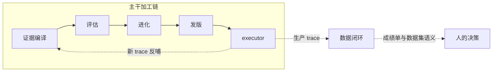
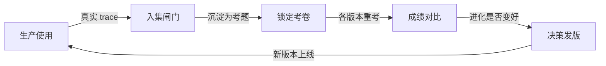
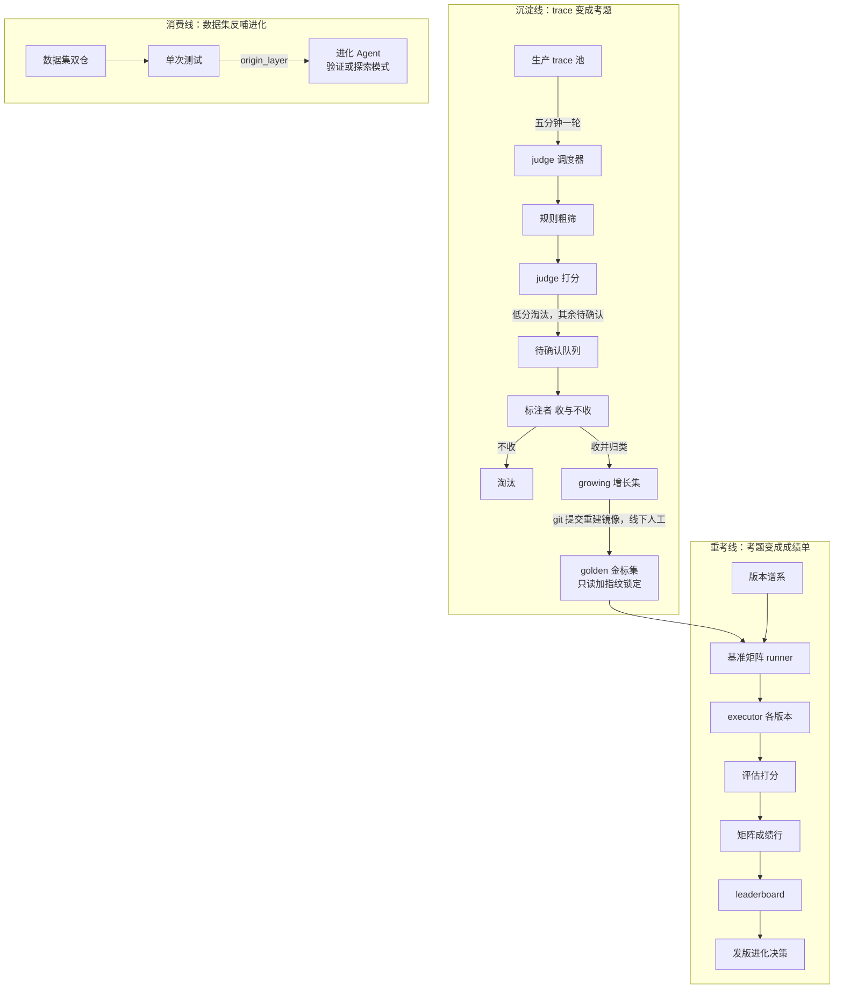
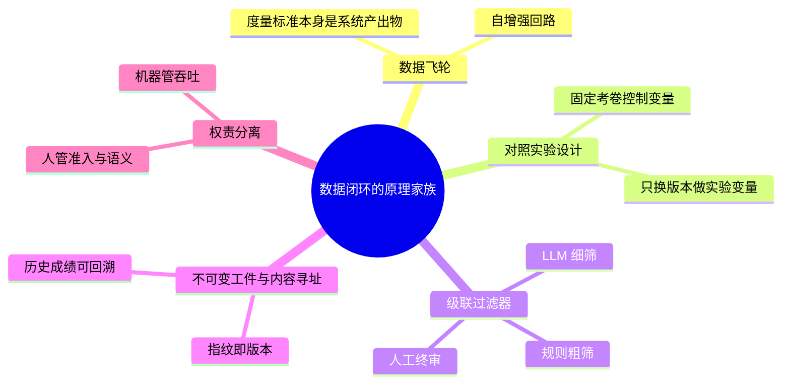

# 子块 06：数据闭环（promote + dataset + benchmark）

> **层位声明**：本篇是「进化系统深读」系列 6 块中的第 6 块，站在**设计思想层（架构师视角）**——只讲为什么这么设计、宏观怎么运转、模块之间的契约与不变量；主动剥离环节内部的微观实现（不做步骤级走读、不列数据结构字段、不贴真实代码）。如需实现层补充，可另行要求。

## 本篇在全局中的位置

进化系统是 Writer（AI 长篇小说写作系统）的自我进化引擎。主干是一条单向加工链：证据卷宗编译 → 评估 → 进化 → 发版 → executor 新版本；新 trace 再反哺上游，如此循环。

数据闭环不在这条主干上。它是挂在 executor 身后的**并行旁支**：接住生产 trace，把 trace 沉淀成数据资产，再用数据资产回答一个主干回答不了的问题——「进化到底有没有变好？拿数字说话」。

本篇边界：只讲数据闭环本身——promote 入集闸门、dataset 双层数据集、benchmark 基准矩阵。trace 的内容结构由「观测深读」覆盖，发版细节由子块 04 覆盖，这里只作为衔接点出现。

## 术语速览：开读前 30 秒装好词汇表

| 术语 | 一句话点破 |
|---|---|
| 数据闭环 | 进化系统的旁支飞轮：管「数据从哪来、怎么变成资产、怎么用数据说话」的整套设施 |
| 生产 trace | 用户一次真实使用留下的完整运行记录（事件流日志——不是报错堆栈；内容结构见观测深读） |
| case（考题） | 数据集的一道题：需求文本（必有）+ 编辑终稿参考件（可选）+ 元数据 |
| promote 闸门 | 生产 trace 进数据集前要过的关：规则粗筛 + judge 打分 + 人工标注三级（promote = 晋升入集；规则粗筛是前置漏斗，不计入评审级） |
| judge 调度器 | 每 5 分钟扫一遍生产 trace、自动建评估任务的后台定时器 |
| 标注（accept/reject） | 人做的终审：这道题收不收、归到哪 |
| 金标集 golden | 封存的基准考卷：冻结、只读，跨版本对比的公制尺 |
| 增长集 growing | 平时攒新题的活题库：运行时可写 |
| revision 锁定 | 给整个 golden 目录算内容指纹当版本号——内容一动指纹就变，即数据集的不可变版本 |
| 基准矩阵 benchmark（case×version） | 重考表：同一张卷子让不同 executor 版本重考 |
| leaderboard | 同一张卷子内按版本排平均分的成绩单 |
| 版本谱系 | 登记所有 executor 版本及其 commit 的册子（registry.json） |
| 单次测试（数据集消费方） | 人手动「选一道题 + 选一个版本」发起的测试 |

下文沿用这套标准叫法。

## 第 1 步：本质锚定——进化系统的「考务处」

**一句话本质**：数据闭环本质上是进化系统的**旁支飞轮**——把 executor 的生产 trace 经「规则粗筛 → judge 打分 → 人工标注」闸门沉淀为分层数据集（golden 冻结基准 / growing 增长集），再以 case×版本的基准矩阵让不同 executor（harness）版本重考同一张卷子，把「进化到底有没有变好」从主观判断变成可复现的数字对比。

证据：主程序里三段挂载注释均自称「数据闭环设计」；诞生提交 850b833 写道——「生产 trace → 清洗 → 数据集 → 跨版本对比 → 进化……让『进化根据什么数据来』和『不同版本怎么对比』有了可落地的基础设施」。

**心智模型：一所学校的考务系统**。这套闭环的每个部件，都能在一所学校里找到对应物：

- **金标集（golden）＝封存的期末卷**。印好、锁进保密柜，谁都不许临时改题。
- **增长集（growing）＝教研组平时攒的新题库**。新题随时收、随时用。
- **规则过滤＝收卷员**。白卷、糊弄卷直接剔掉，不往阅卷室送。
- **judge＝自动阅卷机**。用的就是学校现成的阅卷标准（复用 02 评估 Agent 的打分链路）。
- **标注者＝教研组终审**。自动阅卷说了不算，人拍板：这道题收不收、归到哪个题型。
- **revision 锁定＝卷子的防伪编号**。对整本卷子算内容指纹，卷面动一个字，编号就换。
- **基准矩阵＝同一张期末卷让不同届学生重考**。卷子不变（golden 锁定），换考生（executor 版本），分数才可比。
- **leaderboard＝成绩公示栏**。只在同一张卷子内排名；不同卷子的分数，不放在同一张榜上。

飞轮转起来是这样一个圈：

串成一句话：**用户用得越多 → 好题自动流入题库 → 考卷越来越可信 → 版本对比越来越硬 → 进化决策越来越准 → 产品更好用**。度量标准本身成了系统的产出物——这就是「飞轮」二字的含义。

另一个视角来自数据库领域：golden 的 revision 锁定，等价于给数据集打 content-addressed tag（内容寻址——用内容本身算出的哈希当唯一 ID，像给发布工件盖钢印）。

## 第 2 步：痛点动机——没有它，世界会怎样

不谈干指标，直接看四个具体现场。

**现场 A：进化无据可依。** 进化 Agent 产出了 v5，要发版了。拿什么回答「v5 比 v4 好多少」？没有基准矩阵时，只能挑一两个 trace 主观感受——「感觉文笔顺了点」。感觉不能当发版依据。有了矩阵 + leaderboard，同一张卷子上的跨版本平均分对比，才让发版与进化决策有数字可看。850b833 的说明书写得直白：这套设施就是来解决「不同版本怎么对比」的。

**现场 B：最有价值的数据白白流走。** 用户真实使用产生的 trace——尤其带 user_edit（用户亲手编辑过的终稿）的那些——是全系统最值钱的评估素材。没有 promote 闸门时，想要它们只能人工翻库捞。judge 调度器上线后，每 5 分钟自动扫一遍，发现「真实生产用途且已完成」的 trace 就建任务。当时数据集展示需求文档的原话：「只要执行端有生产 trace 完成，待标注 Tab 就会有真实数据流入，页面纯消费即可」。

**现场 C：考卷被悄悄动过，历史成绩作废。** 假设 golden 可以随手改。v3 在这张卷上跑 90 分；有人往卷里加了一道难题；v4 跑 85 分。85 比 90 差？没法比——题都不一样了。所以需要 revision 锁定 + 启动前篡改校验，保住一句契约原话：「同一 golden_revision 下的行之间分数可比」。

**现场 D：真实事故——重启即丢。** 这是最重要的一条 why。最初的设计允许在运行时把 growing「升级」写入 golden。而部署机制是「git 仓库为权威源 + 容器启动时用种子数据覆盖数据目录」。两者正面冲突：运行时写进数据目录的内容，一重启就被种子覆盖——**线上真的丢过数据，列表真的变空过**。修复提交 d2ac713 原话：「根治『数据丢失/列表变空』问题。根因是存储架构缺陷」。

| 现场问题 | 没有数据闭环 | 有数据闭环 |
|---|---|---|
| A 发版决策 | 主观挑 trace「感觉更好」 | 同卷跨版本平均分对比 |
| B 生产数据 | 人工翻库捞 | 5 分钟一轮自动流入待标注队列 |
| C 基准可信 | 题目随手改，历史成绩作废 | revision 锁定 + 篡改校验 |
| D 数据安全 | 运行时写 golden，重启即丢 | golden 运行时只读，变更唯一合法路径是 git |

一句话收拢，它解决三个核心问题：①进化决策有数字依据（跨版本可比）；②生产数据自动流入评估资产（飞轮转起来）；③基准本身可信、不可悄悄漂移（锁定 + 只读）。

## 第 3 步：模块协作与契约——宏观怎么运转

先看全景图，再逐环节立契约，最后看数据流过每个环节时「变成了什么」。

### 3.1 宏观协作图

三条线组成一个闭环：**沉淀线**把运行事实变成题库资产；**重考线**把题库变成跨版本成绩单；**消费线**把题的语义反哺给进化方向。

### 3.2 逐环节契约

契约格式：`输入 → [保证: 不变量] → 输出`。**不变量是每个环节的核心价值**，一条不落。

#### 沉淀线（promote 域）

**① judge 调度器**

- 职责：后台定时器，5 分钟一轮做两件事——发现「已完成但还没建任务」的生产 trace 自动建任务；推进待 judge 的任务，每轮最多 10 条，控制 LLM 成本。
- 契约：`生产 trace（真实生产用途且已完成）→ [保证: 同一 trace 只建一个任务（幂等——同一动作重复发生，效果和发生一次一样）] → promote 任务`
- 边界不变量：只认真实生产用途（run_purpose 为 user_generation）的 trace；单次测试、A/B 测试的 trace 因用途不同，不进数据集闸门。
- 设计动机：标注者零触发成本——人什么都不用做，数据自动流入。

**② 规则过滤**

- 职责：judge 之前的粗筛、闸门前的漏斗，五条规则：未完成、无正文、太短（不足 500 字）、太长（超 5 万字）、作者未知。
- 契约：`候选 trace → [保证: 明显垃圾不进 LLM] → 少量值得评的候选`
- 设计动机：注释原话——「省 judge 成本」。

**③ judge 打分**

- 职责：复用 02 评估 Agent 的 28 维打分链路（不重复造轮子），取内容层 overall 单指标，按双阈值三档裁决：不低于 0.8 记 auto_promote，低于 0.4 记 auto_reject，中间记 needs_human。
- 契约：`过粗筛的 trace → [保证: auto_promote 仍需人工确认——「judge 只判质量，不判归类」] → 三档裁决摘要`
- 关键分工（拆开说）：同一次 judge 产出**两类记录**——详细分数与「入不入数据集」的决策摘要，两者分家存放。详细分数属评估诊断域（带评估幂等标记——标记该 trace 已评过、避免重复打分），供诊断翻查；决策摘要属数据集准入域（含后续人工决策），promote 任务只看它。judge 只写决策摘要，没有数据集写权。
- 设计动机：机器管吞吐（发现、打分、控成本），准入权留给人。

**④ 标注决策**

- 职责：人做两件事——收/不收（accept/reject）+ 归类。归入已有 case 只补编辑终稿参考件；新建 case 则必须由标注者**规范化重写**需求文本，不是照抄 trace 原文。
- 契约：`待确认队列 → [保证: 同一 case 多次归入的参考件追加而不覆盖；source_trace_id 可追溯到生产来源] → growing 新 case（编号 1xx；golden 是 0xx）+ 元数据注册（所在层、来源 trace）`
- 设计动机：LLM 判质量，人判「这道题值不值得收、归到哪」——人是数据集质量的最终守门人。

#### 双仓（dataset 域）

**⑤ 分层数据集**

- 职责：两层文件真源。golden 是冻结基准、跨版本可比的公制尺；growing 是生产沉淀的探索集。每个 case = 需求文本（必有）+ 编辑终稿参考件（可选），外加元数据。
- 核心设计决策（2026-07-10 重构注释）：**golden 运行时只读，以 git 仓库为权威源，变更只能 git commit + 重建镜像；原「运行时把 growing 升级写入 golden」的能力已删除**——它与只读矛盾，曾导致数据丢失（第 2 步现场 D）。
- 契约：`标注与升级动作 → [保证: 运行时只写 growing；golden 变更唯一合法路径是 git；以文件系统为准——需求文本存在才算 case；元数据缺失时降级运行、不阻塞] → 双层数据集`
- 设计动机：在存储架构层面根除「重启丢数据」，换来零丢失风险。

**⑥ revision 锁定**

- 职责：对 golden 目录下全部需求文本与参考件递归计算 SHA-256 内容指纹，取前 12 位当 golden 的版本号。
- 契约：`golden 目录内容 → [保证: 决策 D4——锁「case 列表 + 需求内容」，动任一项即新 revision；所有 golden case 共享同一 revision，整集同锁] → golden_revision 指纹`
- 锁定范围说明：指纹的输入覆盖全部需求文本**与参考件**——参考件单独变动同样改变指纹、同样换 revision（D4 的列举是最低保证：case 列表与需求内容变动必换；实际锁定范围以指纹输入为准）。
- 设计动机（注释原话）：指纹「必须精确反映 golden 目录的内容，不能依赖整个项目 repo 的 commit（后者包含无关改动）」，且「比 git tree hash 更简单，不依赖 git 状态，确定性可复现」。benchmark 启动前用它校验 golden 未被篡改。

#### 重考线（benchmark 域）

**⑦ 基准矩阵 runner**

- 职责：对 case×版本做笛卡尔积，逐行执行——每行用一道 golden 考题驱动一个指定版本的 executor 产出新 trace，再复用 02 评估 Agent 打分。两个触发面：手动触发；golden 升级后自动重跑最近 K=3 个版本（决策 D8/D18/D20——考卷换新后，把最近几届考生叫回来重考，新卷成绩才连续）。
- 契约：`golden case × 版本谱系中的版本 commit → [保证: 每行钉死（case、版本、golden_revision）三元组——成绩永远可回溯到「哪道题、哪个考生、哪张卷」；失败重试 3 次] → 矩阵成绩行`
- 设计动机：跨版本对比的前提是每行自带完整坐标，否则分数无主。

**⑧ leaderboard**

- 职责：按 golden_revision 过滤已完成的行，按版本聚合平均分、倒序排列。
- 契约：`矩阵成绩行 → [保证: 只在同一 golden_revision 内跨版本对比；跨 revision 是不同的卷，天然隔离、不可混比] → 跨版本成绩单`
- 设计动机：把「进化有没有变好」压缩成人一眼能看的一列数字。

#### 消费线（tests 域）

**⑨ 单次测试（数据集消费方）**

- 职责：手动测试入口——人选一道数据集 case + 选一个 Agent 版本，发起执行。
- 关键契约（决策 A6 origin_layer）：发起时查这道题所在层并记录；进化 Agent 启动时反查注入上下文——题来自 golden，注入「验证模式：改进后不能在 golden 集上退化」；题来自 growing，注入「探索模式：用于发现新问题/新方向」。
- 设计动机：**数据集语义反哺进化方向**的关键闭环点——不只是「用题测 Agent」，而是「题的出身决定进化的姿态」。

### 3.3 数据流的语义变换

数据一路流动，身份一路换装：

| 环节 | 数据过了这一关，变成了什么 |
|---|---|
| 生产 trace | 运行事实：用户真实用出来的原始记录 |
| 规则过滤 | 「是否值得评」 |
| judge 打分 | 「质量分」 |
| 人工标注 | 「数据集资产 + 归类语义」 |
| git commit + 重建镜像（人工线下动作） | growing case 升格为 golden case：探索素材上桌，成为公制尺的一格 |
| benchmark | 「需求 + 版本」变成新 trace + 分数 |
| leaderboard | 「跨版本可比的成绩单」 |
| 人的决策 | 成绩单变成发版/进化方向，新版本又进矩阵……循环 |

### 3.4 与主干加工链的关系（谁消费谁）

- **并行旁支，不进发版门禁。** leaderboard 目前只有 API + 人工查看，桌面端没有专门页面。
- 与主干共享两个底座：**评估打分器**（judge 和 benchmark 都复用 02 的打分链路，不重复造）与**版本谱系**（benchmark 拿版本 commit 去调 executor 执行）。
- 对主干的反哺是间接的，走两条路：①leaderboard 供人做发版/进化决策的参考；②数据集 case 供单次测试选用，origin_layer 把「验证/探索」模式注入进化 Agent——数据集语义直接塑形进化方向。

## 第 4 步：决策对比——为什么不用现成方案

**本项目方案一句话**：两层文件型数据集（golden 以 git 为权威源、运行时只读；growing 运行时可写）+ 三级级联闸门（规则 → LLM judge → 人工）自动与人工两段式入集 + 内容指纹锁定 + case×version 矩阵重考。

**业界替代方案**（基于模型已有知识，未联网核实）：

1. **LangSmith / LangFuse dataset**（LLM Ops 主流）：数据集 + 标注队列 + experiment 对比，形态最接近本项目的 promote。但通常是中心化数据库存储，没有「冻结层/增长层」分离，也没有内容指纹式的不可变版本。
2. **lm-evaluation-harness / HELM / OpenAI evals**（学术/工业静态基准）：静态考卷 + 多版本模型跑分，正是本项目 benchmark 的原型。但 case 集靠手工维护，没有「生产流量自动沉淀入集」的飞轮。
3. **DVC / HuggingFace Datasets revision**（数据版本管理）：用 git tag/SHA 锁数据集版本，等价于本项目的 revision 锁定，但依赖 git 基建——本项目选择自算目录内容指纹，显式绕开 git 依赖（理由见 3.2 ⑥ 的注释原话）。
4. **Chatbot Arena / RLHF 数据管线**：要么全自动入集（无人工闸门），要么全人工（无自动 judge）——本项目取两段式中间态。

| 方案 | 解决的核心问题 | 主要代价 | 适用场景 |
|---|---|---|---|
| 本项目数据闭环 | 生产数据自动沉淀 + 跨版本可比 + 基准不可漂移，三件事一套设施内闭环 | 全套自建；golden 升级要人工 git 动作，小时级 | 有部署级权威源约束、自我进化的自部署系统 |
| LangSmith / LangFuse | 平台化的数据集、标注队列、实验对比 | 中心化存储；无冻结/增长分层；无内容指纹不可变版本 | 团队用 SaaS 托管 LLM 实验管理 |
| lm-eval-harness / HELM 等 | 静态考卷上多模型横向跑分 | case 手工维护；无生产流量入集 | 学术评测、公开模型对比 |
| DVC / HF Datasets | git 体系内锁数据集版本 | 依赖 git 基建 | 已有 git 数据管线的 ML 团队 |
| Chatbot Arena / RLHF 管线 | 大规模偏好数据采集 | 无质量闸门或无自动筛，准入失控 | 大流量在线产品 |

**三条关键异同**：

- 对 LangSmith 类：本项目把「数据集准入」拆成**质量（机器判）与归类/收录（人判）分权**，且 golden 层引入「运行时只读 + git 权威源」这个部署级不变量——后者在平台化产品里没有对应概念。
- 对静态基准类：基准不是静态的，而是从生产飞轮持续换血；换血即换 revision，「跨 revision 不可比」是显式契约，不是隐含假设。
- 对 DVC 类：锁定粒度是「整个 golden 集一个指纹」（所有 case 同锁），不是 per-case 版本。

## 第 5 步：理论抽象——它站在哪些原理上

逐条展开：

1. **数据飞轮 / eval 驱动开发**：系统改进的度量标准（基准数据集）本身也是系统的产出物（从生产 trace 沉淀而来），形成自增强回路。
2. **对照实验设计**：矩阵固定 case（控制变量）、只变 version（实验变量）——A/B 实验思想投影到「版本谱系 × 题库」上。
3. **级联过滤器**：规则粗筛 → LLM 细筛 → 人工终审，每级成本递增、数量递减，是搜索与审核系统的经典架构。
4. **不可变工件 + 内容寻址**：golden revision 等同软件的不可变发布工件，保证历史成绩永远可回溯、可解释。
5. **权责分离**：机器管吞吐（发现、打分、控成本），人管准入与语义（收不收、归哪类）；judge 无数据集写权。

**可迁移原理——任何「AI 系统自我改进」项目都需要的四件套**：

1. 固定考卷（冻结基准）
2. 阅卷自动化（judge 复用评估链路，而非重造）
3. 题库增长通道（生产 → 候选 → 终审）
4. 考卷换版时重考旧生（升级重跑，保证成绩序列连续）

> 核心口诀：**可比性优先于绝对分数**。分数本身多少不重要；同一张卷、同一套阅卷规则下，版本之间的**差值**才携带信息。

## 第 6 步：边界与代价——它什么时候不好使

### 何时失效：五个会翻车的现场

1. **golden 太薄，矩阵拒跑。** golden 集为空时 benchmark 显式报错、拒绝运行。历史上 golden 极薄——数据集模块的前身 evalset 诞生时单层仅 1 条、一度 2 条，2026-07-10 才刻意扩到 3 条；扩充需求文档明言「因为只有 2 条，每一条都必须经过刻意设计，彼此覆盖不同的能力考验面」，并钉死定位：「golden 集 = 评估基准，不是训练数据；系统不训练模型」。
2. **judge 未配置，飞轮停在第一级。** LLM judge 没配置时，打分链路返回空值，judge 任务回退 pending 无限重试（代码事实），待标注队列不再产出。人这边的体感是「待标注页面怎么一直没数据」——飞轮悄无声息地停摆。
3. **golden 被动过但没重锁。** 目录内容与锁定指纹不一致（被篡改、或忘了重锁）时，runner 只打 warning、仍用锁定值继续跑（代码事实）——不阻断，全靠人盯日志。
4. **每次换卷，历史归零。** 跨 revision 成绩天然不可比，leaderboard 按 revision 过滤即隔离。代价是 golden 每次换血，历史分数全部「归零」到新卷上；重跑范围只有最近 K=3 个版本，之外的老版本永远失去对比锚点【基于设计理解推演：重跑范围是代码事实，「老版本失去锚点」是其直接推论】。
5. **裁决只看一个指标。** judge 裁决只取内容层 overall 单指标做三档化；评估的其他维度只作摘要存储、不参与裁决（代码事实）。

### 代价天平：换来什么，付出什么

| 换来（得） | 付出（舍） |
|---|---|
| 零数据丢失风险、架构最简单（d2ac713 决策表原话） | golden 升级没有线上通道：开发者 git commit + 重建镜像，数据集升级从秒级点击变成小时级部署动作 |
| 准入有人守门，题库语义质量可控 | 人工标注是吞吐瓶颈：auto_promote 也要人确认（决策 A10），队列积压时飞轮降速【基于设计理解推演】 |
| judge 成本受控（粗筛挡垃圾 + 每轮限 10 条） | judging 中间态无崩溃恢复：进程若死在 judge 调用中，任务卡死、无超时回收路径（代码事实；注释未提对策——证据不足） |
| 基准可信、成绩可复现 | 规则阈值硬编码（500 / 50000 字）；PII 脱敏明确不做（注释原话「本次明确不做，后续迭代」）——生产用户数据入集的隐私处理是欠账 |
| 矩阵逐行可追溯 | runner 串行逐行执行 + 单 case 10 分钟轮询上限；矩阵规模一大，一批要跑数小时【基于代码事实的规模推演】 |

### 证据不足处（如实呈现）

代码注释里散落的设计编号——promote 的 B1-B6、dataset 的 A1/A3/A4、benchmark 的 C1-C3/D8/D9/D12/D13/D18/D20、单次测试的 A6——全部指向**一份已遗失的设计文档**（从未提交即被清理）。今天对设计动机的还原，靠的是 commit message（几乎逐阶段对应）加注释编号反推；当初立项时的用户原始诉求已无文档可考。另外，桌面端 leaderboard 专用页面经检索确认不存在，当前消费形态是 API only——这是有意留白还是未做完，无证据，如实呈现。

## 第 7 步：吃透检验——五问五答

以下五问，答得上来，就是真吃透了。

**问题一：auto_promote 已经是高分了，为什么还要人工确认？直接自动入集不行吗？**

- **一句话点题**：分权设计——judge 只能回答「质量高不高」，回答不了「这道题该不该进题库、归到哪个 case、需求该怎么表述」。
- **机制怎么保证**：三档裁决里，auto_promote 只是「质量够格」的标记；commit message 原话「auto_promote 仍需人工确认（judge 只判质量，不判归类）」。且 accept 新建 case 时，需求文本必须由标注者**规范化重写**——不是照抄 trace，这是语义加工，LLM 打分覆盖不了。数据集准入权在人：人是数据集质量的最终守门人。
- **代价权衡**：人工确认成为吞吐瓶颈，队列积压时飞轮降速——用速度换语义质量。

**问题二：golden 为什么自己算 SHA-256 指纹，不直接用 git commit hash？**

- **一句话点题**：把「数据集版本语义」与「代码版本语义」解耦。
- **机制怎么保证**：注释给了两个理由——①项目 repo 的 commit 包含大量与数据集无关的改动，commit hash 无法精确表达「golden 内容是否变了」；②指纹是纯文件系统计算，不依赖 git 状态（容器里 git 仓库可能不存在或处于脏状态），确定性可复现。
- **代价权衡**：自己维护一套指纹计算，放弃了 git 基建免费提供的版本语义；换来独立、确定、粒度精确的版本号。

**问题三：跨版本分数可比的前提是什么？被破坏了怎么办？**

- **一句话点题**：前提是同一 golden_revision + 同一条打分链路。
- **机制怎么保证**：golden 任何内容变化或增删 → 指纹变 → 新 revision → 旧成绩与新成绩天然分属两个 leaderboard，不可混比。运行时篡改会被 runner 启动前校验捕获并告警；但更根本的是，golden 只读重构后运行时根本没有写路径——防御纵深是「架构上不可能」优先于「检测后告警」。
- **代价权衡**：隔离的背面是换卷即归零，必须靠重考衔接成绩序列（见问题四）。

**问题四：golden 升级后，为什么要把最近 K=3 个版本拉回来重跑？**

- **一句话点题**：换卷后历史成绩作废，新版本在新卷上的分数没有参照系——重考是把参照系搬过来。
- **机制怎么保证**：把最近 3 个版本拉回新卷重考，就在新 revision 下重建出连续的对比序列；「进化是否进步」的判断不因换卷断档。这是「基准演进」与「成绩序列连续性」冲突的标准解法。
- **代价权衡**：重考本身要烧执行 + 评估成本；且 K 之外的老版本永远失去对比锚点【基于设计理解推演】。

**问题五：growing 运行时可写、golden 只读——写入路径为什么故意不对称？**

- **一句话点题**：不对称的保护等级来自可恢复性差异，而且是用一次真实数据丢失事故换来的。
- **机制怎么保证**：运行时写 golden 与「git 权威源 + 容器启动 seed 覆盖」的部署机制冲突，重启即丢（线上真的丢过）。修复不是打补丁，而是**删掉运行时升级能力**（端点和函数全删）：growing 丢了可以重标——生产 trace 还在，闸门可以重走一遍；golden 被污染则整条跨版本成绩链报废，而且难以察觉。可恢复性差异决定了保护等级差异。
- **代价权衡**：golden 升级没有线上通道，必须开发者 git commit + 重建镜像——数据集升级是小时级部署动作，不是秒级点击。

## 收束：回到那张成绩单

数据闭环做的一切，最终都指向同一件事：把「进化有没有变好」从愿望变成账目——考卷有据可查（revision 锁定），各届考生的分数有卷可对（基准矩阵），每道新题有人签收（promote 闸门）。进化系统其余部分负责「变得更好」，这一块负责「拿出证据」。
