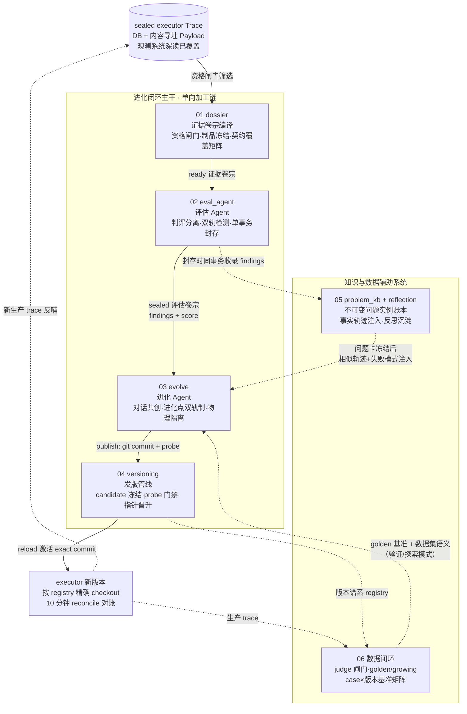
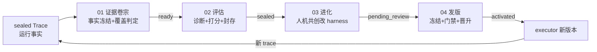

# 进化系统 · 深读总文档

> **层位声明：本套深读为设计思想层（架构师视角）。** 讲的是进化系统为什么这么设计、宏观怎么运转、各子块怎么协作、契约与不变量是什么、优势与弊端、背后的可迁移原理——读完能回答“换一个项目遇到同类问题，我该往哪个方向想”。
>
> 主动剥离环节内部微观实现（不钻步骤序列、不列字段级数据结构、不贴行号代码）。若需实现层补充（具体步骤、字段、行号定位），可另行要求——这会覆盖本层定位。

---

## 这个机制整体是什么

**进化系统**是 Writer（AI 长篇小说写作系统）三端中的**自我进化引擎**。它把 executor（写作执行端）产生的运行事实（sealed Trace），经过一条**单向加工链**——「证据编纂 → 评估 → 人机共创改造 → 发版激活」——变成 harness（executor 的大脑部件包）的新生产版本；配套问题知识库与数据闭环两个辅助系统，形成“用运行事实驱动系统变好，且每一步可审计、可回滚”的进化飞轮。

一句话讲清它干什么：**让“系统哪里不好”有可信证据，让“怎么改”有人拍板，让“改完的版本”能安全上线、能证明变好了、出了问题能退回去。**

### 用一个类比建立全局心智模型

把整个进化系统想象成一家**有自我改进机制的医院**：

| 医院 | 进化系统 |
|---|---|
| 病人就诊，全程病历归档 | executor 跑写作任务，Trace 封存（观测系统，另有深读） |
| 病历科把原始病历整理成规范的病例档案 | 01 证据卷宗编译：sealed Trace → ready 证据卷宗 |
| 外聘的主任医师阅卷出诊断书（本院大夫不能审自己） | 02 评估 Agent：判评分离，sealed 评估卷宗 |
| 主治医生拿着诊断书与家属会诊，逐个方案签字 | 03 进化 Agent：对话共创 + 进化点拍板 |
| 手术方案审核、器械消毒验证、术后确认生效 | 04 发版管线：probe 门禁 + 指针晋升 + reload 核对 |
| 医院的“既往病史库”：复诊先查体再翻旧病历 | 05 问题知识库 + 反思库 |
| 医院的“疗效追踪科”：攒病例成题库，各届住院医同卷重考 | 06 数据闭环：golden/growing + 基准矩阵 |

这张表是阅读全套深读的“地图钥匙”——每个子块深入时都可以回到这张表对号入座。

---

## 全局架构图

这是把 6 个子块深挖后回填的完整架构图。**建议先看这张图建立全局，再按导航索引钻进各子块。**

### 数据流主干（一张图看懂一次进化的完整一生）

一次进化的完整一生：**运行事实 → 证据冻结 → 诊断封存 → 共创改造 → 版本激活 → 新事实**。每一级只消费上一级的**封存产物**（不回读更上游），信息逐级有损但全程可审计、可回溯。辅助系统挂在两侧：知识库让历史失败可检索，数据闭环让“变好了没有”有数字。

---

## 导航索引（按什么顺序读）

| 编号 | 子块 | 一句话定位 | 建议阅读顺序 |
|---|---|---|---|
| **01** | [证据卷宗编译](01_证据卷宗编译_深读.md) | sealed Trace → ready 证据卷宗：资格闸门三层同源、制品确定性冻结、契约覆盖矩阵抓结构性缺失 | **先读**——整条链的地基，理解“事实与判断分离” |
| **02** | [评估 Agent](02_评估Agent_深读.md) | ready 卷宗 → sealed 评估卷宗：判评分离、双轨检测（确定性契约层 + LLM 评分层）、封存即唯一成功判据 | 第二——理解“谁来判断好坏、凭什么可信” |
| **03** | [进化 Agent](03_进化Agent_深读.md) | sealed 评估卷宗 → 代码改动：对话式共创、进化点双轨制（DB 权威+对话联动）、evidence_ref 归因、物理隔离防作弊 | 第三——理解“怎么改、人怎么把关” |
| **04** | [发版管线](04_发版管线_深读.md) | pending_review → production：exact commit 冻结、probe 可运行性门禁、reload 双比对、回滚记账 | 第四——理解“怎么安全上线、怎么退回来” |
| **05** | [问题知识库与反思沉淀](05_问题知识库与反思沉淀_深读.md) | 不可变问题实例账本 + 可治理标准问题 + 事实轨迹注入 + 反思库（注意：治理端当前未接线） | 第五——理解“历史失败怎么变成记忆” |
| **06** | [数据闭环](06_数据闭环_深读.md) | 生产 trace → 分层数据集 → 跨版本基准矩阵：judge 闸门、golden 只读、revision 锁定、重考机制 | **最后读**——理解“怎么证明进化变好了” |

**阅读建议**：
- **想建立全局**：先读本 README，再按 01→06 顺序通读。
- **想理解某段**：直接钻对应子块（关心证据看 01，关心评估看 02，关心改造看 03，关心上线看 04）。
- **想扛追问**：每块第 7 步“吃透检验”是面试级尖锐问题，通读这些最能检验理解深度。

---

## 统一术语表

阅读各子块时如遇术语疑问，回这里查询。所有子块都遵守这套标准叫法。

| 术语 | 标准叫法 | 一句话定义 | 主要出现在 |
|---|---|---|---|
| 证据卷宗 | EvidenceDossier（ready） | 从合格 sealed Trace 冻结出的评估用证据包，只含事实不含评分 | 01 产出, 02 消费 |
| 评估卷宗 | EvaluationDossier（sealed） | 评估 Agent 封存的 findings + score 结论包，不可变 | 02 产出, 03 消费 |
| 资格闸门 | assess_creation_trace | 判定哪些 Trace 可进编纂的唯一函数——候选列表、启动接口、编译器三层消费共用同一个函数，故谓“三层同源”（详见 01） | 01 |
| 封存 | seal | 单事务原子写入、此后不可变的持久化动作 | 01/02/05 |
| 制品版本 | ArtifactRevision | 从受治理 Payload 冻结的最终正文快照，带内容指纹 | 01 |
| 契约覆盖矩阵 | contract_coverage_matrix | 把“承诺 vs 交付”逐项对成布尔表的确定性闸门 | 01 产出, 02 消费 |
| 结构性缺失 | structural_omission | “本该出现的机制没出现”类缺陷（如记忆系统未参与） | 01/02 |
| 人工确认 | evidence_override | 对被闸门挡住的用户停止 trace，产品负责人可人工批准其创作证据入证（独立于自动闸门的审计通道，详见 01） | 01 |
| 判评分离 | eval scope 独立 | 评估与写作/进化用不同模型家族，防同源偏好放水 | 02 |
| 评估终态唯一判据 | completed + sealed_dossier_id | 评估成功的唯一标准：业务完成且封存卷宗存在 | 02 |
| 启动对账 | reconcile | 启动时以 sealed 卷宗为事实收敛分裂状态（评估侧） | 02 |
| 进化点 | evolution point | Agent 提出的问题+备选方案结构化对象（proposed/accepted/rejected） | 03 |
| 双轨制 | DB 权威+对话联动 | 决策状态唯一权威在 DB，对话文字只是过程 | 03 |
| 拍板 | finalize | 用户点按钮把 accepted 进化点冻结成 design_doc 并触发落地 | 03 |
| 问题卡 | 当前问题独立分析锚点 | 历史检索前先冻结的独立分析快照，防锚定漂移 | 05 |
| harness 仓库 | evolution/harnesses/repo | Agent 改代码之地、candidate 按 commit 冻结之所 | 03/04 |
| 候选版本 | candidate | 注册进 registry 但未晋升的不可变版本 | 04 |
| 生产版本 | production（registry 指针） | executor 当前实际运行的版本，由指针动态推导 | 04 |
| probe 门禁 | probe_candidate | 让拟发布 executor 在干净 checkout 上真实装配的唯一发版门禁 | 04 |
| reload | 激活动作 | executor 切到新 production 并返回实际身份，配双比对 | 04 |
| 回滚 | rollback | production 指针回退 + rollback_log 记账，不删谱系 | 04 |
| 版本谱系 | registry.json | 版本家谱 + 生产指针的单一真源 | 04/06 |
| 问题实例 | problem_instance | 封存时从 finding 收录的不可变事实记录 | 05 |
| 标准问题 | standard_problem | 实例经用户确认归并后才形成的可治理问题 | 05 |
| 事实轨迹 | 历史“问题—计划—结果” | 注入进化 Agent 的历史事实链，不带经验结论 | 05 |
| 反思库 | reflection | 失败模式按 dimension 沉淀、进化时注入的轻量库 | 05 |
| 数据闭环 | promote+dataset+benchmark | 生产数据沉淀为资产并反哺评估基准的旁支飞轮 | 06 |
| 金标集/增长集 | golden / growing | 冻结基准考卷（只读）/ 运行时可写的活题库 | 06 |
| revision 锁定 | golden 内容指纹 | 对 golden 目录算 SHA-256 当版本号，动一字即换版 | 06 |
| 基准矩阵 | benchmark（case×version） | 同一张卷子让不同版本重考，产 leaderboard | 06 |

---

## 整体认知概述（把一块块理解升级为整体心智模型）

读完 6 个子块，你应该能建立起这样一套**整体认知**：

### 进化系统解决的核心矛盾

这套系统的所有设计，都在回应一个核心矛盾：**“自我修改的系统”天然不可信——改的人可能改错、评估的人可能放水、上线的过程可能出事故——但业务又要求它持续进化。**

要让一个“自己改自己”的系统变得可信，进化系统的答案是：把进化过程拆成一条**每级只认上级封存产物**的单向加工链，每个环节配不可变产物 + 唯一判据 + 确定性兜底，人握住方向与发布两个决策点。

### 六个子块怎么协作形成整体

把六个子块分成三层来看：

**① 加工链主干（01→02→03→04）——把事实加工成版本**

- **01 证据卷宗编译**是地基：在“不可信的当下”（可变 workspace、可漏采的观测、同源 bias 的 LLM）与“下游决策”之间插一个确定性优先、不可变、可审计的证据冻结层。它确立了两条贯穿全链的原则：**事实与判断分离**（卷宗只含事实，评分归评估）、**传输完整 ≠ 业务完整**（观测链路收齐了事件，不代表任务本该产出的内容真的都在——上游的 verified 只保前者，证据闸门再核后者）。
- **02 评估 Agent**是主考官：只认卷宗不认现场（消费边界物理化）、阅卷者与考生异家族（判评分离）、仪器报警与医生问诊双轨出报告（确定性契约层 + LLM 评分层）、盖章即成功（封存是唯一判据，对账兜底崩溃）。它解决“评估会不会放水、漏判怎么办”两个信任难题。
- **03 进化 Agent**是进化工程师：与用户对话共创，进化点双轨制（决策状态唯一权威在数据库、对话文字只是过程）让人逐点拍板；每个改动必引证据 id（归因底线）；物理隔离让它**想改考卷也做不到**（防 reward hacking）；拍板前 FlowGuard 硬拦截落地工具（未拍板不可能改码）。它把“全自动的不可控”换成“人机各掌一半权”。
- **04 发版管线**是晋升装置：git commit 冻结内容、registry 指针冻结身份、probe 冻结可运行性、reload+双比对固化生效，失败沿原路补偿，回滚是记账不是删除。它最重要的一课来自真实事故：**门禁的可通过性是门禁的生死线**——三件套门禁永卡死整条流水线，单阶段 probe 门禁根治。

**② 记忆辅助（05）——让历史失败可检索**

挂在 02 封存点上非阻塞收录：收录与封存共用同一事务（正常时评估成功、问题实例同账落地），但收录带失败隔离——中途失败被整体捕获吞掉，已执行部分随封存事务照常提交、未执行部分丢失（靠对账补录兜底），绝不阻断封存提交（机制细节见 05）。进化时先冻结问题卡再注入相似历史事实轨迹（先独立考试再看答案，防锚定）。双层模型（不可变实例账本 + 可治理标准问题）把“发生了什么”与“我们认为它们是同一件事”分开——判断可纠错，事实永不清算。

**③ 数据闭环（06）——让“变好了没有”有数字**

与主干并行的旁支飞轮：生产 trace 经三级闸门（规则→judge→人工）沉淀为分层数据集；golden 只读 + revision 锁定保证“同一张卷子上的分数才可比”；case×版本矩阵 + golden 换血重考，让跨版本对比的参照系永不静默漂移。核心口诀：**可比性优先于绝对分数**。

### 贯穿全局的设计思想（可迁移的原理家族）

这套系统浓缩了几个可举一反三的工程范式，换一个项目遇到同类问题都能往这些方向想：

1. **单向不可变加工链 + 证据保管链**：trace → 证据卷宗 → 评估卷宗 → 代码改动 → commit，每级只读上级封存件，全程血缘可溯、审计可回放。（01→04 贯穿）
2. **事实与判断分离**：事实层零评分、判断层必引证据、治理层才做归并——防“立场污染事实”。（01/02/05）
3. **确定性优先于概率**：资格判定、覆盖矩阵、结构性 finding 全是 0-LLM 求值；LLM 被限制在归纳与评分，且受证据绑定约束——用布尔世界给概率世界兜底。（01/02）
4. **防自我证实的三重隔离**：判评分离（评估者与被评者异源）、诊/治分离（评估不给处方）、物理隔离（进化禁写考卷）——凡“自己给自己打分”的系统都需要。（02/03）
5. **单一真源（SSOT）+ 唯一判据 + 幂等收敛**：成功只认不可变产物的存在性（sealed 卷宗、exact commit），业务状态只是从产物推导出来的视图；分裂由对账收敛而非重放（幂等 = 同一动作重做、结果不变）。（02/04）
6. **不可变身份 + 指针切换 + 记账式回滚**：版本=commit、生产=指针、回滚=记账——GitOps 范式的轻量落地。（04）
7. **门禁的可通过性是生死线**：门禁条件必须在正常路径真实可达，否则门禁本身成为最大 bug。（04 用事故换来的教训）
8. **先独立后比较**：注入历史/参考前先冻结独立分析快照——对 LLM 锚定效应的工程化防御。（05）
9. **辅助系统非阻塞从属 + 逐级降级**：辅助能力尽力而为绝不反噬主链路，故障降级且语义诚实（不说谎“没有历史”）。（05/06）
10. **可比性优先于绝对分数**：基准冻结、同卷同规重考、换卷重跑衔接——对照实验设计在版本谱系上的投影。（06）

### 这套系统的代价（没有完美机制）

诚实讲，这套设计也付出了代价：

- **链路长、延迟高**：一次完整进化 = 编译（分钟级）→ 评估（分钟级）→ 多轮对话共创（人工参与）→ 落地 → 发版——这是用吞吐换可信的显式取舍。
- **人工是吞吐瓶颈**：进化点逐个表态、数据集逐条标注、归并逐个确认——共创与治理的自由度换来交互负担。
- **视野受限于上游 recall**：评估只见卷宗冻结的事实，进化只信评估卷宗——上游漏提的，下游三级放大后仍然看不到（双重漏判时本轮不可捕获，系统不做全知承诺）。
- **消费边界的信息有损**：正文截断（超长章节只冻结前 8000 字符）、下游查细节只能沿卷宗登记过的证据 ID 回钻（不能任意搜原始 trace）、停止 trace 的恢复只保留每份文件的最终版本（不重建中间修改史）——换来可审计，牺牲了过程粒度。
- **半成品状态客观存在**：05 治理工作台未接线（标准问题库实际为空）、06 leaderboard 无专门页面、04 的 eval 门控仍是占位——诚实标注实然状态，是本套深读的底线。
- **并发与规模上限**：registry 单 JSON 无事务、进化无总超时、benchmark 串行执行——单机单用户场景的轻量取舍，规模上去都要重做。

每个代价都是**有意识的 trade-off**，不是缺陷——理解这些代价，才算真正吃透这套系统。

---

## 诚实声明

- 本套深读的所有内容均来自仓库证据（evolution 端源码 + git 历史 commit message + 代码注释里的设计反思 + `.claude/md/` 需求文档 + docs/系统心智模型.md）。
- 推断处（基于代码事实 + 工程范式理解的推演）在各子块中显式标注【推测】/【基于设计理解推演】/【基于代码事实推演】。
- 各子块如实呈现了实然状态而非理想状态：05 的治理闭环未接线（半成品）、03 的架构层上报机制未合入 HEAD、04 的 versioning 包存在死代码、06 的原始设计文档已遗失、02 的部分需求文档不可考（由 commit + 注释 + 系统文档三方互证）、多处业界对标基于模型已有知识未联网核实——均已逐处标注。
- 本套深读为**设计思想层**，不钻环节内部微观实现。若需实现层补充（具体步骤、字段、行号），可另行要求。
- 上游 trace 摄入流由 `deep-dives/观测系统_深读/`（另册）覆盖，本套只把它当上游事实源，不重复展开。
